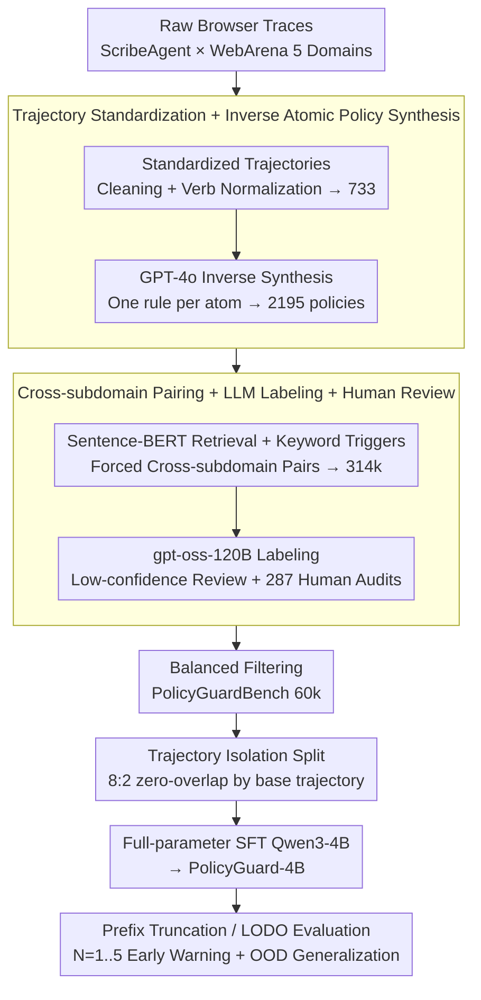

# Learning Efficient Guardrails for Compliance

**Conference**: ICML 2026  
**arXiv**: [2510.03485](https://arxiv.org/abs/2510.03485)  
**Code**: Project Page: learning-efficient-guardrails-for-compliance (link provided in paper)  
**Area**: LLM Safety / Agent Compliance / Guardrail  
**Keywords**: Policy Compliance, Trajectory Auditing, Guardrail Model, Web Agent, Prefix Detection

## TL;DR
This paper constructs PolicyGuardBench, a 60k-scale dataset (5 domains, 733 standardized trajectories × 2195 atomic policies → 60,000 trajectory-policy pairs including cross-subdomain and prefix truncation settings). Based on Qwen3-4B-Instruct, the authors perform full-parameter SFT to create PolicyGuard-4B, a lightweight guardrail model. It achieves 90.14% accuracy and an 87.59% F1 score with a latency of 22.5 ms/sample, matching or exceeding 70B-class open-source models and Claude-Sonnet-4, while demonstrating strong cross-domain generalization (LODO OOD F1 $\approx$ 0.91).

## Background & Motivation

**Background**: Currently, autonomous Web Agents (e.g., ScribeAgent, WebArena-based planning/reasoning work) can complete long-horizon tasks, but deployment is typically constrained by external rules—platform policies, corporate systems, and ethical/regulatory requirements. Existing guardrail research primarily follows a "safety-oriented" path: the LlamaGuard series and ShieldGemma detect toxic prompts, jailbreaks, or dangerous code, while AGrail, ShieldAgent, and LlamaFirewall lean toward OS-level attacks or formal verification.

**Limitations of Prior Work**: The authors' experiments reveal that safety guardrails like LlamaGuard-3/4 and ShieldGemma are almost unusable for policy compliance tasks—the LlamaGuard series predicts nearly all inputs as the same category, with accuracy hovering around 42–58% and F1 scores degrading to near 0 or a constant class. Conversely, relying on 70B+ general-purpose LLMs as guardrails achieves 88–90% accuracy but with latencies of 200–3600 ms/sample, making online intervention difficult. Furthermore, existing evaluations like ST-WebAgentBench, SafeArena, and WebSuite observe the gap between task completion and completion-under-policy but lack a large-scale, systematically labeled dataset covering cross-subdomain and early detection.

**Key Challenge**: The authors argue that "safety" and "policy compliance" are orthogonal dimensions—safety focuses on content toxicity, jailbreaks, or irreversible disasters, while compliance focuses on whether trajectories violate specific business rules (e.g., "total purchase cannot exceed $200" or "secondary confirmation required before deletion"). Conflating them leads to two failures: using safety guardrails for compliance detection overfits to coarse-grained signals like toxicity, while using frontier LLMs for compliance detection is prohibitively inefficient for online use. Additionally, violations are often cumulative ("adding one piece of cake is fine, adding a second violates the rule"), so an effective guardrail must predict violations before the trajectory is complete to prevent irreversible actions.

**Goal**: (i) Establish policy-trajectory compliance as an independent task and construct a recognized large-scale benchmark; (ii) train an accurate and fast small-scale guardrail model, proving the 4B scale is sufficient; (iii) introduce a "prefix detection" setting to quantify whether models can detect violation precursors early in a trajectory.

**Key Insight**: The authors observe that most web agent policy violations are checkable under atomic rules if heterogeneous browser events are standardized into a unified action vocabulary (Click, Input, Scroll, etc.). Then, GPT-4o is used to perform inverse synthesis of "one rule per atom" policies from trajectories. By pairing policies with trajectories from different subdomains within the same domain (forcing cross-subdomain negative/positive pairs), compliance detection is framed as a "binary instruction-following" task. This allows small models to handle the task without relying on RLHF.

**Core Idea**: Construct 60k high-quality binary data through four steps: "standardized trajectories + inverse synthesized atomic policies + cross-subdomain pairing + prefix truncation." Then, conduct single-task SFT to train Qwen3-4B into a specialized guardrail, outperforming 70B+ general LLMs and existing safety guardrails.

## Method

### Overall Architecture
This solution addresses whether a fast, accurate, and cross-domain generalizable compliance guardrail can be trained without human-written rules or 70B models. The authors split the approach into data and model sides. On the data side, starting from raw browser traces generated by ScribeAgent on five WebArena domains, they proceed through four steps: trajectory standardization, inverse policy synthesis, cross-subdomain pairing, and violation labeling. This transforms 733 base trajectories and 2195 policies into 314,556 raw pairs, filtered down to 59,997 label-balanced pairs (42.4% violation / 57.6% compliance, 41.6% cross-subdomain) in PolicyGuardBench. On the model side, `(policy, standardized action sequence, domain metadata)` is formatted into an instruction with binary outputs `{violation, no_violation}`. Using an 8:2 split based on base trajectories (ensuring zero overlap), they perform full-parameter SFT on Qwen3-4B-Instruct to obtain PolicyGuard-4B.

### Key Designs

**1. Standardized Trajectories + Inverse Atomic Policy Synthesis: Unifying Heterogeneous Rules and Trajectories**
Compliance detection is difficult because both rules and trajectories are heterogeneous—browser events vary, and platform rules use diverse phrasing. Small models struggle to align them. The authors "atomize and patternize" both. Trajectories undergo noise cleaning (removing empty events/duplicate rendering) and verb normalization (Click, Input, Scroll, Select, Navigate, Submit). Objects are standardized (e.g., `link 'My Account'`). These are serialized into text: "Step 1: Click link 'My Account'; Step 2: Scroll page; ...". For rules, GPT-4o is fed a trajectory + outcome and asked to write 2-3 atomic rules containing only **one constraint per rule** (e.g., "Do not click 'Delete' without a prior confirmation step"). After human filtering and deduplication, 2195 rules remain, each mapped to a structured schema with `source_subdomain` and up to 2 `target_subdomains`. This reduces inputs to a single interface, making "one rule per atom" naturally verifiable.

**2. Cross-subdomain Pairing + LLM Labeling + Human Review: Two-stage Labeling for ~90% Consistency**
To ensure the guardrail learns transferable patterns rather than memorizing trajectories, generalization pressure is introduced. Sentence-BERT retrieves candidate policies for each trajectory, supplemented by keyword triggers (e.g., `delete` triggers a confirmation rule). Rules are then paired with trajectories from their native subdomain (source) and up to 2 different subdomains (target). 41.6% of the final data are cross-subdomain. Negative examples are created by randomly pairing non-violating policies within the same domain. To label 60k pairs efficiently, gpt-oss-120B labels the data with confidence scores; low-confidence flags are manually reviewed. An independent human audit of 287 pairs showed 89.8% consistency with original labels, with discrepancies mostly in ambiguous policies or tasks requiring specific domain common sense.

**3. Trajectory-Isolated Split + Prefix Truncation Evaluation: Preventing Leakage and Quantifying Early Warning**
A random split by pair would allow the model to cheat by remembering trajectories. The authors force an 8:2 split based on the 733 base trajectories, ensuring 0% trajectory overlap. Two challenging evaluations are added: (1) Prefix detection, where violation samples are truncated to the first $N$ steps ($N=1,\dots,5$, roughly half the average length 9.3) and re-labeled to force prediction before completion. (2) Leave-One-Domain-Out (LODO), where one domain is kept as OOD. Prefix detection addresses the irreversibility of violations (e.g., deletion or overpayment), while LODO distinguishes between "memorizing trajectory patterns" and "learning compliance logic."

### Loss & Training
PolicyGuard-4B uses standard supervised instruction tuning: full-parameter SFT on Qwen3-4B-Instruct. The input is a unified prompt of `(policy, action sequence, domain metadata)`, and the output is strictly formatted as `violation` or `no_violation`. The loss is standard next-token cross-entropy. Training was conducted on H100 80GB GPUs with temperature=0 during decoding for reproducibility. No reward models or multi-task heads were used, as the goal was to validate the effectiveness of the "small model + clean binary SFT" paradigm.

## Key Experimental Results

### Main Results: Full-trajectory Compliance Detection (PolicyGuardBench 12k Test Set)

| Model | Type | Size | Accuracy | F1 | Latency (ms/ex) |
|------|------|------|----------|-----|------------------|
| Claude-Sonnet-4 | Closed frontier | – | 0.8983 | 0.8678 | 1238 |
| Gemini-1.5-Pro | Closed frontier | – | 0.8713 | 0.8502 | 596 |
| DeepSeek-V3.1 (non-think) | Open frontier | 685B | 0.8613 | 0.8407 | 3270 |
| Llama-3.3-70B-Instruct | IT | 70B | 0.9054 | 0.8883 | 305 |
| Qwen2.5-72B-Instruct | IT | 72B | 0.8825 | 0.8607 | 205 |
| Gemma-3-12B-IT | IT | 12B | 0.8964 | 0.8773 | 51.3 |
| Qwen3-4B-Instruct (base) | IT | 4B | 0.6897 | 0.5348 | 25.6 |
| LlamaGuard-3 | Safety guardrail | 8B | 0.4246 | 0.5952 | 164.8 |
| LlamaGuard-4 | Safety guardrail | 12B | 0.4239 | 0.5954 | 175.3 |
| ShieldGemma-27B | Safety guardrail | 27B | 0.5555 | 0.1834 | 45.0 |
| **PolicyGuard-4B (Ours)** | **FT** | **4B** | **0.9014** | **0.8759** | **22.5** |

### Prefix Detection (Accuracy at prefix length $N$)

| Model | $N{=}1$ | $N{=}2$ | $N{=}3$ | $N{=}4$ | $N{=}5$ | Average |
|------|------|------|------|------|------|------|
| Llama-3.2-3B-Instruct | 0.9086 | 0.8199 | 0.7348 | 0.6377 | 0.5693 | 0.7341 |
| Qwen3-4B-Instruct (base) | 0.8832 | 0.8231 | 0.8038 | 0.7688 | 0.7330 | 0.8024 |
| Llama-3.3-70B-Instruct | 0.9298 | 0.8441 | 0.8368 | 0.8305 | 0.8191 | 0.8521 |
| Llama-4-Scout-17B | 0.9389 | 0.8854 | 0.8583 | 0.8355 | 0.8237 | 0.8684 |
| Qwen3-235B-A22B | 0.8976 | 0.8752 | 0.8644 | 0.8569 | 0.8498 | 0.8688 |
| Gemini-1.5-Pro | 0.8990 | 0.8779 | 0.8667 | 0.8630 | 0.8543 | 0.8722 |
| **PolicyGuard-4B** | **0.9101** | **0.8648** | **0.8441** | **0.8276** | **0.8190** | **0.8531** |

### Ablation Study: LODO Generalization

| Domain | ID Acc | ID F1 | OOD Acc | OOD F1 |
|--------|--------|-------|---------|--------|
| GitLab | 0.9314 | 0.9272 | 0.9116 | 0.9116 |
| Map | 0.9361 | 0.9343 | 0.9020 | 0.9078 |
| Reddit | 0.9326 | 0.9338 | 0.9024 | 0.9055 |
| Shopping | 0.9362 | 0.9370 | 0.9174 | 0.9137 |
| Shopping-Admin | 0.9276 | 0.9288 | 0.9079 | 0.9044 |
| **Average** | **0.9328** | **0.9322** | **0.9083** | **0.9086** |

### Key Findings
- **Safety guardrails collapse**: The LlamaGuard series degrades to constant class predictions; ShieldGemma-27B achieves only F1=0.18. This demonstrates that toxicity supervision does not transfer to compliance, supporting the "orthogonality" claim.
- **SFT Efficiency**: SFT improves Qwen3-4B-Instruct from 68.97% accuracy to 90.14%, a gain of +21pp. Specialized SFT on a small model is more cost-effective than scaling up.
- **Early Prediction Paradox**: Most models perform well at $N{=}1$ because early violations are often explicit (e.g., clicking 'alcohol'). Mid-to-late violations involve cumulative constraints (e.g., total price), which are harder. PolicyGuard-4B performs comparably to 235B models here.
- **OOD Performance**: LODO OOD F1 is 0.9086, only a 2.4pp drop from ID. This confirms the model learns transferable compliance patterns rather than trajectory memorization.

## Highlights & Insights
- **Safety $\neq$ Compliance**: The authors provide empirical evidence of the gap between the two. By showing safety guardrails fail on PolicyGuardBench, they establish compliance as a distinct research dimension for agents.
- **Inverse Atomic Policy Synthesis**: This is a clever trick to bypass the cost of human-written rules. Starting with a trajectory and asking "what atomic rules should this follow" ensures alignment and verifiability. This approach is transferable to API or SQL compliance.
- **4B SFT as a Paradigm**: Achieving 22.5 ms latency and 90% accuracy sets a benchmark for online deployment. It proves that high-quality binary data is more valuable for narrow tasks than model scale.

## Limitations & Future Work
- **Domain Distribution**: Data is limited to WebArena domains. Generalization to enterprise SaaS, mobile apps, or system traces may require new standardization.
- **LLM Bias**: Synthesis and labeling rely on GPT-4o, which may introduce systematic biases (e.g., favoring explicit prohibitions over timing constraints).
- **Binary Output**: The model does not quantify violation severity or handle multi-label classification. It also lacks explainability (e.g., highlighting specific violating actions).
- **Offline Truncation vs. Online Action**: The current work doesn't address how an agent should backtrack or rectify its state upon receiving a guardrail warning.
- **Adversarial Robustness**: No tests were conducted on paraphrased or adversarial policies designed to bypass the guardrail.

## Related Work & Insights
- **vs. LlamaGuard/ShieldGemma**: These detect prompt/output toxicity; PolicyGuard-4B detects trajectory-policy compliance. The paper proves the former cannot substitute for the latter.
- **vs. ShieldAgent**: ShieldAgent uses formal verification (probability circuits), which is provable but requires manual rules. PolicyGuard-4B uses LLM-synthesized data and SFT, offering better scalability for complex web actions.
- **vs. AGrail/LlamaFirewall**: These focus on system-level defense. PolicyGuard-4B is better suited as a "compliance module" within such lifelong adaptive guardrail frameworks.
- **vs. ST-WebAgentBench/SafeArena**: These are diagnostic benchmarks. PolicyGuard-4B provides a "diagnostic + therapeutic" pairing, where the guardrail can serve as an in-the-loop reward or critic.

## Rating
- Novelty: ⭐⭐⭐⭐ Separating compliance from safety is a significant conceptual contribution, combined with the inverse synthesis pipeline. SFT itself is standard.
- Experimental Thoroughness: ⭐⭐⭐⭐⭐ Extensive benchmarks (22 baselines), prefix analysis, LODO, and human auditing.
- Writing Quality: ⭐⭐⭐⭐ Logical and well-structured, though more atomic rule examples in the main text would be helpful.
- Value: ⭐⭐⭐⭐⭐ High engineering value. The 4B model and 60k benchmark are ready for immediate use in agentic safety teams.

<!-- RELATED:START -->

## Related Papers

- [\[ICLR 2026\] MEM1: Learning to Synergize Memory and Reasoning for Efficient Long-Horizon Agents](../../ICLR2026/llm_agent/mem1_learning_to_synergize_memory_and_reasoning_for_efficient_long-horizon_agent.md)
- [\[ICML 2026\] Agent-Omit: Adaptive Context Omission for Efficient LLM Agents](agent-omit_adaptive_context_omission_for_efficient_llm_agents.md)
- [\[ACL 2026\] WebClipper: Efficient Evolution of Web Agents with Graph-based Trajectory Pruning](../../ACL2026/llm_agent/webclipper_efficient_evolution_of_web_agents_with_graph-based_trajectory_pruning.md)
- [\[ICLR 2026\] Efficient Agent Training for Computer Use](../../ICLR2026/llm_agent/efficient_agent_training_for_computer_use.md)
- [\[ICML 2026\] Position: Modular Memory is the Key to Continual Learning Agents](position_modular_memory_is_the_key_to_continual_learning_agents.md)

<!-- RELATED:END -->
