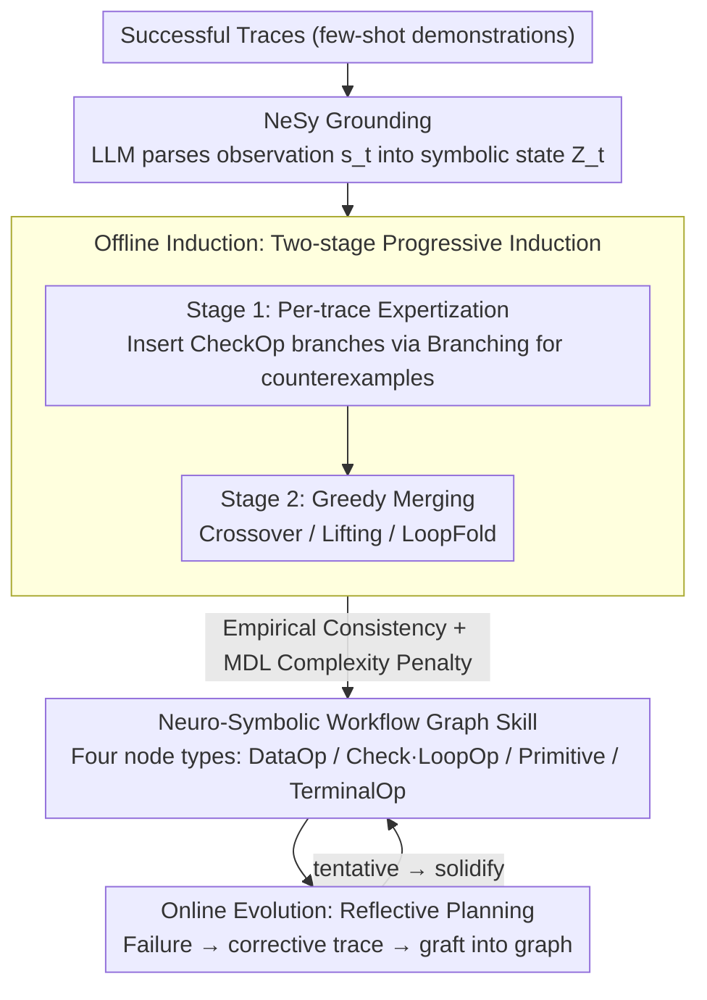

# Lifting Traces to Logic: Programmatic Skill Induction with Neuro-Symbolic Learning for Long-Horizon Agentic Tasks

**Conference**: ICML 2026  
**arXiv**: [2605.01293](https://arxiv.org/abs/2605.01293)  
**Code**: None  
**Area**: LLM Agent / Neuro-Symbolic / Long-Horizon Planning  
**Keywords**: Skill Induction, First-Order Logic, Workflow Graph, Reflective Planning, ALFWorld

## TL;DR
NSI "lifts" interaction traces of LLM agents into neuro-symbolic workflow graphs with explicit conditional branching and dynamic variable binding. This evolves skills from stateless scripts into state-aware logical programs, achieving success rates of 98.0 / 76.5 / 95.2 on ALFWorld / WebShop / TextCraft, significantly outperforming programmatic skill baselines like ASI and AWM.

## Background & Motivation

**Background**: Foundation model-driven agents increasingly rely on "skill induction" in long-horizon tasks—distilling past successful traces into reusable Python functions (e.g., ASI, AWM) to expand the action space and avoid redundant reasoning. This is equivalent to solidifying System-2 thinking into System-1 muscle memory.

**Limitations of Prior Work**: Current skills are either text-based workflows (AWM, non-executable) or stateless parameterized scripts (ASI, e.g., `Open(Receptacle) → Pick(Object)`). These scripts fail immediately when minor environmental deviations occur—for instance, if there is no "apple" in the refrigerator, the script still mechanically executes `Pick` without querying the state first.

**Key Challenge**: The mismatch between programmatic skills and the "conditionality" of real-world environments. LLMs synthesize code based on linear traces, leading to hardcoded sequential structures that lack the expressive power for branching logic, such as "if an apple exists after opening the fridge, take it; otherwise, search elsewhere." This lack of expressiveness causes ASI to score only 7.7 on WebShop (far below AWM's 49.2).

**Goal**: Upgrade skills from linear scripts to graph programs with explicit control flow and dynamic variable binding; enable agents to induce logic with strong generalization from minimal demonstrations (even a single trace) and continuously patch them through reflection during deployment.

**Key Insight**: From a neuro-symbolic perspective, LLMs excel at mapping perception to semantic predicates (System-1 like), while symbolic interpreters excel at executing precise if/loop logic (System-2 like). Decoupling these two preserves the flexible perception of LLMs while gaining the verifiability of programs.

**Core Idea**: Use a "trace-to-logic" lifting mechanism to abstract demonstrations into first-order logic and workflow graphs; induce global skills via a two-stage algorithm involving intra-trajectory consistency and inter-trajectory merging. During runtime, use reflective planning to graft failed subgraphs into failure nodes for skill self-evolution.

## Method

### Overall Architecture
NSI lifts interaction traces into logical programs with conditional branches and state-dependent decision-making. A skill is defined as a triplet $\pi_\omega = (\theta_\omega, \phi_\omega, G_\omega)$, comprising call parameters $\theta_\omega$, a neural perception module $\phi_\omega$ (using an LLM as a semantic parser to translate raw observations into symbolic states $Z_t$), and a symbolic execution graph $G_\omega$ (executed node-by-node by a deterministic interpreter). The pipeline involves three steps: first, NeSy Grounding maps environmental perception to a first-order logic predicate space; second, Offline Induction distills successful traces into modular skills; finally, Online Evolution uses reflective planning during deployment to patch logical branches based on runtime feedback.

### Key Designs

**1. Four Node Types for Neuro-Symbolic Workflow Representation: Transforming Stateless Scripts into State-Aware Graphs**

Linear scripts like ASI collapse under environmental deviations because they hardcode actions into a sequential flow. NSI reformulates skills as directed graphs with four specialized node types: **DataOp** handles dynamic variable binding, synthesizing a program $f_v: \mathcal{C} \times \mathcal{Z} \to \mathcal{C}$ (e.g., `target = select_one(x, is_type(x, 'apple') ∧ contains(loc, x))`); **CheckOp/LoopOp** manage control flow, with the former synthesizing boolean discriminants like `is_closed(y) ∧ locates('agent', y)` to determine branches, and the latter folding repetitive structures into loops; **PrimitiveOp** represents atomic actions with parameters referencing variables bound by upstream DataOps; **TerminalOp** terminates execution upon success or failure, outputting diagnostic info like "$\nexists x, \text{is\_type}(x, \text{apple})$" on failure. This modularity allows the agent to rewrite specific CheckOps without regenerating the entire skill and forces the LLM to formalize "why" and "when" actions occur.

**2. Empirical Programmatic Consistency: Replacing Online Rollouts with Historical Trace Consistency**

Embodied or web environments are often difficult to reset perfectly, making it infeasible to validate candidate skills through repeated online rollouts. NSI establishes the induction goal based on trajectory consistency: a skill $\pi_\omega$ is "consistent" with a state $s_h$ in trace $\tau$ if and only if all non-empty actions $\hat{a}_k$ produced by it starting from $s_h$ match the expert actions $a^\ast_{h+m(k)}$. The optimization objective is:

$$\max_{\pi_\omega} \sum_\tau \big|\widehat{\mathcal{R}}_{\pi_\omega}^\tau\big| - \lambda |\pi_\omega|$$

This maximizes the empirical coverage while penalizing program complexity $|\pi_\omega|$ based on the MDL principle. This approach avoids environment restarts, maintains the constraint of reproducing expert behavior, and prevents overfitting.

**3. Two-Stage Progressive Induction + Four Structural Operators: Expertization followed by Greedy Merging**

Optimizing the global objective in program space leads to combinatorial explosion. NSI uses a "divide and conquer" strategy. **Stage 1** synthesizes a local skill $\pi_\tau$ for each trace. Whenever a counterexample state $s_{\text{err}}$ is encountered, the **Branching** operator inserts a CheckOp branch to satisfy the specific trace. **Stage 2** performs greedy merging: it identifies the trace skill $\pi_{\text{hard}}$ with the poorest current coverage and executes $\mathtt{Consolidate}(\pi_{\text{glb}}, \pi_{\text{hard}})$, accepting the merge only if it strictly expands the feasible region. Three operators are used: **Crossover** grafts subgraphs, **Lifting** promotes constants to parameters for cross-instance generalization, and **LoopFold** abstracts repetitive structures.

### Loss & Training
NSI does not update LLM parameters; all "training" occurs in the program space. Stage 1 relies on iterative consistency checks and LLM program synthesis. Stage 2 uses greedy feasibility dominance verification. During the online phase, Reflective Planning generates a corrective trajectory upon failure and merges it into the skill graph using the same structural operators. New branches exist as "tentative" and are only "solidified" after repeated successes to prevent corrupted skills. The backbone is GPT-4o with temperature set to 0.

## Key Experimental Results

### Main Results

| Method | ALFWorld SR (%) | WebShop Score | WebShop SR (%) | TextCraft SR (%) |
|------|-----------------|---------------|-----------------|--------------------|
| ReAct | 85.8 | 44.0 | 20.0 | 62.0 |
| Reflexion | 84.3 | 40.8 | 23.0 | 59.0 |
| AWM | 91.3 | 49.2 | 30.0 | 92.5 |
| ASI | 70.6 | 7.7 | 7.5 | 77.8 |
| **NSI w/o online honing** | **93.5** | **58.8** | **30.5** | 78.5 |
| **NSI (Ours)** | **98.0** | **76.5** | **44.5** | **95.2** |

### Ablation Study

| Configuration | Observation | Interpretation |
|------|------|------|
| ASI (No logic branches) | WebShop Score only 7.7 | Linear scripts cannot express conditional logic. |
| NSI offline only | Outperforms all baselines | Logical programmatic representation is inherently powerful. |
| NSI full (with online honing) | SOTA across all benchmarks | Reflective planning converts failures into permanent capabilities. |
| Avg atomic steps / skill | NSI $\approx 7.4$ vs lower for ASI | NSI compresses 7+ steps of logic into one skill. |

### Key Findings
- Formalizing experience into scripts (ASI) can be worse than pure text workflows (AWM) if the program lacks expressiveness—demonstrating that "insufficient programs" are worse than "non-executable text."
- "Long-horizon collapse" in ALFWorld: Baselines see success rates drop to 0 at $>22$ steps, while NSI maintains performance at 53+ steps by compressing the planning horizon.
- The gain of text-based memory (Reflexion) over ReAct is negligible, suggesting the bottleneck in long-horizon tasks is "consistent execution" rather than "recall."

## Highlights & Insights
- The "trace-to-logic lifting" concept is highly general—any LLM agent can upgrade demonstrations into verifiable programs, transferable to complex scenarios like SWE-bench or robotics.
- Reflective Planning transforms failure signals into "local subgraph grafting," acting as a programmatic version of continuous learning while avoiding catastrophic forgetting.
- The combination of MDL penalty and structural operators provides a clear preference (coverage vs. simplicity) for LLMs searching the program space.

## Limitations & Future Work
- Assumes the environment provides an enumerable vocabulary of predicates (structured feedback in ALFWorld/WebShop); predicate discovery remains a challenge for open worlds.
- High cost of using GPT-4o as the synthesizer; the feasibility of smaller models as synthesizers is not explored.
- Online honing depends on the LLM proposing correct trajectories; incorrect recovery paths could pollute the skill graph, managed but not fully quantified by "tentative → solidify" cycles.
- Minimal improvement in TextCraft (95.2 vs AWM 92.5) suggests the marginal value of logical branching is lower in tasks where "recursive decomposition" is sufficient.

## Related Work & Insights
- **vs ASI**: ASI synthesizes parameterized scripts without explicit control flow like CheckOp; NSI uses predicate invention to synthesize branches, improving WebShop scores from 7.7 to 76.5.
- **vs AWM**: AWM uses text templates; NSI uses symbolic graph programs that are verifiable and precisely executable.
- **vs Agentic Workflow Generation (AFlow, GPTSwarm)**: Those methods assemble predefined nodes; NSI "invents" internal logic at a finer granularity.
- **vs Classical RL Options (Sutton 1999)**: Traditional options are black-box neural policies needing massive optimization; NSI skills are readable Python-adjacent code naturally aligned with LLM generation.

## Rating
- Novelty: ⭐⭐⭐⭐⭐ Realizing the neuro-symbolic "trace lifting" idea through LLMs for agent frameworks.
- Experimental Thoroughness: ⭐⭐⭐⭐ Three major benchmarks with solid ablation and horizon analysis.
- Writing Quality: ⭐⭐⭐⭐ Clear algorithm and node definitions, though some formalization is dense.
- Value: ⭐⭐⭐⭐⭐ Provides a new paradigm for expressive skill learning in LLM agents.

<!-- RELATED:START -->

## Related Papers

- [\[CVPR 2026\] WebGym: Scaling Training Environments for Long-Horizon Visual Web Agents with Realistic Tasks](../../CVPR2026/llm_agent/webgym_scaling_training_environments_for_long-horizon_visual_web_agents_with_rea.md)
- [\[ACL 2026\] SOLAR-RL: Semi-Online Long-horizon Assignment Reinforcement Learning](../../ACL2026/llm_agent/solar-rl_semi-online_long-horizon_assignment_reinforcement_learning.md)
- [\[ICLR 2026\] MEM1: Learning to Synergize Memory and Reasoning for Efficient Long-Horizon Agents](../../ICLR2026/llm_agent/mem1_learning_to_synergize_memory_and_reasoning_for_efficient_long-horizon_agent.md)
- [\[ACL 2026\] FregeLogic at SemEval 2026 Task 11: A Hybrid Neuro-Symbolic Architecture for Content-Robust Syllogistic Validity Prediction](../../ACL2026/llm_agent/fregelogic_at_semeval_2026_task_11_a_hybrid_neuro-symbolic_architecture_for_cont.md)
- [\[ICML 2026\] Skill-Pro: Learning Reusable Skills from Experience via Non-Parametric PPO for LLM Agents](skill-pro_learning_reusable_skills_from_experience_via_non-parametric_ppo_for_ll.md)

<!-- RELATED:END -->
