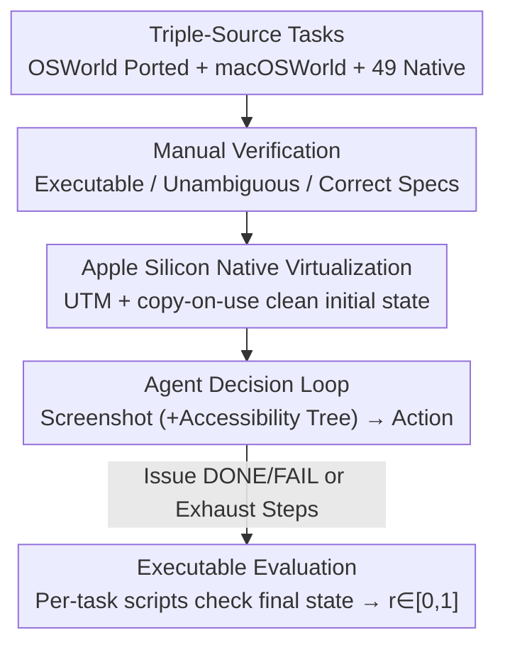

# MacArena: Benchmarking Computer Use Agents on an Online macOS Environment

**Conference**: ICML2026  
**arXiv**: [2606.06560](https://arxiv.org/abs/2606.06560)  
**Code**: https://github.com/MacPaw/MacArena  
**Area**: Agent / GUI Agent / Evaluation Benchmark  
**Keywords**: Computer Use Agent, macOS, GUI Agent, Online Evaluation, Verifiable Reward  

## TL;DR
MacArena unifies ported OSWorld tasks, macOSWorld tasks, and 49 brand-new macOS native tasks (totaling 421 tasks across 50 applications) into a real macOS environment running on Apple Silicon's native virtualization framework. Equipped with per-task handwritten executable evaluation scripts, it reveals that current GUI agents generally perform worse on macOS than Linux, and model rankings reverse between "ported tasks" and "macOS native tasks"—revealing that high scores on existing benchmarks stem more from "having seen this task distribution" rather than true cross-platform GUI capabilities.

## Background & Motivation

**Background**: Computer Use Agents (CUA) directly perceive screen captures and operate Graphical User Interfaces (GUI) via mouse and keyboard. Their capabilities have surged in recent years, largely driven by standardized online evaluation environments like OSWorld, which serve as both benchmarks and training grounds for reinforcement learning. OSWorld covers Linux and Windows and has become the de facto standard for training and evaluating desktop GUI agents.

**Limitations of Prior Work**: macOS is almost entirely absent from this ecosystem. The only macOS benchmark, macOSWorld, only covers a narrow slice of built-in system applications (Finder, Safari, Calendar, etc.), with simpler and less ambiguous tasks that rarely involve third-party software—which is at the core of real macOS usage. More critically, it is built on x86 virtual machines, making it hardware-incompatible with the Apple Silicon product line that Apple transitioned to in 2020. While using cloud-based EC2 Mac instances is technically feasible, the costs are prohibitive for large-scale evaluation and RL training pipelines.

**Key Challenge**: Existing benchmarks assume that "strong GUI capability on Linux = strong cross-platform GUI capability," yet this assumption remains unverified. macOS features unique application conventions, complex window management, and dense third-party software that Linux benchmarks do not touch. Whether a model ranked highly on OSWorld can still perform on unfamiliar macOS native tasks remains an open question.

**Goal**: To build an online evaluation benchmark that (1) runs on real Apple Silicon macOS, (2) covers a vast array of third-party applications, (3) is entirely manually verified, and (4) allows direct comparison of "the same tasks on Linux vs. macOS."

**Key Insight**: Instead of reinventing all tasks, the authors port community-verified OSWorld/macOSWorld tasks into a real macOS environment and supplement them with a set of macOS native tasks to act as a "litmus test"—specifically exposing models that only perform pattern matching on old task distributions.

**Core Idea**: A dual-track design using "ported tasks to measure platform drift and native tasks to measure real generalization," disentangling a GUI agent's "platform familiarity" from its "true cross-platform capability."

## Method

### Overall Architecture
MacArena is essentially an evaluation environment rather than a new model. It addresses the problem of "how to evaluat CuAs reproducibly, cost-effectively, and with third-party app coverage on real Apple Silicon macOS." The pipeline connects the agent's decision loop, task definitions, and executable scoring: in each step, the agent receives a screenshot of the current macOS desktop (optionally with an accessibility tree) and outputs a mouse/keyboard action. This action is executed within an Apple Silicon virtual machine (VM), transitioning the environment state until the agent issues a termination action or the step limit is reached. Finally, a deterministic executable evaluation script checks the final state of macOS (file content, app state, system properties, shell command output) to provide a score $r\in[0,1]$.

The interaction is formalized as a Partially Observable Markov Decision Process (POMDP), defined by the tuple $(\mathcal{S},\mathcal{O},\mathcal{A},\mathcal{T},\Omega,r,\gamma,\mu_0,\mathcal{G},p_g,\varphi)$: where $\mathcal{S}$ is the full macOS state space including hidden states like background processes and the file system, $\mathcal{O}$ is the observation (screenshot + accessibility tree), $\mathcal{A}$ is the mouse/keyboard action space, and the reward $r:\mathcal{S}\times\mathcal{A}\times\mathcal{G}\rightarrow[0,1]$ is provided by task-specific evaluation scripts at the final step.

### Key Designs

**1. 421-Task Set from Triple Sources: Porting for Drift, Native for Generalization**
A single source cannot provide a task set that is both "comparable" and "capable of exposing generalization gaps." Therefore, MacArena assembles tasks from three sources. The first contains 221 tasks carefully selected and ported from OSWorld—these are **identical** to the original OSWorld tasks except for the OS, allowing a direct measurement of the score drop when tasks are moved from Linux to macOS. The second source includes 151 tasks from macOSWorld to ensure coverage of built-in system applications. The third source comprises 49 new macOS native tasks collected by the authors across 20 applications and 5 categories (File Management, System & Interface, Advanced Apps, Built-in Apps, Productivity), specifically targeting third-party/non-standard apps and macOS-specific interaction patterns. These 49 native tasks serve as the "litmus test": a model that has only seen OSWorld-style trajectories may score by memory on the first set but will be exposed on the third.

**2. Apple Silicon Native Virtualization + copy-on-use Clean State**
The reliance of macOSWorld on x86 VMs and its disconnection from modern Mac hardware was the root cause of its lack of scalability. MacArena employs UTM (based on Apple's native Virtualization framework) to run VMs on Apple Silicon, aligning with real-world environments at the hardware level and keeping RL training costs manageable. It maintains two VMs: one manually configured for OSWorld/macOSWorld installation/permission/evaluation prerequisites, and another fully generated by automated build scripts for MacArena's own tasks, facilitating migration across macOS versions and the addition of new apps. Since UTM does not natively support snapshot rollbacks, the authors adopt a **copy-on-use** strategy: before each task episode, the original VM image is copied into a temporary instance, which is discarded upon episode completion. This ensures every evaluation starts from a clean, reproducible initial state, preventing cross-contamination between tasks.

**3. Per-Task Handwritten Executable Scripts: Reality-Based Verification**
Success criteria for GUI tasks vary significantly (some check file content, others app states, system properties, or shell output); a universal scoring rule would inevitably lose fidelity. MacArena adheres to **executable evaluation**: after the agent issues a termination action, the corresponding evaluation script runs against the final VM state and returns a score in $[0,1]$. Each task includes three mandatory fields: `instruction` (natural language goal), `pre_command/config` (initialization, e.g., downloading files or opening documents), and `evaluator` (a deterministic verification function). It supports two formats: the OSWorld format using structured config files with predefined functions, and the macOSWorld format using shell scripts for initialization and evaluation (more flexible for complex or platform-specific logic). Crucially, the 49 MacArena native tasks **each have a separate, independently handwritten evaluation script**, providing high-quality signals by ensuring every task is executable and unambiguous.

### Loss & Training
This paper presents an evaluation benchmark and does not train models. The evaluation protocol is fixed: a limit of 15 steps per task, with each model run twice. The primary metric is the Success Rate (SR, the percentage of tasks where the evaluation script returns a positive result). Agents interact with the VM only through raw mouse and keyboard actions, receiving a screenshot at each step.

## Key Experimental Results

### Main Results
The authors evaluated 4 baseline agents: UI-TARS-1.5 7B, Qwen3-VL 2B, Qwen3-VL 4B, and OpenAI Computer Use Preview (CUA). The table below shows the overall success rate (%) across the three subsets:

| Subset | UI-TARS-1.5 7B | Qwen3-VL 2B | Qwen3-VL 4B | OpenAI CUA |
|------|------|------|------|------|
| OSWorld Subset | **21.27** | 9.95 | 16.36 | 16.74 |
| macOSWorld Subset | 24.50 | 15.89 | 39.74 | **52.32** |
| MacArena Native Subset | 10.20 | 4.08 | 12.24 | **36.73** |
| Overall Benchmark | 21.14 | 11.40 | 24.23 | **31.83** |

OpenAI CUA leads with an overall success rate of 31.83%, but no model exceeds approximately 32% overall—macOS remains a difficult challenge for current GUI agents.

### macOS vs. Linux Platform Gap
Comparing the OSWorld subset (macOS, 15 steps) with the original OSWorld scores (Ubuntu, 15 steps) reported officially, where the task sets are identical:

| Model | Ubuntu | macOS | Δ |
|------|------|------|------|
| UI-TARS-1.5 7B | 24.5 | 21.27 | −3.23 |
| OpenAI CUA | 26.0 | 16.74 | −9.26 |
| Qwen3-VL 2B | 17.0 | 9.95 | −7.05 |
| Qwen3-VL 4B | 26.2 | 16.36 | −9.84 |

All models showed a performance drop when tasks were moved to macOS. The gap stems from differences in application appearance, keyboard shortcuts, window management, and system behavior, which models primarily trained on Linux/Windows trajectories have not adapted to.

### Key Findings
- **Rank Reversal is the Most Important Signal**: UI-TARS-1.5 7B outperforms OpenAI CUA on the OSWorld subset (21.27% vs 16.74%), but the ranking completely reverses on the MacArena Native subset—OpenAI CUA achieves 36.73% while UI-TARS-1.5 7B drops to 10.2%, an inverse gap of over 26.5 percentage points. This suggests that strong performance on Linux-designed tasks **does not** migrate to new macOS native tasks; UI-TARS likely saw OSWorld-style trajectories during training and relied on memory, failing when faced with truly unfamiliar macOS apps.
- **Multi-app Tasks are Universally Difficult**: The multi-app category, requiring coordination across 2 or more apps, yielded nearly 0% success for all models across all subsets. Cross-app coordination remains an open problem for SOTA models.
- **Step Consumption Explains Difficulty**: Using OpenAI CUA statistics, the macOSWorld subset averaged 10.92 steps (8.05 for completed tasks), which was the lowest, explaining why models scored higher there—the tasks were shorter and simpler. The MacArena Native subset had the highest average steps at 13.96 (12.69 for completed tasks).

## Highlights & Insights
- **Controlled "Same Task, Different Platform" Design**: Moving OSWorld tasks to macOS while keeping them identical makes the platform gap (e.g., "9-point drop") an indisputable conclusion—a clean control design that many benchmarks lack.
- **Rank Reversal Debunks "Benchmark Score = True Capability"**: This is the most impactful insight. It warns the field that models chasing scores on existing benchmarks may just be pattern-matching known task structures. Native tasks in new environments are necessary to reveal true generalization shortfalls.
- **Transferable Engineering Strategies**: Using copy-on-use to bypass snapshot limitations, dual-VM division of labor (one for legacy benchmarks, one automated), and per-task handwritten evaluators are approaches directly applicable to any online agent evaluation project requiring heterogenous verification.

## Limitations & Future Work
- **Manual Task Collection Limits Scalability**: All 421 tasks were manually written and verified, which is time-consuming. While the authors suggest using LLMs to synthesize instructions, generated tasks might be ambiguous or infeasible, still requiring manual verification or automated feasibility checks.
- **Lack of Human Baseline**: Although tasks are 100% manually verified as completable, there is no study on human performance to serve as a reference for interpreting model results or measuring the remaining headroom.
- **Self-identified Limitations**: Running each task only twice with a 15-step limit leaves some variance and questions regarding step budgets unexplored. The platform gap analysis relied on a small sample of models with comparable official OSWorld scores.

## Related Work & Insights
- **vs. OSWorld**: OSWorld is the most comprehensive online benchmark. MacArena fills the macOS gap specifically and uses "same-task cross-platform" comparisons to quantify the platform gap.
- **vs. macOSWorld**: macOSWorld only covers built-in apps and runs on x86 VMs. MacArena improves upon this with third-party app coverage, manual verification, and Apple Silicon compatibility, while proving that macOSWorld tasks are significantly shorter (fewer steps).
- **vs. Offline Benchmarks (ScreenSpot/GUIrilla)**: Offline benchmarks only test element localization on static screenshots. MacArena is an online interactive benchmark that tests sequential decision-making and error recovery in dynamic environments.

## Rating
- Novelty: ⭐⭐⭐⭐ While not a new model, the combination of "Real Apple Silicon macOS + cross-platform control + rank reversal insight" is a high-value contribution.
- Experimental Thoroughness: ⭐⭐⭐⭐ Coverage of 4 baselines, 3 subsets, and 20 categories is comprehensive; however, more runs per task and more models for platform comparison would be beneficial.
- Writing Quality: ⭐⭐⭐⭐⭐ Extremely clear motivation and well-articulated insights on rank reversal.
- Value: ⭐⭐⭐⭐⭐ Establishes macOS as a first-class evaluation target and serves as a vital warning that "benchmark scores do not equal true capability."

<!-- RELATED:START -->

## Related Papers

- [\[ICLR 2026\] Efficient Agent Training for Computer Use](../../ICLR2026/llm_agent/efficient_agent_training_for_computer_use.md)
- [\[ICLR 2026\] AgentSynth: Scalable Task Generation for Generalist Computer-Use Agents](../../ICLR2026/llm_agent/agentsynth_scalable_task_generation_for_generalist_computer-use_agents.md)
- [\[ICML 2026\] Web Agents Should Use Typed Actions Instead of Click-Based Browsing](web_agents_should_use_typed_actions_instead_of_click-based_browsing.md)
- [\[ICML 2026\] Reward Hacking Benchmark: Measuring Exploits in LLM Agents with Tool Use](reward_hacking_benchmark_measuring_exploits_in_llm_agents_with_tool_use.md)
- [\[ICML 2026\] Persona2Web: Benchmarking Personalized Web Agents for Contextual Reasoning with User History](persona2web_benchmarking_personalized_web_agents_for_contextual_reasoning_with_u.md)

<!-- RELATED:END -->
