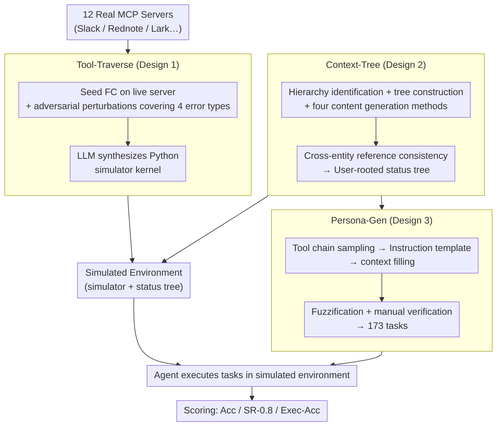

# MCP-Persona: Evaluating LLM Agent Capabilities in Real-World Personal Applications via Environment Simulation

**Conference**: ICML 2026  
**arXiv**: [2606.02470](https://arxiv.org/abs/2606.02470)  
**Code**: https://github.com/wwh0411/MCP-Persona  
**Area**: LLM Agent / Benchmark / Tool Use  
**Keywords**: MCP, Personalization, agent benchmark, environment simulation, tool calling

## TL;DR
MCP-Persona is the first LLM agent benchmark targeting real-world personalized MCP tools (12 servers including Slack/Rednote/Instagram/Lark, etc.). It proposes three methods—Tool-Traverse, Context-Tree, and Persona-Gen—to automatically synthesize Python simulator code using LLMs, avoiding real-account issues. Testing 10+ SOTA agents reveals that even Claude-Sonnet-4.5 achieves only 38.66% Acc, proving that personalized tool use is a severely underestimated capability gap.

## Background & Motivation

**Background**: MCP is the standard protocol for connecting LLMs to external tools and has been widely adopted by Anthropic Skills, OpenClaw, and others. However, existing tool-use benchmarks (AppWorld, PersonaBench, MCP-Universe, ToolAthlon) mostly utilize general information-seeking tools or synthetic tools, failing to evaluate personalized tools that "bind user accounts and operate local states."

**Limitations of Prior Work**: Personalized MCP evaluation faces three difficulties: (1) real deployment requires private user data and extensive manual configuration; (2) privacy and security restrictions limit open data sharing; (3) maintaining a stable, executable simulation environment is a non-trivial technical challenge.

**Key Challenge**: Authentic evaluation requires real data (privacy issues), while synthetic evaluation suffers from a distribution gap (unreliable evaluation signals). Existing benchmarks have chosen the synthetic route, lacking coverage for widely used applications such as Slack, Instagram, and Lark.

**Goal**: To build an evaluation platform that reflects real personalized tool behavior without relying on real user data, covering four major categories: social media, corporate collaboration, email, and content management.

**Key Insight**: A traverse-then-simulate paradigm. First, successful and failed function calling (FC) records are traversed on real MCP servers using sandbox accounts to capture behavior. Then, LLMs autonomously synthesize Python code to serve as a simulator, ensuring the distribution remains close to reality. User context is modeled using a tree hierarchy, and tasks are generated via tool chain sampling, instruction fuzzification, and manual verification.

**Core Idea**: Three components: (1) Tool-Traverse: uses seed FC and adversarial generation to expand the pool, records real behavior, and prompts LLMs to write Python simulators; (2) Context-Tree: represents entities via a hierarchy (e.g., User→Calendar→Event); (3) Persona-Gen: generates 173 tasks via tool chain sampling → prototyping → context injection → fuzzing → manual verification.

## Method

### Overall Architecture

The core contradiction MCP-Persona addresses is that evaluating personalized tools requires real account behavior while prohibiting access to real user privacy data. The solution is the traverse-then-simulate paradigm—first traversing each MCP server's successful and failed calls on sandbox accounts to record behaviors, then letting an LLM "write" these behaviors into an executable Python simulator to replace the real server. The pipeline consists of three components: Tool-Traverse produces the simulator kernel for each server, Context-Tree produces a personalized data tree rooted at the User as the simulator's state, and Persona-Gen samples tool chains from this tree to generate and manually verify 173 tasks. Agents finally execute tasks in this simulated environment, scored by Acc, SR-0.8, and Exec-Acc.

### Key Designs

**1. Tool-Traverse: Traversing real server behavior for LLM code synthesis**

Manually mocking an MCP server is difficult as it often misses various error handling scenarios and does not scale across 12 servers. Tool-Traverse avoids manual simulator writing by first collecting behaviors on real servers. It involves three steps: Bootstrapping, where a valid seed call $x_{\text{seed}}$ is executed on a live server to record a successful trajectory $(t, x_{\text{seed}}, y_{\text{seed}}, \tau)$; Adversarial Failure Induction, where the LLM systematically perturbs the seed input to cover Type Mismatch, Schema Violation, Boundary, and Semantic Conflict errors, recording the failed responses from the real server; and Code-Based Simulation, where the LLM uses the tool schema, behavior trajectories, and context handler APIs to synthesize a Python file $K_t$ that implements the state transition $f_t: (\mathcal{C}_{\text{current}}, x) \to (\mathcal{C}_{\text{new}}, y)$, including full logic for input validation, entity checks, and error responses.

**2. Context-Tree: Carrying personalized state with a User-rooted tree**

A simulator requires stateful user context to support multi-round operations. Context-Tree builds user context as a hierarchical tree matching real MCP server data structures. It begins with Hierarchy Identification, aggregating entity types, fields, and relationships from the tool call pool into a User-rooted hierarchy (e.g., User→Calendar→Event in Lark). In Tree Construction, similar child nodes under a parent entity are stored in maps indexed by identifiers, while foreign keys link disparate entity types to support efficient lookups/updates. Finally, Content Generation uses four methods based on field properties: Enumerate (e.g., `iplocation`), Free-Form (e.g., `channel_name`), Random (e.g., `chat_id`), and Authentic (sampling real text from platforms like Rednote). This ensures data reflects real distributions while replacing sensitive fields with synthetic values.

**3. Persona-Gen: Two-stage generation, fuzzification, and manual verification for 173 tasks**

Persona-Gen uses a five-step pipeline to balance scale and quality. Tool Chain Sampling uses topological sampling to select tool chains satisfying five principles: Dependency, Personalization, Deduplication, Coherence, and Realism. Instruction Prototyping allows the LLM to abstract instructions into templates $S_{\text{proto}}$ using typed placeholders $P$. Context Enrichment samples real entity values from the context-tree to replace placeholders, resulting in specific instructions $S_{\text{inst}}$. A crucial step is Fuzzification, which removes implicit context (e.g., inferring a colleague's `user_id` from a shared group) to produce $S_{\text{fuzz}} = \mathcal{F}(S_{\text{inst}} \setminus \mathcal{C}_{\text{imp}})$. This simulates the real-world difficulty where users provide incomplete instructions and agents must complement information from the environment. Finally, Human Verification ensures consistency and increases difficulty, resulting in 173 high-quality single-server and cross-server tasks.

## Key Experimental Results

### Benchmark Comparison

| Benchmark | Real-World | Personal Context | Social Media | Collab | Email | Content |
|---|---|---|---|---|---|---|
| AppWorld | ✗ | ✓ | ✗ | ✗ | ✓ | ✓ |
| PersonaBench | ✗ | ✓ | ✗ | ✗ | ✓ | ✓ |
| InfoMosaic-Bench | ✓ | ✗ | ✗ | ✗ | ✗ | ✗ |
| MCP-Universe | ✓ | ✗ | ✗ | ✗ | ✗ | ✓ |
| TOOLATHLON | ✓ | ✗ | ✗ | ✗ | ✓ | ✓ |
| **MCP-Persona** | ✓ | ✓ | ✓ | ✓ | ✓ | ✓ |

MCP-Persona is the only benchmark covering all five dimensions, particularly Social Media and Collaboration platforms.

### Main Results: SOTA Agents on MCP-Persona

| Model | Collab | Content | Social | Email | Lark | Rednote | Hodgepodge | Acc | SR-0.8 | Exec-Acc |
|---|---|---|---|---|---|---|---|---|---|---|
| Claude-Sonnet-4.5 | 39.94 | 19.76 | 47.04 | 43.63 | 40.81 | 42.37 | 12.50 | **38.66** | 10.40 | 41.50 |
| GPT-5 | 43.50 | 22.57 | 42.64 | 47.17 | 37.67 | 34.66 | 12.50 | 36.99 | 6.94 | 41.45 |
| Claude-Opus-4.1 | 38.79 | 13.56 | 44.79 | 9.71 | 39.67 | 34.70 | 25.00 | 34.52 | 7.05 | 36.77 |
| o4-mini | 34.38 | 21.22 | 35.61 | 53.83 | 30.43 | 25.25 | 6.25 | 30.70 | 5.78 | 34.73 |
| o3 | 26.41 | 14.55 | 32.78 | 41.08 | 34.64 | 26.05 | 37.50 | 29.79 | 5.20 | 30.27 |
| GPT-4o | 24.50 | 7.58 | 36.98 | 12.57 | 30.65 | 20.29 | 25.00 | 25.56 | 4.35 | 20.02 |

**Claude-Sonnet-4.5 achieves only 38.66% overall Acc**, proving that personalized tool use is a major bottleneck for current LLM agents. Performance on Hodgepodge (cross-server mixtures) is particularly poor (12–25%).

### Key Findings

- **SOTA below 50%**: All models score < 50% Acc, significantly lower than the 70–80%+ seen on general tool benchmarks.
- **Cross-server coordination as a bottleneck**: Performance on Hodgepodge tasks is low (12–25%), showing that cross-service coordination is much harder than single-server tasks.
- **Content Management is hardest**: All models perform worst in Content Mgmt (< 25%), which requires deep understanding of user history rather than simple CRUD.
- **High variance in Email tasks**: o4-mini achieves 53.83 while Claude-Opus-4.1 scores only 9.71, likely due to differences in training data volume for email samples.
- **Simulation Effectiveness**: Experiments show high prediction accuracy between simulator responses and real servers, validating Tool-Traverse.

## Highlights & Insights

- **First benchmark for personalized tools**: Evaluation for Slack, Rednote, Instagram, and Lark was previously blank; this work fills that gap.
- **Traverse-then-simulate paradigm**: Real account traversals combined with LLM-synthesized simulators reduce manual costs while maintaining high fidelity.
- **Error pattern coverage**: Systematic adversarial generation allows the simulator to accurately replicate server error handling.
- **Context-Tree hybrid generation**: Tree structures match real data, and the use of authentic text ensures realism while protecting privacy.
- **Fuzzification in Persona-Gen**: Strategically removing implicit context simulates the core difficulty of real-world agent use.
- **Impactful conclusion**: SOTA models scoring below 50% highlights the significant work remaining for personalized agents.

## Limitations & Future Work

- **Task scale is small**: 173 tasks may lack statistical power compared to large-scale benchmarks like MMLU.
- **Limited application coverage**: The 12 MCP servers are mainly English/Chinese; other linguistic ecosystems are missing.
- **Simulator fidelity edge cases**: While close to real, simulators may miss complex edge cases found in actual deployment.
- **Lack of failure analysis**: While SOTA is below 50%, there is no detailed breakdown of whether errors stem from information seeking or multi-step coordination.
- **Privacy guarantees**: While sensitive fields are replaced, more systematic privacy audits are needed.
- **No adversarial users**: The benchmark assumes well-intentioned tasks rather than malicious or intentionally deceptive user instructions.
- **Missing training baselines**: The experiment only evaluates SOTA models without exploring if fine-tuning can improve personalization.

## Related Work & Insights

- **vs AppWorld / PersonaBench**: These use synthetic tools, whereas MCP-Persona uses real-world MCP tools.
- **vs ToolAthlon**: Real-world but lacks Social Media/Collaboration due to account binding issues; MCP-Persona bypasses this via simulation.
- **vs Tau-Bench**: Uses synthetic tools for airline/retail; MCP-Persona uses a real distribution.
- **Insights**: (1) The traverse-then-simulate paradigm is applicable to any domain requiring private data for benchmarks. (2) LLM-as-coder for simulators is a key trick for scalable benchmark construction. (3) The evaluation gap warns the community not to be misled by high scores on general tool benchmarks.

## Rating

- Novelty: ⭐⭐⭐⭐⭐ The traverse-then-simulate paradigm, LLM-as-coder simulators, and Context-Tree hierarchy are methodological innovations.
- Experimental Thoroughness: ⭐⭐⭐⭐ Evaluation of 10+ SOTA agents and simulator validation is solid, though failure analysis is lacking.
- Writing Quality: ⭐⭐⭐⭐ The pipeline description is clear, and Figure 1 is intuitive.
- Value: ⭐⭐⭐⭐⭐ Directly reveals flaws in LLM personalization, providing a necessary foundation for the agent training community.

<!-- RELATED:START -->

## Related Papers

- [\[ACL 2026\] MCP-Flow: Facilitating LLM Agents to Master Real-World, Diverse and Scaling MCP Tools](../../ACL2026/llm_agent/mcp-flow_facilitating_llm_agents_to_master_real-world_diverse_and_scaling_mcp_to.md)
- [\[ICML 2026\] Agent-Omit: Adaptive Context Omission for Efficient LLM Agents](agent-omit_adaptive_context_omission_for_efficient_llm_agents.md)
- [\[ICML 2026\] SafeHarbor: Defining Precise Decision Boundaries via Hierarchical Memory-Augmented Guardrail for LLM Agent Safety](safeharbor_hierarchical_memory-augmented_guardrail_for_llm_agent_safety.md)
- [\[ACL 2026\] OPeRA: A Dataset of Observation, Persona, Rationale, and Action for Evaluating LLMs on Human Online Shopping Behavior Simulation](../../ACL2026/llm_agent/opera_a_dataset_of_observation_persona_rationale_and_action_for_evaluating_llms_.md)
- [\[ICML 2026\] Weasel: 通过重要性-多样性数据选择实现 Web Agent 的域外泛化](weasel_out-of-domain_generalization_for_web_agents_via_importance-diversity_data.md)

<!-- RELATED:END -->
