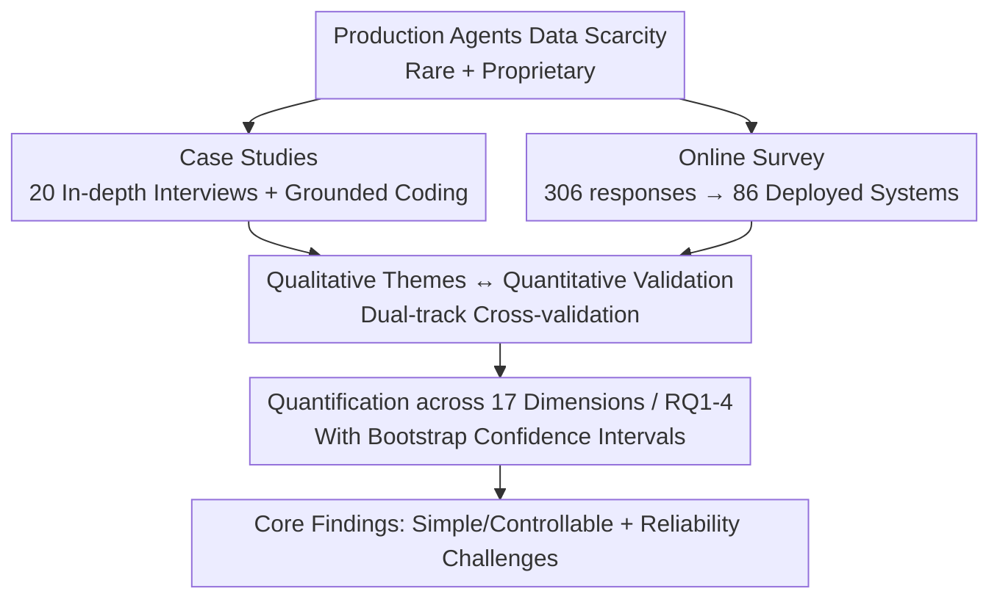

# Measuring Agents in Production

**Conference**: ICML 2026  
**arXiv**: [2512.04123](https://arxiv.org/abs/2512.04123)  
**Code**: To be confirmed  
**Area**: LLM Agent / Empirical Study / Production Deployment  
**Keywords**: Production agents, empirical survey, deployment practices, reliability, system-level design

## TL;DR
This is the first systematic empirical study investigating "how LLM agents in production are actually built and evaluated." Through 20 in-depth case studies and 306 practitioner surveys (filtering 86 deployed/pilot systems) across 26 domains, the authors find that production agents generally follow a "simple and controllable" route ($68\%$ execute $\le 10$ steps before human intervention, $70\%$ directly prompt off-the-shelf models without weight fine-tuning, and $74\%$ rely primarily on human evaluation). **Reliability** is identified as the number one challenge, and practitioners primarily address it through system-level design rather than algorithmic or model-layer innovation.

## Background & Motivation

**Background**: LLM agents combine foundation models with tools, memory, and reasoning to execute multi-step tasks autonomously. While the research community shows intense interest (e.g., drug discovery, scientific discovery), industrial players have already deployed these systems in critical sectors such as finance, healthcare, and education.

**Limitations of Prior Work**: Despite the high enthusiasm, numerous studies show that agent deployments **frequently fail or underperform expectations**. The vast contrast between "agent potential" and "real-world failure" raises a fundamental question: what factors lead to successful agent deployment? However, **almost no public information exists on how production agents are constructed**, as successful real-world deployments are scarce, largely proprietary, and companies are reluctant to disclose details.

**Key Challenge**: The research community continuously pursues RL, complex planning, and autonomy on benchmarks, while production environments face "engineering realities" such as reliability, controllability, and vulnerability to model upgrades. A bridge is missing—researchers cannot see deployment realities, and practitioners' experiences are locked within corporate silos.

**Goal**: Use primary data to answer four research questions: RQ1 What are the application scenarios for agents; RQ2 What models/architectures/methods are used; RQ3 How are they evaluated; RQ4 What are the primary challenges of deployment.

**Key Insight**: Instead of surveying published literature or analyzing individual systems, it is more effective to **directly collect primary data from practitioners** building deployment-grade agents through a combination of interviews and surveys.

**Core Idea**: Systematically collect, anonymize, code, and quantify deployment data—usually treated as trade secrets—to create the first "technical profile of production agents," highlighting deployment realities and neglected research directions for the academic community.

## Method

### Overall Architecture
This is a **measurement study** employing a mixed-methods design. It consists of two parallel data collection streams: ① 20 in-depth case studies (semi-structured interviews) for qualitative observations; ② 306 public online surveys to provide large-scale quantitative confirmation. Qualitative themes are categorized via grounded coding, and 86 "deployed/pilot" systems are filtered as the primary subjects for analysis across 17 design dimensions. The two data streams mutually validate each other: interviews provide depth and "why," while surveys verify breadth and prevalence.

### Key Designs

**1. Dual-track Data Collection: Inter-validation of In-depth Interviews and Large-scale Surveys**

A single method cannot address this problem—interviews can uncover "why a design was chosen" but have small, potentially biased samples; surveys provide scale but only structured selections. The authors used **snowball sampling** for the 20 cases: starting with agent teams at major tech firms and expanding by application diversity, organizational maturity, and global coverage. These cover 5 industries and range from startups to global enterprises, with users from hundreds to millions. Simultaneously, a 47-question survey (using dynamic branching in Qualtrics) was distributed via AI summits and professional networks, receiving 306 valid responses between July and October 2025.

**2. Strict Filtering + Grounded Coding for Data Credibility**

The study faces two obstacles: the rarity of successful deployments and the proprietary nature of systems. The authors countered bias through transparent filtering and coding. From 306 survey responses, **86 were strictly filtered as being in production or pilot stages**. These 86 systems serve audiences ranging from dozens to over a million users. Analysis utilized grounded theory's open coding: each interview note was **independently coded by at least three researchers**, with discrepancies resolved via peer debriefing. Free-text domain classifications used LOTUS for semantic aggregation followed by human labeling (Cohen's $\kappa = 0.636$). All categorical comparisons report $95\%$ confidence intervals derived from 1000 bootstrap resamples.

**3. "Deployed Systems" as the Unit of Analysis to Expose Gaps with Research Prototypes**

Many agent research conclusions stem from research prototypes on benchmarks. The authors deliberately anchored the analysis on **86 deployed systems serving real users** and compared them with research prototypes. For instance, Fig. 21a shows research prototypes have significantly higher step counts than production deployments. This design is the source of the paper’s insights: by looking only at real deployments, the authors observed systemic "sacrificing of capability for reliability"—high autonomy, RL, and complex planning favored by research are significantly constrained in deployment.

### A Complete Example: What a Typical Production Agent Looks Like
Synthesizing several cases: it serves **internal employees** ($52\%$ of deployments), operates in background automation scenarios with **minute-level latency tolerance** ($66\%$ tolerate minutes or longer because being $10\times$ faster than a human baseline is sufficient), directly **prompts a closed-source frontier model** (e.g., Claude Sonnet 4 / GPT o3; 17/20 cases use closed-source) without fine-tuning ($70\%$ do not fine-tune weights), uses **human-written or human+LLM drafted prompts** ($79\%$), runs within **predefined structured workflows**, executes fewer than 10 steps before human intervention ($68\%$), and is guarded by **human-in-the-loop evaluation** ($74\%$) rather than formal benchmarks ($75\%$ do not conduct formal benchmarks, relying on A/B testing and expert feedback). The design philosophy is highly consistent: **trading autonomy for controllability to gain reliability and facilitate rapid iteration**.

## Key Experimental Results

### Core Figures for the Four Research Questions
The paper answers RQ1–RQ4 through dual-track data. The following table summarizes the most critical quantitative findings.

| RQ | Dimension | Key Figures | Interpretation |
|----|-----------|-------------|----------------|
| RQ1 | Motivation | Productivity boost $80\%$, labor reduction $72\%$ | Focus is on quantifiable productivity; hard-to-measure gains like risk mitigation ($12\%$) are less common. |
| RQ1 | Target Users | $93\%$ face human users ($52\%$ internal / $40\%$ external) | Human-in-the-loop oversight; internal deployment first to mitigate risk. |
| RQ1 | Latency Tolerance | $66\%$ tolerate minutes or longer, $17\%$ no clear limit | Challenges the mainstream "ML must minimize latency" goal. |
| RQ2 | Model Selection | 17/20 use closed-source frontier models; $59\%$ use multi-model | Open-source is only adopted under cost/compliance constraints. |
| RQ2 | Weight Fine-tuning | $70\%$ (14/20) do not fine-tune, use direct prompting | Fine-tuning is vulnerable to model upgrades and has high maintenance costs. |
| RQ2 | Prompt Construction | $79\%$ manual or human+LLM; only $9\%$ use prompt optimizers | Preference for controllability, interpretability, and rapid iteration. |
| RQ2 | Architecture | $80\%$ (16/20) use structured workflows; $68\%$ execute $< 10$ steps | Deliberately constraining autonomy for stability. |
| RQ2 | Framework | $85\%$ (17/20) use in-house rather than 3rd-party frameworks | Mature systems tend to build directly on APIs. |
| RQ3 | Evaluation | $74\%$ rely on human-in-the-loop; $75\%$ lack formal benchmarks | LLM-as-a-judge is only used for supplementary validation. |
| RQ4 | Top Challenge | Reliability (consistent correctness over time) | Followed by evaluation (benchmark scarcity) and safety. |

### Key Findings
- **"Simple and controllable" is a deliberate choice, not a lack of capability**: Practitioners default to prompting closed-source models because they are more robust to upgrades, more sample-efficient, and faster to develop—not because they lack knowledge of RL or fine-tuning.
- **Model upgrades are a first-order reliability risk**: Agent scaffolding, prompts, and evaluations are often "locked" to specific model behaviors. Switching models can break workflows, forcing teams to run legacy models ($C10$); $59\%$ multi-model usage partly stems from this operational constraint. "Stronger models do not guarantee better agent performance."
- **Latency tolerance subverts optimization goals**: Mainstream ML system research focuses on reducing latency, but production agents are often background asynchronous automation ($15$ out of 20 cases can be asynchronous). Minute-level latency allows for "trading speed for correctness."
- **Evaluation is an underestimated bottleneck**: Scarcity of benchmarks and feedback delay lead $75\%$ of teams to skip formal benchmarking, making reliability issues harder to measure systematically.

## Highlights & Insights
- **The first technical profile of production agents**: Systematically capturing and quantifying proprietary deployment data fills the information vacuum between research hype and deployment reality.
- **Underlying principle: System-level Design > Algorithmic Innovation**: The paper converges scattered data into a central thesis: practitioners achieve reliability through system-level best practices (structured workflows, human-in-the-loop, multi-model redundancy) rather than algorithmic breakthroughs.
- **Reusable Methodology**: The dual-track validation + independent grounded coding + bootstrap confidence intervals provide a solid template for empirical studies in software engineering and AI systems.

## Limitations & Future Work
- **Sampling and Geographic Bias**: Case study teams are concentrated in the Americas (with some Europe). Survey respondents are biased toward the authors' professional networks and company policies.
- **Temporal Snapshot**: Data collection occurred between April and November 2025. Given the rapid evolution of the agent field, patterns may shift; conclusions should be treated as qualitative evidence.
- **Self-reporting vs. Direct Audit**: Data relies on practitioner statements; there is no direct code or behavior audit of the systems. The authors list "direct auditing" as future work.
- **Small Sample Sizes in Certain Dimensions**: Some nuanced conclusions (e.g., fine-tuning tendencies in latency-sensitive teams) are explicitly labeled as "observations" rather than universal prevalence claims.

## Related Work & Insights
- **Vs. Commercial Agent Surveys (LangChain 2024 / Consulting Reports)**: Those works focus on business viability and organizational readiness, often interviewing executives. This paper focuses on the "production system" scope and technical data from frontline developers.
- **Vs. Academic Surveys**: Literature surveys synthesize published papers. This work **collects primary data**, revealing deployment details absent from existing literature.
- **Vs. Single-system Studies**: Individual corporate reports are deep but cover only single cases. This paper reports **common patterns** across diverse deployments.

## Rating
- Novelty: ⭐⭐⭐⭐⭐ First systematic empirical study into production agents.
- Experimental Thoroughness: ⭐⭐⭐⭐ 20 cases + 306 surveys with rigorous coding, though geographic/network bias remains.
- Writing Quality: ⭐⭐⭐⭐⭐ Clear RQ structure, concise findings, and honest limitation disclosure.
- Value: ⭐⭐⭐⭐⭐ Provides rare primary data and identifies neglected research directions.

<!-- RELATED:START -->

## Related Papers

- [\[ICML 2026\] Reward Hacking Benchmark: Measuring Exploits in LLM Agents with Tool Use](reward_hacking_benchmark_measuring_exploits_in_llm_agents_with_tool_use.md)
- [\[NeurIPS 2025\] AgentMisalignment: Measuring the Propensity for Misaligned Behaviour in LLM-Based Agents](../../NeurIPS2025/llm_agent/agentmisalignment_measuring_the_propensity_for_misaligned_behaviour_in_llm-based.md)
- [\[ACL 2026\] ImplicitMemBench: Measuring Unconscious Behavioral Adaptation in Large Language Models](../../ACL2026/llm_agent/implicitmembench_measuring_unconscious_behavioral_adaptation_in_large_language_m.md)
- [\[ACL 2026\] Topology Matters: Measuring Memory Leakage in Multi-Agent LLMs](../../ACL2026/llm_agent/topology_matters_measuring_memory_leakage_in_multi-agent_llms.md)
- [\[NeurIPS 2025\] EU-Agent-Bench: Measuring Illegal Behavior of LLM Agents Under EU Law](../../NeurIPS2025/llm_agent/eu-agent-bench_measuring_illegal_behavior_of_llm_agents_under_eu_law.md)

<!-- RELATED:END -->
