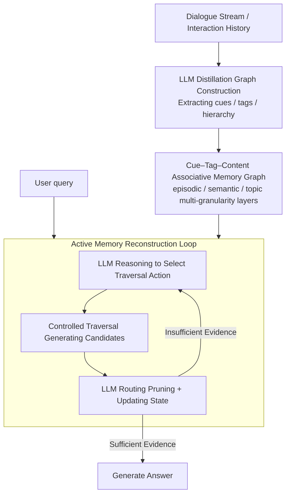

# Memory is Reconstructed, Not Retrieved: Graph Memory for LLM Agents

**Conference**: ICML2026  
**arXiv**: [2606.06036](https://arxiv.org/abs/2606.06036)  
**Code**: https://github.com/Ji-shuo/MRAgent  
**Area**: Agent  
**Keywords**: LLM Agent, Long-term Memory, Active Memory Reconstruction, Associative Memory Graph, Cue-Tag-Content

## TL;DR
MRAgent replaces the static "retrieve-then-reason" memory paradigm with "reason-while-reconstructing." By utilizing a Cue–Tag–Content associative memory graph and an active reconstruction loop, the agent dynamically selects traversal directions and prunes irrelevant branches based on intermediate evidence. It achieves a maximum improvement of 23% over the strongest baseline on LoCoMo / LongMemEval, while significantly reducing token consumption and latency.

## Background & Motivation
**Background**: LLM cognition is "uneven"—while strong in mathematical reasoning, it remains weak in long-range tasks like interactive assistants and decision support that require long-term memory. The root cause is the limited context window, which cannot store the entire history. To mitigate this, mainstream approaches equip agents with external memory: initially RAG (retrieval from unstructured text/embedding stores via similarity), later introducing more structured memory including hierarchical storage and knowledge graphs to explicitly encode entities and relations for more interpretable relational retrieval.

**Limitations of Prior Work**: Whether using similarity or graph-based retrieval, these systems are restricted to **fixed top-$k$ selection or predefined subgraph traversal**. They cannot infer new retrieval clues or adjust strategies based on intermediate evidence. Essentially, they are **passive retrieval strategies**: similarity retrieval (e.g., MemoryBank, Mem0) $\pi_\text{sim}(x)=\text{TopK}(\{\text{sim}(x,v)\},k)$ merely fetches noisy results based on surface relevance without finding correct evidence; graph retrieval (e.g., A-Mem, Zep) $\pi_\text{graph}(x)=\mathcal{V}^\text{sim}\cup\text{Neighbor}(\mathcal{V}^\text{sim})$ uses fixed $n$-hop neighbor expansion, which introduces noise and requires explicit graph links between pieces of evidence. The paper uses an example to illustrate: when searching for "Nate's esports match," passive retrieval only fetches events directly related to esports, failing to **reason out the key temporal clue "July"** to then find Caroline's corresponding activities as a human would.

**Key Challenge**: The fundamental flaw of passive retrieval is the **inability to reason while accessing memory**—it cannot revise strategies based on intermediate states, suffers from noise accumulation due to fixed aggregation, and relies heavily on pre-built structures.

**Key Insight**: Cognitive neuroscience suggests human memory extraction is an **active and associative reconstruction process**. It is triggered by contextual cues, propagates through intermediate representations, and gradually reconstructs coherent memories, rather than being a passive reading of stored content.

**Core Idea**: Embed LLM reasoning directly into memory access, transforming memory from "one-time retrieval" into "multi-step active reconstruction." Memory is organized into a Cue–Tag–Content graph where tags serve as a semantic bridge between "clues" and "content." By selecting tags before fetching content, the agent performs controlled, prunable traversals on a large graph to avoid combinatorial explosion.

## Method

### Overall Architecture
MRAgent consists of two phases. **Graph Construction Phase**: Uses LLM distillation to offline organize dialogue streams into a heterogeneous associative graph $\mathcal{M}=(\mathcal{C},\mathcal{V},\mathcal{R})$, where Cue (fine-grained clues) and Content (specific memory items) are nodes connected via triplets $(c,g,v)$ with Tag attributes. Content is categorized into multi-granularity layers: episodic, semantic, and topic. **Reconstruction Phase**: Given a query, the agent enters an iterative loop rather than a predefined pipeline. It maintains a reconstruction state $\mathcal{S}^{(t)}=(\mathcal{Z}^{(t)},\mathcal{H}^{(t)})$ (current active elements + accumulated evidence). In each round, the LLM selects traversal actions based on known evidence, performs controlled traversal to generate candidates, and then the LLM routes and prunes to update the state until the accumulated evidence is sufficient to answer the query. This interleaves "reasoning" with "memory access," allowing for the discovery of new clues from intermediate evidence while using tags as semantic intermediaries to block expensive content access and avoid unconstrained expansion.

### Key Designs

**1. Cue–Tag–Content Associative Memory Graph & Hierarchical Structures: Using tags as semantic bridges to split retrieval into two steps**

To address the "high noise or reliance on fixed links" issue of passive retrieval, MRAgent builds a heterogeneous graph instead of a flat set of items. Cues are fine-grained keywords like entities/attributes, while Content is specific memory items, connected by typed Tag relations $\mathcal{R}\subseteq\mathcal{C}\times\mathcal{G}\times\mathcal{V}$. Tags summarize the "clue ↔ content" association, enabling the LLM to perform **two-stage retrieval**: first selecting a small set of relevant tags, then fetching content under those tags. This is formalized via two mapping operators: $\phi_{c\to g}(c)\triangleq\{g\mid(c,g,\cdot)\in\mathcal{R}\}$ activates candidate tags from cues, and $\phi_{(c,g)\to v}(c,g)\triangleq\{v\mid(c,g,v)\in\mathcal{R}\}$ fetches content conditioned on cue+tag. While directly performing $n$-hop expansion on large graphs causes combinatorial explosion, tags serve as explicit associative intermediaries, allowing the LLM to evaluate and prune irrelevant branches before accessing expensive episodic content. Content is further divided into three layers: **episodic layer** stores event-level memories organized by timeline for temporal reasoning; **semantic layer** stores stable knowledge like personal attributes/preferences/facts for direct access; and **topic abstraction layer** stabilizes recurring patterns across episodes, supporting top-down transitions $\phi_{\tau\to e}$.

**2. LLM Distillation Graph Construction: Automatically organizing dialogue streams into multi-granularity structures**

The memory graph is not manually built but populated via an automated distillation pipeline. The input stream is segmented into episodic units $e_i$ (coherent events in a specific context). LLM components then extract tags and cues: $g_i=F_\text{LLM}^\text{tag}(e_i)$ produces short associative tags summarizing the episode's relationship patterns, and $C_i=F_\text{LLM}^\text{cue}(e_i)$ extracts fine-grained cues like entities and salient descriptions. Each cue in $C_i$ is linked to $e_i$ via tag $g_i$, forming the Cue–Tag–Episode relation in the episodic layer. Semantic units are extracted similarly for stable knowledge, anchored to entity cues via aspect-level tags. Topic nodes are synthesized from shared themes of related episodes. This hierarchical distillation transforms raw inputs into three tiers (events, facts, themes), providing the foundation for efficient active reconstruction.

**3. Active Memory Reconstruction: State + Traversal Actions + Iterative Loop to interleave reasoning and access**

This is the core mechanism transforming "passive retrieval" into "active reconstruction." MRAgent maintains an explicit reconstruction state $\mathcal{S}^{(t)}=(\mathcal{Z}^{(t)},\mathcal{H}^{(t)})$, where $\mathcal{Z}^{(t)}$ is the candidate active set (cues/tags/content) for the next step and $\mathcal{H}^{(t)}$ is the historically accumulated evidence. The traversal action set $\mathcal{A}=\{\Pi_1,\dots,\Pi_m\}$ is induced by mapping operators, including forward actions $\Pi_{c\to g}$ (cue → tag), $\Pi_{(c,g)\to v}$ (cue+tag → content), and backward actions $\Pi_{v\to(c,g)}$ (content → new cues/tags for redirection). Each loop consists of three steps: ① **LLM Reasoning to select actions** $\mathcal{A}^{(t)}=f_\text{select}(x,\mathcal{H}^{(t)},\mathcal{Z}^{(t)})$ to pick promising directions and denoise while discovering new clues from evidence; ② **Controlled Traversal** $\widetilde{\mathcal{Z}}^{(t+1)}=\bigcup_{a\in\mathcal{A}^{(t)}}\Pi_a(\mathcal{Z}^{(t)})$ to expand only along selected paths; ③ **LLM Routing to update state** $\mathcal{Z}^{(t+1)}=f_\text{route}(x,\mathcal{H}^{(t)},\widetilde{\mathcal{Z}}^{(t+1)})$ to select the most relevant content, prune branches, and merge evidence into $\mathcal{H}^{(t+1)}$. An LLM discriminator then decides whether the evidence is sufficient. The paper provides a theoretical guarantee: **active retrieval is strictly stronger than passive retrieval**—for any budget $T\ge 2$, the passive hypothesis class is strictly contained within the active class $\mathcal{H}_\text{passive}^\text{LM}(T)\subsetneq\mathcal{H}_\text{active}^\text{LM}(T)$.

### An Example: Inferring Implicit Clues from a Query
For the query "What did Caroline do during Nate's esports match?", passive similarity retrieval fetches "esports match" events based on surface relevance, introducing noise but failing to find Caroline because her activities have no direct graph link to "esports." In the loop, MRAgent **reasons to infer the key temporal clue "July"** (a time anchor not explicit in the query but derived from evidence), shifts the retrieval constraint from "esports" to "events in July," performs a backward traversal to activate time-related cues/tags, and finally hits Caroline's corresponding activities during that period.

## Key Experimental Results

### Main Results
LoCoMo Results (Table 1, by question type; metric: LLM-Judge score J; Gemini backbone):

| Method (Gemini) | Multi-hop J | Temporal J | Open Domain J | Single-hop J | Overall J ↑ |
|---------------|-------------|------------|---------------|--------------|-------------|
| RAG | 58.16 | 49.22 | 41.67 | 69.20 | 61.30 |
| A-Mem | 53.54 | 49.53 | 33.33 | 61.83 | 55.97 |
| Mem0 | 68.79 | 61.68 | 41.66 | 73.72 | 68.31 |
| **MRAgent** | **75.17** | **80.37** | **68.75** | **90.48** | **84.21** |

Ours improves Overall J from 68.31 (Mem0) to 84.21 (+23.3% relatively). Gains on Claude backbones are +12.4%. On LongMemEval (Table 2), Ours achieves an approximate 32% gain over the strongest baseline. Improvements are particularly significant for Temporal and Open Domain tasks requiring clue inference.

### Ablation Study
Costs (Table 3, per-sample tokens and time on LongMemEval, Gemini backbone):

| Method | Token Consumption ↓ | Runtime (s) ↓ |
|------|-------------|--------------|
| A-Mem | 632k | 1122.23 |
| MemoryOS | 273k | 3135.54 |
| LangMem | 3268k | 1209.57 |
| Mem0 | 245k | 533.29 |
| **MRAgent** | **118k** | 586.11 |

Ablation Results (Figure 5): ① Structurally, CE < CTE < CTC (performance increases monotonically with associate structure richness, proving tags provide effective semantic guidance); ② "With Reasoning" consistently outperforms "Structure Only" (proving multi-step reasoning is vital for evidence accumulation); ③ Removing the semantic layer causes a significant drop (episodic and semantic layers provide complementary specific and abstract knowledge).

### Key Findings
- **Active multi-step reasoning is the primary source of gain**: Across all structures, versions with reasoning significantly outperform those without. Multi-hop query evidence recall increases by over 30% in successive steps.
- **Better efficiency**: MRAgent reduces prompt tokens to 118k (a fraction of A-Mem's 632k or LangMem's 3268k) because the construction phase is lightweight, deferring complex relationship modeling to the query-time reconstruction and using tags to prune before accessing expensive content.
- **Theoretical consistency**: The theorem that active retrieval is strictly stronger corresponds to empirical results where "implicit clue inference" (Temporal/Open Domain) shows the largest gains.

## Highlights & Insights
- **Redefines "Retrieval" as "Reconstruction"**: The cognitive neuroscience metaphor that "memory is reconstructed, not just read" is implemented as a concrete state + action + loop mechanism.
- **Tags as semantic intermediaries** act as a clever switch to control combinatorial explosion in graph traversal. This "two-stage, semantic-then-content" split is transferable to any large-scale graph retrieval task.
- **Backward traversal** (content activating new clues) allows the agent to redirect its trajectory based on intermediate findings, a feat impossible for passive top-$k$ or fixed $n$-hop strategies.
- **Win-win on efficiency and effectiveness**: Moving heavy lifting from construction to on-demand retrieval saves tokens while improving scores.

## Limitations & Future Work
- Authors acknowledge that reconstruction costs grow with exploration depth. Queries requiring many traversal steps have higher latency—though average token usage is lower, worst-case latency distributions merit attention.
- The process heavily relies on the base LLM for cue/tag extraction, action selection, and routing. Construction and retrieval quality depend on LLM capability and prompt engineering.
- Primary validation was on dialogue-based long-term memory benchmarks (LoCoMo / LongMemEval); generalizability to tool use, code, or multimodal tasks remains to be verified.

## Related Work & Insights
- **vs Mem0 / MemoryBank (Similarity Retrieval)**: These use fixed top-$k$ similarity, whereas Ours uses active multi-step reconstruction. The difference is "one-time similarity fetch vs reasoning along evidence." Ours vs Mem0 on LoCoMo: 84.21 vs 68.31 Overall J.
- **vs A-Mem / Zep (Graph Retrieval)**: These use similarity seeds + fixed $n$-hop expansion, requiring explicit links and prone to noise. Ours uses tag mediation + LLM routing pruning to find implicit clues and non-linked evidence, reducing tokens from 632k to 118k.
- **vs Cognitive Science reconstruction theory**: Not a vague analogy; the cue→engram→reconstruction mechanism is explicitly mapped to the Cue–Tag–Content + active loop architecture with provable advantages.

## Rating
- Novelty: ⭐⭐⭐⭐⭐ "Retrieval as reconstruction" paradigm + Cue-Tag-Content graph + Active loop.
- Experimental Thoroughness: ⭐⭐⭐⭐ Two long-term benchmarks + dual backbones + cost/ablation analysis, though domains are dialogue-heavy.
- Writing Quality: ⭐⭐⭐⭐⭐ Clear chain from motivation to theory to experiment.
- Value: ⭐⭐⭐⭐⭐ Win-win in efficiency and effectiveness; significant guidance for long-term memory in LLM agents.

<!-- RELATED:START -->

## Related Papers

- [\[ACL 2026\] MAGMA: A Multi-Graph based Agentic Memory Architecture for AI Agents](../../ACL2026/llm_agent/magma_a_multi-graph_based_agentic_memory_architecture_for_ai_agents.md)
- [\[ACL 2026\] PersonaAgent: Bridging Memory and Action for Personalized LLM Agents](../../ACL2026/llm_agent/personaagent_bridging_memory_and_action_for_personalized_llm_agents.md)
- [\[ICML 2026\] From Player to Master: Enhancing Test-Time Learning of LLM Agents via Reinforcement Learning over Memory](from_player_to_master_enhancing_test-time_learning_of_llm_agents_via_reinforceme.md)
- [\[NeurIPS 2025\] A-MEM: Agentic Memory for LLM Agents](../../NeurIPS2025/llm_agent/a-mem_agentic_memory_for_llm_agents.md)
- [\[ACL 2026\] SEARL: Joint Optimization of Policy and Tool Graph Memory for Self-Evolving Agents](../../ACL2026/llm_agent/searl_joint_optimization_of_policy_and_tool_graph_memory_for_self-evolving_agent.md)

<!-- RELATED:END -->
