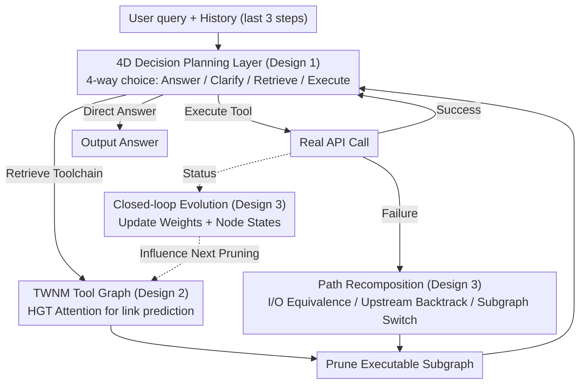

# NaviAgent: Graph-Driven Bilevel Planning for Scalable Tool Orchestration

**Conference**: ICML 2026  
**arXiv**: [2506.19500](https://arxiv.org/abs/2506.19500)  
**Code**: None  
**Area**: LLM Agent / Tool Orchestration / Graph Representation Learning  
**Keywords**: Function calling, Tool Graph, Bilevel Planning, Heterogeneous Graph Transformer, Closed-loop Adaptation  

## TL;DR
NaviAgent decomposes LLM tool calling into "high-level four-choice decision-making + low-level graph-based path searching." A Tool World Navigation Model (TWNM), trained with HGT, explicitly models structural and behavioral dependencies between tools. On ToolBench/API-Bank and 50 real-world RapidAPIs, it improves the Task Success Rate (TSR) by 4.3–18.2 points over the strongest baselines while significantly reducing the number of call steps.

## Background & Motivation
**Background**: Current mainstream function-calling agents (ReAct, ToolLLM, ToolNet, α-UMI, etc.) treat tools as a set of independent callable interfaces. The LLM selects tools one by one during reasoning, either by hard-coding tool knowledge into weights, pulling static graphs from logs, or relying on self-feedback strategies like ReAct/Reflexion.

**Limitations of Prior Work**: These solutions struggle when tool scales reach thousands or when APIs change continuously. Chaining tools leads to error accumulation; static graphs fail to capture sparse multi-hop relations; and dynamic strategies lack global structure, making it difficult to reuse toolchains for repeated tasks.

**Key Challenge**: There is a trade-off between "structured but non-evolvable" (static dependency graphs) and "evolvable but lacking structure" (self-feedback agents), leading to unreliability and poor scalability in large-scale tool ecosystems.

**Goal**: Decompose the problem into two sub-problems: (1) Let the planning layer step back from "deciding the next specific API" to "deciding the next interaction action" to avoid reasoning being overwhelmed by tool combination complexity; (2) Provide the execution layer with a tool relationship graph that self-updates based on real call feedback, enabling both path search and real-time reorganization when APIs fail or semantics drift.

**Key Insight**: The authors observe that real tools are not isolated nodes but depend on each other through shared parameters and idiomatic call patterns. Explicitly encoding these dependencies into a heterogeneous graph transforms "picking the next tool" into "weighted path searching on a graph," while the graph itself is updated by execution logs.

**Core Idea**: Use a four-dimensional decision action space to isolate the LLM from tool combination complexity, offload combination difficulties to an evolvable tool graph, and refresh both the planning strategy and graph structure via a closed-loop execution feedback cycle.

## Method

### Overall Architecture
NaviAgent addresses the issue where LLM tool selection is overwhelmed by complexity as tool scales reach thousands and APIs change. The solution is a dual-loop mechanism: in the inner "planning-execution" loop, the LLM receives a user query and selects one of four interaction actions (Direct Answer / Clarify Intent / Retrieve Toolchain / Execute Tool). When tools are needed, it searches for an executable subgraph on a tool graph (TWNM). In the outer "graph-environment" loop, the success or failure of each call is written back to the TWNM edge weights and node states, influencing future subgraph pruning. The method is formulated as a quintuple $(\mathcal{H}, \mathcal{O}, \mathcal{G}, \mathcal{A}, F)$: history $\mathcal{H}$ consists of the last 3 observation-action pairs, $\mathcal{O}$ is the current observation, $\mathcal{G}$ is the pruned tool subgraph, $\mathcal{A}$ is the set of 4 actions, and the decision function $F: \mathcal{H} \times \mathcal{O} \times \mathcal{G} \to \mathcal{A}$ is implemented by the LLM.

### Key Designs

**1. 4D Decision Planning Layer: Compressing "Toolchain Scheduling" into a 4-way Choice**

Traditional plan-then-execute requires the LLM to pre-arrange a complete API sequence, which fails as the tool scale grows linearly. NaviAgent moves the planning layer from "deciding the next API" to "deciding the type of interaction": at each step, it only judges whether to speak, ask, retrieve a toolchain, or execute. The history is represented by a sliding window $\mathcal{H}_t = \langle (o_{t-3}, a_{t-3}), \dots, (o_{t-1}, a_{t-1}) \rangle$. The pruned tool subgraph $\mathcal{G}_{t-1}'$ from the previous step is serialized into a tree structure and fed to the LLM. The decision is $a_t = F(\mathcal{H}_t, \mathcal{O}_t, \mathcal{G}_{t-1}')$. Training uses SFT, backpropagating only on the action generation segments with the objective: $\mathcal{L}_{\text{SFT}} = -\frac{1}{N} \sum_i \log p_\theta(a_t^* \mid \mathcal{H}_t, \mathcal{O}_t, \mathcal{G}_{\text{sub}})$.

**2. TWNM: Encoding Combination Complexity into a Heterogeneous Tool Graph**

To offload complexity from the LLM, the Tool World Navigation Model (TWNM) is introduced. Recognizing that tools depend on shared parameters and call patterns, APIs and parameters are modeled as nodes. Structural edges ("Parameter → API" / "API → Parameter") and behavioral edges ("API → API" / "Parameter → Parameter") form a directed weighted graph $\mathcal{G}=(V,E,W)$, where edge weights $\tilde{w}_{ij} = N(v_i \to v_j)/N(v_j)$ reflect empirical call frequency. Representation learning uses a 2-layer multi-head Heterogeneous Graph Transformer (HGT). Attention scores integrate statistical weights as priors:

$$e_{uv}^{(k,r)} = \frac{(\mathbf{W}_Q^{(k,r)}\mathbf{h}_u')^\top(\mathbf{W}_K^{(k,r)}\mathbf{h}_v')}{\sqrt{d_k}} + \mathbf{b}_r^{(k)} + \tilde{w}_{uv}$$

The training objective is a combination of Cross-Entropy $\mathcal{L}_{CE}$ with soft labels and an adaptive margin loss $\ell_{\text{margin}}(u,v)=\frac{1}{k}\sum_j [m_{uv}-s(u,v)^+ + s(u_j,v)^-]_+$, weighted by curriculum weights $\mu_t = \mu_0 \gamma^t$ ($\gamma \in (0,1)$).

**3. Closed-loop Evolution + Path Recomposition: Real-time Self-updates and Rerouting**

TWNM must evolve to prevent stagnation. Three mechanisms handle graph maintenance: incremental node addition; targeted subgraph pruning $\text{Prune}(v) \propto \lambda\sigma(f_{\text{fail}}(v)) + (1-\lambda)\sigma(f_{\text{freq}}(v)^{-1})$; and edge weight time propagation $\tilde{w}_{uv}^{(t)} = \eta \tilde{w}_{uv}^{(t-1)} + (1-\eta) N_{\text{succ}}^{\text{recent}}(u\to v)/N_{\text{succ}}^{\text{recent}}(v)$. Execution failures trigger recovery strategies: I/O equivalent replacement, upstream backtracking, or subgraph switching. Theorem 3.1 states that this "mechanism injection" is equivalent to a regularized projection of the base policy onto the feasible action set:

$$\pi_{\text{inj}}(a\mid h)=\frac{\pi_0(a\mid h)\,\mathbf{1}\{a\in\mathcal{A}_{\text{feas}}(h)\}}{\sum_{a'\in\mathcal{A}_{\text{feas}}(h)}\pi_0(a'\mid h)}$$

This implies providing the graph with failure signals is equivalent to adding context feasibility constraints during inference.

### Loss & Training
The LLM is trained with standard SFT on action generation segments. The HGT utilizes Cross-Entropy and adaptive margin loss with curriculum weighting (decay coefficient $\gamma \in (0,1)$). TWNM updates are asynchronous to inference. The backbone Qwen2.5-14B is fine-tuned on 3,500+ curated records.

## Key Experimental Results

### Main Results
Comparison of TCR/TSR and average steps on ToolBench (5k+ tools):

| Backbone | Method | TCR (%) | TSR (%) | Avg. Steps |
|----------|------|---------|---------|----------|
| Qwen2.5-14B | ToolNet | 49.7 | 28.0 | 6.53 |
| Qwen2.5-14B | NaviAgent | **61.6** | **35.8** | **4.38** |
| Qwen2.5-32B | α-UMI | 78.3 | 32.8 | 5.94 |
| Qwen2.5-32B | NaviAgent | **83.2** | **45.4** | **4.66** |
| DeepSeek-V3 | ToolNet | 76.6 | 44.9 | 6.02 |
| DeepSeek-V3 | NaviAgent | **97.0** | **55.2** | **4.60** |

Performance on 50 real-world RapidAPIs:

| Backbone | Method | TSR (%) | Steps | Time (s) |
|----------|------|---------|------|----------|
| Qwen2.5-14B | ToolNet | 33.1 | 6.41 | 31 |
| Qwen2.5-14B | NaviAgent | **37.4** | 5.0 | 26 |
| Qwen2.5-32B | α-UMI | 42.4 | – | – |
| Qwen2.5-32B | NaviAgent | **54.4** | – | – |
| DeepSeek-V3 | NaviAgent | **64.6** | – | – |

### Ablation Study
| Configuration | TSR (Qwen2.5-14B, ToolBench All) |
|------|----------------------------------|
| Full NaviAgent | 35.8 |
| 4D Decision only (No TWNM) | ~28 |
| Static Graph + 4D Decision | ~31 |
| Full + SFT (14B) | 51.3 |

### Key Findings
- TWNM is the primary contributor for complex tasks, providing an average TSR gain of 13.1 points.
- Injecting statistical weights $\tilde{w}_{uv}$ into HGT attention outperforms pure semantic embeddings for recovering multi-hop dependencies.
- Closed-loop evolution allows smaller SFT models (14B) to approach the performance of larger models (32B).

## Highlights & Insights
- Decoupling planning into a constant 4-way action space is critical for scalability to tens of thousands of tools.
- Direct injection of statistical priors into the HGT attention logit is an efficient way to initialize the model with empirical knowledge.
- Path recovery strategies provide an architectural implementation of "reflection."
- The KL projection theorem provides a clear inference-time explanation for mechanism injection: it is local normalization rather than weight fine-tuning.

## Limitations & Future Work
- Theoretical results currently only cover single-step local corrections; global convergence for subgraph switching remains unproven.
- Scalability of HGT 2-hop aggregation and subgraph serialization may become a bottleneck beyond hundreds of thousands of tools.
- Performance in cold-start scenarios (where behavioral edges are missing) requires more discussion.
- Future work includes hierarchical graph abstraction and using RL of SFT for synchronized optimization.

## Related Work & Insights
- **vs ToolLLM**: ToolLLM uses DFSDT for planning; NaviAgent explicitly moves relations into a graph, freeing the planner from combination details.
- **vs ToolNet**: ToolNet lacks parameter nodes and HGT; NaviAgent’s inclusion of structural edges and HGT attention enables robust link prediction in sparse data.
- **vs ControlLLM**: ControlLLM uses static graphs; NaviAgent’s feedback loop enables adaptation to API drift.

## Rating
- Novelty: ⭐⭐⭐⭐ Systematic innovation by decoupling tool graphs and 4D decisions with closed-loop evolution.
- Experimental Thoroughness: ⭐⭐⭐⭐ Broad testing across baselines and real APIs, though lacks massive-scale scalability analysis.
- Writing Quality: ⭐⭐⭐⭐ Clear frameworks and theorems, though pseudo-code for some mechanisms is brief.
- Value: ⭐⭐⭐⭐ Provides a replicable blueprint for large-scale tool agents in production.

<!-- RELATED:START -->

## Related Papers

- [\[ACL 2026\] Towards Scalable Lightweight GUI Agents via Multi-role Orchestration](../../ACL2026/llm_agent/towards_scalable_lightweight_gui_agents_via_multi-role_orchestration.md)
- [\[ICLR 2026\] ToolWeaver: Weaving Collaborative Semantics for Scalable Tool Use in Large Language Models](../../ICLR2026/llm_agent/toolweaver_weaving_collaborative_semantics_for_scalable_tool_use_in_large_langua.md)
- [\[ACL 2026\] SEARL: Joint Optimization of Policy and Tool Graph Memory for Self-Evolving Agents](../../ACL2026/llm_agent/searl_joint_optimization_of_policy_and_tool_graph_memory_for_self-evolving_agent.md)
- [\[ICML 2026\] Agent JIT Compilation for Latency-Optimizing Web Agent Planning and Scheduling](agent_jit_compilation_for_latency-optimizing_web_agent_planning_and_scheduling.md)
- [\[ICML 2026\] Position: Agentic AI Orchestration Should Be Bayes-Consistent](position_agentic_ai_orchestration_should_be_bayes-consistent.md)

<!-- RELATED:END -->
