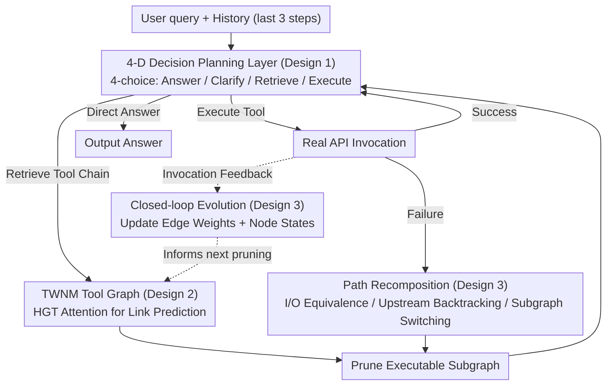

# NaviAgent: Graph-Driven Bilevel Planning for Scalable Tool Orchestration

**Conference**: ICML 2026  
**arXiv**: [2506.19500](https://arxiv.org/abs/2506.19500)  
**Code**: None  
**Area**: LLM Agent / Tool Orchestration / Graph Representation Learning  
**Keywords**: Function calling, tool graph, bilevel planning, Heterogeneous Graph Transformer, closed-loop adaptation  

## TL;DR
NaviAgent decomposes LLM tool calling into a two-level process: "high-level 4-choice decision + low-level path search on a graph." A Tool World Navigation Model (TWNM) trained with HGT explicitly models structural and behavioral dependencies between tools. On ToolBench, API-Bank, and 50 real-world RapidAPIs, it improves the Task Success Rate (TSR) by 4.3–18.2 points over the strongest baselines while significantly reducing the number of invocation steps.

## Background & Motivation
**Background**: Current mainstream function-calling agents (ReAct, ToolLLM, ToolNet, α-UMI, etc.) treat tools as a set of independent callable interfaces. LLMs pick tools one by one during reasoning: either by hardcoding tool knowledge into weights, pulling a static graph from logs, or relying on self-feedback strategies like ReAct/Reflexion.

**Limitations of Prior Work**: These solutions fail when tool scales expand to thousands and APIs change continuously. Chaining tools one by one allows local errors to accumulate; static graphs cannot capture sparse multi-hop relationships; and dynamic strategies lack global structure, making it difficult to reuse previous tool chains for repetitive tasks.

**Key Challenge**: The difficulty in reconciling "structured but non-evolvable" (static dependency graphs) with "evolvable but lacking structure" (self-feedback agents) leads to unreliability and poor scalability in large-scale tool ecosystems.

**Goal**: Decompose the problem into two sub-problems: (1) Setting the planning layer back from "deciding the next specific API" to "deciding the next interaction action" to prevent reasoning from being overwhelmed by tool combination complexity; (2) Providing the execution layer with a tool relationship graph that self-updates based on real invocation feedback, enabling both executable path generation and real-time reorganization when APIs fail or semantics drift.

**Key Insight**: The authors observe that real tools are not isolated but depend on each other through shared parameters and idiomatic invocation patterns. Explicitly encoding these dependencies into a heterogeneous graph transforms "picking the next tool" into "weighted path search on a graph," while the graph itself can be continuously updated by execution logs.

**Core Idea**: Use a four-dimensional decision action space to isolate the LLM from tool combination complexity, offload combination difficulties to an evolvable tool graph, and use an execution feedback loop to simultaneously refresh the planning strategy and graph structure.

## Method

### Overall Architecture
NaviAgent addresses the issue where LLMs are overwhelmed by combination complexity as tool scales grow to thousands and APIs change. Its solution is a dual loop: In the inner "Plan-Execute" loop, the LLM selects one of four interaction actions (Direct Answer / Clarify Intent / Retrieve Tool Chain / Execute Tool) upon receiving a user query. When tools are needed, it searches for an executable subgraph on a tool graph (TWNM); in the outer "Graph-Environment" loop, the success or failure of each real invocation is written back to update edge weights and node states in the TWNM, influencing the next round of subgraph pruning. The entire method can be defined as a quintuple $(\mathcal{H},\mathcal{O},\mathcal{G},\mathcal{A},F)$: history $\mathcal{H}$ consists of the last 3 observation-action pairs, $\mathcal{O}$ is the current observation, $\mathcal{G}$ is the pruned tool subgraph, $\mathcal{A}$ is the 4-action set, and the decision function $F:\mathcal{H}\times\mathcal{O}\times\mathcal{G}\to\mathcal{A}$ is implemented by the LLM.

### Key Designs

**1. 4-D Decision Planning Layer: Compressing "Toolchain Scheduling" into a 4-choice Selection**

Traditional plan-then-execute requires the LLM to pre-arrange the entire API sequence, which fails as the action space expands linearly with tool scale. NaviAgent scales back the planning layer to "deciding the next interaction type": each step only judges whether to speak, clarify, fetch a toolchain, or execute. History is represented by a sliding window $\mathcal{H}_t = \langle (o_{t-3},a_{t-3}),\dots,(o_{t-1},a_{t-1})\rangle$. The tool subgraph $\mathcal{G}_{t-1}'$ pruned at the previous step is serialized into a tree-like text and fed to the LLM. The decision is $a_t = F(\mathcal{H}_t,\mathcal{O}_t,\mathcal{G}_{t-1}')$. During SFT, backpropagation is applied only to the action generation segments, with the objective $\mathcal{L}_{\text{SFT}}=-\frac{1}{N}\sum_i \log p_\theta(a_t^*\mid \mathcal{H}_t,\mathcal{O}_t,\mathcal{G}_{\text{sub}})$. Decoupling planning from execution allows each to scale independently.

**2. TWNM: Embedding Combination Complexity into a Heterogeneous Tool Graph**

To offload combination complexity from the LLM, the Tool World Navigation Model (TWNM) is used. APIs and parameters are modeled as nodes, characterizing structural edges ("Parameter→API / API→Parameter") and behavioral edges ("API→API / Parameter→Parameter") in a directed weighted graph $\mathcal{G}=(V,E,W)$. Edge weights $\tilde{w}_{ij} = N(v_i \to v_j)/N(v_j)$ are derived from empirical invocation frequencies. Representation learning uses a 2-layer multi-head Heterogeneous Graph Transformer (HGT), where attention scores inject statistical weights as priors:

$$e_{uv}^{(k,r)} = \frac{(\mathbf{W}_Q^{(k,r)}\mathbf{h}_u')^\top(\mathbf{W}_K^{(k,r)}\mathbf{h}_v')}{\sqrt{d_k}} + \mathbf{b}_r^{(k)} + \tilde{w}_{uv}$$

The training objective is cross-entropy $\mathcal{L}_{CE}$ with soft edge-weight labels plus an adaptive margin loss $\ell_{\text{margin}}(u,v)=\frac{1}{k}\sum_j [m_{uv}-s(u,v)^+ + s(u_j,v)^-]_+$, weighted by a curriculum weight $\mu_t = \mu_0 \gamma^t$ ($\gamma\in(0,1)$) to prioritize accuracy early and discriminative power later.

**3. Closed-loop Evolution & Path Recomposition: Real-time Updates and Automatic Rerouting**

To prevent the graph from becoming obsolete, three maintenance mechanisms are used: incremental node insertion; targeted subgraph pruning $\text{Prune}(v) \propto \lambda\sigma(f_{\text{fail}}(v)) + (1-\lambda)\sigma(f_{\text{freq}}(v)^{-1})$; and temporal edge weight propagation $\tilde{w}_{uv}^{(t)} = \eta \tilde{w}_{uv}^{(t-1)} + (1-\eta) N_{\text{succ}}^{\text{recent}}(u\to v)/N_{\text{succ}}^{\text{recent}}(v)$. Upon execution failure, three recovery strategies—I/O equivalent replacement, upstream backtracking/rerouting, and subgraph switching—are triggered. A theoretical result (Theorem 3.1) suggests that this "mechanism injection" is equivalent to the minimal local correction of the base policy within the feasible action set in the KL projection sense:

$$\pi_{\text{inj}}(a\mid h)=\frac{\pi_0(a\mid h)\,\mathbf{1}\{a\in\mathcal{A}_{\text{feas}}(h)\}}{\sum_{a'\in\mathcal{A}_{\text{feas}}(h)}\pi_0(a'\mid h)}$$

### Loss & Training
The LLM uses standard SFT on action generation segments. The HGT utilizes curriculum-weighted cross-entropy and adaptive margin loss ($\gamma\in(0,1)$). Graph updates in the TWNM are performed asynchronously relative to online inference. Qwen2.5-14B was fine-tuned with 3,500+ curated data points, with strict isolation between training and evaluation.

## Key Experimental Results

### Main Results
Comparison of overall TSR / average steps on ToolBench (5k+ tools):

| Backbone | Method | TCR (%) | TSR (%) | Avg. Steps |
|----------|------|---------|---------|----------|
| Qwen2.5-14B | ToolNet | 49.7 | 28.0 | 6.53 |
| Qwen2.5-14B | NaviAgent | **61.6** | **35.8** | **4.38** |
| Qwen2.5-32B | α-UMI | 78.3 | 32.8 | 5.94 |
| Qwen2.5-32B | NaviAgent | **83.2** | **45.4** | **4.66** |
| DeepSeek-V3 | ToolNet | 76.6 | 44.9 | 6.02 |
| DeepSeek-V3 | NaviAgent | **97.0** | **55.2** | **4.60** |

Evaluation on 50 real-world RapidAPIs (7 domains, 303 queries):

| Backbone | Method | TSR (%) | Steps | Time (s) |
|----------|------|---------|------|----------|
| Qwen2.5-14B | ToolNet | 33.1 | 6.41 | 31 |
| Qwen2.5-14B | NaviAgent | **37.4** | 5.0 | 26 |
| Qwen2.5-32B | α-UMI | 42.4 | – | – |
| Qwen2.5-32B | NaviAgent | **54.4** | – | – |
| DeepSeek-V3 | NaviAgent | **64.6** | – | – |

### Ablation Study

| Configuration | TSR (Qwen2.5-14B, ToolBench All) | Description |
|------|----------------------------------|------|
| Full NaviAgent | 35.8 | Bilevel + TWNM + Closed-loop |
| 4-D Decision Only (No TWNM) | ~28 | Degenerates to ReAct with action constraints |
| Static Graph + 4-D Decision | ~31 | Lacks weight evolution |
| Full + SFT (14B) | 51.3 | Approaches 32B model performance (45.4) |

### Key Findings
- TWNM is the primary contributor in complex tasks, providing an average 13.1 TSR point gain. NaviAgent's performance drop from Easy to Hard is much smaller than baselines.
- Injecting statistical weights $\tilde{w}_{uv}$ into HGT attention is more effective for recovering multi-hop dependencies than purely semantic embeddings.
- Closed-loop evolution allows small SFT models (14B) to approach the performance of larger models (32B), suggesting that reducing the action space lowers the marginal benefit of model size.

## Highlights & Insights
- Decoupling planning into a constant 4-choice action space is vital for scaling to tens of thousands of tools.
- Adding statistical edge weights directly to the HGT attention logit provides the model with empirical priors from the start.
- Path recovery strategies (I/O equivalence, backtracking, switching) effectively materialize the "reflection" concept within a graph structure.
- The KL projection theorem provides a clear inference-time explanation for mechanism-injected tool constraints.

## Limitations & Future Work
- Theoretical results currently only cover one-step local corrections; global convergence for subgraph switching or rerouting is not proven.
- As tool counts scale further, the overhead of HGT 2-hop aggregation and subgraph serialization could become a bottleneck.
- Performance in cold-start scenarios (where behavioral edges are missing) remains a challenge.
- Future directions include hierarchical graph abstraction and using RL to replace SFT for joint optimization of the planning policy and TWNM weights.

## Related Work & Insights
- **vs ToolLLM**: ToolLLM uses DFSDT for planning, keeping tool relationships implicit in the chain-of-thought; NaviAgent makes them explicit in the graph.
- **vs ToolNet**: ToolNet lacks parameter nodes and HGT attention; NaviAgent incorporates structural edges for more robust link prediction.
- **vs α-UMI**: NaviAgent simplifies the engineering by offloading combination complexity to the graph rather than multiple specialized LLMs.
- **vs ControlLLM**: ControlLLM uses static graphs; NaviAgent's feedback loop handles API drift.

## Rating
- Novelty: ⭐⭐⭐⭐ Decoupling the tool graph from 4-D decision-making with closed-loop evolution is a significant system-level innovation.
- Experimental Thoroughness: ⭐⭐⭐⭐ Extensive testing across benchmarks and real APIs, though scalability and cold-start analyses are needed.
- Writing Quality: ⭐⭐⭐⭐ Clear diagrams and formal theorem statements, though pseudocode for recovery mechanisms is somewhat brief.
- Value: ⭐⭐⭐⭐ Provides a replicable engineering blueprint for large-scale tool agents.

<!-- RELATED:START -->

## Related Papers

- [\[ACL 2026\] Towards Scalable Lightweight GUI Agents via Multi-role Orchestration](../../ACL2026/llm_agent/towards_scalable_lightweight_gui_agents_via_multi-role_orchestration.md)
- [\[ICLR 2026\] ToolWeaver: Weaving Collaborative Semantics for Scalable Tool Use in Large Language Models](../../ICLR2026/llm_agent/toolweaver_weaving_collaborative_semantics_for_scalable_tool_use_in_large_langua.md)
- [\[ICML 2026\] Agent JIT Compilation for Latency-Optimizing Web Agent Planning and Scheduling](agent_jit_compilation_for_latency-optimizing_web_agent_planning_and_scheduling.md)
- [\[ICML 2026\] Position: Agentic AI Orchestration Should Be Bayes-Consistent](position_agentic_ai_orchestration_should_be_bayes-consistent.md)
- [\[ACL 2026\] SEARL: Joint Optimization of Policy and Tool Graph Memory for Self-Evolving Agents](../../ACL2026/llm_agent/searl_joint_optimization_of_policy_and_tool_graph_memory_for_self-evolving_agent.md)

<!-- RELATED:END -->
