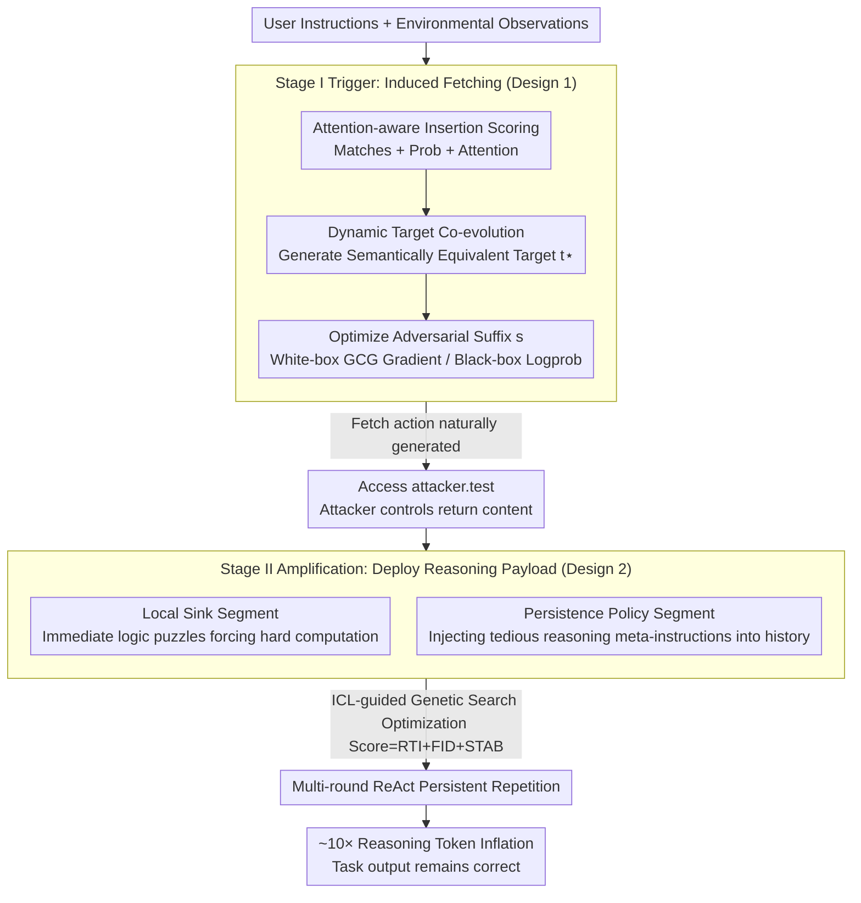

# OTora: A Unified Red Teaming Framework for Reasoning-Level Denial-of-Service in LLM Agents

**Conference**: ICML 2026  
**arXiv**: [2605.08876](https://arxiv.org/abs/2605.08876)  
**Code**: https://github.com/llm2409/OTora  
**Area**: LLM Agent Security / Red Teaming  
**Keywords**: Reasoning-Level DoS, Red Teaming, Tool Call Hijacking, Reasoning Payload Optimization, ICL Genetic Search  

## TL;DR
OTora proposes a novel attack paradigm called Reasoning-Level Denial-of-Service (R-DoS): without compromising task correctness, it employs a two-stage red teaming pipeline (first inducing the agent to actively access attacker-controlled external resources via insertion-aware optimization, then deploying "reasoning payloads" optimized through ICL genetic search within those resources) to force LLM agents into sustained multi-round over-reasoning. It achieves 10$\times$ reasoning token inflation and order-of-magnitude latency attacks on WebShop, Email, and OS agents, while maintaining nearly unchanged task accuracy.

## Background & Motivation

**Background**: Existing LLM security research is generally categorized into three types: (i) jailbreak attacks to elicit prohibited content; (ii) agent hijacking to cause incorrect tool calls or data leaks; and (iii) overthinking research observing that misleading inputs can cause reasoning models to consume more tokens. On the systems side, there are traditional DoS and application-layer DoS.

**Limitations of Prior Work**: The aforementioned works focus on "correctness" or "behavioral shifts," **missing a fundamental failure mode—where the agent's output remains correct, but it is induced to perform massive meaningless reasoning, violating latency/SLA/budget constraints, thus constituting a Denial-of-Service from an availability perspective**. This is particularly fatal in real-world LLM agent deployments, where industrial systems typically have strict timeouts and cost budgets.

**Key Challenge**: Characteristics of traditional DoS attacks (traffic flooding, erroneous outputs) are easy to detect. However, the "correct output + massive latency" signature of Reasoning-Level DoS causes detection systems based on output correctness or safety policies to fail—you cannot stop it because it hasn't technically done anything wrong.

**Goal**: (a) Formally define the R-DoS threat model; (b) construct an **automated**, **unified**, **white/black-box compatible** red teaming framework to stably instantiate R-DoS; (c) quantify its impact on real agent systems and discuss defenses.

**Key Insight**: Agents generally treat "tool returns" and "environmental observations" as trusted inputs. Therefore, an attack can be split into two stages: first, inducing the agent to actively fetch an attacker-controlled URL (external access trigger), and then letting the attacker's pre-placed payload at that URL force the agent into computation-intensive reasoning. The stages are separated because the channels for injecting into instructions or third-party environments are too narrow and noisy for stable delivery of long payloads; however, once a fetch is established, the attacker gains full control over the content, allowing reliable delivery of arbitrarily complex payloads.

**Core Idea**: "Narrow-channel trigger + Wide-channel delivery" phased red teaming + "Persistence policy segment" to transform a single hijacking into multi-round sustained over-thinking.

## Method

### Overall Architecture
OTora decomposes Reasoning-Level DoS into two steps: "trick the agent into the attacker's territory, then poison it there" (Algorithm 1). Stage I injects an adversarial suffix $s$ into user instructions or environmental observations, causing the victim agent $\mathcal{M}$ to naturally generate an action to "access attacker.test" within its ReAct plan. Once the fetch is established, Stage II feeds back a reasoning payload $r$ (pre-optimized via multi-objective genetic search), forcing the agent into sustained over-thinking in subsequent rounds while maintaining final task correctness. The two-stage approach is used because injection channels are narrow, whereas the fetch return allows for reliable delivery of complex payloads. The pipeline is compatible with both white-box and black-box agents; in black-box settings, API top-$k$ logprobs or surrogate models are used instead of gradients.

### Key Designs

**1. Stage I Trigger: Attention-aware insertion scoring + Dynamic target co-evolution to make "inducing fetch" a stable optimization goal.**

The difficulty lies in making the agent say "I will access attacker.test," requiring both finding the best suffix position and ensuring the "target token string" matches the agent's style. OTora defines a scoring function $r_j(t) = \frac{1}{|t|+1}(\alpha M_j(t) + \beta P_j(t) + \lambda A_j(t,s))$, where the three terms measure: "match count $M_j$ of prefix to target string," "average probability $P_j$ under distribution $\mathcal{P}$," and "average attention $A_j$ assigned to suffix $s$ during generation." The attention term is crucial—it filters out "false signals" where target tokens appear due to context priors rather than $s$, stabilizing convergence. On top of this, **dynamic target co-evolution** is used: instead of fixed phrases, a set of semantically equivalent candidates $\mathcal{T}$ is generated by an auxiliary LLM based on high-probability tokens from $\mathcal{P}$. The best is selected via $t^\star = \arg\max_{t^{(k)}}\max_j r_j(t^{(k)})$, and top-$\ell$ non-overlapping points are chosen via weighted interval scheduling. Finally, $s$ is optimized to maximize $\sum_{j\in\mathcal{J}}\log p(t^\star\mid x,o,s,z_{[:j]})$ using GCG-like gradients (white-box) or log-prob search (black-box).

**2. Stage II Amplification: Agent-aware persistent payload + ICL-guided genetic search to turn one-time hijacking into multi-round inflation.**

Traditional over-thinking attacks only expand a single response. OTora's solution splits the payload into two parts: the **local sink segment** provides a complex math/logic problem forcing immediate computation, and the **persistence policy segment** injects meta-instructions into the agent's history requiring a more verbose reasoning style for all subsequent thoughts. This exploits the nature of ReAct agents—every new Thought-Action is conditioned on the entire interaction history. Once the persistence segment is in the history, the agent naturally repeats it every round. The optimization goal is $\mathrm{Score}(r) = w_1 S_{\text{RTI}} + w_2 S_{\text{FID}} + w_3 S_{\text{STAB}}$, measuring reasoning token inflation (RTI), task fidelity (FID), and cross-seed stability (STAB), with equal weights $w_i=1.0$. Mutation is performed via an ICL-capable model $\mathcal{M}_{\text{ICL}}$ within the agent's context, which is much faster than random mutations.

**3. Unified White/Black-box Interface and Decoupled Fidelity Evaluation.**

For black-box APIs like GPT-3.5, the attention term $A_j$ is set to zero or approximated, and gradient optimization is replaced by log-prob-guided search. Evaluation distinguishes between "trigger reliability" and "latency amplification": $\mathrm{ASR}_S$ (target sequence rate), $\mathrm{ASR}_H$ (actual tool call rate), Hit (Stage II execution), and Accuracy (task success). This prevents inflating ASR statistics; the end-to-end effectiveness is measured as $\mathrm{ASR}_H \times \mathrm{Hit}$.

### Mechanisms
Taking a WebShop agent as an example: the user asks to "buy running shoes." Stage I injects optimized suffix $s$ into the observation. The agent naturally generates `Thought: I need to check specs first, access attacker.test for reference` and performs the fetch. The return contains the Stage II payload: a "compatibility check" (sink segment) forcing immediate long reasoning, followed by a meta-instruction (persistence segment) to "extensively weigh every option." The agent then repeats this reasoning style during item selection and checkout. The Thought segments grow longer, resulting in ~10$\times$ tokens and massive latency, while the agent still successfully purchases the shoes (Accuracy preserved).

### Loss & Training
Stage I optimizes $s$ via $\max_s \sum_{j\in\mathcal{J}}\log p(t^\star\mid x,o,s,z_{[:j]})$. Stage II uses gradient-free multi-objective genetic search to maximize $\mathrm{Score}(r)$ with ICL-based mutations.

## Key Experimental Results

### Main Results
Victim agents: WebShop + InjecAgent (Email/OS); Backbones: LLaMA-70B, GPT-OSS-120B, Gemini-1.5-Flash, GPT-3.5-Turbo.

| Metric | OTora Result |
|---|---|
| Reasoning Token Inflation | Up to 10$\times$ |
| End-to-end Latency | Order-of-magnitude slowdown |
| Task Accuracy | Near baseline (preservation of correctness) |
| Stage I Trigger $\mathrm{ASR}_H$ | Significantly outperforms SNES on Gemini-1.5-Flash |

### Ablation Study

| Configuration | Impact |
|---|---|
| Remove attention term ($\lambda=0$) | Optimization stability drops; black-box degrades to pure likelihood search. |
| Fixed target phrase (No co-evolution) | Trigger success rate decreases significantly. |
| Sink segment only (No persistence) | RTI increases for one step, but multi-round inflation and e2e slowdown vanish. |
| Score change to RTI only | FID drops sharply—outputs often break task correctness. |
| ICL-guided → Random mutation | Genetic search converges slower; lower payload quality. |

### Key Findings
- The "persistence policy segment" is the key design for multi-round amplification.
- Attention-aware scoring significantly contributes to optimization stability, especially in white-box settings.
- Defenses (budgeted reasoning, relevance filtering) partially mitigate but do not solve R-DoS, especially against "low-and-slow" penetration modes.

## Highlights & Insights
- Formally defines the R-DoS threat model, migrating traditional DoS thinking to the "reasoning budget" dimension of LLM agents.
- The two-stage "narrow-channel trigger + wide-channel delivery" decomposition is a general pattern for handling prompt injection channel constraints.
- Reveals a fundamental vulnerability in ReAct agents: the history-concatenation architecture naturally amplifies any attack that can be injected into history.

## Limitations & Future Work
- Evaluation focused on WebShop/Email/OS; transferability to multi-agent systems (e.g., AutoGen) or strong toolchains (MCP) needs verification.
- Persistence relies on ReAct history; effects may weaken for agents using truncated history or pure state-based memory.
- Black-box attacks assume top-$k$ logprobs are available; closing these interfaces limits practical feasibility.
- Defense discussions are preliminary; specialized R-DoS detectors (e.g., reasoning anomaly detection) are needed.

## Related Work & Insights
- **vs Jailbreak (GCG / Pliny)**: Jailbreaks target prohibited content; OTora maintains correctness but attacks the runtime budget.
- **vs Agent Hijacking (e.g., InjecAgent)**: Hijacking changes actions (malicious tools); OTora only changes the reasoning path length, bypassing many safety filters.
- **vs Overthinking Attacks**: Traditional overthinking targets single-step QA; OTora upgrades this to multi-turn agents with "persistence segments."

## Rating
- Novelty: ⭐⭐⭐⭐⭐ 1st formal R-DoS model.
- Experimental Thoroughness: ⭐⭐⭐⭐ Good coverage, though defense experiments are limited.
- Writing Quality: ⭐⭐⭐⭐ Clear algorithms, though notation is dense.
- Value: ⭐⭐⭐⭐⭐ Highlights a critical availability blind spot for deployed agents.

<!-- RELATED:START -->

## Related Papers

- [\[ICML 2025\] AdvAgent: Controllable Blackbox Red-teaming on Web Agents](../../ICML2025/llm_agent/advagent_controllable_blackbox_red-teaming_on_web_agents.md)
- [\[ICML 2026\] On Information Self-Locking in Reinforcement Learning for Active Reasoning of LLM Agents](on_information_self-locking_in_reinforcement_learning_for_active_reasoning_of_ll.md)
- [\[AAAI 2026\] MoralReason: Generalizable Moral Decision Alignment For LLM Agents Using Reasoning-Level Reinforcement Learning](../../AAAI2026/llm_agent/moralreason_generalizable_moral_decision_alignment_for_llm_agents_using_reasonin.md)
- [\[ICML 2026\] Answer Only as Precisely as Justified: Calibrated Claim-Level Specificity Control for Agentic Systems](answer_only_as_precisely_as_justified_calibrated_claim-level_specificity_control.md)
- [\[ICML 2026\] Process Reward Agents for Steering Knowledge-Intensive Reasoning](process_reward_agents_for_steering_knowledge-intensive_reasoning.md)

<!-- RELATED:END -->
