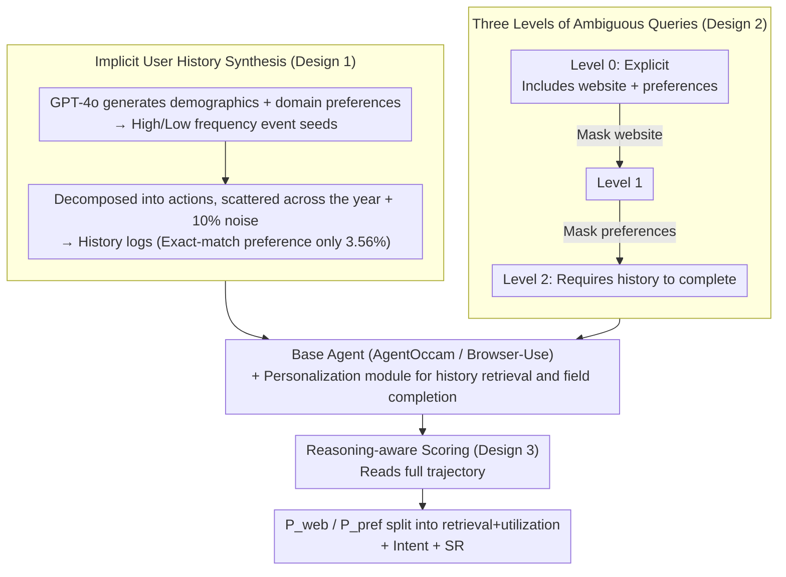

# Persona2Web: Benchmarking Personalized Web Agents for Contextual Reasoning with User History

**Conference**: ICML 2026  
**arXiv**: [2602.17003](https://arxiv.org/abs/2602.17003)  
**Code**: To be released (marked as [CODE] in the paper)  
**Area**: LLM Agent / Web Agent / Personalized Benchmark  
**Keywords**: Personalized web agent, user history, ambiguous query, clarify-to-personalize, reasoning-aware evaluation

## TL;DR
This paper proposes Persona2Web, the first open-web benchmark for personalized web agents. It utilizes "implicit user history + three levels of ambiguous queries + reasoning-aware scoring" to compel agents to infer user preferences from browsing records to disambiguate queries. Evaluations of five mainstream models, including GPT-4.1 and o3, reveal that the success rate for Level 2 queries is only 13% even when history is provided, highlighting a significant lack of true personalization in current web agents.

## Background & Motivation
**Background**: LLM-driven web agents (e.g., WebArena, Mind2Web, WebVoyager, AssistantBench) can execute multi-step tasks in browsers. However, most benchmarks assume users provide complete, explicit queries ("Search for a female doctor near Southside Jacksonville on zocdoc.com").

**Limitations of Prior Work**: Real-world users rarely specify every detail, assuming the system knows their "frequently used sites" or "preferred doctor gender." Current agents face such ambiguous instructions by either filling missing fields arbitrarily or asking for clarification and giving up, failing to resolve ambiguity. Existing personalization benchmarks are limited to dialogue (Apollonion, LongMemEval) or abstract function calls (PersonalWAB), lacking interaction with real websites.

**Key Challenge**: Ambiguity is the fundamental premise of personalization, but existing web agent benchmarks eliminate it entirely. Conversely, personalized LLM benchmarks are decoupled from the web environment. The intersection of these two fields remains empty.

**Goal**: To construct a benchmark capable of evaluating personalization in real open-web environments, requiring (i) realistically distributed user history, (ii) ambiguous queries that necessitates history for resolution, and (iii) fine-grained evaluation to distinguish between "personalization failure" and "navigation failure."

**Key Insight**: The authors redefine personalization as **clarify-to-personalize**. The agent must rely on user history to clarify missing parts of a query rather than expecting the user to state all constraints in the prompt. Thus, the ability to utilize history is reflected in the ability to complete ambiguous fields, avoiding the illusion of "instruction following as personalization."

**Core Idea**: By using three levels of query ambiguity (Level 0/1/2) × implicit browsing history × reasoning-aware scoring, personalization capability is decoupled into three independently measurable sub-capabilities: "retrieving history," "utilizing history," and "completing navigation."

## Method

### Overall Architecture
Persona2Web splits personalized evaluation into two main pipelines: **Data Construction**, which starts from user profiles to generate event seeds, decomposes them into actions, aggregates them into annual logs, and derives three levels of ambiguous queries from an explicit one; and the **Evaluation Architecture**, which adds a personalization module for history retrieval and field completion on top of base agents (AgentOccam/Browser-Use), followed by a reasoning-aware judge (GPT-5-mini) that scores the full trajectory. The final dataset includes 50 users, 102,568 history entries, and 150 tasks (each with three ambiguity levels) across 21 sub-domains and 105 real websites. The agents are evaluated across five backbones × two architectures × three history access schemes (no-history / on-demand / pre-execution).

### Key Designs

**1. Implicit User History: Hiding preferences in behavior to force induction over matching**

If user preferences are directly stated in the prompt, the agent only needs instruction-following skills, failing to test "personalization." Consequently, this paper encodes each user's preferences into an implicit browsing log spanning one year and multiple domains with over 2000 records. Agents must induce preference patterns from behavior. History is synthesized via a four-stage pipeline: GPT-4o generates demographics and selects $K$ domains with rationales to generate domain preferences $\mathrm{Pref}(u)=\{\mathcal{M}(d^{(k)},\pi^{(k)},\rho^{(k)},\mathrm{Dem}(u))\}_{k=1}^K$; event seeds $(\mathcal{E}_u^{\mathrm{HF}},\mathcal{E}_u^{\mathrm{LF}})$ are derived; events are decomposed into action sequences $(a_{i,1},\ldots,a_{i,L_i})=\mathcal{M}(E_i)$ and scattered across a timeline with 10% noise (cancellations/modifications). Each log entry retains only timestamp, type, object, and website. Crucially, the preference values appear as exact strings in the history only **3.56%** of the time. This forces agents to integrate patterns across long-term history rather than relying on simple string matching.

**2. Three Levels of Ambiguous Queries: Distinguishing ambiguity through history-dependent gradients**

Previous benchmarks assume clear queries, conflating instruction following with history utilization. This work starts with a fully explicit Level 0 query (containing both website and preference constraints) and systematically masks fields to create two increasing difficulty levels: Level 1 masks the website keyword ("in my preferred website"), and Level 2 masks both website and preference keywords ("in my usual area that match my preferred provider gender"). Level 2 is the primary target; agents must infer the preferred website (e.g., zocdoc.com) and preference (e.g., female doctor) from history. Since all levels are derived from the same Level 0 query, the ground truth remains identical, isolating ambiguity as the variable. Performance degradation from Level 0 to Level 2 quantifies the agent's dependence on explicit cues. Experiments show average Success Rate (SR) drops from 23.8% at Level 0 to 7.8% at Level 2.

**3. Reasoning-aware Evaluation: Rubric splitting to distinguish "retrieval failure" from "utilization failure"**

On the open web, multiple valid paths exist for the same goal, making action-wise comparison unreliable, while outcome-only metrics ignore intermediate reasoning. The authors use GPT-5-mini to analyze the full trajectory (actions + reasoning traces), splitting the score into $\mathcal{P}_{\text{web}}$, $\mathcal{P}_{\text{pref}}$, Intent, and SR. Each $\mathcal{P}_*$ is further divided into two rubrics: retrieval accuracy (whether correct history items were accessed) and utilization accuracy (whether retrieved information was applied to action planning). Intent satisfaction assesses task completion and allows partial credit for correct plans interrupted by site errors. SR is granted only when all metrics are perfect. Meta-evaluation shows this reasoning-aware scoring achieves a Spearman correlation of 0.72 and accuracy of 0.88 for Preference metrics, significantly higher than action-wise (0.40/0.56) or outcome-based (0.22/0.46) methods.

### Training Strategy
This work introduces a benchmark and evaluation protocol without training new models. Agents are evaluated zero-shot using five backbones (o3, GPT-4.1, Gemini-2.5-Flash, Qwen3-80B-Instruct, Llama-3.3-70B) across two base architectures (AgentOccam, Browser-Use) and two history access schemes: on-demand (history queried when triggered by the planner) and pre-execution (generating multiple queries to fetch history once at the start).

## Key Experimental Results

### Main Results
Core results under the Browser-Use architecture for Level 2 queries:

| Backbone | No-history SR | On-demand $\mathcal{P}_{\text{avg}}$ | On-demand SR | Pre-exec $\mathcal{P}_{\text{avg}}$ | Pre-exec SR |
|----------|--------------|---------------------------------------|--------------|--------------------------------------|-------------|
| o3 | 0.00 | 0.655 | **0.13** | 0.671 | 0.10 |
| GPT-4.1 | 0.00 | **0.767** | **0.13** | 0.727 | **0.13** |
| Gemini-2.5-Flash | 0.00 | 0.597 | 0.02 | 0.659 | 0.03 |
| Qwen3-80B-Inst. | 0.00 | 0.674 | 0.03 | 0.720 | 0.03 |
| Llama-3.3-70B | 0.00 | 0.612 | 0.01 | 0.680 | 0.02 |

Without history, success rates are 0%. Even with history, the strongest configuration (GPT-4.1 + Browser-Use) only reaches 13%, proving that simply providing history to an agent is insufficient.

### Ablation Study

| Experiment | Comparison | Key Finding |
|------|------|----------|
| Ambiguity Level (Level 0/1/2) | Avg SR: 23.8% → 16.3% → 7.8% | Performance collapses as ambiguity increases despite having history. |
| Implicit History vs. Explicit Profile | $\mathcal{P}_{\text{pref}}$ 0.731 → 0.887, SR 0.13 → 0.25 | Explicit preferences inflate scores; implicit logs better test inference. |
| Meta-evaluation (Spearman) | 0.72 (Ours) vs. 0.22 (Outcome) | Analyzing reasoning traces is essential for reliable personalization assessment. |
| Cross-Architecture | (AgentOccam vs. Browser-Use) | Browser-Use yields higher $\mathcal{P}$ scores due to full DOM visibility. |
| Repeatability (3 runs) | Max std = 0.025 | Scores on the open web are stable and reproducible. |

### Key Findings
- **Decoupling Task Completion from Personalization**: Llama-3.3-70B achieved high $\mathcal{P}_{\text{avg}}$ but low Intent satisfaction (correct personalization, failed navigation). Conversely, Gemini-2.5-Flash showed higher Intent but lower $\mathcal{P}_{\text{avg}}$ (correct navigation, failed personalization). Reasoning-aware evaluation is necessary to distinguish these failures.
- **Backbone and Scheme Compatibility**: GPT-4.1 performs better on-demand (situational awareness), while Qwen3 and Llama-3.3 perform better with pre-execution (long-horizon planning).
- **Failure in Clear Queries**: Even at Level 0, $\mathcal{P}_{\text{pref}}$ averaged only 0.92. Errors included applying only partial constraints or failing to input information correctly, indicating that "utilization" is a bottleneck independent of retrieval.

## Highlights & Insights
- **"Clarify-to-personalize" as a Design Paradigm**: Instead of defining "good personalization," the authors create an environment where failure to personalize guarantees task failure. This principle is transferable to other domains like long-context or dialogue memory.
- **Retrieval vs. Utilization Splitting**: This framework mirrors the "retriever vs. generator" debate in RAG, providing an actionable diagnostic framework for web agents.
- **Explicit Profile vs. Implicit History Contrast**: Changing the presentation of the same information drastically alters scores, proving that benchmark difficulty derives from the encoding method.
- **Temporal Drift Evaluation**: SR dropped by ~10% over three months due to website updates. Explicitly reporting this vulnerability adds credibility compared to using fixed snapshots.

## Limitations & Future Work
- User history is synthetic (GPT-4o), potentially carrying LLM preference biases; alignment with real-world anonymous browsing data would improve validity.
- The 105 websites are biased towards English-speaking daily services; robustness across cultures and languages is unverified.
- Reliance on GPT-5-mini as a judge may introduce source bias; multi-judge voting or comparison with open-source judges is needed.
- The low 13% SR suggests a massive gap for improvement; no specific personalization training (e.g., SFT on history) was provided as a baseline.
- Ambiguity is treated as discrete levels; a continuous ambiguity "slider" would offer more diagnostic power.

## Related Work & Insights
- **vs. PersonalWAB (Cai 2024)**: PersonalWAB uses abstract function calls; this work uses real DOM interaction on 105 websites, strictly distinguishing navigation vs. personalization failures.
- **vs. WebVoyager / AssistantBench**: These focus on explicit queries (Level 0). Persona2Web introduces Level 1/2 + user history as an orthogonal dimension.
- **vs. LongMemEval / Apollonion**: These evaluate LLM personalization in text/dialogue; this work extends it to action-oriented web environments.
- **vs. Mind2Web**: Mind2Web uses cached pages to ensure reproducibility; this work uses the open web for realism, addressing stability through temporal drift experiments.

## Rating
- Novelty: ⭐⭐⭐⭐⭐ First personalized agent benchmark on the open web; "clarify-to-personalize" is a clean, transferable principle.
- Experimental Thoroughness: ⭐⭐⭐⭐⭐ Comprehensive cross-evaluation of backbones, architectures, and schemes, supplemented by four distinct ablation categories.
- Writing Quality: ⭐⭐⭐⭐ Clear structure and motivation; however, the Method section contains dense notation.
- Value: ⭐⭐⭐⭐⭐ Reveals a significant performance gap (13% SR), which will likely drive research into specialized training and retrieval methods for personalized agents.

<!-- RELATED:START -->

## Related Papers

- [\[AAAI 2026\] History-Aware Reasoning for GUI Agents](../../AAAI2026/llm_agent/history-aware_reasoning_for_gui_agents.md)
- [\[ICML 2026\] Scaling, Benchmarking, and Reasoning of Vision-Language Agents for Mobile GUI Navigation](scaling_benchmarking_and_reasoning_of_vision-language_agents_for_mobile_gui_navi.md)
- [\[ICLR 2026\] Web-CogReasoner: Towards Multimodal Knowledge-Induced Cognitive Reasoning for Web Agents](../../ICLR2026/llm_agent/web-cogreasoner_towards_multimodal_knowledge-induced_cognitive_reasoning_for_web.md)
- [\[ACL 2026\] Grounding Agent Memory in Contextual Intent](../../ACL2026/llm_agent/grounding_agent_memory_in_contextual_intent.md)
- [\[ICML 2026\] Process Reward Agents for Steering Knowledge-Intensive Reasoning](process_reward_agents_for_steering_knowledge-intensive_reasoning.md)

<!-- RELATED:END -->
