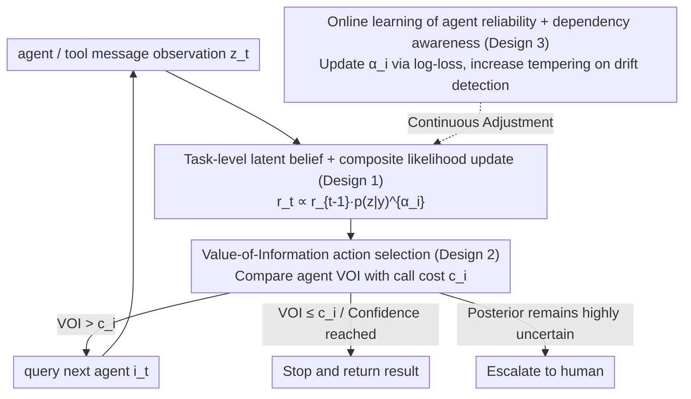

# Position: Agentic AI Orchestration Should Be Bayes-Consistent

**Conference**: ICML 2026 (Position Paper)  
**arXiv**: [2605.00742](https://arxiv.org/abs/2605.00742)  
**Code**: None  
**Area**: Agent / Bayesian Decision Theory / LLM Orchestration / Uncertainty Quantification  
**Keywords**: Bayesian Control Layer, Expected Utility, Value of Information, Agent Orchestration, Composite Likelihood  

## TL;DR
This position paper argues that instead of attempting to make LLMs themselves "Bayesian" (a path fraught with engineering and theoretical obstacles), the Bayesian structure should be moved to the **orchestration control layer** of agentic AI. This entails the controller maintaining a belief over low-dimensional task-level latent variables, updating according to Bayes' rule based on "message observations" returned by agents/tools, and using expected utility or value-of-information for routing, stopping, escalation, and budget allocation.

## Background & Motivation
**Background**: LLMs have become the core of modern AI applications, but the bottleneck for many high-value deployments is not "generating plausible tokens," but **decision-making under uncertainty**: When to stop? Which tool to call? When to ask a clarifying question? When to escalate to a human? Tool calls are expensive, slow, and risky; decisions are essentially trade-offs between cost, quality, and latency. Bayesian decision theory (Berger 1985, DeGroot 2004) is designed for such problems: maintain beliefs over latent variables, update based on evidence via Bayes, and select actions according to expected utility or value of information.

**Limitations of Prior Work**: There are two main paths to integrating Bayesian ideas into the LLM ecosystem. (a) **Making the LLM itself Bayesian**—maintaining a posterior over model parameters and performing marginalization. BDL has struggled for decades since the 90s (Laplace, mean-field, Hinton 1993, etc.), yet it hasn't truly shifted the SOTA of LLM training like second-order optimization has. Furthermore, the use of parameter posteriors in over-parameterized models to represent epistemic uncertainty is questioned (Kirsch 2025). Even if LLMs appear "Bayesian in-context" in restricted scenarios, Falck et al. (2024) used martingale tests to show they violate standard properties of Bayesian belief updates in general cases. (b) **Prompt-based heuristics**—chain-of-thought, ReAct, and various workflows. These suffice for short-horizon, low-risk tasks, but as tasks grow longer and stacks deeper, evidence correlation, cost trade-offs, and escalation thresholds become difficult to express using fixed workflows alone.

**Key Challenge**: Decision-making requires uncertainty at the **task-level semantics** ("will the code pass unit tests?"), but LLMs provide **token-level** probabilities—the scales are fundamentally different. A token distribution can be sharp while the task-level remains uncertain, and vice versa. Moreover, in-context updates of LLMs do not necessarily satisfy exchangeability or martingale properties, making the use of token probabilities as belief states unreliable.

**Goal**: (1) Precisely locate the slogan "agentic AI should be Bayesian"—it belongs in the **control layer**, not inside the LLM; (2) Provide a list of practical properties suitable for modern software stacks and human-AI collaboration; (3) Demonstrate the engineering feasibility of this paradigm through three specific examples (code generation, multi-agent debate, routing) and a set of design patterns; (4) Propose a call to action across benchmarking, modeling, deployment, and theory.

**Key Insight**: The authors stratify "Bayesian structure" into training, inference, and control layers. This paper focuses on the control layer: treating LLMs as black-box predictors, while the **orchestration** logic layer maintains an explicit belief state, updates via an observation model, and selects actions based on expected utility. This bypasses "parameter posteriors" and places Bayesian methods where they excel—on **explicit, low-dimensional decision variables with measurable outcomes**.

**Core Idea**: A Bayesian agentic system is defined by its control layer—maintaining a posterior over task-level latent variables $Y$ (e.g., whether code passes tests / which root-cause hypothesis is true / which tool is more reliable), treating LLM outputs as noisy likelihoods, performing tempered/composite likelihood updates via $r_t(y)\propto r_{t-1}(y)\,p_{i_t}(z_t\mid y)^{\alpha_{i_t}}$, and determining the next step (routing/stopping/escalation) based on expected utility or value-of-information.

## Method

### Overall Architecture
This position paper does not propose a single new algorithm but rather an **architectural template for the orchestration control layer**: LLMs act as black-box predictors, while the orchestrator above them maintains an explicit posterior belief $r_t(\cdot)=p(\cdot\mid\mathcal{D}_{1:t})$ defined over low-dimensional task-level latent variables. Every time a "message observation" is returned by an agent or tool, it is updated via Bayes' rule. The orchestrator then uses expected utility or value-of-information to decide on routing, stopping, escalation, and budget allocation. The core argument is: first, identify that Bayesian structure can reside in training, inference, or control; focus on control; then combine task-level latents, composite likelihood updates, VOI decision-making, and online reliability learning into an orchestrator that is both engineerable and preserves probabilistic interpretation.

### Key Designs

**1. Task-level latent belief + Composite likelihood Bayes update: Placing uncertainty on decision-relevant low-dimensional variables**

Decision-making requires task-level semantic uncertainty ("will this code pass unit tests?"), while LLMs provide token-level or parameter-level probabilities. These scales do not align. The first step is to move the belief out of the LLM and onto a low-dimensional decision variable. In code generation, let $Y\in\{0,1\}$ indicate whether candidate code passes all unit tests. The orchestrator maintains the posterior $r_t(y)=p(Y=y\mid\mathcal{D}_{1:t})$, where $\mathcal{D}_{1:t}=\{(i_s,Z_s):s\le t\}$ is the sequence of queried agents and their returned messages. Each new observation is updated via:

$$r_t(y)\propto r_{t-1}(y)\,p_{i_t}(z_t\mid y)^{\alpha_{i_t}}$$

If using a discriminative predictor $q_i(y\mid z)$, this is equivalently $r_t(y)=r_{t-1}(y)\,\ell_{i_t}(y;z_t)^{\alpha_{i_t}}/Z$, where the likelihood ratio is $\ell_i(y;z)=q_i(y\mid z)/p_0(y)$. The key is the exponent $\alpha_i$: a tempering exponent (generalized Bayes / power-posterior, Bissiri 2016). Naive Bayes assumes conditional independence, but agents from the same LLM family share prompts, base models, and retrieval pipelines, causing highly correlated outputs. Directly multiplying likelihoods leads to overconfidence; tempering absorbs this correlation into the likelihood strength. This is easier to implement and more robust than modeling the joint distribution, upgrading "how much to trust an agent" from a heuristic to a learnable parameter.

**2. Value-of-Information driven action selection: Using a decision-theoretic objective to unify routing / stopping / escalation**

Once a posterior is established, the next step—whether to query another agent, stop and return a result, or escalate to a human—is governed by a single criterion. Each agent $i$ has a known call cost $c_i > 0$. From a Bayesian decision-theoretic perspective, the action is chosen to maximize the posterior expected utility:

$$a_t^\star=\arg\max_a\sum_h u(a,h)\,r_t(h),$$

An agent call is only made if its expected value of information (VOI) exceeds its cost $c_i$. VOI is strictly defined as the "expected improvement in utility after the call." Real-time computation can be approximated using one-step lookahead or amortized surrogates. This approach targets the weaknesses of fixed workflows: "query 3 agents and ensemble" might work for short-horizon/low-stakes tasks, but when tasks are long and costs are asymmetric (e.g., a safety check vs. a unit-test runner), fixed processes fail to adapt. VOI explicitly quantifies "when it is worth spending more to query again." In scenarios like incident diagnosis or multi-agent debate, this translates directly to "query another agent if current max posterior confidence is below a threshold."

**3. Online learning of agent reliability + Dependency-aware evidence pool: Ensuring conservative belief convergence and continuous self-calibration**

Orchestration must handle two types of corruption: agent performance drift and inter-message correlation. For the former, the cumulative log-loss $L_i=\sum_{s:i_s=i}-\log q_i(y_s\mid z_s)$ is used to update exponential weights $w_i\propto\exp(-\beta L_i)$ online. These are mapped to tempering coefficients $\alpha_i=\alpha_\text{max}\tilde w_i$ (Cesa-Bianchi & Lugosi 2006), automatically suppressing the influence of poor performers. For the latter (especially correlations from repeated queries to the same agent), the interaction history is either included in the observation model or the latent state is expanded to include agent-specific shared-error variables. If rolling calibration diagnostics detect drift, the system automatically increases tempering or triggers abstention/escalation. Together, these ensure the belief does not become overconfident due to correlated messages. Notably, this trains the **orchestrator's meta-learning** rather than the LLM: $q_i(y\mid z)$ is learned from historical interaction logs with outcome labels, $\alpha_i$ is updated online, and calibration is verified on held-out tasks (using empirical coverage or proper scoring rules). The design allows the observation model to continuously recalibrate from measurable outcomes (pass/fail, human ratings, task completion), which is compatible with RLHF/online learning practices and exposes verifiable engineering interfaces (confidence thresholds, cost scales) to users.

## Key Experimental Results

> Note: As a position paper, this work does not present a large-scale empirical benchmark but demonstrates design feasibility through three examples and distills "desirable Bayesian properties for agentic systems" into 7 actionable attributes (see Section 2).

### Main Results
Three examples and their corresponding latent variable designs:

| Example (Section) | Orchestration Scenario | Latent Variable $Y$/$H$ | Observation $Z$ | Decision |
|-------------------|------------------------|-------------------------|-----------------|----------|
| 4.1 Multi-agent Code Gen | generator + retrieval + safety + unit-test runner | $Y\in\{0,1\}$: Pass all unit tests | Candidate code / refs / warnings | When to stop, whom to call |
| 4.2 Multi-agent Debate | Expert LLMs debating scientific/policy issues | $H\in\{h_1,\dots,h_k\}$: Root cause/hypothesis | Argument messages from agents | When to stop, escalate to human |
| Appx C Routing | Routing tasks across an agent pool | Task-specific competence parameters | Agent historical performance | Select the most suitable agent |

### Ablation Study (Thought Experiments)

| Configuration | Meaning | Paper Argument |
|---------------|---------|----------------|
| Belief in parameter space ("Bayesian LLM") | Bayesian inference inside LLM | Falck 2024 proves in-context update is not truly Bayesian; parameter posterior poor for epistemic uncertainty in over-parameterized models; prohibitive engineering cost. |
| Belief in token probabilities | Next-token distribution as belief state | Kuhn 2023 / Aichberger 2025: syntactic uncertainty $\neq$ semantic; sharp token distribution does not imply task-level certainty. |
| Prompt-based heuristics only | ReAct / Reflexion, etc. | Sufficient for short-horizon; fixed workflows struggle with routing/stopping for long-horizon, large tool ecosystems, or asymmetric costs. |
| Robust control / Bandits (no explicit posterior) | UCB, worst-case | Suitable for pure reward-driven tasks, but cannot naturally express VOI, abstention, or cost-aware escalation. |
| Task-level latent + VOI + Composite likelihood (**Ours**) | Bayes-consistent control layer | Explicit interface, engineerable, principled handling of dependencies, compatible with human-AI collaboration. |

### Key Findings
- **Uncertainty scale mismatch is critical**: Token uncertainty $\neq$ task uncertainty $\neq$ parameter uncertainty. Agentic decisions require task-level latents; separating these from LLM internals is more feasible than making LLMs internally Bayesian.
- **Composite likelihood + tempering solves correlation**: Correlated outputs from related agents are inevitable. Simple likelihood multiplication leads to overconfidence; learning $\alpha_i$ automatically suppresses unreliable or redundant agents.
- **Value-of-information is an explicit "cost-worth" criterion**: Replacing heuristic workflows with VOI unifies routing, stopping, and escalation under a single decision-theoretic objective.
- **Seven properties make engineering feasible**: (1) Accessible control layer; (2) Compatible with typed agent schemas; (3) Exposes simple knobs like confidence thresholds; (4) Supports abstention/escalation; (5) Maintains manageable context windows; (6) Treats human feedback as probabilistic observations; (7) Supports logging of beliefs and decisions (see Section 2).

## Highlights & Insights
- **"Which layer to place Bayes" is the core question**: The paper's most significant contribution is refining the vague "agentic AI should be Bayesian" into a precise proposition: not in parameter or token space, but in task-level latent + control policy. This places BDL tools (composite likelihood, generalized Bayes, VOI, Bayesian bandits) exactly where they are needed in the agent era.
- **Tempering is an elegant "engineering compromise"**: Fully modeling correlations between LLMs is nearly impossible. Using $\alpha_i$ as a single-knob proxy preserves probabilistic interpretation while acknowledging real-world noise, proving more robust than naive multiplication or assuming independence.
- **VOI provides a principled "when to stop" for long-horizon agents**: In practice, agents often over-call tools (high cost) or under-call (low accuracy). VOI explicitly quantifies if a call is worthwhile, offering a more elegant solution than manually tuned thresholds.
- **Bridging sub-communities**: By stringing together PAC-Bayes, generalized Bayes, Bayesian bandits, and filtering into an agentic orchestration narrative, the paper provides a reframing for the BDL community.
- **Transferable design patterns**: Any system using multiple unreliable predictors for joint decision-making (medical consultation, autonomous driving sensor fusion, multi-strategy quant trading) can adopt this belief + likelihood + VOI template. Treating human feedback as just another noisy probabilistic observation is a solid path toward unifying RLHF and HCI interfaces.

## Limitations & Future Work
- **Risk of misspecified observation models**: Since $q_i(y\mid z)$ is learned from historical logs, calibration may fail under distribution drift. The paper acknowledges the need for continuous monitoring, stronger tempering, and fallback to abstention.
- **Mapping high-dimensional agent messages to likelihoods is an open problem**: How to map text-level $Z$ to a likelihood for latent $y$? Currently, embedding-based discriminative models are used as approximations, which remains distant from "strict Bayesianism."
- **Computational cost of VOI in complex orchestration**: Multi-step VOI on tree/graph agent call structures is exponentially expensive. The paper suggests amortized controllers or one-step approximations, but exact solutions remain an open challenge.
- **Dependence on measurable outcomes**: Many agentic tasks lack binary success metrics (creative writing, policy advice). Defining belief states and learning observation models for these requires sophisticated domain engineering.
- **Lack of large-scale evidence**: As a position paper, it lacks benchmarks; the authors primarily call for the creation of outcome-based, cost-aware, and dependence-aware evaluation platforms.
- **Latency constraints in industrial systems**: VOI calculation might add hundreds of milliseconds to each routing decision. Whether industrial systems can tolerate this remains to be verified.

## Related Work & Insights
- **vs. Mainstream Bayesian Deep Learning (MacKay 1992, Blundell 2015, Gal & Ghahramani 2016)**: BDL puts Bayes in the parameter space; this paper explicitly argues this is neither engineerable nor theoretically sound for LLMs, proposing a shift to the control layer.
- **vs. "Are LLMs Bayesian" studies (Falck 2024, Chlon 2025, Atwell 2026)**: These studies show LLM in-context behavior deviates from martingales. This paper uses these results as **evidence** for why we shouldn't expect internal Bayesianism, making control-layer Bayes more realistic.
- **vs. ReAct / Reflexion / Chain-of-Thought**: These are prompt-heuristic orchestrations. This paper notes their effectiveness for short tasks but argues that long-horizon tasks and large tool ecosystems require principled Bayesian control.
- **vs. Bayesian bandits / Robust control**: These can make decisions without explicit beliefs. This paper argues that when abstention, escalation, and VOI are important, an explicit belief state is a more natural interface.
- **vs. Bengio 2025 "Bayesian Oracle"**: Bengio et al. propose using a Bayesian oracle to prevent agent harm, aligning with this vision; this paper goes further by providing design patterns for the control layer.
- **Insights**: (1) Teams aiming to industrialize LLM agents should start by implementing belief logging and VOI-based routing in orchestrators; (2) BDL researchers can find a new niche in the control layer, which is far more realistic than parameter-level Bayesian LLMs; (3) The evaluation community should integrate outcome calibration and cost-aware metrics into agent benchmarks.

## Rating
- Novelty: ⭐⭐⭐⭐ Not a new algorithm, but a **precise reframing** of "agentic AI should be Bayesian" into four specific design principles: control layer + task-level latent + VOI + composite likelihood.
- Experimental Thoroughness: ⭐⭐⭐ As a position paper, it lacks a benchmark; three specific examples and design templates demonstrate feasibility, but end-to-end evidence is missing—a natural limitation of the format.
- Writing Quality: ⭐⭐⭐⭐⭐ Clear argumentative structure: defining the layer, explaining why internal Bayes fails, providing the template, listing properties, and the call to action; solid citations spanning BDL, decision theory, agents, and bandits.
- Value: ⭐⭐⭐⭐ A crucial boundary definition for both BDL and agent communities. BDL has struggled to find a "killer app" for LLMs; this paper moves it to the control layer, where it truly fits. Expect a wave of work following this path.

<!-- RELATED:START -->

## Related Papers

- [\[ICML 2026\] Position: Assistive Agents Need Accessibility Alignment](position_assistive_agents_need_accessibility_alignment.md)
- [\[ACL 2026\] How Adversarial Environments Mislead Agentic AI](../../ACL2026/llm_agent/how_adversarial_environments_mislead_agentic_ai.md)
- [\[NeurIPS 2025\] Orchestration Framework for Financial Agents: From Algorithmic Trading to Agentic Trading](../../NeurIPS2025/llm_agent/orchestration_framework_for_financial_agents_from_algorithmic_trading_to_agentic.md)
- [\[ICML 2026\] NaviAgent: Graph-Driven Bilevel Planning for Scalable Tool Orchestration](naviagent_graph-driven_bilevel_planning_for_scalable_tool_orchestration.md)
- [\[ICLR 2026\] SR-Scientist: Scientific Equation Discovery With Agentic AI](../../ICLR2026/llm_agent/sr-scientist_scientific_equation_discovery_with_agentic_ai.md)

<!-- RELATED:END -->
