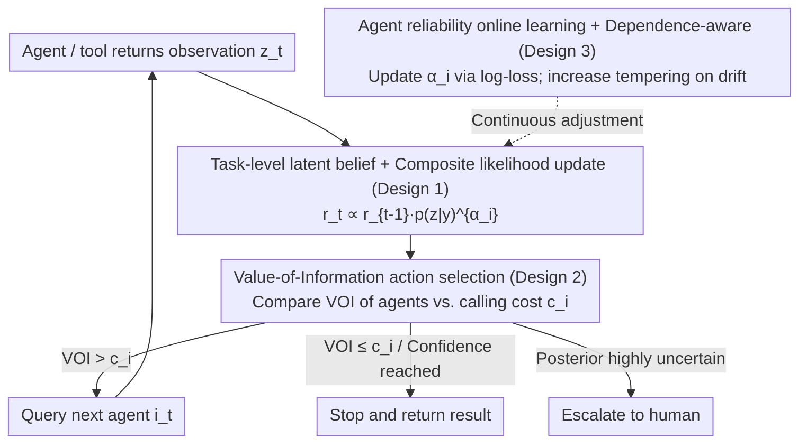

# Position: Agentic AI Orchestration Should Be Bayes-Consistent

**Conference**: ICML 2026 (Position Paper)  
**arXiv**: [2605.00742](https://arxiv.org/abs/2605.00742)  
**Code**: None  
**Area**: Agent / Bayesian Decision Theory / LLM Orchestration / Uncertainty Quantification  
**Keywords**: Bayesian Control Layer, Expected Utility, Value of Information, Agent Orchestration, Composite Likelihood  

## TL;DR
This position paper argues against trying to make LLMs themselves "Bayesian" (a path fraught with engineering and theoretical roadblocks). Instead, it proposes moving the Bayesian structure to the **orchestration control layer** of agentic AI. Here, the controller maintains beliefs over low-dimensional task-level latent variables, updates these beliefs following Bayes' rule based on "message observations" from agents/tools, and employs expected utility or Value of Information (VOI) for routing, stopping, escalation, and budget allocation.

## Background & Motivation
**Background**: LLMs have become the core of modern AI applications, but the bottleneck in high-value deployments is not "generating plausible tokens" but **decision-making under uncertainty**: When to stop? Which tool to invoke? When to ask a clarifying question? When to escalate to a human? Tool calls are expensive, slow, and risky; decision-making is essentially a trade-off between cost, quality, and latency. Bayesian decision theory (Berger 1985, DeGroot 2004) is designed for exactly these problems: maintaining beliefs over latent variables, updating based on evidence, and selecting actions based on expected utility or VOI.

**Limitations of Prior Work**: There are two main ways to integrate Bayesian thinking into LLM systems. (a) **Making the LLM itself Bayesian**: Maintaining posteriors over model parameters and performing integration. Bayesian Deep Learning (BDL) has worked on this for decades (Laplace, mean-field, Hinton 1993, etc.), but it has yet to change the training SOTA of LLMs like second-order optimization might; the parameter posterior as a representation of epistemic uncertainty in over-parameterized models is also questioned (Kirsch 2025). Even if LLMs appear "Bayesian in-context" in constrained scenarios, Falck et al. (2024) used martingale tests to show they violate standard properties of Bayesian belief updates in general cases. (b) **Prompt-based heuristics**: Chain-of-Thought, ReAct, and various workflows work well for short-horizon, low-risk tasks; however, as tasks lengthen and stacks deepen, evidence correlation, cost trade-offs, and escalation thresholds become difficult to express using only fixed workflows.

**Key Challenge**: Decision-making requires uncertainty at the **task-level semantic scale** ("will the code pass unit tests?"), but LLMs provide probabilities at the **token level**. The scales are fundamentally different. A token distribution can be sharp while the task-level remains uncertain, and vice-versa. Furthermore, in-context updates of LLMs do not necessarily satisfy exchangeability or martingale properties, making it unreliable to treat token probabilities as belief states.

**Goal**: (1) To precisely locate where agentic AI should be Bayesian—at the **control layer**, not inside the LLM; (2) To provide a checklist of practical properties suitable for modern software stacks and human-AI collaboration; (3) To demonstrate the engineering feasibility of this paradigm through three specific examples (code generation, multi-agent debate, routing) and a set of design patterns; (4) To propose a call to action across benchmarking, modeling, deployment, and theory.

**Key Insight**: The authors stratify "Bayesian structure" into layers—training, inference, or control. This paper focuses on the control layer: treating LLMs as black-box predictors, while the **orchestration** logic layer maintains an explicit belief state, updates according to an observation model, and selects actions based on expected utility. This bypasses "parameter posteriors" and places Bayes where it excels—**explicit, low-dimensional decision variables with measurable outcomes**.

**Core Idea**: A Bayesian agentic system is defined by its control layer—maintaining a posterior over task-level latent variables $Y$ (e.g., whether code passes tests, which root-cause hypothesis is true, which tool is more reliable), treating LLM outputs as noisy likelihoods, performing tempered/composite likelihood updates via $r_t(y)\propto r_{t-1}(y)\,p_{i_t}(z_t\mid y)^{\alpha_{i_t}}$, and deciding on the next routing/stopping/escalation step based on expected utility or VOI.

## Method

### Overall Architecture
This position paper does not propose a specific new algorithm but rather an **architectural template for the orchestration control layer**: LLMs serve as black-box predictors, while the orchestrator above them maintains an explicit posterior belief $r_t(\cdot)=p(\cdot\mid\mathcal{D}_{1:t})$ defined over low-dimensional task-level latent variables. Upon receiving a "message observation" returned by an agent/tool, the orchestrator updates according to Bayes' rule and uses expected utility or VOI to determine routing, stopping, escalation, and budget allocation. The primary argument is: first, identify that Bayesian structure can reside in training, inference, or control (focusing on the latter); then, assemble an engineered orchestrator from four components: task-level latents, composite likelihood updates, VOI-based decision-making, and online reliability learning.

### Key Designs

**1. Task-level latent belief + Composite Likelihood Bayesian Update: Placing uncertainty on low-dimensional variables relevant to orchestration**

Decision-making requires task-level semantic uncertainty ("will this code pass unit tests?"), whereas LLMs provide token-level or parameter-level probabilities. These scales are mismatched. The first step reflects extracting beliefs from the LLM internals and placing them on low-dimensional decision variables. For code generation, let $Y\in\{0,1\}$ represent whether candidate code passes all unit tests. The orchestrator maintains the posterior $r_t(y)=p(Y=y\mid \mathcal{D}_{1:t})$, where $\mathcal{D}_{1:t}=\{(i_s,Z_s):s\le t\}$ is the sequence of queried agents and their returned messages. Each new observation updates the belief via:

$$r_t(y)\propto r_{t-1}(y)\,p_{i_t}(z_t\mid y)^{\alpha_{i_t}}$$

If using a discriminative predictor $q_i(y\mid z)$, this is equivalently written as $r_t(y)=r_{t-1}(y)\,\ell_{i_t}(y;z_t)^{\alpha_{i_t}}/Z$, where the likelihood ratio is $\ell_i(y;z)=q_i(y\mid z)/p_0(y)$. The critical component is the exponent $\alpha_i$, a tempering index (generalized Bayes / power-posterior, Bissiri 2016). Naive Bayes assumes conditional independence, but agents from the same LLM lineage share prompts, base models, and retrieval pipelines, leading to correlated outputs. Direct likelihood multiplication would lead to overconfidence; tempering absorbs these correlations into the likelihood strength, which is more robust and easier to implement than explicitly modeling the joint distribution. This elevates "how much each agent should be trusted" from a heuristic to a learnable parameter.

**2. Value-of-Information Driven Action Selection: Unifying routing, stopping, and escalation under a decision-theoretic objective**

Once the posterior is established, the decision of which agent to query, whether to stop and return a result, or whether to escalate to a human is governed by a single criterion. Each agent $i$ carries an associated calling cost $c_i > 0$. From a Bayesian decision-theoretic perspective, actions are chosen to maximize the posterior expected utility:

$$a_t^\star=\arg\max_a\sum_h u(a,h)\,r_t(h),$$

and an agent is queried only if the expected Value of Information (VOI) of that call exceeds its cost $c_i$. VOI is strictly defined as the "expected difference in utility before and after the call"; real-time computation can be approximated using one-step lookahead or amortized surrogates. This approach addresses the weaknesses of fixed workflows: predefined "ensemble 3 agents" logic works for short-horizon/low-stakes tasks, but fails when tasks lengthen or costs become highly asymmetric (e.g., a safety check vs. a unit-test runner). VOI explicitly quantifies "when it is worth spending more to query again," allowing for self-adaptive orchestration in scenarios like incident diagnosis or multi-agent debate.

**3. Agent Reliability Online Learning + Dependence-aware Evidence Pool: Ensuring conservative convergence and continuous self-calibration**

Orchestration must handle two types of corruption: agent performance drift and message correlation. For the former, a cumulative log-loss is defined as $L_i=\sum_{s:i_s=i}-\log q_i(y_s\mid z_s)$, which updates online via exponential weights $w_i\propto\exp(-\beta L_i)$. This is then mapped to the tempering coefficient $\alpha_i=\alpha_\text{max}\tilde w_i$ (Cesa-Bianchi & Lugosi 2006), automatically reducing the influence of underperforming agents. For correlation (especially repeated queries to the same agent), the system either incorporates interaction history into the observation model conditioning or expands the latent state to include agent-specific shared-error variables. If rolling calibration diagnostics detect drift, the system automatically increases tempering or triggers abstention/escalation. This ensures the belief does not become overconfident due to a few correlated messages. Notably, this trains the **orchestrator's meta-learning**, not the LLM: $q_i(y\mid z)$ is learned from historical interactions with outcome labels, $\alpha_i$ updates online, and calibration is verified using held-out tasks (empirical coverage, proper scoring rules). This design principle allows observation models to recalibrate continuously from measurable outcomes (pass/fail, human ratings, task completion), remaining compatible with RLHF/online learning practices and exposing verifiable engineering interfaces (confidence thresholds, cost scales).

## Key Experimental Results

> Note: As a position paper, this work does not present a large-scale empirical benchmark but demonstrates feasibility through three specific examples and distills 7 operational properties a Bayesian agentic system should possess (see Section 2).

### Main Results
Three scenarios and their corresponding latent variable designs:

| Example (Section) | Orchestration Scenario | Latent Variable $Y$/$H$ | Observation $Z$ | Decision |
|-------------------|------------------------|-------------------------|-----------------|----------|
| 4.1 Multi-agent Code Gen | generator + retrieval + safety checker + unit-test runner | $Y\in\{0,1\}$: Pass all tests | Candidate code / citations / warnings | When to stop, who to call |
| 4.2 Multi-agent Debate | Multiple experts debating a scientific/policy issue | $H\in\{h_1,\dots,h_k\}$: Root cause/hypothesis | Argumentative messages | When to stop, escalate to human |
| C Routing (Appendix) | Routing tasks across an agent pool | Task-specific competence parameters | Agent historical performance | Select most suitable agent |

### Ablation Study (Thought Experiments)

| Configuration | Meaning | Argument |
|---------------|---------|----------|
| Belief in parameter space ("Bayesian LLM") | Bayesian internals for LLM | Falck 2024 proves in-context update isn't truly Bayesian; parameter posteriors express epistemic uncertainty poorly in over-parameterized regimes; huge engineering cost. |
| Belief in token probabilities | Next-token distribution as belief state | Kuhn 2023 / Aichberger 2025: syntactic uncertainty $\neq$ semantic; sharp token distributions don't imply task-level certainty. |
| Prompt-based heuristics only | ReAct / Reflexion, etc. | Sufficient for short-horizon; fails to express routing/stopping for long-horizon, large tool ecosystems, or asymmetric costs. |
| Robust control / Bandits (No explicit posterior) | UCB, worst-case | Suitable for pure reward-driven tasks, but less natural for expressing VOI, abstention, or cost-aware escalation. |
| **Task-level latent + VOI + Composite Likelihood (Ours)** | **Bayes-consistent control layer** | **Explicit interface, engineerable, principled dependence handling, compatible with human-AI collaboration.** |

### Key Findings
- **Uncertainty scale mismatch is the bottleneck**: Token uncertainty $\neq$ Task uncertainty $\neq$ Parameter uncertainty. Agentic decisions require task-level latents; separating this from LLM internals is more feasible than making the LLM internally Bayesian.
- **Composite Likelihood + Tempering addresses correlation**: Correlation between agents of the same lineage is inevitable. Naive likelihood multiplication leads to overconfidence. Learning $\alpha_i$ as a power-posterior automatically suppresses unreliable or correlated agents.
- **Value of Information as an explicit "budget ruler"**: Replacing heuristic workflows with VOI unifies routing, stopping, and escalation under a single decision-theoretic objective.
- **Seven properties facilitate engineering**: (1) Easy control-layer integration; (2) Compatibility with typed agent schemas; (3) Explicit knobs like confidence thresholds; (4) Support for abstention and escalation; (5) Manageable context windows; (6) Treating human feedback as probabilistic observations; (7) Support for logging beliefs and decisions (see Section 2).

## Highlights & Insights
- **The "Layer" question is pivotal**: The core contribution is precisely situating where "agentic AI should be Bayesian"—not in parameter space or token space, but in the task-level latent and control policy. This allows BDL tools (composite likelihood, generalized Bayes, VOI, Bayesian bandits) to find a proper home in the agent era.
- **Composite Likelihood + Tempering is an elegant "engineering compromise"**: Fully modeling correlations between LLMs is near-impossible; using $\alpha_i$ as a single-knob proxy maintains probabilistic interpretation while acknowledging real-world noise.
- **Value of Information provides a principled "when to stop" for long-horizon agents**: In practice, agents often over-call tools (high cost) or under-call (low accuracy). VOI quantifies whether "one more call is worth it," proving more elegant than manually tuned heuristics.
- **Bridge across sub-communities**: It reframes and unifies tools like PAC-Bayes, generalized Bayes, and Bayesian filtering into a narrative for agentic orchestration.
- **Transferable design patterns**: Any system using multiple unreliable predictors for joint decisions (medical consultation, autonomous driving sensor fusion, quantitative multi-strategy weighting) can adopt this belief + likelihood + VOI template.

## Limitations & Future Work
- **Misspecified observation models**: $q_i(y\mid z)$ is learned from history; calibration may fail under distribution drift. Continuous monitoring and stronger tempering or escalation are required.
- **Likelihood of high-dimensional agent messages**: Mapping text-level $Z$ to a likelihood for latent $y$ is an open challenge. Embedding-based discriminative models are current approximations.
- **VOI computational cost in combinatorial orchestration**: Multi-step VOI for tree/graph-based agent calls can explode. Amortized controllers or one-step lookahead are suggested compromises.
- **Dependence on measurable outcomes**: Many tasks (creative writing, policy advice) lack easy binary outcomes, making it difficult to define belief states and learn observation models.
- **Lack of large-scale empirical validation**: As a position paper, it calls for the establishment of outcome-based, cost-aware, and dependence-aware benchmarking platforms.
- **Latency constraints in industrial systems**: VOI calculations might add hundreds of milliseconds to routing decisions, which may be unacceptable for some real-time systems.

## Related Work & Insights
- **vs. Mainstream Bayesian Deep Learning (Mackay 1992, Gal 2016, etc.)**: BDL focuses on parameter space; this paper explicitly argues that this path is engineeringly and theoretically infeasible for LLMs, proposing the control layer instead.
- **vs. "Are LLMs Bayesian" studies (Falck 2024, Atwell 2026)**: These show in-context behavior deviates from martingale properties. This paper uses these results as arguments for why "expecting LLMs to be internally Bayesian" is ill-advised.
- **vs. ReAct / Reflexion / Chain-of-Thought**: These are prompt-based heuristics. While effective for short horizons, this paper argues Bayesian control is necessary for long horizons and large tool ecosystems.
- **vs. Bayesian Oracles (Bengio 2025)**: Proposes Bayesian oracles to prevent agent harm. This paper shares that vision and provides specific design patterns for the control layer.

## Rating
- **Novelty**: ⭐⭐⭐⭐ Not a new algorithm, but a **precise reframing** of the Bayesian agentic AI claim into four concrete, actionable design principles.
- **Experimental Thoroughness**: ⭐⭐⭐ As a position paper, it lacks a benchmark, but the examples and template sufficiently demonstrate feasibility.
- **Writing Quality**: ⭐⭐⭐⭐⭐ Extremely clear structure: identifying the layer, debunking internal Bayesianism, providing templates, listing properties, and setting a call to action.
- **Value**: ⭐⭐⭐⭐ Provides a clear boundary and home for BDL tools in the LLM era. It is likely to inspire a wave of work following this orchestration-layer path.

<!-- RELATED:START -->

## Related Papers

- [\[ICML 2026\] Position: Assistive Agents Need Accessibility Alignment](position_assistive_agents_need_accessibility_alignment.md)
- [\[ICML 2026\] Web Agents Should Use Typed Actions Instead of Click-Based Browsing](web_agents_should_use_typed_actions_instead_of_click-based_browsing.md)
- [\[ICML 2026\] Position: Modular Memory is the Key to Continual Learning Agents](position_modular_memory_is_the_key_to_continual_learning_agents.md)
- [\[NeurIPS 2025\] Orchestration Framework for Financial Agents: From Algorithmic Trading to Agentic Trading](../../NeurIPS2025/llm_agent/orchestration_framework_for_financial_agents_from_algorithmic_trading_to_agentic.md)
- [\[ICML 2026\] NaviAgent: Graph-Driven Bilevel Planning for Scalable Tool Orchestration](naviagent_graph-driven_bilevel_planning_for_scalable_tool_orchestration.md)

<!-- RELATED:END -->
