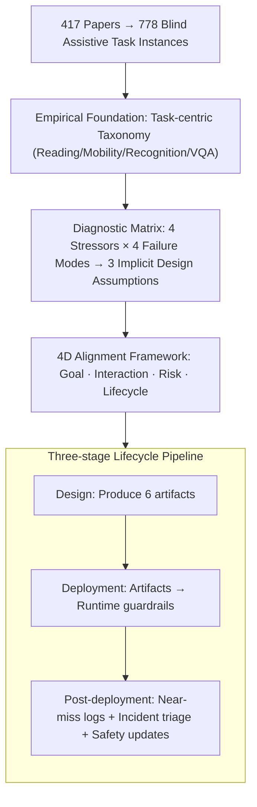

# Position: Assistive Agents Need Accessibility Alignment

**Conference**: ICML 2026  
**arXiv**: [2605.13579](https://arxiv.org/abs/2605.13579)  
**Code**: None  
**Area**: Agent / Accessibility AI / Human-AI Alignment  
**Keywords**: Blind assistance, accessibility alignment, agentic AI, risk calibration, lifecycle design

## TL;DR
This position paper presents a systematic review of 778 blind assistive task instances across 417 publications. It argues that "accessibility alignment" should be a first-class alignment objective for Agents, alongside helpfulness, harmlessness, and honesty. The authors propose a design pipeline covering four dimensions: goal, interaction, risk, and lifecycle.

## Background & Motivation
**Background**: Currently, agentic AI is advancing rapidly in multi-step reasoning, tool usage, and autonomous decision-making. Researchers have begun applying these agents to accessibility scenarios—such as navigation for the blind, street view understanding, and UI operations—aiming to replace traditional white canes or screen readers with general-purpose Agents.

**Limitations of Prior Work**: The authors provide extensive evidence that even SOTA Agents like GPT-4o, ChatGPT Live Video, and StreetReaderAI produce "confident but incorrect" instructions in dynamic street scenes, blurred medicine labels, or street-crossing scenarios. Since blind users cannot independently verify visual outputs, errors often go undetected and can lead to direct physical harm.

**Key Challenge**: The fundamental cause is that current Agent design, training, and evaluation implicitly rely on three assumptions: users can quickly verify outputs visually, errors are low-cost and iteratively correctable, and users share the same visual context as the Agent. These three assumptions fail for the Blind and Visually Impaired (BVI) population, resulting in four types of systemic failures: silent failure, overconfident hallucination, miscalibrated autonomy, and cognitive overload.

**Goal**: (1) Characterize the real distribution of blind assistive tasks using large-scale instance data; (2) Demonstrate that accessibility is not merely a UI patch but an Agent alignment issue; (3) Provide an actionable design pipeline.

**Key Insight**: Positioned as a position paper, the work first creates a statistical profile using 778 real-world tasks. It then diagnoses issues via a causal chain of "stressor $\rightarrow$ failure mode $\rightarrow$ violation of design assumptions," finally proposing an alignment framework. This follows a typical trajectory of deriving a theoretical framework from empirical data.

**Core Idea**: Elevate accessibility from the HCI interface layer to the Agent core as a third alignment objective alongside helpfulness and harmlessness, implemented through a "goal/interaction/risk/lifecycle" four-dimensional framework.

## Method
This position paper does not introduce a new algorithm; its "method" is an argumentation chain grounded in empirical data that leads back to an alignment framework.

### Overall Architecture
The core proposition is that the repeated safety errors of blind assistive Agents stem from implicit assumptions that users can visually verify outputs. Thus, accessibility should be elevated to the alignment layer. The argument proceeds in four steps: establishing a task-centric taxonomy based on 778 task instances, deriving four systemic failure modes from BVI environmental stressors, attributing these failures to three invalid design assumptions, and proposing a four-dimensional alignment framework with a three-stage lifecycle pipeline.

### Key Designs

**1. Empirical foundation using 778 task instances to counter the "accessibility is a marginal issue" argument**

The authors address the common weakness of position papers—basing arguments on intuition—by presenting data. They extracted task descriptions from 417 papers (2012–2025) across CV, GenAI, Robotics, and HCI to perform qualitative coding. This yielded 778 fine-grained task instances categorized into: Reading & Text Access (35%), Mobility & Safety (34%), Object Recognition & Daily Operations (12%), and VQA Goal-directed Query (18%). This statistical profile proves that assistive tasks are high-volume and concentrated in high-risk areas like mobility and reading where "errors lead to incidents."

**2. A diagnostic matrix of 4 Stressors × 4 Failure Modes for reverse-engineering accessibility failures**

Four environmental characteristics (stressors) specific to BVI scenarios are identified: limited verifiability, high-cost errors, cognitive burden, and privacy exposure. These lead to four systemic failure modes: silent failure, overconfident hallucination, miscalibrated autonomy, and interaction-induced cognitive overload. By linking each failure mode to specific stressors—for example, silent failure is driven by limited verifiability and asymmetric cost—the problem is transformed from anecdotal complaints into an engineering problem that can be addressed by mitigating the corresponding stressors.

**3. 4D Accessibility Alignment Framework + Three-stage Lifecycle Pipeline**

The authors decompose alignment into four dimensions with specific artifacts: Goal (redefining success with safety margins and recovery procedures $\rightarrow$ Accessibility Success Specification), Interaction (low-bandwidth non-visual protocols $\rightarrow$ Interaction Contract), Risk (conservative actions triggered by uncertainty $\rightarrow$ Risk/Uncertainty Policy, Privacy Manifest, Autonomy Calibration Specification), and Lifecycle (logging/feedback/updates). The pipeline transitions from Design (artifact creation) to Deployment (runtime guardrails like autonomy downgrade and safe pauses) and Post-deployment (incident triage and regression testing). Evaluation metrics move from task-completion (SPL, OCR accuracy) to safety-aware metrics (unsafe instruction rate, risk-trigger compliance, abstention precision/recall).

## Key Experimental Results
There are no quantitative experiments; the "experiments" consist of statistical descriptions of the 778 instances and qualitative demonstrations via case studies.

### Main Results
Distribution of 778 task instances:

| Category | Count | Percentage | Representative Sub-tasks (Count) |
|------|------|------|--------|
| Reading & Text Access | ~293 | 35% | General Document Reading (95) / Interactive Digital Reading (100) / Non-linear Visual Doc (98) |
| Mobility & Safety | ~253 | 34% | Hazard Perception (108) / Path Planning & Navigation (116) / Localization & Relocation (29) |
| VQA Goal-directed Query | ~141 | 18% | Situational Understanding (96) / Goal-directed Object Queries (45) |
| Object Recognition & Daily Operations | ~91 | 12% | Object Understanding (56) / Object-Centered Interaction (35) |

### Ablation Study
A comparison between a non-aligned baseline and accessibility-aligned design across two cases:

| Case | Red-line failure | Uncertainty trigger | Metric Migration | Runtime Behavior |
|------|------|------|------|------|
| Navigation Assistance | Giving decisive crossing instructions despite localization drift. | Localization drift / Occlusion / Map ambiguity / Dynamic obstacles. | SPL, Path length $\rightarrow$ Unsafe instruction rate, Risk-trigger compliance, Recovery success. | Conservative pathing, Autonomy downgrade, Landmark instructions, Safe pause, Human escalation. |
| Pill Label Reading | Confidently reporting dosage from blurry/partial evidence. | Blur / Occlusion / Folded packaging / OCR-VLM conflict. | OCR accuracy, CER/WER $\rightarrow$ Critical-field accuracy, Critical hallucination rate, Abstention P/R. | Field-level confidence, Ambiguity detection, Structured output, Recapture policy, Escalation to pharmacist. |

### Key Findings
- Reading and Mobility account for 69% of tasks and are high-risk "fail-deadly" scenarios, indicating that research must focus on safety guarantees under missing verification rather than general multimodal capability.
- The core engineering lesson is that uncertainty must be expressed at the decision point rather than just upstream.
- Failure modes are mutually reinforcing: silent failures and hallucinations increase cognitive burden as users attempt mental verification, while miscalibrated autonomy wastes bandwidth or blocks verification.

## Highlights & Insights
- Successfully frames accessibility as an alignment problem by emphasizing non-verifiability and irreversible errors, aligning it with the Helpful/Harmless/Honest triad.
- Anchoring the argument with 778 instances provides a robust empirical foundation that is difficult to dismiss, offering a template for survey-style position papers.
- The "Stressor $\rightarrow$ Failure Mode $\rightarrow$ Assumption" causal decomposition is a reusable framework for explaining systemic bugs and deriving technical remedies.
- The insistence on "conservative by default + escalation pathway" as enforced runtime properties rather than "nice-to-have" features is relevant to other high-stakes domains like medicine or finance.

## Limitations & Future Work
- The taxonomy is derived from literature, which may underestimate needs in non-academic scenarios like social interaction or employment.
- The framework remains at the specification level; future work requires longitudinal deployment and quantified trust/calibration metrics for validation.
- The coupling between the four dimensions lacks formal proofs or compatibility checks.
- While focused on BVI users, the paper does not discuss the transferability of this framework to other disabilities (hearing, motor, or cognitive impairments).

## Related Work & Insights
- **vs. HCI Accessibility (Lazar et al.)**: Traditional HCI treats accessibility as a UI/screen reader issue. This paper argues that since Agents are autonomous decision-makers, errors are rooted in policy/goals, requiring architectural alignment.
- **vs. Agent Scaling (Ferrag, Acharya et al.)**: Scaling does not eliminate silent failures; in fact, increased confidence can lead to greater harm. This paper provides empirical evidence that scale alone is insufficient.
- **vs. RLHF Triad (HHH)**: The HHH framework assumes users can verify and correct outputs. This paper extends alignment research to underrepresented users by adding dimensions like verifiability, risk asymmetry, and interaction bandwidth.

## Rating
- **Novelty**: ⭐⭐⭐⭐ Reframing accessibility as an alignment problem is a timely and systematic call within Agent literature.
- **Experimental Thoroughness**: ⭐⭐⭐ The statistical task profiling is solid, though it lacks real-world deployment or quantitative user studies.
- **Writing Quality**: ⭐⭐⭐⭐⭐ Clear structure with a strong causal chain and case studies that ground abstract principles.
- **Value**: ⭐⭐⭐⭐ Directly provides design guidance for researchers in Agent safety, healthcare, and assistive technologies.

<!-- RELATED:START -->

## Related Papers

- [\[ICML 2026\] Position: Modular Memory is the Key to Continual Learning Agents](position_modular_memory_is_the_key_to_continual_learning_agents.md)
- [\[ICML 2026\] Position: Agentic AI Orchestration Should Be Bayes-Consistent](position_agentic_ai_orchestration_should_be_bayes-consistent.md)
- [\[ACL 2026\] Taming Actor-Observer Asymmetry in Agents via Dialectical Alignment](../../ACL2026/llm_agent/taming_actor-observer_asymmetry_in_agents_via_dialectical_alignment.md)
- [\[ACL 2025\] Multiple LLM Agents Debate for Equitable Cultural Alignment](../../ACL2025/llm_agent/multiple_llm_agents_debate_for_equitable.md)
- [\[AAAI 2026\] MoralReason: Generalizable Moral Decision Alignment For LLM Agents Using Reasoning-Level Reinforcement Learning](../../AAAI2026/llm_agent/moralreason_generalizable_moral_decision_alignment_for_llm_agents_using_reasonin.md)

<!-- RELATED:END -->
