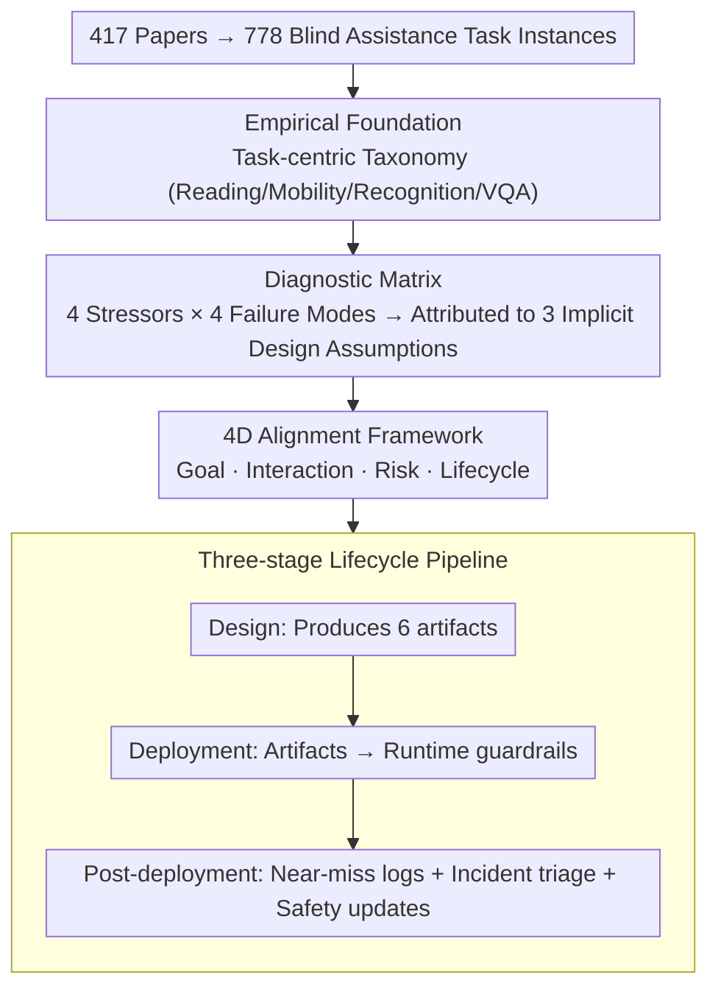

# Position: Assistive Agents Need Accessibility Alignment

**Conference**: ICML 2026  
**arXiv**: [2605.13579](https://arxiv.org/abs/2605.13579)  
**Code**: None  
**Area**: Agent / Accessible AI / Human-centered Alignment  
**Keywords**: Blind assistance, accessibility alignment, agentic AI, risk calibration, lifecycle design

## TL;DR
This is a position paper in which the authors conduct a systematic review of 778 blind assistance task instances from 417 papers. They argue that "accessibility alignment" should be regarded as a first-tier alignment goal for Agents, alongside helpfulness, harmlessness, and honesty, and propose a design pipeline covering four dimensions: goal, interaction, risk, and lifecycle.

## Background & Motivation
**Background**: Currently, agentic AI is developing rapidly in multi-step reasoning, tool usage, and autonomous decision-making. Researchers have begun applying these capabilities to accessibility scenarios such as blind navigation, street view understanding, and UI operation, aiming to replace traditional white canes or screen readers with general-purpose Agents.

**Limitations of Prior Work**: The authors provide extensive evidence showing that even SOTA Agents like GPT-4o, ChatGPT Live Video Chat, and StreetReaderAI output "confident but incorrect" instructions in scenarios involving dynamic street views, blurry medicine labels, or crossing streets. Since blind users cannot independently verify visual outputs, errors often go undetected and can directly cause physical harm.

**Key Challenge**: The fundamental cause is that current Agent design, training, and evaluation implicitly assume three things: the user can quickly verify output visually, errors are low-cost and iteratively correctable, and the user shares the same visual context as the Agent. These three assumptions fail for the BVI (Blind and Visually Impaired) population, resulting in four types of systematic failures: silent failure, overconfident hallucination, miscalibrated autonomy, and cognitive overload.

**Goal**: (1) Characterize the real distribution of blind assistance tasks using large-scale instance data; (2) Argue that accessibility is not a problem solvable by UI patches but is an Agent alignment issue; (3) Provide an implementable design pipeline.

**Key Insight**: Positioned as a position paper, the work first creates a statistical profile using 778 real tasks and then diagnoses issues through a causal chain of "stressor → failure mode → violation of design assumptions." Finally, it proposes an alignment framework—a typical approach of deriving a theoretical framework from empirical data.

**Core Idea**: Elevate accessibility from the HCI interface layer to the Agent kernel layer as a third category of alignment goal alongside helpfulness and harmlessness, implemented through a "goal / interaction / risk / lifecycle" four-dimensional framework.

## Method
This position paper does not introduce a new algorithm; its "method" is an argumentation chain starting from empirical data and leading back to an alignment framework.

### Overall Architecture
The core claim is that the recurring safety errors of blind assistance Agents stem not from insufficient multimodal capability, but from the implicit assumption that "users can verify output visually." Therefore, accessibility should be elevated to the alignment layer. The argument proceeds in four steps: establishing a task-centric taxonomy with 778 real instances as a foundation, deriving 4 systematic failure modes from environmental stressors of BVI scenarios, attributing these failures to 3 indefensible design assumptions, and finally proposing a 4D alignment framework with a three-stage lifecycle pipeline as a remedy.

### Key Designs

**1. Using 778 task instances as an empirical foundation to preempt arguments that "accessibility is a marginal issue"**

The primary weakness of position papers is "subjective positioning." To counter this, the authors provide data first: they extracted and qualitatively coded task descriptions from 417 papers across CV, GenAI, Robotics, and HCI between 2012 and 2025, yielding 778 fine-grained task instances. These were categorized into Reading & Text Access (35%), Mobility & Safety (34%), Object Recognition & Daily Operations (12%), and VQA Goal-directed Query (18%). Each subcategory includes instance counts (e.g., 108 for hazard perception, 116 for path planning). This statistical profile proves that blind assistance tasks are substantial in volume, broad in coverage, and significantly concentrated in high-risk directions like mobility and reading, providing a solid empirical anchor for all subsequent arguments.

**2. A 4 Stressor × 4 Failure Mode diagnostic matrix to turn accessibility failures into a reverse-engineerable problem**

The authors identify four environmental characteristics (stressors) of BVI scenarios: limited verifiability, high-cost errors, cognitive burden, and privacy exposure. They then derive four systematic failure modes: silent failure, overconfident hallucination, miscalibrated autonomy, and interaction-induced cognitive overload. Crucially, each failure mode is linked to a specific combination of stressors—for example, silent failure is driven by limited verifiability and asymmetric cost. This creates a causal chain of "environmental constraint → failure phenomenon → design responsibility." Consequently, "poor accessibility" is transformed from an anecdotal complaint into an engineering problem: if an Agent's design can mitigate the corresponding stressors, the failure mode can theoretically be eliminated. The authors also note that these failures reinforce each other, necessitating a unified framework rather than separate patches.

**3. 4D Accessibility Alignment Framework + Three-stage Lifecycle Pipeline for auditable and falsifiable framing**

To address the diagnosed failures, alignment is decomposed into four dimensions with specific artifacts: Goal (redefining success with safety margins and recovery procedures, resulting in an Accessibility Success Specification), Interaction (non-visual protocols like chunked/landmark-based communication, resulting in an Interaction Contract), Risk (conservative actions triggered by uncertainty and privacy-by-default, resulting in Risk/Uncertainty Policies and Autonomy Calibration Specifications), and Lifecycle (logs, feedback, and safety updates). These dimensions are integrated into a three-stage pipeline: Design (producing 6 artifacts), Deployment (translating artifacts into runtime guardrails like risk-triggered autonomy downgrades), and Post-deployment (logging near-misses, triaging incidents, and performing regression-tested safety updates). Correspondingly, the authors advocate for shifting evaluation metrics from task-completion indicators (e.g., SPL, OCR accuracy) to safety-aware metrics such as unsafe instruction rate, risk-trigger compliance, and critical hallucination rate.

## Key Experimental Results
This paper contains no quantitative experiments; the "results" consist of statistical descriptions of 778 task instances and qualitative demonstrations of two case studies.

### Main Results
Distribution of 778 task instances:

| Category | Instance Count | Prop. | Representative Subtasks (Counts) |
|------|------|------|--------|
| Reading & Text Access | ~293 | 35% | General Document Reading (95) / Interactive Digital Reading (100) / Non-linear Visual Doc (98) |
| Mobility & Safety | ~253 | 34% | Hazard Perception (108) / Path Planning & Navigation (116) / Localization & Relocation (29) |
| VQA Goal-directed Query | ~141 | 18% | Situational Understanding (96) / Goal-directed Object Queries (45) |
| Object Recognition & Daily Operations | ~91 | 12% | Object Understanding (56) / Object-Centered Interaction (35) |

### Ablation Study
A comparison between a non-aligned baseline and accessibility-aligned design across two cases:

| Case | Red-line failure | Uncertainty trigger | Metric Shift | Runtime Behavior |
|------|------|------|------|------|
| Navigation Assistance | Giving decisive crossing commands despite unreliable localization/geometry. | Loc. drift / Occlusion / Vague map evidence / Dynamic obstacles | SPL, Path Length → Unsafe instruction rate, Risk-trigger compliance, Recovery success, Calibration | Conservative path selection, Autonomy downgrade, Landmark instructions, Safe pause, Human escalation |
| Medicine Label Reading | Confidently reporting dosage/contraindications from blurry/partial evidence. | Blur / Occlusion / Curved packaging / OCR-VLM conflict / Low confidence in numerical fields | OCR accuracy, CER/WER, Answer accuracy → Critical-field accuracy, Critical hallucination rate, Abstention P/R, Recapture success | Field-level confidence, Ambiguity detection, Structured output, Recapture policy, Verify critical fields, Abstention, Pharmacist escalation |

### Key Findings
- Reading and Mobility account for 69% and are high-risk tasks. This indicates that research on accessibility Agents must prioritize safety guarantees under a lack of verification rather than general multimodal capabilities.
- While the same set of stressors triggers different runtime behaviors in different cases, the principle that "uncertainty must be expressed at the decision point rather than upstream" is universal.
- Silent failures and hallucinations increase cognitive burden by forcing users to mentally verify every output; conversely, miscalibrated autonomy wastes bandwidth or blocks verification. These modes reinforce each other, requiring joint treatment.

## Highlights & Insights
- The framing of "accessibility as alignment" is firmly established: by emphasizing that BVI users cannot verify and that errors are irreversible, the authors link accessibility directly to the helpful/harmless/honest triad of the RLHF era.
- Anchoring the work with 778 instances is crucial. Position papers often suffer from "subjective positioning," but the approach of large-scale literature coding followed by framework construction makes the claims much harder to refute.
- The Stressor → failure mode → assumption causal decomposition is a reusable trick for any survey-style paper aiming to establish a new framing.
- The insistence in the lifecycle pipeline that "conservative-by-default + escalation pathways are enforced runtime properties" is an insight applicable to any high-stakes Agentic scenario, such as medical or financial AI.

## Limitations & Future Work
- The taxonomy is derived from literature rather than real-world deployments, potentially underestimating needs in non-academic scenarios like social interaction or employment.
- The framework remains at the design specification level without a directly implementable architecture; future work needs longitudinal deployment and quantitative trust/calibration metrics for validation.
- The four dimensions (Goal, Interaction, Risk, Lifecycle) are coupled somewhat intuitively and lack formal proofs of compatibility.
- The work focuses on the BVI community; whether this framework applies directly to other disabilities (hearing, physical, or cognitive) was not discussed.

## Related Work & Insights
- **vs. HCI Accessibility (Lazar et al.)**: The HCI route treats accessibility as a UI/screen reader issue. This paper argues that Agents are active decision-making entities and the root of errors lies in policy/goals, requiring alignment at the architectural layer.
- **vs. General Agent Scaling (Ferrag, Acharya, et al.)**: Scaling advocates believe accessibility will be solved naturally as capabilities improve. This paper shows that SOTA models like GPT-4o do not eliminate silent failures; rather, increased confidence can lead to greater harm.
- **vs. RLHF HHH Triad**: The HHH framework assumes a sighted user capable of error correction. This paper extends alignment research to underrepresented users by adding dimensions of verifiability, risk asymmetry, and interaction bandwidth.

## Rating
- Novelty: ⭐⭐⭐⭐ Reframing accessibility as an alignment problem is a timely and systematic call within Agent literature.
- Experimental Thoroughness: ⭐⭐⭐ The statistical profiling of 778 instances is solid, but it lacks real-world deployment or quantitative user studies.
- Writing Quality: ⭐⭐⭐⭐⭐ The structure is clear, with a very strong causal chain from stressors to the proposed pipeline.
- Value: ⭐⭐⭐⭐ Directly provides design guidance for researchers working on safety-critical or assistive Agent scenarios.

<!-- RELATED:START -->

## Related Papers

- [\[ICML 2026\] Position: Agentic AI Orchestration Should Be Bayes-Consistent](position_agentic_ai_orchestration_should_be_bayes-consistent.md)
- [\[ACL 2026\] Taming Actor-Observer Asymmetry in Agents via Dialectical Alignment](../../ACL2026/llm_agent/taming_actor-observer_asymmetry_in_agents_via_dialectical_alignment.md)
- [\[ACL 2025\] Multiple LLM Agents Debate for Equitable Cultural Alignment](../../ACL2025/llm_agent/multiple_llm_agents_debate_for_equitable.md)
- [\[AAAI 2026\] MoralReason: Generalizable Moral Decision Alignment For LLM Agents Using Reasoning-Level Reinforcement Learning](../../AAAI2026/llm_agent/moralreason_generalizable_moral_decision_alignment_for_llm_agents_using_reasonin.md)
- [\[CVPR 2025\] ATA: Adaptive Transformation Agent for Text-Guided Subject-Position Variable Background Generation](../../CVPR2025/llm_agent/ata_adaptive_transformation_agent_for_text-guided_subject-position_variable_back.md)

<!-- RELATED:END -->
