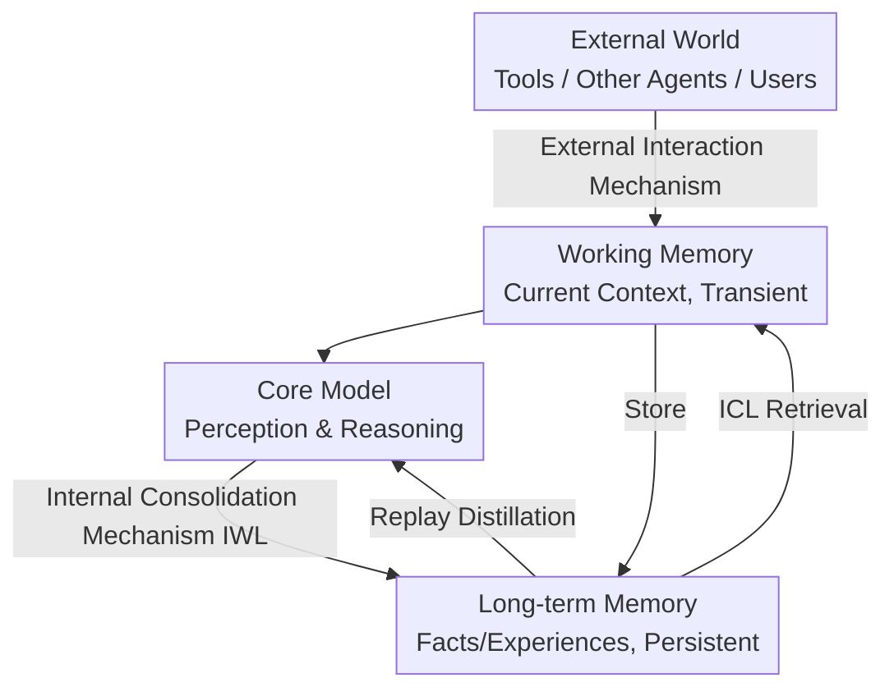

# Position: Modular Memory is the Key to Continual Learning Agents

**Conference**: ICML 2026  
**arXiv**: [2603.01761](https://arxiv.org/abs/2603.01761)  
**Code**: None (Position/Roadmap paper)  
**Area**: Continual Learning Agent / Memory Architecture  
**Keywords**: Continual Learning, Modular Memory, In-Context Learning, In-Weight Learning, Consolidation

## TL;DR
This is a position paper from the Dagstuhl Continual Learning workshop arguing that relying solely on In-Weight Learning (IWL) leads to catastrophic forgetting, while relying solely on In-Context Learning (ICL) causes computational explosion and rigid foundations. The missing piece for "continual learning agents" is a **modular memory** that integrates the fast adaptation of ICL with the slow consolidation of IWL (Core Model + Working Memory + Long-term Memory, plus sleep-like offline consolidation).

## Background & Motivation
**Background**: Continual Learning (CL) has focused for decades on In-Weight Learning (IWL)—constantly updating a monolithic model's parameters to absorb new knowledge. In the era of foundation models, In-Context Learning (ICL) emerged—using attention mechanisms to inject additional information (raw inputs, retrieved/learned embeddings) to modulate outputs. Most LLM agents expand context windows or build memory systems to store interaction history, assuming a **frozen** base model.

**Limitations of Prior Work**: Both paths have fatal flaws. Frequent weight updates in pure IWL lead to **catastrophic forgetting**, unstable optimization, and loss of plasticity, which is one of the hardest problems in machine learning. Pure ICL seems to bypass forgetting, but **over-reliance on long contexts leads to computational explosion**, with performance degrading as context length grows. Furthermore, frozen base models cannot adapt to fundamental distribution shifts or evolving user needs.

**Key Challenge**: The classic tension between fast adaptation (plasticity) and stable retention (stability) is handled in a "biased" manner by current paradigms—either fast but unstable (IWL forgets upon weight changes) or stable but non-learning (ICL freezes the base). Even recent works combining RAG with periodic fine-tuning suffer from memory that grows unprincipled and session-locally; multimodal information is lost when compressed to text summaries, and parameter updates still rely on standard next-token prediction, remaining prone to memorization and forgetting.

**Goal**: To unify the complementary strengths of ICL and IWL under a **modular memory architecture**—Core Model (Pre-trained) + Working Memory (Current Context) + Long-term Memory (Fast Adaptation and Knowledge Accumulation). Long-term memory is **distilled** into the core model through stable, low-frequency updates (to counter forgetting). The objective is not rote memorization but rather achieving higher-level generalization and incremental improvement from accumulated experience.

**Key Insight**: Borrowing from the human brain's memory stack (sensory memory / working memory / long-term memory, with hippocampal fast learning + cortical slow learning + sleep-based replay consolidation) and computer storage hierarchies (registers/cache/DRAM/secondary storage + write-back/eviction/prefetch/telemetry strategies). Both prove that "modularity + multiple time scales + active management" allow continual learning to be both fast and stable.

**Core Idea**: Use a dual mechanism of "Fast (ICL, Long-term + Working Memory) + Slow (IWL, Core Model Consolidation)" paired with a three-module memory, transforming adaptation from "modifying a monolithic model" to "managing a specialized memory system."

## Method
> This is a position/roadmap paper. The "method" refers to its proposed **conceptual framework** rather than a runnable algorithm. It is organized below by framework components, operational mechanisms, and memory design space.

### Overall Architecture
The framework consists of three core components plus an external environment: the **Core Model** (Perception and Reasoning, pre-trained and refined by consolidation), **Working Memory** (temporarily storing information relevant to the current interaction, finite capacity, and transient), **Long-term Memory** (persistently storing facts/events/personalized experiences, supporting retrieval, updates, forgetting, and consolidation), and the **External World** (tools and other agents) that can be queried. The system toggles between two mechanisms: the **External Interaction Mechanism** (environment-driven, responding to external signals and retrieving from long-term memory as needed) and the **Internal Consolidation Mechanism** (self-driven, replaying long-term memory to distill useful information into the core model in the absence of external stimuli—analogous to sleep). Two learning pathways run in parallel: long-term/working memory uses ICL for fast adaptation (no core parameter changes), while the core model uses IWL for sparse updates during consolidation phases.

### Key Designs

**1. Fusion of ICL × IWL Dual Learning Mechanisms: Complementary Fast and Slow**

This is the central stance of the paper. The pain point is the bias in current paradigms: IWL updates weights quickly but forgets; ICL fills context stably but is expensive and rigid. The authors advocate binding them together—**ICL** does not strictly mean "feeding raw data as input" but refers to attention mechanisms using extra embeddings (past experiences, examples, task info) to modulate outputs layer by layer, achieving few-shot fast adaptation without core parameter changes. **IWL** is then used only during consolidation to sparsely distill information from long-term memory into core parameters for incremental capability enhancement. Because parameter updates are "low-frequency + backed by long-term memory + coordinated with consolidation," classic IWL issues like catastrophic forgetting and loss of plasticity are naturally mitigated. This mirrors the human brain: hippocampal fast encoding and cortical slow consolidation via replay.

**2. Three-Module Memory Architecture: Structural Separation of "Fast Adaptation" and "Slow Integration"**

To break the fundamental dilemma where a monolithic model must be both fast and stable, the authors propose a separation of concerns: the core model handles general perception/reasoning/tool use and can run independently of long-term memory; working memory determines the current system state using external signals (instructions, demonstrations, sensory inputs) and internal signals (retrieved long-term memory, intermediate reasoning traces, implicit planning states) to condition the core model; long-term memory handles persistence and accumulation across contexts, supporting retrieval, updates, forgetting, and consolidation. This division follows two organizational principles of the brain's memory stack—**modularity** (different modules use different representation formats with active gating) and **complementarity** (fast learning systems for pattern-separated episodic representations and slow learning systems for structural, generalizable knowledge).

**3. Dual Operational Mechanisms + Control Strategy: Sleep-like Switching between Interaction and Consolidation**

Modules alone are insufficient; rules for "when to retrieve and when to consolidate" are required. Under the external interaction mechanism, signals are encoded into working memory → core mechanisms implicitly determine processing strategies (whether to retrieve from LTM, how much compute to allocate to the input, such as test-time scaling) → retrieve experiences into working memory for grounding when necessary → generate responses and decide how to write back to long-term memory. The internal consolidation mechanism is **triggered sparsely after accumulating sufficient experience**: the model replays long-term memory, distilling useful info into the core model (refining old abilities, acquiring new skills), while long-term memory itself undergoes refinement, compression, graceful forgetting, and reorganization to expose generalizable structures. Control strategies can be heuristic (capacity thresholds, periodic, event-triggered) or learned; the author notes that metacognitive autonomous control remains an orthogonal open problem.

**4. Memory Design Space: Trade-offs in Representation × Organizational Function**

The authors present two main axes for designing memory modules. The **Representation Dimension** distinguishes between slot-based (each memory independently addressable: raw data / embeddings like activations, KV cache, learned codes) and distributed neural memory (information across shared parameters, no discrete boundaries, retrieval via implicit forward propagation). These involve trade-offs in storage efficiency, capacity, modality, update speed, interference risk, selective forgetting, retrieval cost, and generalization (see table below). The **Organization and Function Dimension** revolves around "when/what to store, when/what to forget, and when/how to retrieve": updates can be triggered by capacity thresholds/event signals/learned strategies; forgetting can follow temporal rules (FIFO), importance heuristics (retrieval frequency, cumulative attention), or learned strategies (predicting future utility); retrieval ranges from "every time" to selective triggering based on uncertainty or explicit requests. Core model consolidation relies on IWL, for which the authors suggest three remedies: store compressed codes instead of raw traces, use stable/specialized/modular architectures to localize updates, and use objectives that encourage generalization while reducing forgetting (e.g., on-policy distillation/RL has been found to cause less forgetting than SFT).

### A Complete Example: From One Interaction to One Consolidation
Consider a long-term online personalized assistant. A user asks a question, initiating the **external interaction mechanism**: the question is encoded into working memory; the control mechanism determines this requires personal preferences and retrieves the experience that "this user preferred concise answers last week" from long-term memory to inject into working memory (ICL fast adaptation, no parameter changes) → the core model generates a concise response → the system writes the interaction and the lack of further user follow-up back to long-term memory. After accumulating thousands of such rounds, the **internal consolidation mechanism** triggers during idle time: the model replays this long-term memory, distilling stable patterns like "this user consistently prefers concise, technical content" into core parameters via IWL (so retrieval is not needed every time), while long-term memory compresses redundant episodes and gracefully forgets outdated preferences. The fast path (ICL) ensures immediate personalization, while the slow path (IWL) ensures capability sedimentation and avoids forgetting through low-frequency updates.

## Key Experimental Results
> As a position paper, there are no experiments. Below is a summary of the comparative evaluation of **memory representations** (Sec. 4.1 / Table 1 desiderata) and the characterization of the two learning mechanisms.

### Memory Representation Comparison (Desiderata Evaluation)

| Memory Type | Storage per item | Capacity | Update Speed | Interference Risk | Selective Forgetting | Generalization |
|------|------|------|------|------|------|------|
| Slot (Raw Data) | Low (Verbatim) | Unbounded | Fast | Low | Easy (Delete slot) | Limited |
| Slot (Embedding) | Medium | Unbounded | Fast | Low | Easy | Implicit (Learned code) |
| Distributed Neural | High (Shared) | Bounded | Slow/Fast | High | Normal (Entangled) | Explicit (Optimization) |

Key point: Slot-based capacity is unbounded and selective forgetting is easy, but retrieval costs grow with the number of items and generalization is weaker. Neural memory is compact with $O(1)$ retrieval and strong generalization, but high interference leads to forgetting and precise deletion is difficult. There is no one-size-fits-all design; trade-offs in fidelity/efficiency/generalization must be made based on the scenario.

### Positioning of the Two Learning Mechanisms

| Mechanism | Targeted Module | Speed | Main Risk | Brain Analog |
|------|------|------|------|------|
| ICL (In-Context) | Working + Long-term | Fast, no core change | Context compute explosion | Hippocampal episodic encoding |
| IWL (In-Weight) | Core Model (Consolidation) | Slow, low-frequency | Forgetting / Instability | Cortical slow consolidation |

### Key Findings
- The missing piece is not stronger ICL or stronger IWL, but **fusing both via modular memory**—this is the central position emphasized throughout.
- Human brains (modularity + multiple time scales + active gating) and computer storage (hierarchy + explicit management + telemetry) both point to treating memory as an **actively managed finite resource**, rather than an implicitly infinite buffer.
- Consolidation should be triggered at low frequency, store compressed codes, and use on-policy objectives to refine capabilities while avoiding forgetting.

## Highlights & Insights
- **Reframing CL as "Memory System Design"**: Instead of struggling with "how to make a monolithic model learn new things without forgetting old ones," the focus shifts to "how to divide labor between fast and slow memory modules." This perspective shift is highly valuable.
- **Solid Interdisciplinary Anchors**: Both the human brain's memory stack and computer storage hierarchies prove that "modularity + multi-time-scale + active management" works, preventing the position from being vacuous.
- **Precise Definition of ICL**: Clarifying that ICL refers to the layer-wise modulation of the core model by additional embeddings (rather than just "feeding raw data as input") turns the vague "context learning" into a designable mechanism.
- **Desiderata Table**: Systematically listing eight attributes for slot-based vs. neural memory serves as a practical checklist for future memory module design.
- **Sleep-style Offline Consolidation**: Aligning "idle-period replay distillation" with human sleep consolidation provides a natural, low-interference answer to the question of "when to perform IWL updates."

## Limitations & Future Work
- As a position paper, the framework is conceptual. There is no runnable implementation or experimental validation; the claim that "modular memory solves continual learning" remains an unproven assertion.
- Control strategies (when to retrieve/consolidate/forget) are candidly left as orthogonal open problems—yet these are precisely the keys to an autonomous system. Metacognitive learning, long-range credit assignment, and objective design have no answers yet.
- Technical challenges like unified representations for multimodal memory and memory transfer across agents (KV caches cannot be read directly across models; neural memory requires model merging) are identified as directions but lack solutions.
- Specific values for consolidation frequency, capacity thresholds, and forgetting strategies are highly application-dependent, lacking an operational "default recipe."

## Related Work & Insights
- **vs. Traditional Continual Learning (Rehearsal / Regularization / Pseudo-replay)**: Traditional CL treats memory as a "buffer to mitigate forgetting during training." This paper elevates memory to a first-class component of inference and explicitly introduces the ICL fast path.
- **vs. Pure ICL LLM Agent Memory Systems**: Those systems freeze the backbone and rely solely on external memory + ICL. This paper points out that this merely shifts forgetting to the memory components (unbounded slot growth / aggressive compression / neural interference) and argues for IWL-based consolidation of the core model.
- **vs. RAG + Periodic Fine-tuning (e.g., Liu et al. 2025)**: Those works use session-local memory, unprincipled growth, and compress multimodality to text. Updates via next-token prediction remain prone to forgetting. This paper demands principled cross-session abstraction, compressed code consolidation, and true continual learning evaluation.

## Rating
> ⚠️ This is a qualitative assessment of the paper's role as a research agenda, rather than a performance-based rating.
- Novelty: ⭐⭐⭐⭐ The perspective of a modular memory framework fusing ICL/IWL is clear, though individual components are mostly integrations of existing ideas.
- Experimental Thoroughness: ⭐⭐⭐⭐ Arguments across brain/computer/CL literature are solid, and the desiderata tables are useful.
- Writing Quality: ⭐⭐⭐⭐⭐ Clear structure, precise definitions, and appropriate biological analogies.
- Value: ⭐⭐⭐⭐⭐ Significant for setting the agenda by providing a feasible roadmap for continual learning agents.

<!-- RELATED:START -->

## Related Papers

- [\[ICLR 2026\] PolySkill: Learning Generalizable Skills through Polymorphic Abstraction for Continual Agents](../../ICLR2026/llm_agent/polyskill_learning_generalizable_skills_through_polymorphic_abstraction_for_cont.md)
- [\[ICML 2026\] Position: Assistive Agents Need Accessibility Alignment](position_assistive_agents_need_accessibility_alignment.md)
- [\[CVPR 2026\] CGL: Advancing Continual GUI Learning via Reinforcement Fine-Tuning](../../CVPR2026/llm_agent/cgl_advancing_continual_gui_learning_via_reinforcement_fine-tuning.md)
- [\[ICML 2026\] From Player to Master: Enhancing Test-Time Learning of LLM Agents via Reinforcement Learning over Memory](from_player_to_master_enhancing_test-time_learning_of_llm_agents_via_reinforceme.md)
- [\[ICLR 2026\] Scaling Agents via Continual Pre-training](../../ICLR2026/llm_agent/scaling_agents_via_continual_pre-training.md)

<!-- RELATED:END -->
