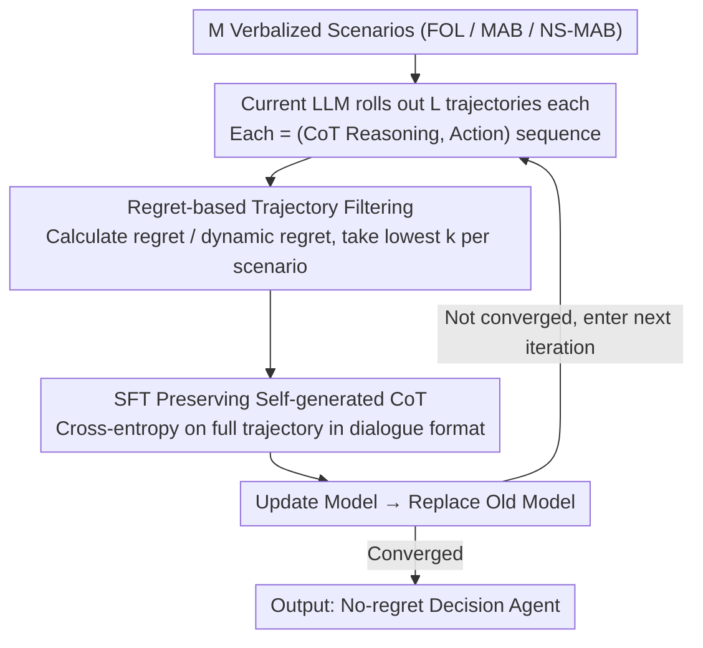

# Post-Training LLMs as Better Decision-Making Agents: A Regret-Minimization Approach

**Conference**: ICML 2026  
**arXiv**: [2511.04393](https://arxiv.org/abs/2511.04393)  
**Code**: Not yet public  
**Area**: LLM Agent / Online Decision Making / Post-training  
**Keywords**: Regret minimization, Iterative SFT, Online decision making, Multi-armed bandits, Self-generated reasoning

## TL;DR
The authors propose Iterative RMFT, which ranks decision trajectories rolled out by the LLM from lowest to highest regret. The top $k$ optimal trajectories are selected for repeated fine-tuning using SFT. Without depending on known optimal algorithms (e.g., UCB/FTRL) or manually designed CoT templates, this approach allows no-regret behavior and a reasonable exploration-exploitation balance to automatically emerge in LLMs across three types of verbalized decision tasks: multi-armed bandits, online learning, and non-stationary bandits.

## Background & Motivation

**Background**: Deploying LLMs as decision-making agents in multi-round interactive environments (recommendation, gaming, healthcare, operations) has become a prominent trend. However, the pre-training objective of LLMs is next-token prediction, which is not explicitly optimized for online decision-making; thus, there is no theoretical guarantee as to why LLMs can make good decisions.

**Limitations of Prior Work**: A series of empirical studies indicates that LLMs without targeted training fail at fundamental online decision problems: they are reluctant to explore in stochastic MAB, exhibit linear regret growth in adversarial online learning, and fail to track reward drifts in non-stationary environments. In other words, out-of-the-box LLMs are not no-regret learners even on "textbook" tasks.

**Key Challenge**: Among existing LLM post-training methods, two main routes attempt to fix this:
One is "algorithm distillation," which distills action sequences from known optimal algorithms (e.g., UCB, EXP3) into the LLM. This requires prior knowledge of the environment's optimal algorithm, and the trained models are sensitive to problem structures like action space size, time horizon, and reward distribution, often failing when transferred to new verbalized tasks. The other is RL fine-tuning, but using rewards directly as signals only solves reward maximization and does not naturally include exploration incentives, nor can it be directly applied to adversarial or non-stationary settings.

**Goal**: To find a unified post-training paradigm that does not rely on known optimal algorithms, improves LLM decision-making capabilities in verbalized tasks, and simultaneously preserves and enhances the LLM's CoT reasoning process.

**Key Insight**: The authors note that regret is a highly versatile metric in online decision-making—FOL, MAB, and NS-MAB can all be characterized by regret or dynamic regret—and it can be calculated post-hoc once a decision trajectory is obtained. Since an LLM can calculate regret after rolling out its own trajectory, regret can serve as a "post-hoc judge" to filter which self-generated trajectories are worth SFT.

**Core Idea**: Use regret as the sole signal for trajectory filtering and repeatedly distill the low-regret trajectories generated by the LLM back into itself (self-imitation). This allows no-regret behavior to "emerge" rather than being forced in.

## Method

### Overall Architecture
Iterative RMFT is a meta-algorithm: the same outer loop can be applied to three online decision environments: FOL (Full-information Online Learning), MAB (Multi-Armed Bandits), and NS-MAB (Non-Stationary Bandits). In one outer iteration, the LLM rolls out $L$ trajectories for each of $M$ different scenarios (verbally described decision tasks). Each trajectory consists of several (CoT reasoning, action) pairs with interaction in natural language. After the trajectories are completed, cumulative regret is calculated. The $k$ trajectories with the lowest regret from each scenario are selected to form the SFT dataset $\mathcal{D}$, and the model is updated using the standard SFT loss. The new model replaces the old one for the next round, cycling until convergence. The essence of this paradigm is that the training signal is only the scalar of regret, making no assumptions about action formats, CoT templates, or optimal algorithms, while the model's inherent reasoning is preserved and reinforced.

### Key Designs

**1. Regret-based Trajectory Filtering: Unifying Evaluation and Data Generation with a Scalar**

As mentioned, LLMs are not no-regret learners in classic online decision tasks, and fixing this without relying on optimal algorithms is difficult. The authors' entry point is that regret is a universal metric for online decision-making. Once a complete trajectory is obtained, regret can be calculated post-hoc, allowing it to serve both as an "evaluation metric" and a "filter for SFT data." Specifically, for each scenario $i$, $L$ trajectories $C_{1,i}, \dots, C_{L,i}$ are rolled out. After each, regret is calculated—static regret $\text{Regret}_\mathcal{A}((R_t)_{t\in[T]}, T) = \max_{\pi\in\Pi} \sum_t \langle \pi, R_t\rangle - \sum_t \langle \pi_{\mathcal{A}, t}, R_t\rangle$ for FOL, expected regret for MAB, and dynamic regret $\text{D-Regret} = \mathbb{E}[\sum_t \max_a r_t(a) - \sum_t r_t(a_{\mathcal{A},t})]$ for NS-MAB. The $k$ trajectories with the lowest regret (in ascending order) are added to $\mathcal{D}$. This selection works because regret does not depend on whether the optimal algorithm is known, nor on action space size or horizon, naturally supporting training across tasks and problem structures. Moreover, filtering occurs at the trajectory level rather than the token level, automatically preserving the full CoT and avoiding the difficult reward-credit-assignment problem in RL.

**2. SFT Preserving Self-generated CoT: Updating via Self-Imitation instead of RL**

If output formats are forced as in algorithm distillation, or if only rewards are used as token-level signals as in RLFT, the model's free reasoning is flattened, and regret in adversarial/non-stationary settings cannot be captured. The authors use the simplest approach: treating selected trajectories in their full dialogue format (task description + historical interaction + reasoning + action) as SFT samples. Standard cross-entropy loss is applied to each token without introducing a reward model, token-level RL, or forcing the CoT into a fixed template. Consequently, all natural language parts (reasoning + actions) become supervision targets. The model "imitates its own most successful decision-making instances." This offers three benefits: direct utilization of closed-source APIs (like GPT-4o mini's fine-tune interface), no constraints on CoT form, and the emergence of new "algorithmic style" reasoning, leading to better generalization than forced templates.

**3. Cross-Environment Meta-algorithm Instantiation: One Signal for FOL / MAB / NS-MAB**

To prove the universality of the regret signal, the same outer loop must work across three typical environments, with differences only in regret calculation and feedback completeness. FOL uses the full-information reward vector $R_t$ to evaluate each action; MAB only has partial feedback $R_t(a_t)$ and takes expectations over randomness; NS-MAB additionally introduces a variation budget $V_T = \sum_{t=2}^T \|r_t - r_{t-1}\|_\infty$ and uses dynamic regret as the filtering criterion. The scenario library consists of verbalized tasks (healthcare recommendation, resource allocation, marketing, etc.), where each scenario is translated into natural language dialogue each round. The agent outputs an action + CoT, and a program parses $a_t$ or $\pi_t \in \Delta(\mathcal{A})$ from the output. The fact that a single signal covers all three environments is empirical evidence of the universal nature of regret. Furthermore, the authors randomized scenarios extensively (horizon, action space, reward generation, domain context), forcing the model to learn general decision strategies rather than memorizing lookup tables for specific horizons.

### Loss & Training
The inner layer is standard SFT: minimizing cross-entropy on tokens of selected trajectories without additional regularization. The number of outer iterations and the parameters $k$, $L$, and $M$ for each round are hyperparameters. Theoretically, the authors prove in a simplified 1-layer attention Transformer setting that the fixed point of this "iterative imitation of lowest regret trajectories" corresponds to the FTRL algorithm. Thus, no-regret behavior is induced by this paradigm in the theoretical model rather than being a coincidence.

## Key Experimental Results

### Main Results
The study covers three types of models: (1) Small Transformers with numerical I/O as a controlled warm-up; (2) Open-source LLMs: Phi-3.5-mini, Gemma-2-9b-it, Qwen3-8B; (3) Closed-source LLMs: GPT-4o mini, trained via its SFT API.

| Environment | Model Type | Pre-training Behavior | After Iterative RMFT |
|------|----------|-----------|------------------|
| FOL (Verbalized) | Open-source LLMs (Phi-3.5 / Gemma-2-9b / Qwen3-8B) | Linear regret growth, $\hat\beta \approx 1$ | $\hat\beta < 1$, significant $p_{\text{reg}}$, sublinear regret observed |
| MAB (Verbalized) | GPT-4o mini | High SuffFailFreq, reluctant to explore | Significant drop in SuffFailFreq, MinFrac increase, more uniform exploration |
| NS-MAB (Verbalized) | Open-source LLMs + GPT-4o mini | Dynamic regret cannot track drift | Dynamic regret growth slows down; can switch arms after reward drift |
| FOL (Numerical Transformer) | Single/Multi-layer attention | No no-regret guarantee at default initialization | $\hat\beta < 1$ after training, close to FTRL baseline |

### Ablation Study

| Configuration | Key Metric | Description |
|------|---------|------|
| Iterative RMFT (Full) | Sublinear regret growth; Exploration-exploitation balance | Complete method |
| RMFT 1-round only (Non-iterative) | Improved regret but still near linear | Single-round SFT insufficient to "amplify" low-regret behavior; iteration is key |
| Filtering with reward (instead of regret) | Regret bounces back in FOL/NS-MAB | Validates that cumulative reward maximization $\neq$ regret minimization, especially in adversarial/non-stationary settings |
| Removing self-generated CoT (SFT actions only) | Cross-scenario generalization performance drops | Self-generated reasoning is key for the model to maintain no-regret in new scenarios |
| Cross-task Generalization (Train FOL, Test MAB / change horizon, actions, reward dist) | Maintains sublinear regret | Indicates the model learns general decision strategies rather than patterns for a specific horizon |

### Key Findings
- Regret is a better post-training signal than reward: Reward might suffice in stochastic environments, but in adversarial/non-stationary settings, cumulative reward maximization is not equivalent to regret minimization, leading to model degradation.
- Self-generated CoT is the key source of generalization: Forcing the removal of CoT and only performing SFT on action tokens during training leads to collapse when scenarios change (e.g., changes in reward description or domain). Preserving self-generated reasoning allows for cross-task transfer.
- Iteration is mandatory: A single RMFT can only lower regret slightly; multiple iterations gradually amplify the minority of low-regret behavior modes into the model's default behavior.
- Theoretical evidence: In a simplified setting with 1-layer attention Transformers, the fixed point of "imitating the lowest regret trajectory" is FTRL, suggesting that no-regret behavior is a natural attractor for this paradigm.

## Highlights & Insights
- Treating regret as a "post-hoc judge" rather than a "training loss" bypasses the difficulty of direct backpropagation for regret in token-level autoregressive generation. This is a very clever way to migrate classic online learning tools to LLM training.
- Using SFT instead of RL makes the method naturally compatible with closed-source fine-tune APIs (like GPT-4o mini), significantly lowering the barrier for deployment from an engineering perspective—something most RLHF/RLFT works cannot achieve.
- The theoretical result that "self-imitation converges to FTRL" provides a specific limit property for "why this self-distillation emerges no-regret behavior," beyond just empirical observation.
- Transferable logic: Any task where a full trajectory can be evaluated post-hoc by a scalar metric (multi-turn tool calling, code agent, game playing) can adopt the "rollout → rank by metric → top-$k$ self-SFT → iteration" paradigm by replacing regret with task-relevant metrics.

## Limitations & Future Work
- The authors acknowledge that training APIs for closed-source models like GPT-4o mini lack full hyperparameter control, and training costs grow linearly with the number of scenarios and iterations.
- Theoretical results are limited to simplified 1-layer attention settings; whether self-imitation still converges to no-regret algorithms on multi-layer Transformers remains an open question.
- Evaluation still focuses on canonical online DM tasks; truly complex verbal decision-making (e.g., multi-step tool use + long context) only covers variant scenarios and hasn't been tested on end-to-end agent benchmarks.
- Sorting by regret requires calculating regret post-hoc, which necessitates either an oracle optimal strategy or full reward feedback. For many real-world scenarios (like RLHF-style human preference feedback), the problem of "how to define regret" must be solved first.
- Future improvements: Replacing regret estimation with "relative gap estimation from the optimal strategy" provided by an LLM-as-judge could extend this paradigm to real tasks without an oracle. Alternatively, replacing SFT with DPO for preference optimization between "low-regret vs high-regret trajectories" could improve sample efficiency.

## Related Work & Insights
- **vs Nie et al. 2025 (Algorithm Distillation)**: They distill action sequences of known optimal algorithms (e.g., UCB); this paper does not rely on known optimal algorithms and filters self-generated trajectories via regret, providing better generalization.
- **vs Schmied et al. 2026 (RLFT)**: Both use self-generated CoT, but RLFT uses reward as a signal and relies on UCB-style manual CoT templates. This paper uses regret and does not constrain CoT format, covering adversarial and non-stationary environments.
- **vs Park et al. 2025b (regret-loss)**: They directly backpropagate regret as a loss to numerical Transformers to obtain FTRL; this paper extends that idea from "explicitly optimizing regret" to "filtering trajectories with regret for SFT," making it applicable to verbalized I/O and closed-source LLMs.
- **vs General RLHF / RLAIF**: The training goal of RLHF is reward maximization rather than regret minimization, and it usually doesn't explicitly incentivize exploration. This paper demonstrates that for decision tasks, regret is a more suitable training signal than reward.

<!-- RELATED:START -->

## Related Papers

- [\[ACL 2025\] R2D2: Remembering, Replaying and Dynamic Decision Making with a Reflective Agentic Memory](../../ACL2025/llm_agent/r2d2_reflective_agentic_memory.md)
- [\[ACL 2026\] MemSearcher: Training LLMs to Reason, Search and Manage Memory via End-to-End RL](../../ACL2026/llm_agent/memsearcher_training_llms_to_reason_search_and_manage_memory_via_end-to-end_rein.md)
- [\[ICML 2026\] SafeHarbor: Defining Precise Decision Boundaries via Hierarchical Memory-Augmented Guardrail for LLM Agent Safety](safeharbor_hierarchical_memory-augmented_guardrail_for_llm_agent_safety.md)
- [\[ACL 2025\] LLM Agents Making Agent Tools](../../ACL2025/llm_agent/llm_agents_making_agent_tools.md)
- [\[AAAI 2026\] MoralReason: Generalizable Moral Decision Alignment For LLM Agents Using Reasoning-Level Reinforcement Learning](../../AAAI2026/llm_agent/moralreason_generalizable_moral_decision_alignment_for_llm_agents_using_reasonin.md)

<!-- RELATED:END -->
