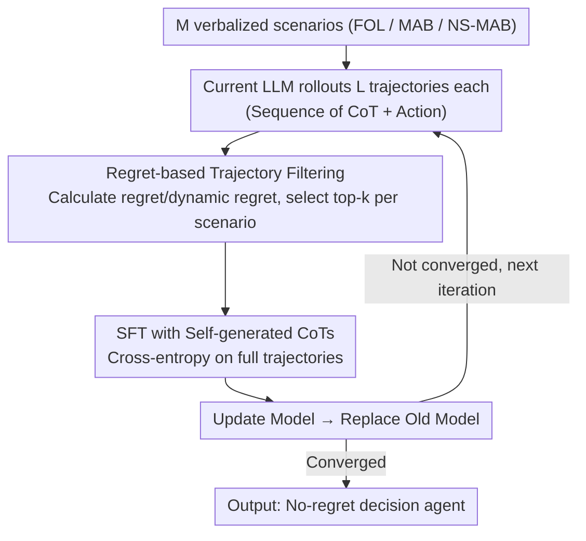

# Post-Training LLMs as Better Decision-Making Agents: A Regret-Minimization Approach

**Conference**: ICML 2026  
**arXiv**: [2511.04393](https://arxiv.org/abs/2511.04393)  
**Code**: Not yet released  
**Area**: LLM Agent / Online Decision Making / Post-training  
**Keywords**: Regret Minimization, Iterative SFT, Online Decision Making, Multi-Armed Bandits, Self-generated Reasoning

## TL;DR
The authors propose Iterative RMFT, which ranks decision trajectories rolled out by the LLM itself based on regret from low to high. The top $k$ optimal trajectories are selected for iterative SFT. This approach allows LLMs to automatically emerge with no-regret behavior and a reasonable exploration-exploitation balance across three types of verbalized decision tasks—Multi-Armed Bandits (MAB), online learning, and non-stationary bandits—without relying on known optimal algorithms (e.g., UCB/FTRL) or manually designed CoT templates.

## Background & Motivation

**Background**: Deploying LLMs as decision-making agents in multi-round interactive environments (recommendation, gaming, healthcare, operations) is a clear trend. However, the pre-training objective of LLMs is next-token prediction, which is not explicitly optimized for online decision-making. Thus, there is no theoretical guarantee for "why LLMs can make good decisions."

**Limitations of Prior Work**: Empirical studies show that LLMs without targeted training fail at fundamental online decision problems: they are reluctant to explore in stochastic MAB, exhibit linear regret growth in adversarial online learning, and fail to track reward drifts in non-stationary environments. In other words, out-of-the-box LLMs are not no-regret learners even on "textbook" tasks.

**Key Challenge**: Traditional LLM post-training methods follow two main paths to address this:
One is "algorithm distillation"—distilling action sequences of known optimal algorithms (e.g., UCB, EXP3) into the LLM. However, this requires prior knowledge of the optimal algorithm and results in models sensitive to problem structures like action space size, time horizon, and reward distribution, often failing when transferred to verbalized new tasks. The other is RL fine-tuning; however, using rewards directly as signals only solves reward maximization, which does not naturally include exploration incentives and cannot be directly applied to adversarial or non-stationary settings.

**Goal**: To find a unified post-training paradigm that enhances LLM decision-making capabilities in verbalized tasks without relying on known optimal algorithms, while preserving and strengthening the CoT reasoning process.

**Key Insight**: The authors observe that regret is a universal metric in online decision-making—Full-Information Online Learning (FOL), MAB, and NS-MAB can all be characterized by regret/dynamic regret—and it can be calculated post-hoc once a trajectory is obtained. Since the LLM can calculate regret after rolling out its own trajectories, regret can serve as a "post-hoc judge" to filter which self-generated trajectories are worth SFT.

**Core Idea**: Use regret as the sole trajectory filtering signal to iteratively distill low-regret trajectories generated by the LLM into itself (self-imitation). This allows no-regret behavior to "emerge" rather than being forced into the model.

## Method

### Overall Architecture
Iterative RMFT is a meta-algorithm: the same outer loop applies to FOL, MAB, and NS-MAB environments. In one outer iteration, the LLM rollouts $L$ trajectories for $M$ different verbalized scenarios. Each trajectory consists of (CoT reasoning, action) pairs in natural language. After trajectories are completed, cumulative regret is calculated. The $k$ trajectories with the lowest regret from each scenario form the SFT dataset $\mathcal{D}$, used to update the model via standard SFT loss. The new model replaces the old one for the next round until convergence. The essence of the paradigm is that the only training signal is the scalar regret; it assumes nothing about action formats, CoT templates, or optimal algorithms, while model reasoning is preserved and reinforced.

### Key Designs

**1. Regret-based Trajectory Filtering: Unifying Evaluation and Data Generation with a Scalar**

As mentioned, LLMs are not no-regret learners on classic tasks. To fix this without optimal algorithms, the authors use regret as the universal metric. It acts as both an evaluation metric and an SFT data filter. Specifically, for scenario $i$, $L$ trajectories $C_{1,i}, \dots, C_{L,i}$ are generated, and regret is calculated post-hoc. For FOL, static regret $\text{Regret}_\mathcal{A}((R_t)_{t\in[T]}, T) = \max_{\pi\in\Pi} \sum_t \langle \pi, R_t\rangle - \sum_t \langle \pi_{\mathcal{A}, t}, R_t\rangle$ is used; for MAB, expected regret; for NS-MAB, dynamic regret $\text{D-Regret} = \mathbb{E}[\sum_t \max_a r_t(a) - \sum_t r_t(a_{\mathcal{A},t})]$. The top $k$ trajectories with the lowest regret enter $\mathcal{D}$. This logic works because regret does not depend on whether the optimal algorithm is known or the specific horizon, supporting cross-task training naturally. Filtering at the trajectory level instead of the token level preserves the full CoT and bypasses the reward-credit-assignment problem in RL.

**2. CoT-preserving SFT: Updating the Model via Self-Imitation instead of RL**

If output formats are forced (algorithm distillation) or signals are token-level rewards (RLFT), free-form reasoning is flattened, and regret in adversarial settings cannot be captured. The authors use the simplest approach: treat selected trajectories as SFT samples in dialogue format (Task Description + Interaction History + Reasoning + Action) using standard cross-entropy loss. There is no reward model, no token-level RL, and no fixed CoT template. The model "imitates its own most successful decisions." This approach allows the use of closed-source APIs (e.g., GPT-4o mini fine-tuning), does not constrain CoT form, and allows the emergence of new "algorithmic-style" reasoning, leading to better generalization.

**3. Meta-algorithm Instantiation across Environments: Covering FOL / MAB / NS-MAB**

To prove the universality of the regret signal, the same outer loop is applied to three environments. FOL uses the full reward vector $R_t$; MAB uses partial feedback $R_t(a_t)$; NS-MAB introduces violation budget $V_T = \sum_{t=2}^T \|r_t - r_{t-1}\|_\infty$ and dynamic regret. Scenarios are verbalized (medical recommendation, resource allocation, etc.). The agent outputs actions and CoT, and $a_t$ or $\pi_t \in \Delta(\mathcal{A})$ is parsed. The success of a single signal across these environments provides empirical evidence for the universality of regret. Extensive randomization in scenario dimensions (horizon, action space, reward generation, context) ensures the model learns general decision strategies rather than lookup tables for specific horizons.

### Loss & Training
The inner loop is standard SFT: minimize cross-entropy on selected trajectory tokens without additional regularization. Outer iteration counts and $k, L, M$ are hyperparameters. On the theoretical side, the authors prove in a simplified single-layer attention Transformer setting that the fixed point of this "iterative imitation of lowest regret trajectories" corresponds to the FTRL algorithm, suggesting that no-regret behavior is induced by this paradigm rather than being a coincidence.

## Key Experimental Results

### Main Results
Three model types were covered: (1) Small numerical Transformers for warm-up; (2) Open-source LLMs: Phi-3.5-mini, Gemma-2-9b-it, Qwen3-8B; (3) Closed-source LLM: GPT-4o mini via SFT API.

| Environment | Model Type | Pre-training Behavior | After Iterative RMFT |
|------|----------|-----------|------------------|
| FOL (Verbalized) | Open-source LLMs | Linear regret growth, $\hat\beta \approx 1$ | $\hat\beta < 1$, significant $p_{\text{reg}}$, sublinear regret |
| MAB (Verbalized) | GPT-4o mini | High SuffFailFreq, reluctant to explore | Significant SuffFailFreq decrease, MinFrac increase, uniform exploration |
| NS-MAB (Verbalized) | Open/Closed LLMs | Dynamic regret fails to track drift | Slower growth in dynamic regret, switches arms after reward drift |
| FOL (Numerical Trans.) | Single/Multi-layer Attention | No no-regret guarantee at init | $\hat\beta < 1$ after training, close to FTRL baseline |

### Ablation Study

| Configuration | Key Metric | Description |
|------|---------|------|
| Iterative RMFT (Full) | Sublinear regret growth; Exploration balance | Full method |
| 1-round RMFT (Non-iterative) | Improved regret but still near-linear | Single SFT round is insufficient to "amplify" low-regret behavior; iteration is key |
| Filtering by Reward (not Regret) | Regret rebounds in FOL/NS-MAB | Verifies cumulative reward maximization $\neq$ regret minimization in adversarial/non-stationary settings |
| Removing self-CoT (Action only) | Decreased cross-scenario generalization | Self-generated reasoning is key for no-regret in new scenarios |
| Cross-task generalization (Train FOL, Test MAB/Diff. Horizon) | Maintains sublinear regret | Learns general decision strategies rather than fixed-horizon patterns |

### Key Findings
- Regret is a better post-training signal than reward: Reward may suffice in stochastic settings, but in adversarial/non-stationary settings, cumulative reward maximization is not equivalent to regret minimization, leading to model degradation.
- Self-generated CoT is the source of generalization: Removing CoT for action-only SFT causes model failure when scenarios change. Preserving reasoning enables cross-task transfer.
- Iteration is mandatory: Single RMFT only slightly reduces regret; multiple iterations amplify low-regret behavioral patterns into the model's default behavior.
- Theoretical evidence: In simplified single-layer attention settings, "imitating the lowest regret trajectory" has FTRL as a fixed point, indicating no-regret behavior is a natural attractor.

## Highlights & Insights
- Using regret as a "post-hoc judge" rather than a "training loss" bypasses the difficulty of backpropagating regret through token-level autoregressive generation.
- The use of SFT makes the method natively compatible with closed-source fine-tuning APIs (GPT-4o mini), lowering the bar for deployment—a challenge for most RLHF/RLFT work.
- The "self-imitation converges to FTRL" theoretical result provides a concrete property for why this self-distillation emerges no-regret behavior.
- Transferable logic: Any task where a scalar post-hoc metric can evaluate a full trajectory (multi-turn tool use, code agents, gaming) can benefit from the "rollout → rank → top-$k$ SFT → iterate" paradigm.

## Limitations & Future Work
- Closed-source training APIs for GPT-4o mini do not allow full hyperparameter control, and training costs scale linearly with scenarios and iterations.
- Theoretical results are limited to simplified single-layer attention settings; whether self-imitation converges to no-regret algorithms on deep Transformers remains an open question.
- Evaluation focuses on canonical online DM tasks; complex verbal decisions (long context, multi-step tool use) were only covered by variant scenarios, not full end-to-end agent benchmarks.
- Regret ranking requires the ability to calculate regret post-hoc, necessitating an oracle policy or full reward feedback. Defining regret in real-world scenarios (like RLHF preference feedback) is a challenge.
- Future improvements: Replacing regret estimation with "distance to optimal policy" estimated by LLM-as-judge could extend the paradigm to real-world tasks without oracles. Replacing SFT with DPO for preference optimization between low and high regret trajectories could improve sample efficiency.

## Related Work & Insights
- **vs Nie et al. 2025 (Algorithm Distillation)**: They distill action sequences from known optimal algorithms (e.g., UCB); **Ours** does not rely on known optimal algorithms and filters self-generated trajectories via regret, providing better generalization.
- **vs Schmied et al. 2026 (RLFT)**: Both use self-generated CoT, but RLFT uses reward signals and depends on UCB-style manual CoT templates; **Ours** uses regret signals, does not constrain CoT format, and covers adversarial/non-stationary environments.
- **vs Park et al. 2025b (Regret-loss)**: They backpropagate regret as loss in numerical Transformers to get FTRL; **Ours** extends this to filtering trajectories for SFT, making it applicable to verbalized I/O and closed-source LLMs.
- **vs Standard RLHF / RLAIF**: RLHF targets reward maximization rather than regret minimization and lacks explicit exploration incentives; **Ours** shows regret is a more suitable training signal for decision tasks.

<!-- RELATED:START -->

## Related Papers

- [\[ICLR 2026\] LLMs are Greedy Agents: Effects of RL Fine-tuning on Decision-Making Abilities](../../ICLR2026/llm_agent/llms_are_greedy_agents_effects_of_rl_fine-tuning_on_decision-making_abilities.md)
- [\[ICLR 2026\] Language Agents for Hypothesis-driven Clinical Decision Making with Reinforcement Learning](../../ICLR2026/llm_agent/language_agents_for_hypothesis-driven_clinical_decision_making_with_reinforcemen.md)
- [\[ICLR 2026\] AgentGym-RL: An Open-Source Framework to Train LLM Agents for Long-Horizon Decision Making via Multi-Turn RL](../../ICLR2026/llm_agent/agentgym-rl_an_open-source_framework_to_train_llm_agents_for_long-horizon_decisi.md)
- [\[ICML 2026\] SafeHarbor: Defining Precise Decision Boundaries via Hierarchical Memory-Augmented Guardrail for LLM Agent Safety](safeharbor_hierarchical_memory-augmented_guardrail_for_llm_agent_safety.md)
- [\[ACL 2025\] R2D2: Remembering, Replaying and Dynamic Decision Making with a Reflective Agentic Memory](../../ACL2025/llm_agent/r2d2_reflective_agentic_memory.md)

<!-- RELATED:END -->
