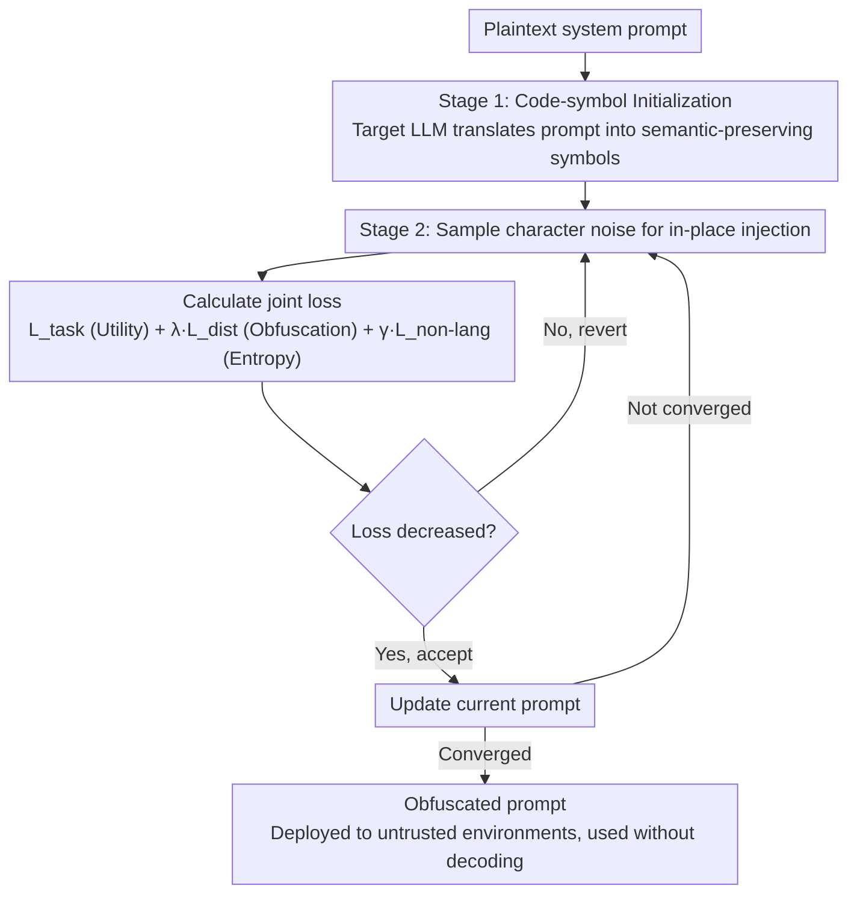

# PragLocker: Protecting Agent Intellectual Property in Untrusted Deployments via Non-Portable Prompts

**Conference**: ICML 2026  
**arXiv**: [2605.05974](https://arxiv.org/abs/2605.05974)  
**Code**: None  
**Area**: Agent Security / Prompt Protection / LLM IP Protection  
**Keywords**: prompt obfuscation, agent IP, non-portability, black-box optimization, random search

## TL;DR
PragLocker employs a two-stage strategy consisting of "code-symbol initialization + noise injection under target model feedback" to encode an agent system prompt into obfuscated text. This text functions solely on the target LLM and fails when migrated to any other LLM, ensuring that attackers cannot reuse stolen prompts.

## Background & Motivation
**Background**: The core IP of commercial LLM agents (e.g., Cursor, Manus, Zapier) lies in the system prompt. Since different prompt designs using the same model (e.g., GPT-4o) result in vastly different product experiences, prompts are high-value assets refined through extensive expert iteration.

**Limitations of Prior Work**: Agents are frequently deployed on user devices or third-party cloud infrastructure where malicious users or insiders can dump the prompt and replicate it on more powerful LLMs. Existing solutions—such as prompt watermarking (post-hoc verification), encryption (requires runtime decryption for API calls), emoji obfuscation (decodable by other LLMs), and representation-space obfuscation (requires white-box access, impractical for GPT/Gemini)—fail to simultaneously satisfy requirements for proactivity, runtime efficiency, usability, and non-portability.

**Key Challenge**: Constructing a prompt that maintains utility on a target LLM while failing on others requires the prompt to preserve original semantics while overfitting to the specific loss landscape geometry of the target model. This must be achieved using only API-level input-output and log-prob feedback.

**Goal**: (1) Formalize four requirements C1-C4 for prompt protection; (2) Provide an existence proof to ensure theoretical feasibility; (3) Design a purely black-box, API-only optimization algorithm; (4) Validate utility retention and non-portability across multiple models and tasks.

**Key Insight**: The authors leverage the "attention dilution" property of transformers—the network is insensitive to perturbations of certain tokens. Theoretically, an $\epsilon$-ball stability region $S_{\bm{x}}$ exists where utility remains constant. Since different models have distinct stability region geometries, a target-specific perturbation is unlikely to fall within the stability regions of other models.

**Core Idea**: Treat prompt obfuscation as a "gradient-free discrete optimization over target-LLM-specific loss landscape," utilizing random search to find a token sequence that satisfies a joint loss of utility, obfuscation, and non-portability.

## Method

### Overall Architecture
PragLocker transforms a plaintext system prompt into obfuscated text that is functional only on the target LLM. It operates in two stages: Stage 1 utilizes the target LLM to translate the plaintext prompt $\bm{x}$ into a semantic-preserving "code-symbol" form $\tilde{\bm{x}}_0$ as a starting point. Stage 2 uses random search to iteratively inject character-level noise. Each step is evaluated using a joint loss (task + distance + non-language) to decide whether to accept the update. The resulting $\tilde{\bm{x}}$ is deployed directly in untrusted environments and used as-is at runtime without decoding.

### Key Designs

**1. Theoretical Foundation: functional equivalence + stability region**

To move beyond ad-hoc claims, the authors provide a geometric existence proof. Functional equivalence is defined as: a perturbed embedding $\tilde{\bm{h}}$ is equivalent to the original $\bm{h}$ if they produce the same greedy decoding for any query $\bm{q}_i$. The correct-class margin is defined as $m(\tilde{\bm{h}}, \bm{q}_i, y_i) = f(\tilde{\bm{h}}, \bm{q}_i)_{y_i} - \max_{k \neq y_i} f(\tilde{\bm{h}}, \bm{q}_i)_k$. As long as the margin $> 0$, an $\epsilon$-ball $B_\epsilon(\bm{h})$ exists where utility remains constant—this is the "stability region" $S_{\bm{x}}$. Non-portability arises from "manifold mismatch": in high-dimensional space, the stability regions of model $\theta$ and model $\theta'$ are unlikely to intersect.

**2. Stage 1 — Code-symbol Initialization**

Searching from scratch is unlikely to find a functional prompt because the stability region is sparse within the vast search space. Stage 1 has the target LLM translate the prompt into a "code + symbol" format $\tilde{\bm{x}}_0$. This symbolic representation preserves semantics and utility while introducing target-conditioned bias and redundancy. This places the initial search point directly inside $S_{\bm{x}}$, significantly narrowing the effective search space.

**3. Stage 2 — Random-search noise injection + joint loss**

In a black-box setting lacking gradients, the method samples printable characters $\bm{n}_t$ for in-place injection. Updates are accepted if the joint loss decreases:

$$\mathcal{L} = \mathcal{L}_{\text{task}} + \lambda \mathcal{L}_{\text{dist}} + \gamma \mathcal{L}_{\text{non-lang}}$$

$\mathcal{L}_{\text{task}} = -\log p(\bm{y}|\bm{q}, \tilde{\bm{x}})$ maintains utility (C3), while $\mathcal{L}_{\text{dist}} = -\log \sigma(\mathrm{Dist}(\tilde{\bm{x}}, \bm{x}))$ uses Levenshtein distance to move the prompt away from the original (C2). $\mathcal{L}_{\text{non-lang}} = -H(\tilde{\bm{x}})$ minimizes character Shannon entropy to push the prompt away from the natural language distribution. This entropy term is crucial; as natural language is highly portable across LLMs, forcing the prompt into a "token salad" recognized only by the target model eliminates cross-model readability (C4).

### Loss & Training
The training process uses a greedy random search (Algorithm 1). In each step, it samples a mini-batch $(\bm{q}_t, \bm{y}_t)$ and noise $\bm{n}_t$, comparing the joint loss before and after injection. The process is entirely gradient-free and relies only on the target LLM's API outputs and log-probabilities.

## Key Experimental Results

### Main Results
Portability is measured by optimizing a prompt for a target LLM and testing its performance on other LLMs (e.g., LessonL agent on HumanEval/MBPP):

| Agent / Task | Target LLM | Orig. Prompt → GPT-4o | Orig. Prompt → Gemini2 | PragLocker → GPT-4o | PragLocker → Gemini2 |
|------|------|------|------|------|------|
| LessonL / HumanEval | Gemini 2 | 93.90 | - | 0.61 | - |
| LessonL / HumanEval | DeepSeek | 93.90 | 98.78 | 0.61 | 2.44 |
| LessonL / MBPP | Gemini 2 | 91.89 | - | 0.51 | - |
| LessonL / MBPP | DeepSeek | 91.89 | 97.33 | 0.62 | (~0) |

PragLocker effectively reduces cross-model transfer performance to near zero, whereas original prompts typically maintain performance above 90%.

### Ablation Study
The study evaluates two variants: PragLocker_tune (task loss tuning only) and PragLocker_code (initialization only).

| Configuration | Cross-model Portability | Description |
|------|------|------|
| Original Prompt | 93-99 | Fully portable |
| PragLocker_code (Init only) | 85-95 | Coding reduces portability slightly but remains usable |
| PragLocker_tune (Task tune only) | 80-93 | Task loss alone is insufficient to block transfer |
| **PragLocker (Full)** | 0-3 | Portability nears zero after joint loss optimization |

### Key Findings
- **Non-language loss** is the primary contributor to non-portability. Prompts must be pushed outside the natural language distribution to fail on other LLMs.
- PragLocker prompts do not transfer even between the same model at different precisions (FP16 vs. 4-bit quantization), providing strong evidence for the "manifold mismatch" hypothesis.
- The target LLM cannot deobfuscate its own obfuscated prompt back to the original text, indicating the prompt has become a model-conditioned trigger without recoverable text-level information.

## Highlights & Insights
- Framing prompt IP protection as a "gradient-free discrete optimization" problem is a highly appropriate approach for black-box LLM environments.
- The **non-language entropy regularizer** is a valuable insight; any scenario aiming to block semantic transfer across models can leverage this by diverging from natural language distributions.
- Using the target LLM for its own initialization is an elegant "warm start" that significantly improves search efficiency.
- The existence theorem provides a geometric explanation for prompt obfuscation through attention dilution and high-dimensional sparsity.

## Limitations & Future Work
- The assumption that attackers cannot train a deobfuscator using massive query-output pairs may not hold for persistent large-scale attacks.
- The weights $\lambda, \gamma$ require manual tuning and may vary across tasks.
- Random search converges slowly on long prompts and may suffer from low acceptance rates.
- Robustness against minor model fine-tunes or different models within the same family (e.g., Claude) remains to be fully explored.
- Increased token counts from obfuscation may raise API costs and latency.

## Related Work & Insights
- **vs Prompt Watermarking**: PragLocker provides proactive defense to prevent redistribution, rather than just post-hoc detection.
- **vs Encryption**: Protects prompts during execution, whereas traditional encryption only protects data at rest.
- **vs Representation Obfuscation**: PragLocker works in a purely black-box setting and ensures non-portability, unlike methods like EmojiPrompt which remain decodable by other models.
- **vs Jailbreak Suffixes (GCG)**: While the technical approach is similar, the objective is defensive (non-portability) rather than attacking.

## Rating
- Novelty: ⭐⭐⭐⭐⭐
- Experimental Thoroughness: ⭐⭐⭐⭐
- Writing Quality: ⭐⭐⭐⭐
- Value: ⭐⭐⭐⭐⭐

<!-- RELATED:START -->

## Related Papers

- [\[ICML 2026\] Skill-Pro: Learning Reusable Skills from Experience via Non-Parametric PPO for LLM Agents](skill-pro_learning_reusable_skills_from_experience_via_non-parametric_ppo_for_ll.md)
- [\[ICLR 2026\] ToolACE-MT: Non-Autoregressive Generation for Agentic Multi-Turn Interaction](../../ICLR2026/llm_agent/toolace-mt_non-autoregressive_generation_for_agentic_multi-turn_interaction.md)
- [\[ICML 2026\] Agent JIT Compilation for Latency-Optimizing Web Agent Planning and Scheduling](agent_jit_compilation_for_latency-optimizing_web_agent_planning_and_scheduling.md)
- [\[ICML 2026\] A Minimal Agent for Automated Theorem Proving](a_minimal_agent_for_automated_theorem_proving.md)
- [\[ICML 2026\] Agent-Omit: Adaptive Context Omission for Efficient LLM Agents](agent-omit_adaptive_context_omission_for_efficient_llm_agents.md)

<!-- RELATED:END -->
## Related Papers

- [\[ICML 2026\] Skill-Pro: Learning Reusable Skills from Experience via Non-Parametric PPO for LLM Agents](skill-pro_learning_reusable_skills_from_experience_via_non-parametric_ppo_for_ll.md)
- [\[ICML 2026\] Weasel: 通过重要性-多样性数据选择实现 Web Agent 的域外泛化](weasel_out-of-domain_generalization_for_web_agents_via_importance-diversity_data.md)
- [\[ICML 2026\] Agent JIT Compilation for Latency-Optimizing Web Agent Planning and Scheduling](agent_jit_compilation_for_latency-optimizing_web_agent_planning_and_scheduling.md)
- [\[ICML 2026\] MCP-Persona: 用环境模拟评估 LLM agent 在真实个人化应用上的能力](mcp-persona_benchmarking_llm_agents_on_real-world_personal_applications_via_envi.md)
- [\[ICML 2026\] A Minimal Agent for Automated Theorem Proving](a_minimal_agent_for_automated_theorem_proving.md)

<!-- RELATED:END -->
