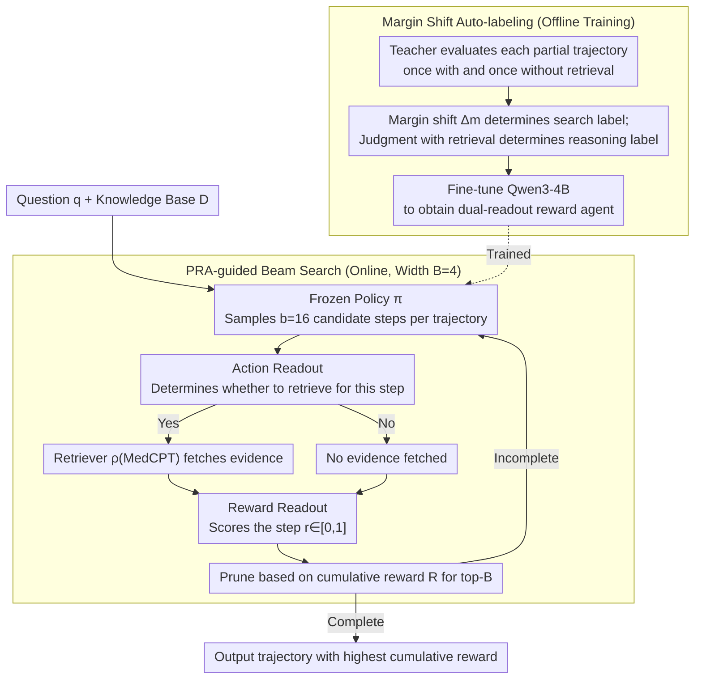

# Process Reward Agents for Steering Knowledge-Intensive Reasoning

**Conference**: ICML 2026  
**arXiv**: [2604.09482](https://arxiv.org/abs/2604.09482)  
**Code**: https://process-reward-agents.github.io/ (Available)  
**Area**: LLM Agent / Process Reward / Medical Reasoning  
**Keywords**: Process Reward Model, Beam Search, Retrieval Augmented, Medical Reasoning, Frozen Policy

## TL;DR
Reconstructs the Process Reward Model (PRM) from "post-hoc scoring" into an **online agent**: it decides in real-time whether to retrieve evidence and provides rewards at each reasoning step. By using beam search to prune candidate trajectories from a frozen policy, Qwen3-4B achieves a 4B-scale SOTA of 81.9% on MedQA and demonstrates direct transferability to various unseen backbones from 0.5B to 8B (yielding up to a 25.7% gain).

## Background & Motivation

**Background**: In domains like mathematics or coding, each reasoning step can be mechanically verified using formal rules or compilers. However, in knowledge-intensive domains like medicine, determining the correctness of a step often requires synthesizing evidence across multiple guidelines, literature, and clinical standards, lacking locally verifiable "axioms." Current approaches follow two main lines: (1) injecting retrieved documents into the policy context (RAG); (2) training Process Reward Models (PRM) to score complete reasoning trajectories post-hoc (e.g., Med-PRM, Med-S3).

**Limitations of Prior Work**: Post-hoc scoring means that error propagation has already reached the end, making correction too late; it also lacks the ability to branch, prune, or re-rank during the generation process, which limits the space for inference-time scaling. Furthermore, stuffing all documents into the policy context causes context bloating and does not guarantee that the model will consult the "correct evidence" at the "correct timing." Additionally, PRMs suffer from poor off-policy generalization—distribution shifts cause reward signal distortion when switching backbone models.

**Key Challenge**: Reward signals must be "online, step-level, and supported by external evidence" to truly intervene in generation; however, existing PRMs are either offline or only usable post-hoc, and are strongly coupled with the policy.

**Goal**: To decouple the judgment of "when to retrieve" and "step-level correctness" from the policy, forming an independent reward module capable of online intervention during beam search while keeping the policy frozen and hot-swappable.

**Key Insight**: A reward model does not have to be a passive scorer; it can be an **agent**—actively choosing between "retrieve" or "score directly" at each step, then assigning a 0-1 reward to the current step. This allows dynamic integration of external knowledge into the reasoning process while decoupling the policy and reward, enabling them to evolve independently.

**Core Idea**: Use a parameter-shared lightweight agent (with two token-level readouts from the same model) to simultaneously output the **action (whether to search)** and the **reward (whether this step is correct)**. Its cumulative reward serves as a pruning signal for beam search, transforming the process reward from post-hoc scoring into online control.

## Method

### Overall Architecture
PRA addresses the difficulty in knowledge-intensive tasks like medicine where there are "no locally verifiable axioms and errors cannot wait for post-hoc correction." It upgrades the reward from a passive scorer to an agent that intervenes online. The system consists of three collaborative components: a frozen reasoning policy $\pi$, a process reward agent $\mu_\phi$ (a Qwen3-4B), and a dense retriever $\rho$ (MedCPT). Given a question $q$ and a knowledge base $\mathcal{D}$, beam search maintains a set of partial trajectories $\{\tau_t^{(j)}\}_{j=1}^B$ with width $B$. At each step, $\pi$ samples $b$ candidate next steps for each trajectory (totaling $B \times b$ new trajectories). Then, the action readout of $\mu_\phi$ determines whether to retrieve for each trajectory—if so, $\rho$ fetches $D_t$; otherwise, $D_t = \varnothing$. Finally, the reward readout scores the step as $\hat r_t \in [0, 1]$ conditioned on $(q, \tau_t, D_t)$. The top-$B$ trajectories are retained based on the cumulative reward $R(\tau_t^{(j)}) = \sum_{i=1}^t \hat r_i^{(j)}$, while others are pruned. After processing, the trajectory with the highest cumulative reward is selected as the answer. Throughout this process, the policy sees the same input as original CoT, while retrieval and scoring are externalized in the reward agent.

### Key Designs

**1. Dual Readout: Enabling the reward agent to output "whether to retrieve" and "step correctness" simultaneously**

Traditionally, PRMs only output a single reward, passively accepting retrieved results provided externally, without deciding for themselves "whether to check evidence." PRA internalizes this decision as an agent action: it fixes two slots $\ell^{(1)}, \ell^{(2)}$ in the output sequence, each performing a two-way softmax on the logits of tokens "0" and "1." The reward $\hat r_t = \text{softmax}(\ell^{(1)})_{[1]}$ is treated directly as the probability of "current step being correct," and the action $\hat a_t \sim \text{softmax}(\ell^{(2)})$ decides whether to trigger retrieval. Both readouts share the same Qwen3-4B backbone. By using only two additional tokens, the model performs agent control and step-level scoring with almost zero additional inference overhead. This allows the reward module to adaptively request external evidence based on the reasoning state, effectively opening a new axis for inference-time scaling: besides scaling the number of samples, one can optionally exchange retrieval budget for stronger reward signals at each step.

**2. Automatic Generation of Reasoning + Search dual labels via Teacher's Margin Shift**

PRA requires two sets of step-level supervision—"whether this step is correct" (reasoning label) and "whether this step needs retrieval" (search label). However, manual step-level labeling is too expensive, MC rollouts are noisy (incorrect intermediate steps might still guess the right answer), and LLM-as-judge without evidence often fails in medical scenarios. This work utilizes Qwen3-235B-Instruct as a teacher to evaluate each partial trajectory twice—once with retrieved documents and once without—taking the log-probs of tokens 0/1 to obtain margins $m = \log p(1) - \log p(0)$ and $m_d$. The margin shift $\Delta m = m - m_d$ measures "how much the correctness judgment for this step depends on external evidence": if $|\Delta m| > \epsilon_{\text{global}}$ (the threshold is the median of the training set, naturally forming a 50/50 split), it is labeled for search; otherwise, it is labeled for reward. The reasoning label is directly taken from the teacher's binary judgment under the "with-retrieval" condition. This essentially utilizes the "posterior update magnitude" from a Bayesian perspective—only when new evidence significantly shifts the teacher's belief is it labeled as "searching required," allowing PRA to learn selective retrieval rather than blind searching at every step.

**3. PRA-guided Beam Search: Online Step-level Pruning + Stage-level Global Batching**

Post-hoc scoring (outcome-level or post-hoc process-level) can only be aggregated on complete trajectories, where errors have already propagated to the end; only online step-level rewards can prune errors before they spread. PRA uses beam search with width $B=4$ and branching factor $b=16$, ensuring the sampling budget $B \times b = 64$ equals that of self-consistency with 64 samples for a fair comparison. A narrow beam with a large branching factor provides PRA with enough candidates to "pick" from without causing the global queue to explode. Crucially, in terms of engineering, scheduling is optimized: since different questions and beams have asynchronous progress due to variable-length reasoning and conditional retrieval, PRA organizes by "stage" rather than "question." All active traces are placed in a global queue and bucketed into three pending stages: policy generation, retrieval, and readout. Each stage is executed in batches before returning to the queue. This maintains high GPU utilization even when some steps skip $\rho$ while others require retrieval.

### A Complete Example
Take a MedQA question as an example: with beam width $B=4$, the initial 4 partial trajectories each have $\pi$ sample 16 next steps, totaling $4 \times 16 = 64$ candidate new trajectories. For these 64 candidates, the PRA action readout performs judgment—for instance, steps involving specific drug dosages that require guidelines trigger retrieval to fetch $D_t$, while pure logical deductions skip retrieval. The reward readout then assigns $\hat r_t$ to each candidate, adding it to their respective cumulative rewards $R$. Trajectories are sorted by $R$, the top 4 are retained, and the other 60 are pruned, expanding again into 64 candidates in the next step. If an early incorrect trajectory maintains a consistently low cumulative reward, it is quickly pushed out of the beam. Finally, after all trajectories are completed, the linear step sequence with the highest cumulative reward outputs the answer.

### Loss & Training
PRA is fine-tuned from Qwen3-4B-Instruct: each step simultaneously predicts the binary tokens for reasoning and search labels, with the loss being the cross-entropy at these two positions. In main experiments, the search label is fixed to 1 (always-search setting to ensure evidence is always available during reward evaluation); the margin-shift labels are only used when analyzing the search–accuracy trade-off to let PRA learn selective retrieval according to a threshold $\theta_{\text{dep}}$. Training data comes from 10,178 questions in the MedQA train split; for each question, the frozen Qwen3-4B samples 8 reasoning trajectories, and retrieval is performed on each partial trajectory to generate a large volume of step-level training samples.

## Key Experimental Results

### Main Results
On seven medical reasoning benchmarks, compared with Direct/CoT/RAG (including 64-way self-consistency), using Qwen3-4B-Instruct as the uniform policy.

| Dataset | Metric | PRA | RAG+SC | Gain |
| :--- | :--- | :--- | :--- | :--- |
| MedQA (ID) | Acc | 81.9 | 76.7 | +5.2 |
| Medbullets | Acc | 65.9 | 58.4 | +7.5 |
| MedMCQA | Acc | 66.2 | 64.8 | +1.4 |
| MMLU-Med | Acc | 86.6 | 86.2 | +0.4 |
| GPQA | Acc | 65.1 | 54.4 | +10.7 |
| Lancet | Acc | 70.9 | 61.0 | +9.9 |
| NEJM | Acc | 68.0 | 66.9 | +1.1 |
| **Average** | Acc | **72.1** | 66.9 | **+5.2** |

Cross-backbone migration (PRA was trained only on Qwen3-4B trajectories; all non-† policies were completely unseen):

| Policy | CoT | +SC | +PRA | $\Delta$ vs CoT |
| :--- | :--- | :--- | :--- | :--- |
| Llama-3.1-8B | 67.0 | 75.1 | 82.3 | +15.3 |
| Llama-3.2-3B | 56.0 | 66.2 | 79.1 | +23.1 |
| Qwen2.5-3B | 49.5 | 54.0 | 74.9 | +25.4 |
| Llama-3.2-1B | 36.2 | 44.0 | 61.2 | +25.0 |
| Qwen2.5-0.5B | 28.4 | 31.9 | 54.1 | +25.7 |

### Ablation Study
Table 3 decomposes reward agent / training / retrieval factors (Policy fixed to Qwen3-4B, sampling budget 64):

| Configuration | Acc. | Description |
| :--- | :--- | :--- |
| CoT | 72.7 | Single sample baseline |
| CoT + SC | 74.8 | 64-way self-consistency |
| RAG + SC | 76.7 | Retrieval + SC |
| PRA w/o train w/o search | 74.4 | Untrained Qwen3-4B as reward agent, beam search structure only |
| PRA w/o train w/ search | 76.7 | Adds retrieval, matches RAG+SC |
| **PRA (Full)** | **81.9** | Trained reward agent + online retrieval |

Table 4 further decomposes reward level and timing (using the same trained PRA parameters, varying usage):

| Usage | Reward Level | Timing | Acc. |
| :--- | :--- | :--- | :--- |
| PRA (Last) | Outcome | Post-hoc | 75.7 |
| PRA (Min) | Process | Post-hoc | 74.3 |
| PRA (Max) | Process | Post-hoc | 77.5 |
| PRA (Average) | Process | Post-hoc | 77.6 |
| **PRA (Ours)** | Process | **Online** | **81.9** |

### Key Findings
- **Training the reward agent is the single largest contribution**: The untrained version with search only matches RAG+SC (76.7). Training jumps this to 81.9, indicating that training contributes the most.
- **Online > Post-hoc**: Using the same PRA parameters, post-hoc scoring (Average) only reaches 77.6, while online beam search intervention jumps to 81.9—showing that performance comes not just from stronger rewards, but from the ability to "prune before errors propagate."
- **Smaller models benefit more**: PRA brings a 90.5% relative improvement to Qwen2.5-0.5B (28.4→54.1), exposing the underestimated reasoning potential of small models; this suggests reasoning potential can be unlocked by swapping reward agents for new domains without retraining policies.
- **Self-consistency can drop performance on difficult tasks**: On benchmarks like GPQA and Lancet where the policy frequently errs, multiple sampling can amplify errors via majority vote; PRA provides stable improvement by incorporating external evidence.
- **Margin shift correlates with correctness**: Correct trajectories show larger margin shifts later in the sequence (relying on evidence for final judgment), while incorrect trajectories show smaller shifts (the teacher detects internal inconsistency without evidence), providing an interpretable signal for "when to retrieve."

## Highlights & Insights
- **Recasting PRM as an agent**: Traditionally, PRMs are passive scorers. PRA internalizes "whether to retrieve" as an action, turning the reward module into a mini-agent. This makes reward signals online, controllable, and branchable, creating a new dimension for inference-time scaling—traditionally one scales the number of samples, but now one can also scale the retrieval budget × beam width.
- **Complete Policy-Reward Decoupling**: The policy never touches retrieved documents nor updates its parameters; new backbones are plug-and-play. This is significant for industrial deployment—as medical knowledge bases update monthly, only a 4B reward agent needs retraining rather than the entire LLM stack.
- **Stage-level Global Batching**: The engineering implementation of PRA-guided beam search replaces traditional "question-independent" scheduling with "stage-independent" global queuing. Desynchronization from variable-length reasoning and conditional retrieval is hidden within the batch dimension, a trick applicable to any PRM-based benchmarking.
- **Margin Shift as a proxy for retrieval necessity**: Using the log-prob difference of a teacher model under "with vs. without evidence" conditions avoids expensive manual labeling of "when to retrieve." This is a paradigm for label generation reproducible in other knowledge-intensive domains (law, finance).

## Limitations & Future Work
- **Validated only in medicine**: All experiments are on MedQA + medical OOD. The authors note this as a methodological contribution rather than a deployable system; effectiveness in other domains (law, science) is not yet verified.
- **Always-on search is an upper bound**: Main results use an always-search configuration; "retrieving at every step" implies significantly higher inference costs than self-consistency. While a selective search Pareto front exists, the selective version's upper bound on MedQA is lower than always-search.
- **Dependence on a strong teacher**: Labels are generated by Qwen3-235B; the ceiling for PRA is limited by the teacher's medical judgment quality.
- **Beam search is still single-chain reasoning**: PRA selects top-$B$, but each trajectory remains a linear step sequence without support for step-level backtracking or rewriting; an early misestimate by PRA could lead the entire beam astray.
- **Future Improvements**: (i) Expanding the action space from binary {search, reward} to multiple actions (e.g., "switch retriever," "backtrack to step k for regeneration"); (ii) Using reinforcement learning to directly optimize final answer accuracy rather than two binary labels, aligning rewards with downstream metrics; (iii) Adding calibration to the reward agent so $\hat r_t$ represents true posterior probability.

## Related Work & Insights
- **vs Med-PRM (Yun et al., 2025)**: Both are retrieval-augmented PRMs, but Med-PRM scores only after full trajectory generation, whereas PRA scores at every step during beam search. The former cannot intervene online; the latter prunes early errors.
- **vs Med-S3 (Jiang et al., 2025)**: Med-S3 jointly trains policy + reward for self-evolution without search; PRA keeps the policy frozen, allowing the reward to evolve independently, making it more suitable for frequent backbone updates.
- **vs RAG / RAG+SC**: Traditional RAG places retrieved documents in the policy context, relying on the policy to "pick points"; PRA externalizes retrieval to the reward agent. The policy's input distribution remains identical to CoT, preventing context bloating.
- **vs Math PRMs (Lightman 2023, Wang 2023, Zhang 2025b)**: Math step labels can be approximated by MC rollout, but medical "correctness" requires external evidence; PRA utilizes margin shift to learn "when evidence is needed," solving a new problem for migrating PRMs to knowledge-intensive tasks.

## Rating
- Novelty: ⭐⭐⭐⭐ The combination of reconstructing PRM as an agent with actions and using margin shift for automatic search label generation is a meaningful paradigm shift for PRMs, though beam search + PRM is not entirely new.
- Experimental Thoroughness: ⭐⭐⭐⭐⭐ 7 benchmarks + 6 cross-backbones from 0.5B to 8B + multi-dimensional ablation (training/retrieval/timing/level) + retrieval-accuracy Pareto; a rare comprehensive comparison in the medical domain.
- Writing Quality: ⭐⭐⭐⭐ The logical chain between motivation and method is clear; the Bayesian explanation for margin shift is slightly condensed.
- Value: ⭐⭐⭐⭐⭐ The "frozen policy + hot-swappable reward" paradigm is directly friendly to industrial medical LLM deployment; achieving over 80% on MedQA with 4B is a compelling milestone.

<!-- RELATED:START -->

## Related Papers

- [\[ICLR 2026\] WebArbiter: A Principle-Guided Reasoning Process Reward Model for Web Agents](../../ICLR2026/llm_agent/webarbiter_a_principle-guided_reasoning_process_reward_model_for_web_agents.md)
- [\[ACL 2026\] Exploring Reasoning Reward Model for Agents](../../ACL2026/llm_agent/exploring_reasoning_reward_model_for_agents.md)
- [\[ICML 2026\] Reward Hacking Benchmark: Measuring Exploits in LLM Agents with Tool Use](reward_hacking_benchmark_measuring_exploits_in_llm_agents_with_tool_use.md)
- [\[ICLR 2026\] Web-CogReasoner: Towards Knowledge-Induced Cognitive Reasoning for Web Agents](../../ICLR2026/llm_agent/web-cogreasoner_towards_knowledge-induced_cognitive_reasoning_for_web_agents.md)
- [\[ACL 2026\] Rethinking Reasoning-Intensive Retrieval: Evaluating and Advancing Retrievers in Agentic Search Systems](../../ACL2026/llm_agent/rethinking_reasoning-intensive_retrieval_evaluating_and_advancing_retrievers_in_.md)

<!-- RELATED:END -->
