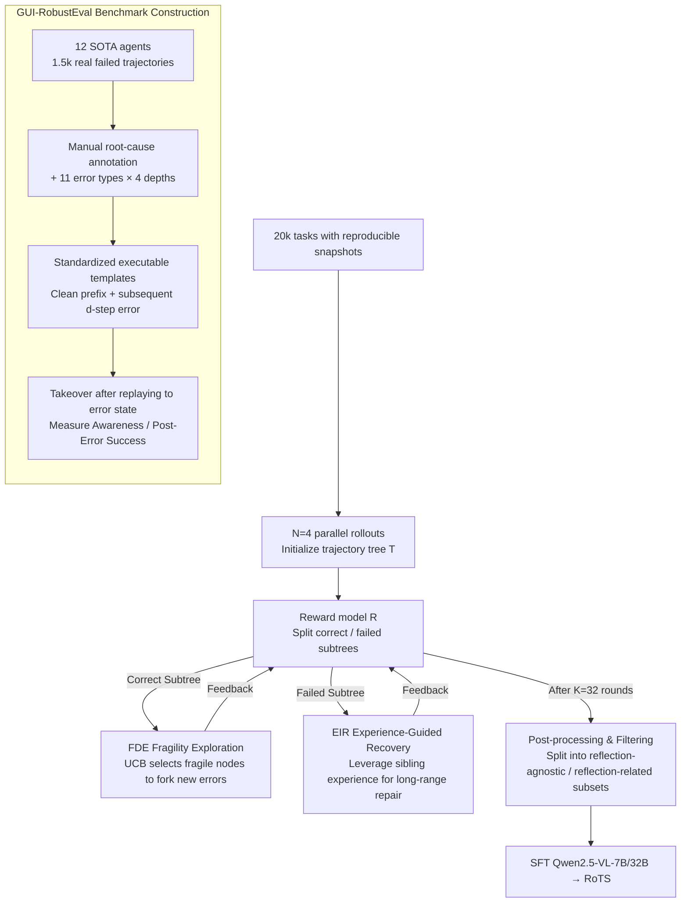

# Recovering Policy-Induced Errors: Benchmarking and Trajectory Synthesis for Robust GUI Agents

**Conference**: ICML 2026 Spotlight  
**arXiv**: [2605.29447](https://arxiv.org/abs/2605.29447)  
**Code**: https://github.com/AlibabaResearch/RoTS (Available)  
**Area**: Agent / GUI Agent / Robustness / Data Synthesis  
**Keywords**: GUI Agents, Policy-Induced Errors, Error Recovery, Trajectory Tree Synthesis, Reflection Data

## TL;DR
To address the critical issue where GUI agents commonly fail to recover from "self-induced errors" in real-world deployments, the authors developed GUI-RobustEval (1216 executable tests covering 11 policy-induced error types across 4 error depths) for fine-grained evaluation. Simultaneously, they proposed RoTS, an online data synthesis framework based on trajectory trees: it actively exposes new errors in correct subtrees using fragility-based UCB and performs long-range recovery rollbacks in failed subtrees using sibling experiences. Ultimately, 800k reflection data samples were synthesized, allowing RoTS-32B to achieve an open-source SOTA of 47.4% SR / 33.8% All-Pass@4 on OSWorld.

## Background & Motivation
**Background**: Over the past year, GUI agents driven by VLMs (GPT-5.1, Claude 4.5, Qwen3-VL, UI-TARS, OpenCUA, etc.) have pushed average success rates on desktop tasks like OSWorld to 30~40%. The mainstream training paradigm involves "SFT on human demonstration trajectories + online RL," while evaluation metrics focus on grounding accuracy, planning precision, and overall task success rate.

**Limitations of Prior Work**: In real deployments, agents frequently encounter *policy-induced errors*—such as incorrect grounding, misreading the screen, or faulty sub-goal decomposition—which often lead to irreversible failure loops. However, existing benchmarks primarily measure external disturbances like "injected noise" or "adversarial attacks." Furthermore, reflection samples in training data are either manually authored or augmented offline, resulting in distributions that deviate significantly from the actual errors made by the policy. Frameworks typically rely on a reflection sub-agent as a fallback rather than inherently teaching the model to "identify and fix self-made errors" at the training level.

**Key Challenge**: The authors explicitly decompose this mismatch into two gaps: (1) **Error Type Mismatch**—training data is dominated by low-level execution errors (invalid clicks), whereas real failures are more often compositional planning or progress-awareness errors; (2) **Error Temporal Mismatch**—most errors in training data are identifiable within 1 step, but policy-induced errors often take several steps to manifest, requiring long-range backtracking.

**Goal**: To close these two gaps across both evaluation and data synthesis by creating a diagnostic benchmark categorized by error type and depth, and an extensible pipeline that actively exposes diverse error patterns while synthesizing long-range recovery trajectories.

**Key Insight**: The authors observe that since real policy-induced errors are "branches" generated during policy-environment interaction, the best synthesizer for this distribution is the policy itself performing repeated rollouts on a replayable trajectory tree. Correct branches are used to actively seek new errors ("exploration"), and failed branches are used to synthesize recovery trajectories ("resurrection"). Their symbiotic expansion naturally covers both the type and temporal gaps.

**Core Idea**: Utilize an online trajectory tree with "exploration-recovery co-expansion" to replace manual reflection data, allowing the agent to train its own robustness using self-generated failure-recovery pairs.

## Method

### Overall Architecture
The objective is to resolve the inability of GUI agents to recover from self-induced errors by bridging the error type and temporal gaps in both evaluation and data. On the evaluation side, GUI-RobustEval identifies root-cause steps and error types from 1.5k failed trajectories of 12 SOTA agents on OSWorld, summarizing 11 types of policy-induced errors across 4 error depths $d \in \{0,1,3,5\}$. Each test case consists of a "clean human-rectified prefix + root-cause step + $d$ subsequent erroneous executions." The agent is then evaluated on its ability to handle the state after replaying these errors, reporting the *Error-Awareness Rate* (whether the first step after takeover realizes the error, judged by VLM) and *Post-Error Success Rate* (ultimate completion).

On the data side, RoTS builds trajectory trees $T=(O,A,E)$ (nodes as screenshots, edges as actions) on 20k tasks with reproducible snapshots. It starts with $N=4$ parallel rollouts for initialization, followed by $K=32$ rounds of "explore-recovery co-expansion." In each round, the tree is split into correct subtrees $T^{\text{corr}}$ and failed subtrees $T^{\text{fail}}$ by a reward model $\mathcal{R}$—the former expands to find new errors, and the latter synthesizes recovery trajectories. Finally, after post-processing and filtering, 800k training samples are assembled for SFT on Qwen2.5-VL-7B/32B.

### Key Designs

**1. GUI-RobustEval: Back-tracing Controllable Error Prefixes from Real Failures**

Existing benchmarks (GUI-Reflection, GUI-Robust, D-GARA, RedTeamCUA) measure synthetic disturbances, environment noise, or adversarial attacks, rather than errors generated by the policy itself, resulting in a mismatch between evaluation signals and real failure distributions. GUI-RobustEval extracts root-cause steps and error distributions from 1.5k failed trajectories of 12 SOTA agents, standardizing each case into an executable template of "clean prefix + root-cause + subsequent $d$ steps" (unified into action summary + PyAutoGUI, then converted back to native agent formats during testing). By replaying the prefix to a specific depth $d \in \{0,1,3,5\}$, the agent is dropped into an "already erred for $d$ steps" state to test its awareness and recovery. This makes error depth a controllable first-order variable—Fig. 3(d) shows that success rates for almost all agents drop monotonically with depth, highlighting that long-range recovery is a significantly underestimated dimension.

**2. Fragility Driven Exploration (FDE): Actively Finding New Errors in Correct Subtrees**

Simple parallel sampling often repeats from the root, wasting computation and yielding narrow error coverage, which causes training data to be dominated by low-level execution errors. FDE instead selects nodes in $T^{\text{corr}}$ that "appear correct but are prone to failure": for each node $o_i$, a pre-operative progress scorer $\mathcal{R}_p$ samples $N$ candidate actions from the policy to calculate a step-level success rate $r_i = \tfrac{1}{N}\sum_n r_{i,n}$. A fragility score is computed as $f_i = (1-r_i) + c\sqrt{\ln(V^f_{p(i)}+1)/(V^f_i+1)}$ (UCB form, where $V^f$ is the visit count for FDE). Environment states are replayed to the node $i^*=\arg\max_i f_i$ for further rollout. Combining "reused correct prefixes + branching at the most unstable nodes" focuses the sampling budget on the most likely error-prone locations, while UCB exploration prevents repetitive sampling.

**3. Experience-Guided Recovery (EIR): Synthesizing Long-range Recovery in Failed Subtrees**

Policy-induced errors often take steps to manifest, requiring long-range backtracking, whereas most training errors are recognizable in 1 step. EIR extracts information from failed trajectories $\tau^{\text{fail}}$ by aggregating sibling branch experiences $\mathcal{E}(\tau^{\text{fail}})=\{E_{\tau^{\text{nb}}}\}$ (reusable trajectory experiences identified by the reward model, effectively "how the correct paths went"). These are fed to a reflector $\pi^{er}_\theta$ to produce $(i, g_i, p_i)$—candidate error step, recovery guidance, and expansion priority. UCB-style selection $s_i = p_i + c\sqrt{\ln(V^r_{p(i)}+1)/(V^r_i+1)}$ picks the node to repair, which is replayed to $o_{i^*}$ and followed by a recovery actor rollout $\tau^{\text{rec}} \sim \pi^{rec}_\theta(u, o_{i^*}, h_{i^*-1}, g_{i^*})$. By merging "sibling experience" and "reflector advice" into an advice-conditioned rollout, the system stably produces "error → identification → recovery → completion" long-range samples.

### Loss & Training
The training data is a mixture: $\mathcal{D}_{\text{train}} = \mathcal{D}_{\text{agn}} \cup \lambda_{\text{ref}} \mathcal{D}_{\text{ref}}$, where $\lambda_{\text{ref}} \in [0,1]$ controls the ratio of reflection samples (final choice $\lambda_{\text{ref}}=0.1$, consisting of 720k agnostic + 80k reflection samples). Each training sample is $x_i=(u, h_{i-1}, o_i, a_i)$, and the loss is the standard teacher-forcing NLL:
$$\mathcal{L}(\theta) = \mathbb{E}_{(u,h,o,a)\sim\mathcal{D}_{\text{train}}}[-\log \pi_\theta(a|u,h,o)]$$
The NLL is only calculated on action $a_i$ tokens; historical context $h$ is used only as context to avoid back-propagating noise from imperfect rollouts. The base models are Qwen2.5-VL-7B and 32B with pure SFT.

## Key Experimental Results

### Main Results

Success rates across different error depths on GUI-RobustEval (Open-source models):

| Agent | Depth 0 | Depth 1 | Depth 3 | Depth 5 | Drop | Awareness |
|------|--------|--------|--------|--------|------|-----------|
| Qwen2.5-VL-7B | 5.1 | 3.0 | 2.9 | 1.3 | ↓75% | — |
| GUI-Owl-7B | 28.7 | 15.6 | 8.1 | 10.4 | ↓64% | 5.9 |
| UI-TARS1.5-7B | 39.6 | 34.2 | 27.8 | 23.3 | ↓41% | 38.0 |
| OpenCUA-7B | 40.7 | 30.3 | 23.3 | 19.0 | ↓53% | 46.3 |
| OpenCUA-32B | 45.5 | 37.2 | 28.6 | 25.9 | ↓53% | 50.3 |
| **RoTS-7B** | 43.5 | 36.6 | 30.1 | 26.7 | **↓38%** | 51.9 |
| **RoTS-32B** | **49.7** | **41.8** | **36.5** | **33.2** | **↓33%** | **58.8** |

OSWorld-Verified Main Comparison (Max 50 steps, All-Pass@4 measures the success rate of all 4 independent runs):

| Agent | Data Source | All-Pass@4 | Max 15 | Max ≥50 |
|------|---------|-----------|--------|---------|
| Claude 4.5 Sonnet | Proprietary | – | 42.9 | 58.1 |
| GPT-OpenAI CUA | Proprietary | – | 26.0 | 31.3 |
| Qwen3-VL-Plus | Proprietary | 24.5 | 33.1 | 35.2 |
| OpenCUA-7B | Open Source | 12.5 | 24.3 | 28.2 |
| GUI-OWL-7B | Proprietary | 14.7 | 27.1 | 29.4 |
| OpenCUA-32B | Open Source | 15.5 | 29.7 | 34.1 |
| **RoTS-7B** | Open Source | **26.3** | 31.7 | **36.3** |
| **RoTS-32B** | Open Source | **33.8** | **42.8** | **47.4** |

### Ablation Study
Ablation of rollout strategies at a scale of 100k data (PS = parallel sampling):

| Data Source | Aware. | Post.Succ. | All-Pass@4 | OSWorld(50) |
|---------|--------|-----------|-----------|-------------|
| PS | 19.9 | 12.1 | 8.6 | 18.1 |
| + FDE | 22.5 | 14.4 | 9.1 | 19.6 |
| + EIR | 28.3 | 18.1 | 12.1 | 19.5 |
| + FDE + EIR | **32.1** | **22.1** | **14.1** | **21.4** |

Comparison of data sources with AgentNet (Human demonstrations):

| Training Data | All-Pass@4 | OSWorld(50) |
|--------------|-----------|-------------|
| $\mathcal{D}_{\text{agn(hum)}}$ | 7.8 | 15.3 |
| $\mathcal{D}_{\text{agn(hum)}} \cup \mathcal{D}_{\text{ref(hum)}}$ | 8.4 | 16.1 |
| $\mathcal{D}_{\text{agn(hum)}} \cup \mathcal{D}_{\text{ref}}$ | 11.6 | 18.8 |
| $\mathcal{D}_{\text{agn}} \cup \mathcal{D}_{\text{ref}}$ | **14.1** | **21.4** |

### Key Findings
- **EIR contributes robustness, FDE contributes overall success rate**: Adding EIR alone pushed All-Pass@4 from 8.6 to 12.1 (+3.5), while OSWorld success remained stagnant. Conversely, FDE alone helped OSWorld but barely moved All-Pass@4.
- **Data distribution is more important than data quantity**: 100k human reflection data points only increased OSWorld SR by 0.6 over agnostic data, whereas policy-induced RoTS reflection data at the same scale increased it by 5.3 points.
- **$\lambda_{\text{ref}}$ has an optimal range**: A reflection data ratio of 0.1 is optimal; ratios > 0.2 lead to "over-reflection," where the model attempts to fix parts of rollouts that are not actually erroneous.

## Highlights & Insights
- The study pulls the GUI agent robustness problem away from the engineering focus of "adding reflection sub-agents" toward the core issue of "training data distribution alignment."
- The dual-tree design is ingenious: it uses the same structure for both error creation and repair, balancing coverage and exploitation via UCB, while prefix sharing across branches mimics MCTS concepts without the complexity of value backup.
- Making error depth a first-order variable in evaluation allows "long-horizon recovery" to have its own comparable curves, providing clarity similar to how Chain-of-Thought evaluation separated single-step from multi-step reasoning.

## Limitations & Future Work
- Currently limited to desktop environments (Ubuntu / Windows 11); mobile and edge GUI tasks remain unverified.
- Evaluators must inject unified prefixes into each agent's native action space, which may introduce degradation during conversion.
- Training relies purely on SFT without a closed-loop online RL component; the lack of a "data flywheel" means the model cannot iterate once it exceeds the capabilities of the synthesizer.
- The 800k sample synthesis requires significant infrastructure (32x A100, 120-way parallelism, proprietary APIs), making exact reproduction difficult for the open-source community.

## Related Work & Insights
- **vs GUI-Reflection / GUI-Robust / D-GARA**: While they focus on synthetic or adversarial noise, Ours measures recovery from errors actually generated by the policy, where error depth is controllable.
- **vs AgentNet / AgentTrek**: These rely on human demos or offline augmentation; RoTS allows the policy to branch off its own errors, matching the policy-induced failure distribution more naturally.
- **vs Agent S / UFO**: These use inference-time reflection modules; RoTS "burns" robustness into the model weights, saving inference costs but increasing training complexity.

## Rating
- Novelty: ⭐⭐⭐⭐
- Experimental Thoroughness: ⭐⭐⭐⭐⭐
- Writing Quality: ⭐⭐⭐⭐
- Value: ⭐⭐⭐⭐⭐

## Related Papers

- [\[CVPR 2026\] HATS: Hardness-Aware Trajectory Synthesis for GUI Agents](../../CVPR2026/llm_agent/hats_hardness-aware_trajectory_synthesis_for_gui_agents.md)
- [\[ACL 2026\] Robust Tool Use via Fission-GRPO: Learning to Recover from Execution Errors](../../ACL2026/llm_agent/robust_tool_use_via_fission-grpo_learning_to_recover_from_execution_errors.md)
- [\[ICML 2026\] Rule2DRC: Benchmarking LLM Agents for DRC Script Synthesis with Execution-Guided Test Generation](rule2drc_benchmarking_llm_agents_for_drc_script_synthesis_with_execution-guided_.md)
- [\[ICML 2026\] Scaling, Benchmarking, and Reasoning of Vision-Language Agents for Mobile GUI Navigation](scaling_benchmarking_and_reasoning_of_vision-language_agents_for_mobile_gui_navi.md)
- [\[ACL 2025\] OS-Genesis: Automating GUI Agent Trajectory Construction via Reverse Task Synthesis](../../ACL2025/llm_agent/os_genesis_gui_agent_trajectory.md)

<!-- RELATED:END -->

<!-- RELATED:START -->

## Related Papers

- [\[ICML 2026\] AutoRPA: Efficient GUI Automation through LLM-Driven Code Synthesis from Interactions](autorpa_efficient_gui_automation_through_llm-driven_code_synthesis_from_interact.md)
- [\[ICML 2026\] Constitutional Black-Box Monitoring for Scheming in LLM Agents](constitutional_black-box_monitoring_for_scheming_in_llm_agents.md)
- [\[ICML 2026\] ACON: Optimizing Context Compression for Long-horizon LLM Agents](acon_optimizing_context_compression_for_long-horizon_llm_agents.md)
- [\[ICML 2026\] Post-Training LLMs as Better Decision-Making Agents: A Regret-Minimization Approach](post-training_llms_as_better_decision-making_agents_a_regret-minimization_approa.md)
- [\[ICML 2026\] Talk, Judge, Cooperate: Gossip-Driven Indirect Reciprocity in Self-Interested LLM Agents](talk_judge_cooperate_gossip-driven_indirect_reciprocity_in_self-interested_llm_a.md)

<!-- RELATED:END -->
