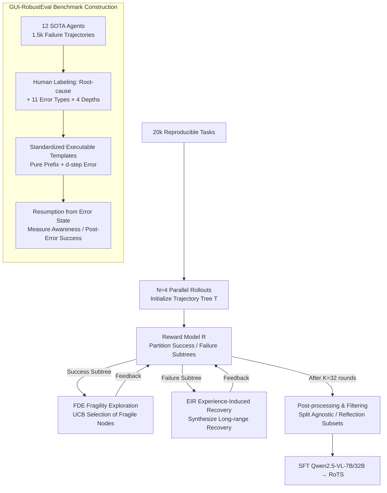

# Recovering Policy-Induced Errors: Benchmarking and Trajectory Synthesis for Robust GUI Agents

**Conference**: ICML 2026 Spotlight  
**arXiv**: [2605.29447](https://arxiv.org/abs/2605.29447)  
**Code**: https://github.com/AlibabaResearch/RoTS (Available)  
**Area**: Agent / GUI Agent / Robustness / Data Synthesis  
**Keywords**: GUI Agents, Policy-Induced Errors, Error Recovery, Trajectory Tree Synthesis, Reflection Data

## TL;DR
Addressing the issue where GUI agents frequently fail to recover from "self-inflicted errors" in real-world deployments, the authors construct GUI-RobustEval (1,216 executable tests covering 11 types of policy-induced errors across 4 error depths) for fine-grained evaluation. Simultaneously, they propose RoTS—an online data synthesis framework based on trajectory trees. It uses Fragility-based UCB to actively expose new errors in success subtrees and leverages neighbor experience for long-horizon recovery rollbacks in failure subtrees. This synthesizes 800k reflection samples, enabling RoTS-32B to achieve an open-source SOTA of 47.4% SR / 33.8% All-Pass@4 on OSWorld.

## Background & Motivation
**Background**: In the past year, GUI agents powered by VLMs (GPT-5.1, Claude 4.5, Qwen3-VL, UI-TARS, OpenCUA, etc.) have reached average success rates of 30–40% on desktop tasks like OSWorld. The dominant training paradigm involves "Human Demonstration SFT + Online RL," with primary evaluation metrics focused on grounding accuracy, planning precision, and overall task success rate.

**Limitations of Prior Work**: Agents frequently encounter *policy-induced errors* during deployment—such as grounding failures, visual misinterpretations, or incorrect sub-goal decomposition—and often become "trapped" once an error occurs. However, existing benchmarks primarily measure external disturbances like "injected noise" or "adversarial attacks." Furthermore, reflection samples in training data are either manually authored or offline-augmented, leading to a distribution that deviates significantly from errors actually committed by the policy. Many frameworks rely on a separate reflection sub-agent for recovery rather than training the model to "identify and fix its own mistakes" at the capability level.

**Key Challenge**: The authors explicitly decompose this mismatch into two gaps: (1) **Error Type Mismatch**—training data is dominated by low-level execution errors (e.g., invalid clicks), whereas real failures are often compositional planning or progress-perception errors; (2) **Error Horizon Mismatch**—most training errors are identifiable within one step, but policy-induced errors often manifest several steps after the root cause, requiring long-horizon backtracking.

**Goal**: To bridge these two gaps at both the evaluation and data synthesis levels. The objective is to create a benchmark for fine-grained diagnosis based on error types and depths, alongside a scalable pipeline that actively exposes diverse error patterns and synthesizes long-horizon recovery trajectories.

**Key Insight**: Policy-induced errors are essentially "branches" that diverge when a policy interacts with the environment. Thus, the most representative synthesizer is the policy itself, performing repeated rollouts on a replayable trajectory tree. Success branches are used to find new errors ("Explore"), while failure branches are used to synthesize recovery trajectories ("Recover"), creating a symbiotic expansion that covers both the type and horizon gaps.

**Core Idea**: Replace manual reflection data with an "exploration-recovery co-expansion" online trajectory tree, allowing the agent to train its robustness using self-generated failure-recovery pairs.

## Method

### Overall Architecture
The framework addresses the inability of GUI agents to recover from self-inflicted errors by bridging error type and horizon gaps. For evaluation, GUI-RobustEval identifies root-cause steps and error types from 1.5k failure trajectories of 12 SOTA agents on OSWorld, summarizing 11 categories of policy-induced errors across 4 depths $d \in \{0,1,3,5\}$. Each test case consists of a "clean human-corrected prefix + root-cause step + $d$ subsequent erroneous steps." Agents are evaluated on their *Error-Awareness Rate* and *Post-Error Success Rate* after resuming from these erroneous states.

For data synthesis, RoTS constructs trajectory trees $T=(O,A,E)$ across 20k tasks with reproducible snapshots. After initializing with $N=4$ parallel rollouts, it performs $K=32$ iterations of "explore-recovery co-expansion." In each round, a reward model $\mathcal{R}$ partitions the tree into success subtrees $T^{\text{corr}}$ and failure subtrees $T^{\text{fail}}$. The former is expanded via Fragility-Driven Exploration (FDE) to find new errors, while the latter utilizes Experience-Induced Recovery (EIR) to synthesize recovery paths. The resulting 800k samples are used to fine-tune Qwen2.5-VL-7B/32B.

### Key Designs

**1. GUI-RobustEval: Deriving Controlled Error Prefixes from Real Failures**
Existing benchmarks (GUI-Reflection, GUI-Robust, D-GARA, RedTeamCUA) measure synthetic perturbations rather than self-inflicted policy errors. GUI-RobustEval extracts root-cause steps and error distributions from 1.5k real SOTA agent failures. Each case is standardized into a template (Action Summary + PyAutoGUI). During evaluation, the environment is replayed to a specific depth $d \in \{0,1,3,5\}$, forcing the agent to take over from a state where an error has already persisted. Results show that success rates for almost all agents drop monotonically with depth, highlighting long-horizon recovery as a critical missing dimension.

**2. Fragility-Driven Exploration (FDE): Actively Finding New Errors in Success Subtrees**
Standard parallel sampling often wastes budget on identical paths from the root, leading to data dominated by low-level errors. FDE instead identifies branches in $T^{\text{corr}}$ where the agent is "apparently correct but prone to failure." For a node $o_i$, a progress scorer $\mathcal{R}_p$ evaluates $N$ candidate actions to compute a step-level success rate $r_i = \tfrac{1}{N}\sum_n r_{i,n}$. A fragility score is calculated as $f_i = (1-r_i) + c\sqrt{\ln(V^f_{p(i)}+1)/(V^f_i+1)}$ (a UCB variant). The agent rollouts from $i^*=\arg\max_i f_i$, effectively focusing the sampling budget on high-risk nodes to expand error type coverage.

**3. Experience-Induced Recovery (EIR): Synthesizing Long-horizon Recovery in Failure Subtrees**
Policy-induced errors often require multiple steps to manifest, necessitating long-range backtracking. EIR extracts information from failure trajectories $\tau^{\text{fail}}$ by aggregating experience from "sibling" success branches $\mathcal{E}(\tau^{\text{fail}})=\{E_{\tau^{\text{nb}}}\}$ (i.e., how others succeeded). A reflector $\pi^{er}_\theta$ generates an error step $i$, recovery guidance $g_i$, and priority $p_i$. A UCB-based selection $s_i = p_i + c\sqrt{\ln(V^r_{p(i)}+1)/(V^r_i+1)}$ chooses the node for correction. An advice-conditioned actor then performs a rollout $\tau^{\text{rec}} \sim \pi^{rec}_\theta(u, o_{i^*}, h_{i^*-1}, g_{i^*})$, stably producing "Error → Identification → Recovery → Completion" sequences.

### Loss & Training
The training set is a mixture: $\mathcal{D}_{\text{train}} = \mathcal{D}_{\text{agn}} \cup \lambda_{\text{ref}} \mathcal{D}_{\text{ref}}$, where $\lambda_{\text{ref}}$ is set to 0.1 (720k agnostic samples + 80k reflection samples). Given $x_i=(u, h_{i-1}, o_i, a_i)$, the loss is the standard teacher-forcing NLL:
$$\mathcal{L}(\theta) = \mathbb{E}_{(u,h,o,a)\sim\mathcal{D}_{\text{train}}}[-\log \pi_\theta(a|u,h,o)]$$
Gradients are calculated only for the action $a_i$ tokens, while the history $h$ serves as context to avoid backpropagating through noise in imperfect rollouts.

## Key Experimental Results

### Main Results
Success Rate vs. Error Depth on GUI-RobustEval:

| Agent | Depth 0 | Depth 1 | Depth 3 | Depth 5 | Drop | Awareness |
|------|--------|--------|--------|--------|------|-----------|
| Qwen2.5-VL-7B | 5.1 | 3.0 | 2.9 | 1.3 | ↓75% | — |
| UI-TARS1.5-7B | 39.6 | 34.2 | 27.8 | 23.3 | ↓41% | 38.0 |
| OpenCUA-32B | 45.5 | 37.2 | 28.6 | 25.9 | ↓53% | 50.3 |
| **RoTS-7B** | 43.5 | 36.6 | 30.1 | 26.7 | **↓38%** | 51.9 |
| **RoTS-32B** | **49.7** | **41.8** | **36.5** | **33.2** | **↓33%** | **58.8** |

OSWorld-Verified Results (All-Pass@4 measures the success rate of 4 independent runs all passing):

| Agent | Source | All-Pass@4 | Max 15 | Max ≥50 |
|------|---------|-----------|--------|---------|
| Claude 4.5 Sonnet | Closed | – | 42.9 | 58.1 |
| Qwen3-VL-Plus | Closed | 24.5 | 33.1 | 35.2 |
| OpenCUA-32B | Open | 15.5 | 29.7 | 34.1 |
| **RoTS-32B** | **Ours** | **33.8** | **42.8** | **47.4** |

RoTS-32B improves All-Pass@4 from 15.5 to 33.8 in the open-source category, significantly narrowing the robustness gap.

### Ablation Study
Ablation of rollout strategies (100k data scale, PS = parallel sampling):

| Source | Aware. | Post.Succ. | All-Pass@4 | OSWorld(50) |
|---------|--------|-----------|-----------|-------------|
| PS | 19.9 | 12.1 | 8.6 | 18.1 |
| + FDE | 22.5 | 14.4 | 9.1 | 19.6 |
| + EIR | 28.3 | 18.1 | 12.1 | 19.5 |
| + FDE + EIR | **32.1** | **22.1** | **14.1** | **21.4** |

## Key Findings
- **EIR Improves Robustness, FDE Increases General Success Rate**: Adding EIR alone boosts All-Pass@4 by 3.5 points, while FDE primarily improves overall OSWorld scores. Their co-expansion yields the best of both worlds.
- **Data Distribution Outweighs Quantity**: 100k human-derived reflection samples only improve OSWorld success by 0.6 points, whereas 100k policy-induced RoTS samples improve it by 5.3 points.
- **$\lambda_{\text{ref}}$ Balance is Crucial**: An optimal ratio of 0.1 was found. Excessive reflection data ($> 0.2$) leads to "over-reflection," where the agent attempts to fix non-existent errors, degrading performance.
- **Scalability**: Success rates scale smoothly with expansion rounds (0 to 32) and data size (50k to 1000k).

## Highlights & Insights
- Shifted the GUI agent robustness paradigm from "inference-time sub-agents" to "distributional alignment in training data."
- The trajectory tree serves as a unified structure for both error generation and recovery synthesis, applying MCTS-inspired exploration to data synthesis without the complexity of value backup.
- Introducing error depth as a primary evaluation variable provides a diagnostic curve for long-horizon recovery, similar to how CoT decomposed reasoning evaluation.

## Limitations & Future Work
- **Domain Scope**: Currently limited to Desktop OS (Ubuntu/Windows 11); Android and cross-device GUI tasks remain unexplored.
- **Format Integrity**: Converting standardized evaluation prefixes back into agent-native CoT formats may introduce noise.
- **SFT-Only**: Training is currently limited to SFT. Integration into a closed-loop online RL "data flywheel" is a promising future direction.
- **Cost**: The synthesis pipeline requires significant compute (32 A100s, 120-way parallelization), making reproduction difficult for smaller labs.

## Related Work & Insights
- **Comparison to Synthetic Noise Benchmarks**: Unlike GUI-Reflection or RedTeamCUA, RoTS targets errors generated by the policy itself, which are more relevant to real-world deployment failures.
- **Comparison to Modular Reflection**: Frameworks like Agent S or UFO improve robustness through inference-time engineering, whereas RoTS "bakes" this capability into the model weights, reducing inference latency and complexity.

## Rating
- Novelty: ⭐⭐⭐⭐ 
- Experimental Thoroughness: ⭐⭐⭐⭐⭐ 
- Writing Quality: ⭐⭐⭐⭐ 
- Value: ⭐⭐⭐⭐⭐ 

<!-- RELATED:START -->
<!-- RELATED:END -->

## Related Papers

- [\[CVPR 2026\] HATS: Hardness-Aware Trajectory Synthesis for GUI Agents](../../CVPR2026/llm_agent/hats_hardness-aware_trajectory_synthesis_for_gui_agents.md)
- [\[ACL 2026\] Robust Tool Use via Fission-GRPO: Learning to Recover from Execution Errors](../../ACL2026/llm_agent/robust_tool_use_via_fission-grpo_learning_to_recover_from_execution_errors.md)
- [\[ICML 2026\] Rule2DRC: Benchmarking LLM Agents for DRC Script Synthesis with Execution-Guided Test Generation](rule2drc_benchmarking_llm_agents_for_drc_script_synthesis_with_execution-guided_.md)
- [\[ACL 2025\] OS-Genesis: Automating GUI Agent Trajectory Construction via Reverse Task Synthesis](../../ACL2025/llm_agent/os_genesis_gui_agent_trajectory.md)
- [\[ICML 2026\] Scaling, Benchmarking, and Reasoning of Vision-Language Agents for Mobile GUI Navigation](scaling_benchmarking_and_reasoning_of_vision-language_agents_for_mobile_gui_navi.md)

<!-- RELATED:END -->
