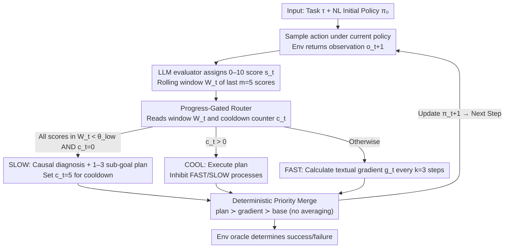

# ReflexGrad: Within-Episode Failure Recovery in LLM Agents via Progress-Gated Dual-Process Routing

**Conference**: ICML 2026 Workshop (FoGen)  
**arXiv**: [2511.14584](https://arxiv.org/abs/2511.14584)  
**Code**: https://github.com/qpiai/reflexgrad (Available)  
**Area**: LLM Agent / Failure Recovery / Inference-time Learning  
**Keywords**: Dual-process architecture, Progress-gated routing, TextGrad, Reflexion, ALFWorld

## TL;DR
ReflexGrad integrates TextGrad-style "local gradient refinement every 3 steps" as a fast process and Reflexion-style "causal re-planning triggered by consecutive low scores" as a slow process. Using a progress-gated routing rule to switch between them zero-shot within a **single episode**, it improves Qwen-3-8B's success rate on 134 ALFWorld tasks from 35.1% to 75.4% (+40.3pp), surpassing 1-shot LATS / ToT / Self-Refine under equivalent compute budgets.

## Background & Motivation

**Background**: Mainstream improvements for LLM agents in long-horizon text environments like ALFWorld follow two paths. One is the Reflexion family (including ReflAct), which performs policy-level error correction by "running a full trial → writing self-reflection → retrying in the next round." The other includes the TextGrad / DSPy / OPRO family, which treats natural language policies as optimizable parameters and performs local refinement within a session using "textual gradients." Additionally, search methods like ToT / LATS expand the action space at each step but **never update the policy itself**.

**Limitations of Prior Work**: Evaluation reveals a typical failure mode: an agent commits to a wrong path early in an episode (e.g., attempting to use a stove instead of a microwave to heat). Since environment feedback is often ambiguous (e.g., "nothing happened"), the agent continues refining under a flawed strategy until the step budget is exhausted. In other words, **the information required to escape the loop is already present in the failed trajectory**, but Reflexion waits until the next trial to use it, TextGrad only makes the incorrect strategy more precise, and search methods fail to update the strategy at all.

**Key Challenge**: Policy-level correction (slow, requires causal diagnosis) and tactical-level correction (fast, local) occur at different time scales. Existing methods operate on only one scale, and Reflexion's policy correction is constrained by the prerequisites of "restarting the trial" and "requiring demonstrations for bootstrapping."

**Goal**: To construct a **single-episode, zero-shot, training-free** failure recovery mechanism. This requires solving three sub-problems: (i) When should it upgrade from tactical refinement to strategic re-planning? (ii) After upgrading, how should new plans and old gradients be merged without conflict? (iii) How can the upgrade trigger be made robust to evaluator noise?

**Key Insight**: The authors observe that "flawed policy + persistent local refinement" leaves a specific signature on the trajectory: **consecutive $m$ low progress scores**. This can serve as a gated signal to switch from fast to slow, being more targeted than fixed cadence or random switching.

**Core Idea**: Utilize a progress-gated routing rule $R_t$ that allows the fast process (TextGrad) to perform local gradients during high-score phases, while the slow process (Reflexion) is triggered only upon $m$ consecutive low scores for causal diagnosis and short-term planning. A cooldown window is used to protect plan execution from contamination by new gradients.

## Method

### Overall Architecture
ReflexGrad addresses the "commitment to failure" mode where LLM agents in long-horizon tasks refine wrong strategies until exhaustion. It merges two time scales of error correction into a single episode: a fast process for tactical refinement and a slow process for strategic causal re-planning, with a progress-gated routing rule determining which process to activate at each step.

Specifically, the input is a natural language task $\tau$ and an initial policy $\pi_0$ (also a string). At each step, the agent receives an observation $o_t$, samples an action $a_t \sim \pi_{t-1}(o_t, \tau_{\text{act}}, M_t)$ (where $M_t$ is a sliding window of the last 10 interactions), and the environment returns $o_{t+1}$. An LLM evaluator $E$ assigns a score $s_t \in [0, 10]$ to each transition. The last $m=5$ scores form a rolling window $W_t$. The router reads $W_t$ and a cooldown counter $c_t$ to **select exactly one** mode: FAST (~85% of steps), SLOW (~15%), or COOL (plan execution). Outputs from both processes are merged into $\pi_{t+1}$ via a fixed-priority function. Final success is determined by the environment oracle; **evaluator scores are used only for routing**.

### Key Designs

**1. Progress-Gated Routing: "m Consecutive Low Scores" as Trigger**

This serves as the main switch for the architecture, targeting the issue that fixed or random switching ignores the structural signature of the fast process being stuck. The observation is that TextGrad's gradients are local and may refine a wrong strategy; the only observable trace is "consecutive low scores despite local refinement." The routing rule is: if $c_t = 0$ and all $s_i \in W_t < \theta_{\text{low}}$, trigger SLOW; if $c_t > 0$, trigger COOL; otherwise, use FAST. Crucially, the **criterion is "all $m$ scores below threshold" rather than a low window average**: single noisy low scores won't cause misfires; only $m$ consecutive failures indicate convergence into a dead end. Once SLOW is triggered, $c_t$ is set to $c=5$, inhibiting both processes during the cooldown to allow for plan execution.

The authors provide a union bound for robustness to evaluator noise: if the false positive rate $\eta_{\text{fp}} \approx 3\%$, the upper bound of $m=5$ independent misfires is $\leq m\,\eta_{\text{fp}} \approx 15\%$, while in practice (GPT-5), misfires were zero. Sensitivity sweeps show the rule is robust to the three threshold parameters.

**2. Fast / Slow Dual-Process + Cooldown Protection**

The fast process addresses "local fixable errors" (e.g., avoiding a specific dead action), while the slow process handles "strategic deviation" (e.g., using a microwave instead of a stove). In FAST mode, a textual gradient $g_t = \text{LLM}_{\text{grad}}(\pi_t, W_t[-k:], \{(o_i, a_i, o_{i+1})\}_{i=t-k+1}^t)$ is calculated every $k=3$ steps. In SLOW mode, a causal diagnosis $\rho_t = \text{LLM}_{\text{diag}}(\pi_t, W_t, \{(o_i, a_i, o_{i+1}, s_i)\}_{i=t-m+1}^t)$ outputs a short-term plan with 1-3 sub-goals.

The cooldown is vital: after adopting a new plan, the first few steps often still reflect low scores from the failed trajectory. Without inhibiting the fast process, it would immediately generate a gradient based on these scores and overwrite the new plan. This protection leads to super-additive synergy: on GPT-5, fast-only (69.4%) and slow-only (53.0%) yield a combined expected gain of 29.8pp, but the integrated system achieves 88.1% (**+12.0pp synergy**).

**3. Deterministic Priority Merge: Never Average NL Instructions**

Simply concatenating or averaging natural language updates is problematic; concatenation leads to context overflow, and averaging risks merging "go to microwave" and "continue with stove" into nonsense. ReflexGrad uses a fixed-priority overwrite: $\pi_{t+1} = \text{Merge}(\pi_t, \text{plan}=\rho_t)$ (SLOW) / $\text{Merge}(\pi_t, \text{grad}=g_t)$ (FAST at $k=3$) / $\pi_t$ (other). The priority is plan ≻ gradient ≻ base policy—**discarding lower priority updates in case of conflict**. To control policy drift, the working memory is fixed, and each update replaces or adjusts current instructions rather than appending history. 

### Mechanism Example: heat tomato (Appendix D)
In a "heat the tomato" task, the agent initially commits to using a stove. The feedback is ambiguous ("nothing happened"), and FAST generates local gradients (e.g., adjusting grip or placement) on this wrong path. After $m$ consecutive low scores, routing switches to SLOW. The diagnosis concludes that "heating in ALFWorld requires a microwave," and a short plan is produced (find microwave → insert tomato → activate). Cooldown (5 steps) ensures the plan is executed without FAST interference, leading to success.

### Loss & Training
**Completely training-free**. All updates occur at inference time; no parameters are optimized via gradient descent. "Textual gradients" are NL strings generated by the LLM. Fixed hyperparameters: $k=3, m=5, \theta_{\text{low}}=4, c=5$, working memory 10, max_steps 15.

## Key Experimental Results

### Main Results

**Cross-model Ablation (ALFWorld 134 tasks, 10 seeds, zero-shot)**:

| Method | GPT-5 | Qwen-3-8B | Gain vs zero-shot |
|------|-------|-----------|----------------|
| Zero-shot | 46.3±1.5 | 35.1±1.5 | — |
| Reflexion-only | 53.0±2.0 | 42.5±2.2 | +6.7 / +7.4 |
| TextGrad-only | 69.4±2.2 | 61.2±1.5 | +23.1 / +26.1 |
| **Ours (ReflexGrad)** | **88.1±2.0** | **75.4±2.2** | **+41.8 / +40.3** |

The architectural gain difference between models is only 1.5pp ($p \approx 0.13$), suggesting the gain stems from the architecture rather than scale. Super-additive synergy is observed: +12.0pp on GPT-5 and +6.8pp on Qwen-3-8B.

**Compute-Equivalent Comparison (Qwen-3-8B)**:

| Method | Demos | Calls/Task | Success |
|------|-------|-----------|---------|
| ReAct | 1-shot | ~10 | 65.7 |
| Self-Refine | 1-shot | ~55 | 68.7±1.9 |
| Tree of Thoughts | 1-shot | ~100 | 69.7±2.2 |
| LATS | 1-shot | ~140 | 72.7±2.0 |
| **Ours (ReflexGrad)** | **None** | **~100** | **75.4±2.2** |
| ReflAct | 1-shot | ~10 | 80.6 |

Zero-shot ReflexGrad outperforms 1-shot LATS (+2.7pp, $p \approx 0.01$) and ToT (+5.7pp) with 30% lower compute. It does not surpass ReflAct (80.6%), with the 5.2pp gap attributed to "verb-receptacle" world knowledge typically conveyed via demonstrations.

### Ablation Study

**Routing Threshold Sensitivity Sweep (GPT-5)**:

| Parameter | Range | Results |
|------|---------|---------|
| Gradient window $k$ | $\{2, 3, 5\}$ | 85.8% – 88.1% |
| Trigger threshold $m$ | $\{3, 5, 7\}$ | 84.3% – 88.1% |
| Score cutoff $\theta_{\text{low}}$ | $\{3, 4, 7\}$ | 84.3% – 88.1% |

Maximum fluctuation across sweeps is 3.8pp. Even the worst configuration ($m=3$ over-triggering) remains at 84.3%, significantly higher than zero-shot (46.3%).

### Key Findings
- **Synergy stems from the routing/cooldown interface**: FAST and SLOW solve different issues; the key is switching precisely when FAST stalls and protecting the new plan via cooldown.
- **The "consecutive m low scores" trigger is the soul of the design**: It is extremely robust to evaluator noise (GPT-5 showed zero misfires).
- **Zero-shot ReflexGrad > 1-shot ToT at 100 calls/task**: The architecture partially replaces the utility of demonstrations through gradients and diagnosis, though it cannot replace implicit world knowledge.

## Highlights & Insights
- **Progress-gated switching** via continuous score streams is smoother than binary success/failure signals and cheaper than learning a routing policy. This paradigm can be extended to any agent task with step-wise reward signals.
- **The priority merge mechanism** effectively prevents policy text from exploding (limiting growth from ~150 to ~380 tokens) and avoids the dilution of instructions that occurs with averaging.
- **Auditability**: Every SLOW activation produces a trigger condition, diagnosis, and plan, allowing for post-hoc explanation in safety-critical scenarios.
- **Cross-model consistency**: The architecture provides comparable gains regardless of model scale, highlighting its structural effectiveness.

## Limitations & Future Work
- **Limitations**: (i) Domain probe tests (TextWorld, OSWorld) are small-scale; (ii) dependency on GPT-5 for some results; (iii) the gap with 1-shot ReflAct due to missing world knowledge.
- **Personal Insights**: Trigger conditions ($m=5$, $\theta_{\text{low}}=4$) were tuned on ALFWorld's dense feedback and might fail in sparse reward tasks (e.g., WebShop). The cooldown is a hard-coded constant; adaptive lengths could further optimize performance.
- **Future Work**: Transforming the routing into an online predictor of strategic plateaus to trigger SLOW even earlier.

## Related Work & Insights
- **vs Reflexion**: Reflexion corrections occur between trials with demo bootstrapping; ours occurs within a single episode zero-shot.
- **vs TextGrad**: ReflexGrad adds a slow process to escape the local refinement loops that stall TextGrad.
- **vs AdaPlanner**: While both use within-episode switching, AdaPlanner relies on binary success signals, whereas ReflexGrad uses progress scores for "tactical-to-strategic" escalation.
- **vs DPT-Agent / CogRouter**: ReflexGrad is distinct in being training-free, single-model, and demo-free.

## Rating
- **Novelty**: ⭐⭐⭐⭐ Progress-gated dual-process is a novel combination of existing primitives (TextGrad/Reflexion).
- **Experimental Thoroughness**: ⭐⭐⭐⭐⭐ Robust cross-model testing, sensitivity sweeps, and compute-equivalent comparisons.
- **Writing Quality**: ⭐⭐⭐⭐⭐ Clear positioning and professional analysis of concurrent work.
- **Value**: ⭐⭐⭐⭐ High practical value for inference-time learning and auditable agent deployment.

<!-- RELATED:START -->

## Related Papers

- [\[AAAI 2026\] DEPO: Dual-Efficiency Preference Optimization for LLM Agents](../../AAAI2026/llm_agent/depo_dual-efficiency_preference_optimization_for_llm_agents.md)
- [\[ICML 2026\] Process Reward Agents for Steering Knowledge-Intensive Reasoning](process_reward_agents_for_steering_knowledge-intensive_reasoning.md)
- [\[ACL 2025\] Leveraging Dual Process Theory in Language Agent Framework for Real-time Simultaneous Human-AI Collaboration](../../ACL2025/llm_agent/dpt_agent_dual_process.md)
- [\[ICLR 2026\] AgenTracer: Who Is Inducing Failure in the LLM Agentic Systems?](../../ICLR2026/llm_agent/agentracer_who_is_inducing_failure_in_the_llm_agentic_systems.md)
- [\[AAAI 2026\] ProBench: Benchmarking GUI Agents with Accurate Process Information](../../AAAI2026/llm_agent/probench_benchmarking_gui_agents_with_accurate_process_infor.md)

<!-- RELATED:END -->
