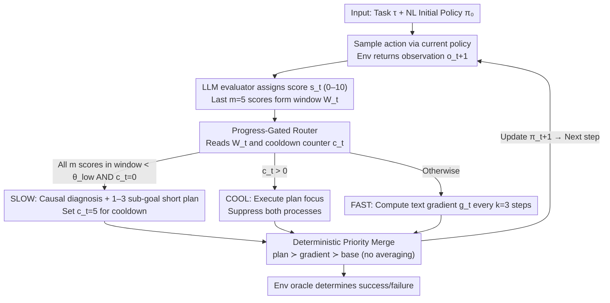

# ReflexGrad: Within-Episode Failure Recovery in LLM Agents via Progress-Gated Dual-Process Routing

**Conference**: ICML 2026 Workshop (FoGen)  
**arXiv**: [2511.14584](https://arxiv.org/abs/2511.14584)  
**Code**: https://github.com/qpiai/reflexgrad (Available)  
**Area**: LLM Agent / Failure Recovery / Test-Time Learning  
**Keywords**: Dual-Process Architecture, Progress-Gated Routing, TextGrad, Reflexion, ALFWorld

## TL;DR
ReflexGrad utilizes TextGrad-style "local gradient refinement every 3 steps" as a fast process and Reflexion-style "causal replanning triggered by consecutive low scores" as a slow process. Using a progress-gated routing rule to switch between the two within a **single episode** without demonstrations, it improves Qwen-3-8B's success rate on 134 ALFWorld tasks from 35.1% to 75.4% (+40.3pp), outperforming 1-shot LATS / ToT / Self-Refine under equivalent compute budgets.

## Background & Motivation

**Background**: Mainstream improvement routes for LLM agents in long-horizon text environments like ALFWorld fall into two categories: the Reflexion family (including ReflAct), which performs strategy-level error correction by "completing a trial → writing a self-reflection → retrying in the next round"; and the TextGrad/DSPy/OPRO family, which treats natural language policies as optimizable parameters and performs local refinements within a session using "textual gradients." There are also test-time search methods like ToT/LATS that expand the action space at each step but **never update the policy itself**.

**Limitations of Prior Work**: A typical failure mode observed in practice is that an agent commits to an incorrect path early in the episode (e.g., attempting to use a stove instead of a microwave to heat something). Environment feedback is often ambiguous (e.g., "nothing happened"), causing the agent to refine its incorrect policy until the step budget is exhausted. In other words, **the information needed to escape the loop is already present in the failed trajectory**, but Reflexion waits until the next trial to use it, TextGrad only makes the incorrect policy more precise, and search methods fail to update the policy entirely.

**Key Challenge**: Strategy-level correction (slow, requiring causal diagnosis) and tactical-level correction (fast, local) occur at different time scales. Existing methods operate only on one scale. Furthermore, Reflexion's strategy-level correction is tied to the prerequisites of "restarting the trial" and "requiring few-shot demonstration bootstrapping."

**Goal**: Construct a failure recovery mechanism that is **within-episode, zero-shot, and training-free**. This requires solving three sub-problems: (i) When should tactical refinement be escalated to strategic replanning? (ii) After escalation, how can new strategies and old gradients be merged without conflict? (iii) How can the escalation trigger be made robust to evaluator noise?

**Key Insight**: The authors observe that "incorrect policy + continuous local refinement" leaves a specific signature on the trajectory—**$m$ consecutive low progress scores**. This serves as a gating signal for the fast→slow transition, being more targeted than fixed cadence or random switching.

**Core Idea**: A progress-gated router $R_t$ allows the fast process (TextGrad) to continuously apply local gradients when scores are high, while triggering the slow process (Reflexion) for causal diagnosis and short-term planning only after $m$ consecutive low scores. A cooldown window protects plan execution from being corrupted by new gradients.

## Method

### Overall Architecture
ReflexGrad addresses the "persisting in a failing path" failure mode in long-horizon LLM agent tasks. It integrates two timescales of error correction into a single episode: a fast process for local tactical refinement and a slow process for strategy-level causal replanning, with a progress-gated routing rule deciding which process to activate at each step.

Specifically, the input consists of a natural language task $\tau$ and an initial policy $\pi_0$ (also a string). At each step, the agent receives an observation $o_t$, samples an action $a_t \sim \pi_{t-1}(o_t, \tau_{\text{act}}, M_t)$ (where $M_t$ is a sliding window of the last 10 interactions), and the environment returns $o_{t+1}$. An LLM evaluator $E$ assigns a score $s_t \in [0, 10]$ to each transition $s_t = E(o_t, a_t, o_{t+1}, \tau)$. The last $m=5$ scores form a rolling window $W_t$. The router reads $W_t$ and a cooldown counter $c_t$ to select **exactly one** mode per step: FAST (approx. 85% of steps), SLOW (approx. 15%), or COOL (plan execution period). Outputs from both processes are written back to $\pi_{t+1}$ via a fixed-priority merge function. Final success is determined by the environment oracle; **evaluator scores are used only for routing**.

### Key Designs

**1. Progress-Gated Routing: "Consecutive $m$ Low Scores" as the Switch**

This serves as the master switch for the architecture, addressing the pain point that fixed cadence/random switching ignores the structural signature of the fast process being stuck. The observation is that TextGrad's gradients are local and may refine an incorrect strategy. The only observable trace is "consecutive low scores despite local refinement." The routing rule is: if $c_t = 0$ and all $s_i \in W_t < \theta_{\text{low}}$, activate SLOW; if $c_t > 0$, activate COOL; otherwise, activate FAST. Critically, the **criterion is "all $m$ scores below threshold" rather than "average score is low"**. A single noisy low score will not trigger the escalation; only $m$ consecutive failures indicate that the local process has converged into a dead end. Once SLOW is triggered, $c_t$ is set to $c=5$, during which both processes are suppressed to focus on the new plan.

To prove robustness against evaluator noise, the authors provide a union bound: if the evaluator false positive rate $\eta_{\text{fp}} \approx 3\%$, the upper bound for $m=5$ independent consecutive false triggers is $\leq s m \eta_{\text{fp}} \approx 15\%$, while in practice (GPT-5), false triggers were zero. Sensitivity sweeps show the method is robust to threshold choices.

**2. Fast / Slow Dual-Process + Cooldown: Managing Different Time Scales**

The fast process fixes "small, locally correctable errors" (e.g., avoiding a specific dead action), while the slow process fixes "strategic deviations" (e.g., using a microwave instead of a stove). Neither is sufficient alone. During FAST steps, a text gradient is computed every $k=3$ steps: $g_t = \text{LLM}_{\text{grad}}(\pi_t, W_t[-k:], \{(o_i, a_i, o_{i+1})\}_{i=t-k+1}^t)$. When SLOW is triggered, a causal diagnosis is performed: $\rho_t = \text{LLM}_{\text{diag}}(\pi_t, W_t, \{(o_i, a_i, o_{i+1}, s_i)\}_{i=t-m+1}^t)$, outputting a short plan with 1-3 sub-goals.

The cooldown is the key bridge: when a new plan is introduced, the first few steps often still reflect residual low scores from the failed trajectory. Without suppression, the fast process would immediately generate a gradient based on these low scores, overwriting the new plan. Protecting this segment results in **super-additive synergy**: on GPT-5, fast-only (69.4%) + slow-only (53.0%) results in 88.1%. The actual gain (+41.8pp) exceeds the sum of individual gains (+29.8pp) by **+12.0pp**.

**3. Deterministic Priority Merge: Never Average Natural Language Instructions**

Naively merging two natural language updates via concatenation or averaging fails: concatenation causes token explosion, and averaging creates nonsensical instructions. ReflexGrad uses fixed-priority overwriting: $\pi_{t+1} = \text{Merge}(\pi_t, \text{plan}=\rho_t)$ (SLOW) / $\text{Merge}(\pi_t, \text{grad}=g_t)$ (FAST if $t \bmod k = 0$) / $\pi_t$ (otherwise), with priority: **plan ≻ gradient ≻ base policy**. Conflicting lower-priority instructions are discarded.

To control policy drift, four mechanisms are used: fixed working memory (10 steps), text gradients overwriting old instructions, SLOW plans replacing cumulative gradient drift, and length monitoring (starting at ~150 tokens, ending at ~380, max 520).

### Loss & Training
**Completely training-free.** All updates occur at test-time. No parameters are optimized via backpropagation. "Textual gradients" are LLM-generated strings, not mathematical gradients. Fixed hyperparameters: $k=3, m=5, \theta_{\text{low}}=4, c=5$, working memory 10, max steps 15.

## Key Experimental Results

### Main Results

**Cross-Model Ablation (ALFWorld 134 tasks, 10 seeds, zero-shot)**:

| Method | GPT-5 | Qwen-3-8B | Δ vs zero-shot |
|------|-------|-----------|----------------|
| Zero-shot | 46.3±1.5 | 35.1±1.5 | — |
| Reflexion-only | 53.0±2.0 | 42.5±2.2 | +6.7 / +7.4 |
| TextGrad-only | 69.4±2.2 | 61.2±1.5 | +23.1 / +26.1 |
| **ReflexGrad** | **88.1±2.0** | **75.4±2.2** | **+41.8 / +40.3** |

The architectural gain difference across models is only 1.5pp ($p \approx 0.13$), suggesting the improvement stems from the architecture rather than model scale.

**Compute-Equivalent Comparison (Qwen-3-8B)**:

| Method | Demos | Calls/Task | Success |
|------|-------|-----------|---------|
| ReAct | 1-shot | ~10 | 65.7 |
| Self-Refine | 1-shot | ~55 | 68.7±1.9 |
| Tree of Thoughts | 1-shot | ~100 | 69.7±2.2 |
| LATS | 1-shot | ~140 | 72.7±2.0 |
| **ReflexGrad** | **None** | **~100** | **75.4±2.2** |
| ReflAct | 1-shot | ~10 | 80.6 |

Zero-shot ReflexGrad outperforms 1-shot LATS by +2.7pp ($p \approx 0.01$) with 30% less compute. It does not match ReflAct (80.6%), as ReflAct uses demonstrations to pass "verb-receptacle" world knowledge that the agent otherwise lacks.

### Ablation Study

**Routing Threshold Sensitivity Sweep (GPT-5)**:

| Parameter | Range | Results |
|------|---------|---------|
| Gradient window $k$ | $\{2, 3, 5\}$ | 85.8% – 88.1% |
| Trigger threshold $m$ | $\{3, 5, 7\}$ | 84.3% – 88.1% |
| Score cutoff $\theta_{\text{low}}$ | $\{3, 4, 7\}$ | 84.3% – 88.1% |

Maximum fluctuation across sweeps is only 3.8pp, with the worst configuration ($m=3$) still reaching 84.3%.

### Key Findings
- **Synergy comes from the integration of cooldown + routing**: The critical moment is switching to SLOW the instant FAST stalls and allowing the plan to execute via cooldown.
- **Routing by "consecutive $m$ low scores" is robust**: The upper bound for false positives is low, and empirically zero for GPT-5, making it highly robust to evaluator noise.
- **Comparison to 1-shot methods**: ReflexGrad's continuous gradients + slow diagnosis **partially substitute for demonstrations**, though they cannot replace missing implicit world knowledge.

## Highlights & Insights
- **Progress-governed switching** is smoother than binary success/failure signals (e.g., AdaPlanner) and cheaper than learned routing policies. This "escalate based on progress signals" paradigm can be transferred to any agent task with step-wise reward signals.
- **Deterministic priority merging** prevents policy explosion and conflicting instructions, solving the "averaging" problem in natural language policy updates.
- **Auditability**: Each SLOW activation produces a trigger condition, causal diagnosis, and plan. This makes the architecture suitable for safety/compliance scenarios requiring post-hoc explanations.

## Limitations & Future Work
- Generality is limited to environments with relatively dense progress signals; in sparse reward tasks like WebShop, the trigger might fail.
- Evaluator false positive rates (~3%) set a performance ceiling; future work could involve self-calibrating evaluators.
- Cooldown length $c=5$ is currently a hard-coded constant; adaptive cooldowns based on plan length could further optimize the step budget.

## Related Work & Insights
- **vs Reflexion**: Reflexion performs inter-trial reflection with demonstrations; ReflexGrad performs intra-episode diagnosis without demonstrations and uses gating to reduce overhead.
- **vs TextGrad**: ReflexGrad incorporates TextGrad's tactical refinement but adds a SLOW process to escape local minima where gradients alone would fail.
- **vs ReflAct**: ReflAct uses 1-shot demos for 80.6%. ReflexGrad reaches 75.4% without demos, with the gap attributed to specific environment world knowledge contained in demonstrations.

## Rating
- Novelty: ⭐⭐⭐⭐ (Novel combination of existing primitives: TextGrad/Reflexion/Gating).
- Experimental Thoroughness: ⭐⭐⭐⭐⭐ (Cross-model tests, compute-equivalent baselines, sensitivity sweeps, and failure analysis).
- Writing Quality: ⭐⭐⭐⭐⭐ (Clear positioning and well-defined falsifiable hypotheses).
- Value: ⭐⭐⭐⭐ (Simple, reproducible, and provides significant gains for within-episode recovery).

<!-- RELATED:START -->

... [Related Papers Section] ...

<!-- RELATED:END -->

## Related Papers

- [\[AAAI 2026\] DEPO: Dual-Efficiency Preference Optimization for LLM Agents](../../AAAI2026/llm_agent/depo_dual-efficiency_preference_optimization_for_llm_agents.md)
- [\[ICML 2026\] Process Reward Agents for Steering Knowledge-Intensive Reasoning](process_reward_agents_for_steering_knowledge-intensive_reasoning.md)
- [\[ACL 2025\] Leveraging Dual Process Theory in Language Agent Framework for Real-time Simultaneous Human-AI Collaboration](../../ACL2025/llm_agent/dpt_agent_dual_process.md)
- [\[AAAI 2026\] ProBench: Benchmarking GUI Agents with Accurate Process Information](../../AAAI2026/llm_agent/probench_benchmarking_gui_agents_with_accurate_process_infor.md)
- [\[ICLR 2026\] WebArbiter: A Principle-Guided Reasoning Process Reward Model for Web Agents](../../ICLR2026/llm_agent/webarbiter_a_principle-guided_reasoning_process_reward_model_for_web_agents.md)

<!-- RELATED:END -->
