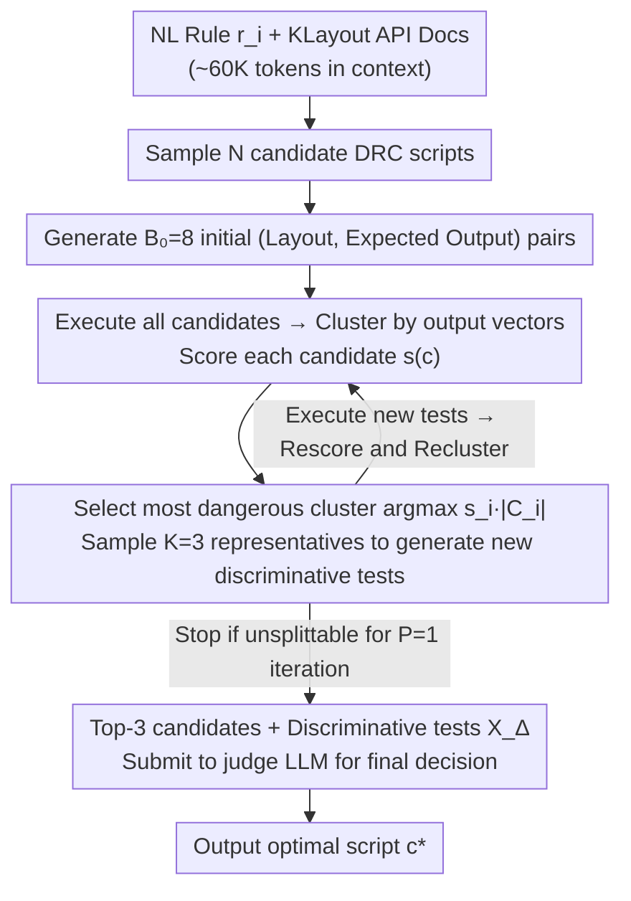

# Rule2DRC: Benchmarking LLM Agents for DRC Script Synthesis with Execution-Guided Test Generation

**Conference**: ICML 2026  
**arXiv**: [2605.15669](https://arxiv.org/abs/2605.15669)  
**Code**: https://github.com/snu-mllab/Rule2DRC (Available)  
**Area**: LLM Agent / Code Generation / EDA / Test Generation  
**Keywords**: DRC Script Synthesis, KLayout, Best-of-N Selection, Test-Driven Clustering, Electronic Design Automation

## TL;DR
The authors construct Rule2DRC, a large-scale EDA benchmark containing 1,000 natural language design rules and 13,921 evaluation layouts. Performance is measured via execution-level scoring using the KLayout engine rather than code similarity. They propose SplitTester: a method that clusters $N$ candidate DRC scripts based on execution consistency, iteratively generates new layouts to split the most "dangerous" cluster (defined by the product of score and cluster size), and finally utilizes a judge LLM to select the optimal script based on discriminative tests.

## Background & Motivation

**Background**: Before tape-out, chips must pass thousands of geometric Design Rule Checking (DRC) constraints. Each rule is typically released by foundries in two forms: natural language (NL) descriptions and executable DRC scripts. DRC engines (KLayout, SVRF, etc.) execute these scripts to determine layout violations. Recent work has begun using LLMs to translate NL rules into executable DRC scripts, such as keyword extraction (DRC-SG), AST-guided retrieval-augmented fine-tuning (AST-Guided SVRF), and multimodal approaches (DRC-Coder).

**Limitations of Prior Work**: The authors identify two critical issues. First, existing benchmarks are small (DRC-SG has 200 rules, AST-Guided has 74, DRC-Coder has 7) and primarily rely on "code similarity" for scoring. However, the same rule can be implemented using various KLayout syntaxes (e.g., `separation`, `sized` additions/subtractions, `interacting`) that are semantically equivalent but syntactically distinct, leading to false negatives in similarity-based metrics. Second, current methods either fail to utilize execution feedback (DRC-SG, AST-Guided) or require ground-truth violation labels for evaluation layouts during inference (DRC-Coder), which is unrealistic in real-world scenarios where these labels themselves are the intended output.

**Key Challenge**: While DRC tasks are naturally suited for Best-of-N (BoN) sampling, generating corner-case layouts that effectively differentiate candidates is difficult, and LLM-generated "expected labels" are often noisy. Existing tester agents have weaknesses: CodeMonkey aggressively prunes candidates to Top-3 before generating tests, potentially discarding the correct solution prematurely, while S* focuses test generation on already-separated candidates rather than unresolved high-quality clusters.

**Goal**: (1) Provide a sufficiently large benchmark that uses execution-level scoring and keeps evaluation layouts private from the agent; (2) Design a BoN selector specifically aimed at splitting candidate groups that remain indistinguishable by existing tests.

**Key Insight**: The bottleneck in LLM test generation is not the quantity of tests, but their discriminative power regarding the current candidate pool. By clustering $N$ candidates based on their output vectors across existing tests, scripts within a cluster remain indistinguishable. Continuously splitting the most "dangerous" clusters (large clusters with high average scores) ensures that the resulting discriminative tests provide sufficient evidence for a judge LLM.

**Core Idea**: Replace code similarity with execution-level scoring as the evaluation metric and utilize "targeted splitting of indistinguishable high-score clusters" as the BoN selection strategy.

## Method

### Overall Architecture
The paper combines a benchmark (Rule2DRC) and a BoN selection algorithm (SplitTester). Rule2DRC defines NL rule-to-DRC script translation as a task evaluated solely by execution results on private layouts. SplitTester samples $N$ candidates, generates initial test layouts, clusters them based on execution, and iteratively splits the most critical clusters before a final judge LLM makes the terminal selection. Each task is defined as a tuple $\langle r_i, c_i, \{x_{ij}\}_{j=1}^{m_i}, \{\phi(x_{ij}, c_i)\}\rangle$, where $r_i$ is the NL rule, $c_i$ is the ground-truth script, $\{x_{ij}\}$ are private evaluation layouts, and $\phi$ is the violation detection function.

### Key Designs

**1. Rule2DRC Benchmark: Execution-Level Scoring + Private Evaluation Layouts**

To solve the limitations of small and inaccurate benchmarks, the authors curated 310 rules from the open-source SkyWater130 PDK. To cover complex multi-layer constraints for sub-7nm nodes, 490 additional rules were drafted by GPT-5.2 and manually verified. Another 200 rules were added to cover rare KLayout DSL syntax (frequency <5), totaling 1,000 tasks and 13,921 layouts. Layouts include both "pass" and "fail" cases, focusing on hard negative samples near threshold boundaries. Performance is measured by $\text{SuccessRate}(f) = \frac{1}{n}\sum_i s_i$, where $s_i = 1$ iff the script matches ground-truth behavior on all private layouts. No code similarity is used.

**2. SplitTester: Targeted Budget Allocation for Indistinguishable Clusters**

Standard selectors often fail to generate effective corner cases. SplitTester iteratively refines the test suite by identifying candidates that produce identical output vectors. Each candidate is scored by $s(c) = \frac{1}{|T|}\sum_{(x,\phi^*) \in T} \mathbb{1}[\phi(x, c) = \phi^*]$, representing consistency with LLM-generated expected labels. In each iteration, it selects the cluster satisfying:

$$i^* = \arg\max_i s_i |C_i|$$

This targeted approach maximizes information gain by prioritizing clusters that are likely to contain the correct solution ($s_i$ is high) but are still too large ($|C_i|$), suggesting the presence of incorrect candidates. $K=3$ representatives are used to keep prompts concise. If a cluster cannot be split within $P=1$ attempt, the process stops to save budget.

**3. Expected Labels + Two-Stage Judgment with Long-Context API Documentation**

Since LLM-generated expected labels $\phi^*(x)$ can be noisy, SplitTester uses a two-stage decision process. It uses the labels to guide clustering but performs the final selection using a judge LLM that examines the Top-3 candidates and the specific subset of tests where they differ:

$$X_\Delta = \{x : \exists c_a, c_b \in C_3, \phi(x, c_a) \neq \phi(x, c_b)\}$$

Additionally, 60K tokens of KLayout API documentation are included in the context, which significantly improved performance (pass@1 of GPT-OSS-120B increased by over 20 percentage points), acknowledging that DRC DSL is too niche for purely parametric memory.

### Loss & Training
No training is involved. The work utilizes off-the-shelf checkpoints: Qwen3-30B-A3B-Instruct-2507, GPT-OSS-20B, and GPT-OSS-120B (with medium reasoning effort). SplitTester hyperparameters: $B_0 = 8$, $B = 8$, $K = 3$, $P = 1$.

## Key Experimental Results

### Main Results
Evaluation conducted on the full 1,000 tasks of Rule2DRC. Results are averaged over three runs.

| Model | Setting | LLM-as-Judge | Generated Tests (8) | CodeMonkey | SplitTester (Ours) | Oracle@N |
|------|------|--------------|---------------------|------------|---------------------|----------|
| GPT-OSS-120B | BoN-10 Success Rate | 37.6 | 54.5 | 56.9 | **58.0** | 63.0 |
| GPT-OSS-120B | BoN-20 Success Rate | 37.6 | 59.4 | 62.7 | **63.8** | 72.1 |
| GPT-OSS-20B | BoN-20 Success Rate | 28.0 | 39.0 | 41.1 | **44.4** | 53.8 |
| GPT-OSS-20B | BoN-20 Error Rate | 54.9 | 14.0 | 14.1 | **12.6** | 11.6 |
| Qwen3-30B-A3B | BoN-20 Success Rate | 16.0 | 17.3 | 17.2 | **18.0** | 23.7 |
| Qwen3-30B-A3B | BoN-20 Error Rate | 65.2 | 38.5 | 38.6 | **35.1** | 29.5 |

### Ablation Study (GPT-OSS-120B, BoN-10)

| Configuration | Success Rate (%) | Error Rate (%) | Description |
|------|-----------|-----------|------|
| SplitTester (Full) | **58.0** | 9.1 | Full method |
| - w/o final judge LLM | 55.5 | 9.1 | Top-1 by score only (-2.5pp) |
| - w/o expected labels | 57.1 | 9.1 | Round-robin Top-3 clusters (-0.9pp) |
| - Top-3 candidates only | 57.4 | 9.1 | Similar to CodeMonkey pruning (-0.6pp) |
| Sample-1 | 32.5 | 48.5 | Single sample baseline |
| Oracle@10 | 63.0 | 8.5 | Theoretical upper bound |

### Key Findings
- **Context Engineering is Critical**: Including 60K tokens of API documentation provided massive gains (+20 to +40pp), suggesting that niche languages like DRC DSL rely heavily on external reference knowledge.
- **Maintaining the Full Pool is Vital**: Pruning to Top-3 early (as in CodeMonkey) leads to a 0.6pp drop, confirming that "look-weak-but-are-correct" solutions are often discarded prematurely.
- **Expected Labels and Judge LLM are Complementary**: Removing either decreases performance, but the judge LLM provides a larger boost by checking evidence and resisting label noise.
- **Scaling Effects**: While SplitTester maintains a lead, the margin over CodeMonkey narrows slightly with stronger models, though the Oracle gap suggests BoN selection is far from saturated.

## Highlights & Insights
- **"Splitting Indistinguishable Clusters" as an Objective**: The usage of $\arg\max_i s_i |C_i|$ effectively targets the most informative regions of the candidate space. This pattern is transferable to any code selection task with enumerable outputs.
- **Execution-Level + Private Layout Protocol**: This combination prevents the "label leakage" issues seen in previous work like DRC-Coder, forcing the model to rely on true translation capability.
- **Efficiency through Early Stopping**: The $P$ parameter prevents budget waste on impossible-to-differentiate clusters, placing the method on the Pareto front of cost vs. performance.
- **Documentation as External Memory**: The results emphasize that long-tail domain performance is often a knowledge retrieval problem rather than just a reasoning problem.

## Limitations & Future Work
- The study is limited to the KLayout engine; supporting the industry-standard Calibre SVRF requires overcoming proprietary toolchain constraints.
- Synthetic rules drafted by GPT-5.2 may introduce an implicit bias favoring similar LLM architectures during generation.
- SplitTester lacks a "code-edit" phase. Future work could use the signals from failed splits to guide iterative script refinement.
- For strongest models, failure cases are often "common errors" where all $N$ candidates fail identically, which selection alone cannot solve.

## Related Work & Insights
- **Contrast with DRC-SG/AST-Guided**: These rely on keyword extraction and code similarity. This paper demonstrates that execution metrics reveal their accuracy is often overestimated.
- **Contrast with DRC-Coder**: DRC-Coder feeds labeled violation layouts to the model; Rule2DRC keeps these private to evaluate genuine zero-shot translation.
- **Contrast with CodeMonkey**: CodeMonkey prunes candidates early; SplitTester maintains the full pool to avoid discarding correct solutions that only differentiate later.
- **Contrast with S***: S* targets already split clusters; SplitTester targets the largest high-score clusters to maximize the marginal information of each new test.

## Rating
- Novelty: ⭐⭐⭐⭐ The cluster-splitting strategy for BoN is a clean, novel design for code selection; first rigorous execution-based DRC benchmark.
- Experimental Thoroughness: ⭐⭐⭐⭐ Extensive cross-model and cross-scale evaluations with comprehensive ablations and Pareto analysis.
- Writing Quality: ⭐⭐⭐⭐ Logical flow with clear algorithms and compelling justifications for the metrics used.
- Value: ⭐⭐⭐⭐ Provides a reproducible, high-standard open-source benchmark for EDA, with direct implications for industrial DRC automation.

<!-- RELATED:START -->

## Related Papers

- [\[ICML 2026\] Recovering Policy-Induced Errors: Benchmarking and Trajectory Synthesis for Robust GUI Agents](recovering_policy-induced_errors_benchmarking_and_trajectory_synthesis_for_robus.md)
- [\[ICLR 2026\] The Tool Decathlon: Benchmarking Language Agents for Diverse, Realistic, and Long-Horizon Task Execution](../../ICLR2026/llm_agent/the_tool_decathlon_benchmarking_language_agents_for_diverse_realistic_and_long-h.md)
- [\[ICML 2026\] Towards Feedback-to-Plan Decisions for Self-Evolving LLM Agents in CUDA Kernel Generation](towards_feedback-to-plan_decisions_for_self-evolving_llm_agents_in_cuda_kernel_g.md)
- [\[ACL 2025\] METAL: A Multi-Agent Framework for Chart Generation with Test-Time Scaling](../../ACL2025/llm_agent/metal_a_multi-agent_framework_for_chart_generation_with_test-time_scaling.md)
- [\[ICML 2026\] AutoRPA: Efficient GUI Automation through LLM-Driven Code Synthesis from Interactions](autorpa_efficient_gui_automation_through_llm-driven_code_synthesis_from_interact.md)

<!-- RELATED:END -->
