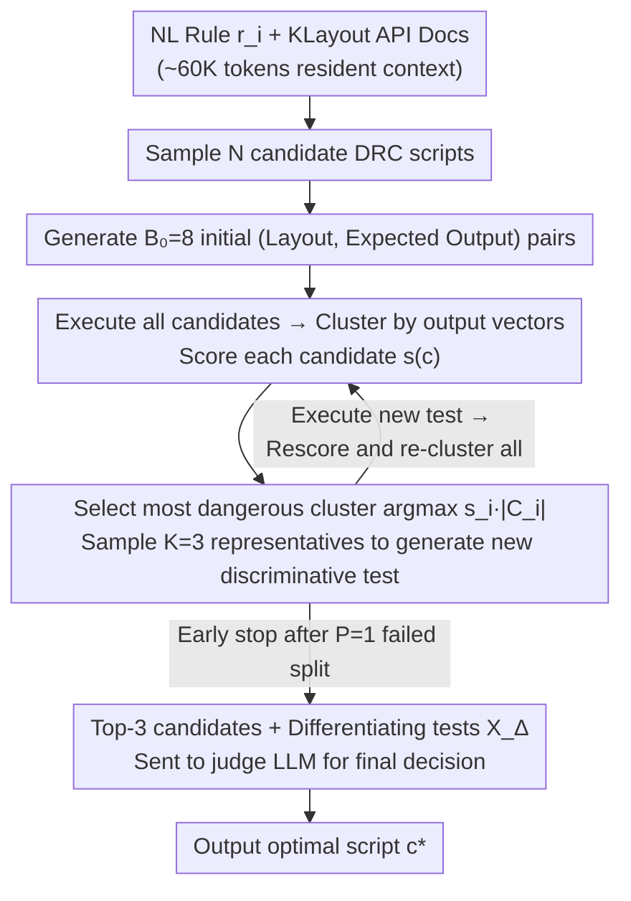

# Rule2DRC: Benchmarking LLM Agents for DRC Script Synthesis with Execution-Guided Test Generation

**Conference**: ICML 2026  
**arXiv**: [2605.15669](https://arxiv.org/abs/2605.15669)  
**Code**: https://github.com/snu-mllab/Rule2DRC (Available)  
**Area**: LLM Agent / Code Generation / EDA / Test Generation  
**Keywords**: DRC Script Synthesis, KLayout, Best-of-N Selection, Test-Driven Clustering, Electronic Design Automation

## TL;DR
The authors construct Rule2DRC, a large-scale EDA benchmark containing 1,000 natural language design rules and 13,921 evaluation layouts. It utilizes the KLayout engine for execution-level scoring instead of code similarity. They propose SplitTester: a method that clusters $N$ candidate DRC scripts based on "output consistency under current tests," iteratively generates new layouts to split the cluster with the largest "Score $\times$ Cluster Size," and finally allows a judge LLM to select the optimal candidate using the Top-3 candidates and their differentiating tests.

## Background & Motivation

**Background**: Before tape-out, chips must satisfy thousands of geometric Design Rule Checking (DRC) constraints. Each rule is typically released by foundries in two forms: Natural Language (NL) instructions and executable DRC scripts. DRC engines (e.g., KLayout, SVRF) execute these scripts to determine if a layout violates rules. Recent work has begun using LLMs to translate NL rules into executable DRC scripts, such as BERT-based keyword extraction (DRC-SG), AST-retrieval-augmented fine-tuning (AST-Guided SVRF), and multimodal approaches like DRC-Coder.

**Limitations of Prior Work**: The authors identify two independent but critical issues. First, benchmark limitations: existing evaluation sets are generally small (DRC-SG has 200 rules, AST-Guided has 74, DRC-Coder has 7), and most rely on "code similarity" for scoring. However, the same rule can be written using various semantically equivalent but string-distinct KLayout syntaxes (e.g., `separation`, `sized` addition/subtraction, `interacting`), leading code similarity metrics to misclassify correct solutions (illustrated in Figure 3 of the paper). Second, methodological limitations: existing methods either fail to utilize execution feedback from the DRC engine (DRC-SG, AST-Guided) or require evaluation layouts with ground-truth violation labels as agent input (DRC-Coder), which is nearly impossible in real-world scenarios since these labels themselves require ground-truth scripts or expert manual generation.

**Key Challenge**: The DRC task is naturally suited for Best-of-N (BoN)—sampling $N$ candidate scripts and selecting the best based on execution. However, generating corner-case layouts that can truly differentiate candidates is difficult, and the "expected output labels" generated by models themselves are often erroneous. Existing selection-based tester agents have weaknesses on corner cases: CodeMonkey aggressively prunes to the Top-3 before generating tests, potentially discarding the correct solution before a discriminative test is created; S* focuses test generation on "already differentiated candidates," failing to invest in high-quality candidates that remain entangled.

**Goal**: (1) Provide a sufficiently large benchmark that is strictly scored by execution results and does not expose evaluation layouts to the agent; (2) Design a BoN selector specifically aimed at generating new tests for groups of candidates that "cannot yet be differentiated by any existing tests."

**Key Insight**: It is observed that the real bottleneck in LLM test generation is not the "quantity of tests" but the "lack of discriminative power of the test set for the current candidate pool." If the $N$ candidates are clustered by their "output vectors on existing tests," scripts within the same cluster are indistinguishable. By iteratively splitting the most "dangerous" clusters (those both large and high-scoring), the resulting differentiated tests become sufficient for the judge LLM to make a decision.

**Core Idea**: Replace code similarity with execution-level scoring as the evaluation metric, and replace "supplementing tests between differentiated candidates" with "targeted splitting of indistinguishable high-score clusters" as the BoN selection strategy.

## Method

### Overall Architecture
This paper combines a benchmark with a BoN selection algorithm. On the benchmark side (Rule2DRC), the NL design rule to executable DRC script task is defined as a mission where evaluation layouts are private to the agent and scoring is based solely on execution. On the algorithm side (SplitTester), after sampling $N$ candidate scripts, it generates test layouts, executes all candidates, clusters them, and purposefully splits the most dangerous clusters before a judge LLM selects the optimal script from a narrow evidence set. To understand SplitTester, one must consider its input-output protocol: each task is a quadruple $\langle r_i, c_i, \{x_{ij}\}_{j=1}^{m_i}, \{\phi(x_{ij}, c_i)\}\rangle$, where $r_i$ is the NL rule, $c_i$ is the ground-truth DRC script, $\{x_{ij}\}$ are private evaluation layouts, and $\phi(\cdot, \cdot) \in \{0,1\}$ is the DRC engine's binary violation function. The agent $f(\cdot)$ only sees $r_i$, KLayout API documentation, and its own generated intermediates, outputting script $f(r_i)$. Success rate is the ratio of tasks where $\phi(x_{ij}, f(r_i)) = \phi(x_{ij}, c_i)$ for all evaluation layouts. SplitTester selects $c^*$ from candidates $\mathcal{C} = \{c_1, \dots, c_N\}$ where $N \in \{10, 15, 20\}$ without touching ground-truth labels or private layouts.

### Key Designs

**1. Rule2DRC Benchmark: Execution-level Scoring + Private Evaluation Layouts**

This addresses the inaccuracy and small scale of existing DRC benchmarks. Rule2DRC includes 310 rules from the open-source SkyWater130 PDK. To cover multi-layer cascading constraints for sub-7nm nodes, 490 additional multi-layer rules were drafted by GPT-5.2 and manually verified. An extra 200 rules were added to trigger syntax constructs appearing fewer than 5 times, ensuring full coverage of the KLayout DSL spectrum. This results in 1,000 translation tasks and 13,921 evaluation layouts. Each task includes both "pass" and "fail" layout samples, with hard negative samples where violations are at the threshold edge. Scoring uses $\text{SuccessRate}(f) = \frac{1}{n}\sum_i s_i$, where $s_i = 1$ if and only if $\forall j: \phi(x_{ij}, f(r_i)) = \phi(x_{ij}, c_i)$. This is the first implementation in this field to combine execution-level scoring with private layouts, preventing both misclassification of equivalent code and label-based cheating.

> ⚠️ Model names like GPT-5.2 are as per the original text.

**2. SplitTester: Targeting Test Budgets at Indistinguishable High-Score Clusters**

The bottleneck in BoN for DRC is generating discriminative corner-case layouts. SplitTester observes that the limitation is the lack of discriminative power in the test set. It first generates $B_0$ initial (layout, expected output) pairs. After execution, candidates are clustered into $\{C_i\}$ based on identical output vectors. Each candidate is scored by $s(c) = \frac{1}{|T|}\sum_{(x,\phi^*) \in T} \mathbb{1}[\phi(x, c) = \phi^*]$, the ratio of consistency with expected outputs across all tests. It then iteratively selects:

$$i^* = \arg\max_i s_i |C_i|$$

This targeted cluster is "high-scoring and large." $s_i$ being large suggests the cluster likely contains the correct solution, while a large $|C_i|$ indicates a higher probability of containing incorrect solutions. Directing the test budget here maximizes the marginal information gain per new test. $K=3$ representatives are used to control prompt length. If a cluster cannot be split after $P=1$ attempt, the process early-stops to save budget.

**3. Two-Stage Decision with Expected Labels + Judge LLM, and Long-Context API Docs**

The "expected output" $\phi^*(x)$ used for clustering is LLM-generated and potentially noisy. SplitTester treats decision-making as a two-stage process: expected labels provide directional signals for clustering, but the final judgment is made by feeding the Top-3 candidates and the differentiating tests 

$$X_\Delta = \{x : \exists c_a, c_b \in C_3, \phi(x, c_a) \neq \phi(x, c_b)\}$$

to a judge LLM. Ablations show these stages are complementary: removing the final judge drops success rate from 58.0% to 55.5%, while removing expected labels drops it to 57.1%. Additionally, Crawler-processed KLayout API documentation (~60K tokens) is included in the context of all LLM calls. This alone improved GPT-OSS-120B’s pass@1 by 20+ percentage points, acknowledging that DRC DSL is too niche for purely parametric memory.

### Loss & Training
This work involves no training; all LLMs are accessed via existing checkpoints (Qwen3-30B-A3B-Instruct-2507, GPT-OSS-20B, GPT-OSS-120B). SplitTester has no learnable parameters. Hyperparameters: initial test budget $B_0 = 8$, additional budget $B = 8$, cluster representatives $K = 3$, early stopping threshold $P = 1$.

## Key Experimental Results

### Main Results
Evaluated on the full 1,000 tasks of Rule2DRC. BoN-N indicates selecting 1 from $N$ candidates. Results are averaged over three runs.

| Model | Setting | LLM-as-Judge | Generated Tests (8) | CodeMonkey | SplitTester (Ours) | Oracle@N |
|------|------|--------------|---------------------|------------|---------------------|----------|
| GPT-OSS-120B | BoN-10 Success Rate | 37.6 | 54.5 | 56.9 | **58.0** | 63.0 |
| GPT-OSS-120B | BoN-20 Success Rate | 37.6 | 59.4 | 62.7 | **63.8** | 72.1 |
| GPT-OSS-20B | BoN-20 Success Rate | 28.0 | 39.0 | 41.1 | **44.4** | 53.8 |
| GPT-OSS-20B | BoN-20 Error Rate | 54.9 | 14.0 | 14.1 | **12.6** | 11.6 |
| Qwen3-30B-A3B | BoN-20 Success Rate | 16.0 | 17.3 | 17.2 | **18.0** | 23.7 |
| Qwen3-30B-A3B | BoN-20 Error Rate | 65.2 | 38.5 | 38.6 | **35.1** | 29.5 |

The single-sample baseline for GPT-OSS-120B is 32.5%; BoN-20 + SplitTester increases this to 63.8%. The largest absolute gain over CodeMonkey (+3.3pp) was observed on GPT-OSS-20B.

### Ablation Study (GPT-OSS-120B, BoN-10)

| Configuration | Success Rate (%) | Error Rate (%) | Description |
|------|-----------|-----------|------|
| SplitTester (Full) | **58.0** | 9.1 | Full Method |
| - w/o final judge LLM | 55.5 | 9.1 | Top-1 by score only → -2.5pp |
| - w/o expected labels | 57.1 | 9.1 | Cluster polling instead of scoring → -0.9pp |
| - Top-3 candidates only | 57.4 | 9.1 | CodeMonkey-style but with SplitTester testing → -0.6pp |
| Sample-1 (Single) | 32.5 | 48.5 | No BoN |
| Oracle@10 | 63.0 | 8.5 | Theoretical upper bound for BoN-10 |

### Key Findings
- **Context engineering provides massive gains**: Including 60K tokens of KLayout API documentation improves GPT-OSS-120B pass@1 by 20+ pp and pass@20 by 40+ pp. This far outweighs any BoN algorithm gains, proving that niche syntax requires documentation as external memory.
- **Maintaining the full candidate pool is crucial**: Restricting the pool to Top-3 early (similar to CodeMonkey) drops performance by 0.6pp, indicating that early pruning discards candidates that might excel under later tests.
- **Expected labels and judge LLM are complementary**: Removing either reduces performance, but the judge LLM has a larger impact. This suggests that the noise in self-generated expected labels must be mitigated by a second LLM reviewing specific evidence.
- **Pareto front advantage converges with scale**: On GPT-OSS-120B, SplitTester outperforms CodeMonkey by only 1.1pp. While stronger models leave less room for selection algorithms, the Oracle gap (72.1%) shows selection is still far from saturated.

## Highlights & Insights
- **"Splitting indistinguishable clusters" is a clean objective function**: The $\arg\max_i s_i |C_i|$ heuristic efficiently targets high-scoring clusters that likely contain the answer but require further differentiation. This can be adapted to any code selection scenario where outputs are enumerable.
- **Execution-level evaluation + Private layouts** is a robust protocol: It eliminates the risk of overfitting to fixed labels seen in DRC-Coder and mirrors the real-world engineering task of translating NL to scripts.
- **The early stopping parameter $P$ is a valuable engineering detail**: The discovery that budget is wasted once a cluster can no longer be split keeps the method on the Pareto frontier of cost-efficiency.
- **API Docs = Handbook**: This highlights that failures in niche domains are often knowledge-based rather than capability-based. Contextual documentation is more effective than many prompt engineering tricks.

## Limitations & Future Work
- Only KLayout was evaluated; industrial standard Calibre SVRF was not used due to toolchain/licensing constraints. Migrating to SVRF would require new benchmarks and documentation.
- Using GPT-5.2 to draft 690 rules might introduce a "systematic bias" that implicitly favors similar LLMs during the generation phase.
- SplitTester lacks a code-editing phase (unlike CodeMonkey or DRC-Coder). Using the split signals to guide script refinement (e.g., as critique for next-iteration fixes) could provide further gains.
- For the strongest model (GPT-OSS-120B), the error rate is flat at 4–9%, suggesting remaining failures are hard cases where all $N$ candidates are incorrect. This requires better samplers or self-repair tools.

## Related Work & Insights
- **vs DRC-SG / AST-Guided SVRF (Zhu et al. 2022/2023; Abdelmalak et al. 2025)**: These use keyword extraction or AST retrieval without execution feedback and evaluate via code similarity. This paper proves code similarity overestimates accuracy and pushes the task into an LLM agent framework.
- **vs DRC-Coder (Chang et al. 2025)**: They use VLM+LLM but require labeled violation layouts as input. This paper enforces a setup where the agent cannot see evaluation layouts, testing true translation ability.
- **vs CodeMonkey (Ehrlich et al. 2025)**: CodeMonkey prunes candidates early; this paper shows that maintaining the full pool combined with cluster-based splitting is superior.
- **vs S\* (Li et al. 2025)**: S* focuses on tests between already split clusters; this paper focuses on unsplit high-score clusters to maximize the marginal information of each test.
- **vs CodeT (Chen et al. 2023) / Dynamic Scaling (Ma et al. 2025)**: While they explore consistency and scaling, this work directs test generation based on candidate cluster topology.

## Rating
- Novelty: ⭐⭐⭐⭐ The "split on indistinguishable clusters" strategy for BoN selection is a clean design; the benchmark is the first to combine execution-level scoring with private layouts in DRC.
- Experimental Thoroughness: ⭐⭐⭐⭐ Three models, multiple BoN scales, strong baselines, Pareto curves, and Oracle bounds are provided, though limited to the KLayout engine.
- Writing Quality: ⭐⭐⭐⭐ Logical flow is excellent; Algorithm 1 is clear, and the argument against code similarity is well-supported.
- Value: ⭐⭐⭐⭐ Provides a reproducible, open-source benchmark for the EDA $\times$ LLM field and introduces selection techniques applicable to broader code generation tasks.

<!-- RELATED:START -->

## Related Papers

- [\[ICML 2026\] Recovering Policy-Induced Errors: Benchmarking and Trajectory Synthesis for Robust GUI Agents](recovering_policy-induced_errors_benchmarking_and_trajectory_synthesis_for_robus.md)
- [\[ICLR 2026\] The Tool Decathlon: Benchmarking Language Agents for Diverse, Realistic, and Long-Horizon Task Execution](../../ICLR2026/llm_agent/the_tool_decathlon_benchmarking_language_agents_for_diverse_realistic_and_long-h.md)
- [\[ACL 2025\] METAL: A Multi-Agent Framework for Chart Generation with Test-Time Scaling](../../ACL2025/llm_agent/metal_a_multi-agent_framework_for_chart_generation_with_test-time_scaling.md)
- [\[ICML 2026\] Towards Feedback-to-Plan Decisions for Self-Evolving LLM Agents in CUDA Kernel Generation](towards_feedback-to-plan_decisions_for_self-evolving_llm_agents_in_cuda_kernel_g.md)
- [\[ICML 2026\] Scaling, Benchmarking, and Reasoning of Vision-Language Agents for Mobile GUI Navigation](scaling_benchmarking_and_reasoning_of_vision-language_agents_for_mobile_gui_navi.md)

<!-- RELATED:END -->
