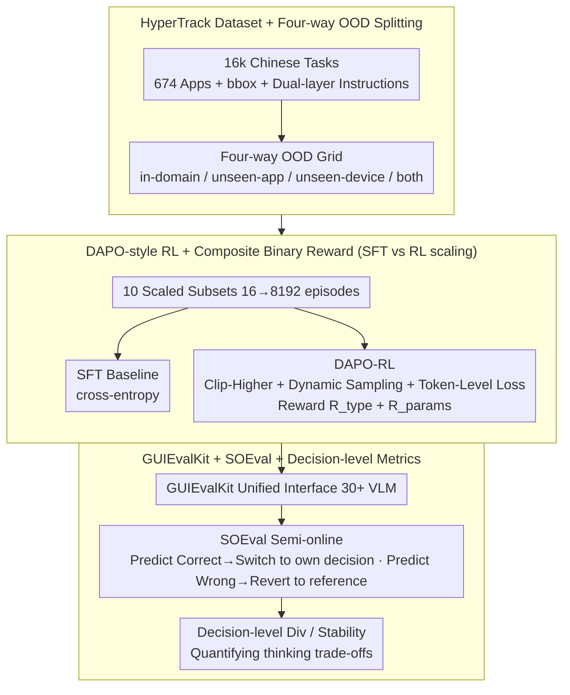

# Scaling, Benchmarking, and Reasoning of Vision-Language Agents for Mobile GUI Navigation

**Conference**: ICML 2026  
**arXiv**: [2605.27134](https://arxiv.org/abs/2705.27134)  
**Code**: https://github.com/xiaomi-research/guievalkit (Available)  
**Area**: Agent / Multimodal VLM  
**Keywords**: Mobile GUI Navigation, VLM Agent, Data Scaling, DAPO-RL, Semi-online Evaluation

## TL;DR
The Xiaomi team presents a systematic study on the "Data-Evaluation-Reasoning" trinity for VLM mobile GUI agents. They released the HyperTrack dataset (16k tasks / 674 Chinese apps) and the GUIEvalKit tool (supporting 30+ models). The study demonstrates that DAPO-style RL significantly outperforms SFT in OOD scenarios and utilizes semi-online evaluation (SOEval) to reveal a core trade-off: "explicit reasoning sacrifices PASS@1 stability but enhances PASS@n diversity."

## Background & Motivation

**Background**: VLM-driven GUI Agents (UI-TARS, AgentCPM-GUI, GUI-Owl, etc.) have become the mainstream solution for mobile automation. Training paradigms focus on SFT + preference alignment (DPO) + recent GRPO/DAPO-style RL.

**Limitations of Prior Work**: (1) Data – Mainstream benchmarks (AITW, AndroidControl, AMEX, GUI Odyssey) are almost entirely in English. The largest Chinese dataset, CAGUI, contains only 600 tasks across 22 apps, failing to cover long-tail applications. (2) Evaluation – Inconsistent scripts, action spaces, and confusing step-level/episode-level metrics make cross-model comparisons difficult. (3) Training – The scaling laws for SFT vs. RL in GUI scenarios have not been systematically explored. (4) Reasoning – Conclusions on whether "thinking mode" is effective remain contradictory across benchmarks, with a lack of decision-level (rather than step-level) analytical tools.

**Key Challenge**: GUI navigation is essentially a combination of long-horizon tasks, multimodal perception, and sequential decision-making. There is a significant gap between offline metrics (which feed the model ground-truth history) and real online execution. Conversely, fully online evaluation is too expensive to scale. A protocol is needed that reflects on-policy behavior while reusing static data for reproducibility.

**Goal**: Decomposed into four sub-problems: (a) Construct large-scale data covering Chinese long-tail apps; (b) Provide a unified evaluation tool for multiple models and benchmarks; (c) Clarify the in-domain vs. OOD performance of SFT/RL under different data scales; (d) Use decision-level metrics to explain when "explicit reasoning" becomes counterproductive.

**Key Insight**: The authors observe that the disconnect in offline evaluation stems from feeding the model a reference trajectory, whereas in real deployment, the model only sees its own prior decisions. By "switching" to the model's own decision artifact when it predicts correctly and reverting to the reference when it fails, one can approximate the real on-policy distribution without sacrificing the reproducibility of static data.

**Core Idea**: A coordinated quad-set of "Data-Tool-Training-Evaluation." HyperTrack provides 16k Chinese tasks, GUIEvalKit offers a unified interface, DAPO-RL outperforms SFT on OOD tasks, and SOEval + decision-level diversity/stability metrics quantify the true cost of reasoning.

## Method

### Overall Architecture
This paper does not introduce a new model architecture but rather integrates "Data–Training–Evaluation" into an analytical chain to address the disputes regarding "SFT vs. RL" and "to think or not to think" for GUI Agents. The chain begins with the HyperTrack dataset (16,080 real Chinese tasks with screenshots, text instructions, low-level action descriptions, and bboxes). UI-TARS-1.5-7B / Qwen3-VL-8B are trained using SFT and DAPO-RL on 10 scaled subsets (16 to 8,192 episodes). The trained models are evaluated via GUIEvalKit across five benchmarks (AndroidControl, AiTZ, GUI Odyssey, CAGUI, HyperTrack) using unified action spaces and four metrics: step-type/exact-match and episode-progress/success. Finally, SOEval aligns offline evaluation with real on-policy distributions, while decision-level Diversity/Stability metrics quantify the "cost of thinking" as a trade-off curve.

### Key Designs

**1. HyperTrack Dataset + Four-way OOD Splitting: Providing large-scale bbox-annotated data for Chinese long-tail apps**

Mainstream benchmarks are almost exclusively English. The largest Chinese collection, CAGUI, only features 600 tasks across 22 apps, which is insufficient for scaling law analysis. HyperTrack collects 16,080 episodes from 674 Chinese Android apps across 17 categories (including long-tail and tablet-exclusive apps), with an average of 5.1 steps. The action space is unified into OPEN/CLICK/SCROLL/TYPE/STOP. Each step includes high-level task descriptions, screenshots, low-level action descriptions, and ground-truth bboxes for all clickable elements. Its most critical feature is the splitting method: the training set contains only phone data, making tablets a natural unseen-device test set. Combined with unseen-apps, this creates a four-way OOD grid (in-domain / unseen-app / unseen-device / unseen-app&device). Compared to AITW (no bboxes), AndroidControl (English), and CAGUI (too small), HyperTrack is the first large-scale collection to feature "hierarchical UI docs + bbox + screen description + Chinese + dual-layer instructions."

**2. DAPO-style RL + Composite Binary Reward: Quantifying SFT vs. RL scaling behavior**

The choice between SFT and RL in GUI scenarios has long relied on intuition rather than systematic evidence. The authors run two training pipelines across the 16 to 8,192 episode range. The RL side utilizes the GRPO framework enhanced with a three-part DAPO suite: Clip-Higher (raises the upper clip bound to allow low-probability correct actions to be amplified), Dynamic Sampling (replaces samples with zero advantage to maintain gradient signals), and Token-Level Policy Gradient Loss (ensures tokens in varying sequence lengths contribute equally). The objective function is $\mathbb{E}_{q,o_i}\frac{1}{\sum|o_i|}\sum_{i,t}\min(r_{i,t}\hat A_{i,t}, \text{clip}(r_{i,t},1-\epsilon_{\text{low}},1+\epsilon_{\text{high}})\hat A_{i,t})$, with group size $G=16$, $\epsilon_{\text{low}}=0.2$, $\epsilon_{\text{high}}=0.3$, and $\beta=0$ (omitting the reference model to save VRAM). The reward is a composite binary: $R = R_{\text{action-type}} + R_{\text{params}}$—checking first if the action type is correct, and then validating parameters (click location within bbox, scroll direction, or exact text match). Experiments show that performance grows approximately log-linearly with the number of training episodes, and RL's lead over SFT on unseen-apps is significantly larger than in-domain.

**3. GUIEvalKit + SOEval + Decision-level Metrics: Bridging offline and online evaluation while quantifying the cost of thinking**

Offline evaluation often disconnects from reality because it relies on reference trajectories. GUIEvalKit wraps over 30 VLMs into a unified interface using `prepare_input / generate / parse_response` via the `ABCModel` (supporting vLLM backends and `enable_thinking` switches). The protocol is modified through SOEval: at each step, a history selection operator is used. If the model predicts correctly ($\hat a_t = a_t$), it switches to the model's own artifact $\psi=\phi(o_t,\hat a_t,\hat\tau_t)$; if it fails, it reverts to the reference $\phi(o_t,a_t)$. This allows the evaluation context to approach the on-policy distribution as the rollout progresses. Finally, a decision-level analysis is performed by mapping $n=512$ rollouts to a decision space $\mathcal D$ via density clustering. Two complementary metrics are defined: Diversity $\text{Div} = H(p(d|M,S,s))$ (entropy of decision distribution) and Stability $\hat\theta = p(d^*|M,S,s)$ (probability of the dominant decision $d^*$). SOEval achieves a Spearman correlation of $\rho=0.771$ ($R^2=0.624$) with AndroidWorld online success rates, significantly higher than pure offline evaluation ($\rho=0.657$, $R^2=0.482$), proving it to be a more reliable offline proxy.

### Loss & Training
SFT employs standard cross-entropy. RL uses DAPO-GRPO ($G=16, \epsilon_{\text{low}}=0.2, \epsilon_{\text{high}}=0.3, \beta=0$). The primary reward is the composite binary reward for action-type and parameters, while a Gaussian spatial reward is used for ablation studies. The primary backbone is UI-TARS-1.5-7B, with Qwen3-VL-8B-Thinking used to verify the universality of scaling trends.

## Key Experimental Results

### Main Results: Cross-benchmark Offline Evaluation (Step type / Exact match, selected)

| Model | AndroidControl-low | GUI-Odyssey | AiTZ | CAGUI | HyperTrack |
|-------|--------------------|-------------|------|-------|-----------|
| Qwen3-VL-8B-Thinking | 81.08 / 71.10 | 74.01 / 46.98 | 66.90 / 47.27 | 78.37 / 56.89 | 77.03 / 59.35 |
| Qwen3-VL-8B-Instruct | 82.36 / 72.20 | 77.85 / 51.78 | 72.77 / 52.64 | 83.83 / 63.94 | 81.48 / 66.28 |
| MiMo-VL-7B-RL (w/o thinking)| 94.03 / 90.23 | 85.64 / 67.08 | 79.38 / 66.91 | 79.27 / 61.60 | 92.56 / 76.41 |
| UI-TARS-7B-SFT | 98.08 / 94.81 | 86.94 / 68.82 | 82.92 / 67.34 | 89.99 / 70.62 | 90.40 / 75.40 |
| UI-TARS-72B-SFT | 98.17 / 95.05 | 89.80 / 72.27 | 84.27 / 69.83 | 91.08 / 74.53 | 90.16 / 75.20 |
| AgentCPM-GUI-8B | 92.80 / 88.60 | 90.82 / 74.84 | 85.46 / 76.08 | **96.88 / 91.32** | 82.80 / 54.26 |

Findings: (a) Specialized GUI Agents generally outperform general VLMs; (b) UI-TARS performance increases consistently from 2B to 72B; (c) **Thinking mode actually decreases scores for multiple models** (Qwen3-VL series, MiMo-VL, and GUI-Owl all score higher without thinking).

### Key Experimental Results: SOEval vs. Offline (5-benchmark average exact match)

| Model | Offline | SOEval | Δ |
|-------|---------|--------|---|
| Qwen3-VL-4B-Instruct | 59.39 | 63.05 | +3.66 |
| Qwen3-VL-8B-Instruct | 60.39 | 62.84 | +2.45 |
| GUI-Owl-7B | 65.49 | 67.37 | +1.88 |
| UI-Venus-Navi-72B | 74.09 | 76.16 | +2.07 |

SOEval consistently raises PASS@1 and correlates more strongly with AndroidWorld's online success rate (Spearman 0.771) than offline (0.657).

### Decision-level Analysis (Reasoning vs. Instruct-only)
- **Stability shift** (SOEval vs. offline): For GUI-Owl-7B, the rising group increased by +0.4500 while the falling group decreased by −0.3882. For UI-TARS-1.5-7B, it was +0.2343 / −0.2052. SOEval primarily recovers unstable samples from offline evaluation but slightly impacts already stable ones.
- **Reasoning–execution consistency** (GUI-Owl-7B): R-E consistent samples have a success rate of 73.70%, while inconsistent samples struggle at 18.29% (absolute difference 55.4 pp, $\chi^2 = 2389.58$, $\phi = 0.489$). Misalignment between reasoning and execution almost always results in failure.
- **Failure Analysis**: Action-type mismatch accounts for 61.1% of failures (high-level decision error), followed by action-target mismatch (grounding error). This indicates that the primary harm of thinking mode is selecting the wrong action type despite increased thought.

### Key Findings
- Performance grows approximately log-linearly with training episodes, and the **RL slope and OOD gain are consistently higher than SFT**. This holds across different backbones and reward functions.
- Thinking mode is not a "free lunch": it increases decision diversity and rescues low-stability samples, but it simultaneously destabilizes high-stability samples, leading to a net loss in PASS@1. It only overtakes instruct-only models at PASS@8.
- SOEval reveals that current models lack a mechanism to adaptively balance recent on-policy context with stable decision-making. Increasing on-policy history (OSR) monotonically improves EM to a point, but excessive history interferes with stable decisions.

## Highlights & Insights
- **Ingenious SOEval Design**: The use of a $\psi$ operator to switch between on-policy and reference trajectories provides a seamless bridge between evaluation distributions while maintaining static data reproducibility.
- **Thinking as a Stability-Diversity Trade-off**: By utilizing 512-rollout decision clustering, the authors transform the "thinking is better/worse" debate into a quantifiable shift along a trade-off curve.
- **DAPO's OOD Advantage**: The observation that RL widens its lead over SFT in OOD scenarios provides empirical support for utilizing RL in agent scenarios where training data is limited but deployment environments vary.

## Limitations & Future Work
- Only a preview subset of HyperTrack was released; the full 16k dataset remains unavailable, hindering external replication of scaling experiments.
- Decision-level clustering relies on density methods requiring $n=512$ rollouts, which is computationally expensive and unsuitable for real-time monitoring.
- SOEval assumes an "on-track" model—it reverts to ground truth immediately upon failure, which may disadvantage agents capable of self-correction.
- Experiments are restricted to Android/Chinese apps; cross-platform (desktop/web) and cross-lingual generalization have not been verified.

## Related Work & Insights
- **vs. UI-TARS / AgentCPM-GUI**: These are the evaluation targets. This paper focuses on providing "Data + Tools + Methodology," positioning it as the HELM/Big-Bench of the GUI Agent field.
- **vs. DAPO (Yu et al. 2025)**: While DAPO was originally for reasoning tasks, this work adapts it for GUI action prediction, verifying its utility in multimodal sequential decision-making.
- **vs. AndroidWorld**: While AndroidWorld is the gold standard, it is expensive. SOEval provides a affordable proxy with 0.77 correlation.
- **vs. CAGUI**: HyperTrack scales task volume by 27x and app count by 30x compared to CAGUI, with higher annotation density.

## Rating
- Novelty: ⭐⭐⭐⭐ The dataset and tools are iterative, but the combination of SOEval and decision-level metrics is pioneering for GUI Agents.
- Experimental Thoroughness: ⭐⭐⭐⭐⭐ Massive scale across 5 benchmarks, 30+ models, and 10 data scales.
- Writing Quality: ⭐⭐⭐⭐ Generally clear, though decision-level joint distribution plots require appendix consultation.
- Value: ⭐⭐⭐⭐⭐ Provides a comprehensive "Data + Evaluation + Training" baseline for the Chinese GUI Agent community.

<!-- RELATED:START -->

## Related Papers

- [\[CVPR 2026\] Towards GUI Agents: Vision-Language Diffusion Models for GUI Grounding](../../CVPR2026/llm_agent/towards_gui_agents_vision-language_diffusion_models_for_gui_grounding.md)
- [\[CVPR 2026\] History to Future: Evolving Agent with Experience and Thought for Zero-shot Vision-and-Language Navigation](../../CVPR2026/llm_agent/history_to_future_evolving_agent_with_experience_and_thought_for_zero-shot_visio.md)
- [\[ICML 2026\] Persona2Web: Benchmarking Personalized Web Agents for Contextual Reasoning with User History](persona2web_benchmarking_personalized_web_agents_for_contextual_reasoning_with_u.md)
- [\[ICML 2026\] Scaling Small Agents Through Strategy Auctions](scaling_small_agents_through_strategy_auctions.md)
- [\[CVPR 2026\] GUI-CEval: A Hierarchical and Comprehensive Chinese Benchmark for Mobile GUI Agents](../../CVPR2026/llm_agent/gui-ceval_a_hierarchical_and_comprehensive_chinese_benchmark_for_mobile_gui_agen.md)

<!-- RELATED:END -->
