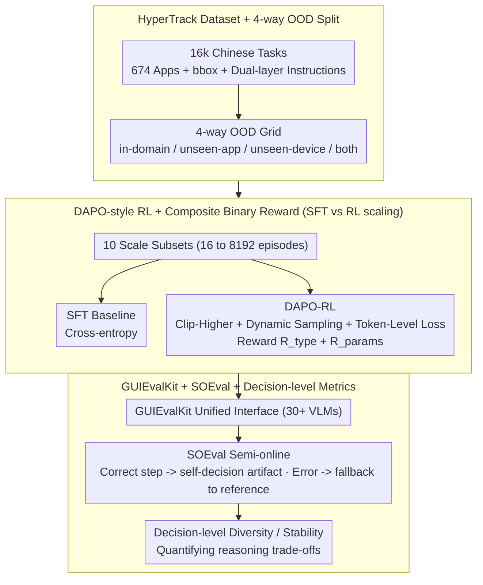

# Scaling, Benchmarking, and Reasoning of Vision-Language Agents for Mobile GUI Navigation

**Conference**: ICML 2026  
**arXiv**: [2605.27134](https://arxiv.org/abs/2605.27134)  
**Code**: https://github.com/xiaomi-research/guievalkit (Available)  
**Area**: Agent / Multimodal VLM  
**Keywords**: Mobile GUI Navigation, VLM Agent, Data Scaling, DAPO-RL, Semi-online Evaluation  

## TL;DR
The Xiaomi team presents a systematic "Data-Evaluation-Reasoning" study for VLM mobile GUI agents: releasing the HyperTrack dataset (16k tasks / 674 Chinese Apps) and the GUIEvalKit tool (supporting 30+ models). They demonstrate that DAPO-style RL significantly outperforms SFT in OOD scenarios and reveal the core trade-off via SOEval: "explicit reasoning sacrifices PASS@1 stability but enhances PASS@n diversity."

## Background & Motivation

**Background**: VLM-driven GUI Agents (UI-TARS, AgentCPM-GUI, GUI-Owl, etc.) have become the mainstream solution for mobile automation. Training paradigms focus on SFT + Preference Alignment (DPO) + recent GRPO/DAPO-style RL.

**Limitations of Prior Work**: (1) Data—Mainstream benchmarks (AITW, AndroidControl, AMEX, GUI Odyssey) are almost entirely English-based. The largest Chinese dataset, CAGUI, contains only 600 tasks across 22 apps, failing to cover long-tail applications. (2) Evaluation—Different teams use inconsistent scripts, action spaces, and conflicting definitions for step-level/episode-level metrics, making cross-model comparison difficult. (3) Training—The scaling law of SFT vs. RL in GUI scenarios has not been systematically explored. (4) Reasoning—Conclusions on the utility of "thinking mode" are contradictory across benchmarks, lacking decision-level (rather than step-level) analysis tools.

**Key Challenge**: GUI navigation is essentially a combination of long-horizon tasks, multimodal perception, and sequential decision-making. There is a large gap between offline metrics (using ground-truth history) and real online execution, while full online evaluation is too costly to scale. An evaluation protocol is needed that reflects on-policy behavior while reusing static data.

**Goal**: Decomposition into four sub-problems: (a) Constructing large-scale data covering Chinese long-tail apps; (b) Providing unified evaluation tools for multiple models and benchmarks; (c) Clarifying in-domain vs. OOD performance of SFT/RL at different data scales; (d) Explaining the "cost of explicit reasoning" using decision-level metrics.

**Key Insight**: The authors observe that offline evaluation disconnects from online reality because the model is fed reference trajectories (ground-truth history), whereas in deployment, it sees its own previous decisions. By "switching" to the model's own decision artifacts when its predictions are correct and falling back to reference actions only upon error, one can approximate the real on-policy distribution without losing the reproducibility of static data.

**Core Idea**: A synergy of "Data-Tool-Training-Evaluation"—HyperTrack provides 16k Chinese tasks, GUIEvalKit offers a unified interface, DAPO-RL outperforms SFT on OOD tasks, and SOEval + decision-level diversity/stability metrics quantify the true cost of reasoning.

## Method

### Overall Architecture
This paper does not release a new model but integrates "Data-Training-Evaluation" into an analysis chain to address industry debates: "SFT or RL?" and "To think or not to think?". The chain starts with the HyperTrack dataset (16,080 Chinese tasks with screenshots, textual instructions, low-level action descriptions, and bboxes). Models like UI-TARS-1.5-7B and Qwen3-VL-8B are trained using SFT and DAPO-RL on 10 scale-based subsets (16 to 8,192 episodes). Models are then evaluated via GUIEvalKit across 5 benchmarks (AndroidControl, AiTZ, GUI Odyssey, CAGUI, HyperTrack) using step-type/exact-match and episode-progress/success metrics. Finally, SOEval bridges the gap to on-policy distributions, while decision-level Diversity/Stability metrics quantify the reasoning trade-off.

### Key Designs

**1. HyperTrack Dataset + 4-way OOD Split: Large-scale data with bboxes for Chinese long-tail apps**

HyperTrack collects 16,080 episodes from 674 Chinese Android apps across 17 categories (including long-tail and tablet-exclusive apps), with an average of 5.1 steps. The action space is unified as OPEN/CLICK/SCROLL/TYPE/STOP. Each step includes high-level task descriptions, screenshots, low-level action descriptions, and ground-truth bboxes for all clickable elements. The split strategy is crucial: the training set contains only phone data, making tablets a natural unseen-device test set. Combining this with unseen-apps creates a 4-way OOD grid (in-domain / unseen-app / unseen-device / unseen-app&device).

**2. DAPO-RL + Composite Binary Reward: Quantifying SFT vs. RL scaling behavior**

The authors run parallel training routes from 16 to 8,192 episodes. RL utilizes the GRPO framework with three DAPO components: Clip-Higher (raising the upper clip bound to allow low-probability correct actions to be amplified), Dynamic Sampling (replacing zero-advantage samples to maintain gradient signals), and Token-Level Policy Gradient Loss (equal weighting for tokens in varying sequence lengths). The objective is $\mathbb{E}_{q,o_i}\frac{1}{\sum|o_i|}\sum_{i,t}\min(r_{i,t}\hat A_{i,t}, \text{clip}(r_{i,t},1-\epsilon_{\text{low}},1+\epsilon_{\text{high}})\hat A_{i,t})$ with $G=16, \epsilon_{\text{low}}=0.2, \epsilon_{\text{high}}=0.3, \beta=0$. The reward is a composite binary: $R = R_{\text{action-type}} + R_{\text{params}}$. Performance grows log-linearly with training episodes, and RL's lead over SFT is significantly larger on unseen-apps than in-domain.

**3. GUIEvalKit + SOEval + Decision-level Metrics: Bridging evaluation gaps and quantifying the cost of thinking**

SOEval implements a history selection operator: when the model predicts correctly at step $t$ ($\hat a_t = a_t$), it switches to its own artifact $\psi=\phi(o_t,\hat a_t,\hat\tau_t)$; if incorrect, it falls back to the reference $\phi(o_t,a_t)$. This allows the context to approach on-policy distributions while maintaining reproducibility. Decision-level analysis maps $n=512$ rollouts to a decision space $\mathcal D$ via density clustering. Two metrics are defined: Diversity $\text{Div} = H(p(d|M,S,s))$, representing distribution entropy, and Stability $\hat\theta = p(d^*|M,S,s)$, the probability of hitting the dominant decision. 

### Loss & Training
SFT uses standard cross-entropy. RL uses DAPO-GRPO ($G=16, \epsilon_{\text{low}}=0.2, \epsilon_{\text{high}}=0.3, \beta=0$). The primary reward is a composite binary based on action-type and parameters, with Gaussian spatial rewards used in ablation. UI-TARS-1.5-7B is the primary backbone, with Qwen3-VL-8B-Thinking used to verify cross-model scaling trends.

## Key Experimental Results

### Main Results: Cross-benchmark Offline Evaluation (Step Type / Exact Match)

| Model | AndroidControl-low | GUI-Odyssey | AiTZ | CAGUI | HyperTrack |
|-------|--------------------|-------------|------|-------|-----------|
| Qwen3-VL-8B-Thinking | 81.08 / 71.10 | 74.01 / 46.98 | 66.90 / 47.27 | 78.37 / 56.89 | 77.03 / 59.35 |
| Qwen3-VL-8B-Instruct | 82.36 / 72.20 | 77.85 / 51.78 | 72.77 / 52.64 | 83.83 / 63.94 | 81.48 / 66.28 |
| MiMo-VL-7B-RL (w/o thinking)| 94.03 / 90.23 | 85.64 / 67.08 | 79.38 / 66.91 | 79.27 / 61.60 | 92.56 / 76.41 |
| UI-TARS-7B-SFT | 98.08 / 94.81 | 86.94 / 68.82 | 82.92 / 67.34 | 89.99 / 70.62 | 90.40 / 75.40 |
| AgentCPM-GUI-8B | 92.80 / 88.60 | 90.82 / 74.84 | 85.46 / 76.08 | **96.88 / 91.32** | 82.80 / 54.26 |

**Key Findings**: (a) Specialized GUI Agents generally outperform general VLMs. (b) UI-TARS scores increase from 2B to 72B. (c) **Thinking mode actually degrades performance** across several models (Qwen3-VL series, MiMo-VL, GUI-Owl).

### Gain: SOEval vs. Offline (5-benchmark Average Exact Match)

| Model | Offline | SOEval | Gain |
|-------|---------|--------|---|
| Qwen3-VL-8B-Instruct | 60.39 | 62.84 | +2.45 |
| GUI-Owl-7B | 65.49 | 67.37 | +1.88 |
| UI-Venus-Navi-72B | 74.09 | 76.16 | +2.07 |

SOEval consistently raises PASS@1 and shows stronger Spearman correlation ($\rho=0.771$) with real online success rates than offline evaluation ($\rho=0.657$).

### Decision-level Analysis (Reasoning vs. Instruct-only)
- **Stability shift**: SOEval mainly recovers unstable offline samples but slightly harms high-stability samples.
- **Reasoning–Execution Consistency**: Successful reasoning-execution alignment corresponds to a 73.70% success rate, whereas inconsistency drops success to 18.29% ($\phi = 0.489$).
- **Failure Breakdown**: Action-type mismatch (high-level error) accounts for 61.1% of failures in thinking mode, suggesting reasoning's primary harm is picking the wrong action category.

## Highlights & Insights
- **SOEval Design**: The $\psi$ operator seamlessly switches between on-policy and reference history, providing a low-cost proxy for real deployment that is transferable to web or code agents.
- **Stability-Diversity Trade-off**: Thinking mode shifts models toward "high diversity / low stability." While this hurts PASS@1, it allows reasoning models to eventually surpass instruct-only models at PASS@8.
- **DAPO Advantage in OOD**: RL's scaling slope and OOD performance gains are consistently higher than SFT's, providing strong evidence for adopting RL in GUI agent training.

## Limitations & Future Work
- The full 16k HyperTrack dataset is not entirely public (only a preview subset), hindering full external reproduction of scaling experiments.
- Decision-level clustering requires 512 rollouts, making it computationally expensive and unsuitable for real-time monitoring.
- SOEval remains an "on-track" assumption—falling back to ground truth upon error does not reward agents capable of self-correction.
- Experiments are restricted to Android and Chinese apps; cross-platform (Desktop/Web) and cross-lingual generalization remains unverified.

## Related Work & Insights
- **vs. UI-TARS / AgentCPM-GUI**: These are the evaluation targets. This paper focuses on "Data + Tooling + Methodology," acting as a HELM/Big-Bench for the GUI Agent field.
- **vs. DAPO (Yu et al. 2025)**: While the original DAPO was for reasoning, this study successfully migrates the components to multimodal sequential decision-making.
- **vs. AndroidWorld**: SOEval provides a cheaper proxy with 0.77 correlation to AndroidWorld's online success rates, benefiting resource-constrained research groups.

## Rating
- Novelty: ⭐⭐⭐⭐ SOEval and decision-level metrics are pioneering for GUI agents.
- Experimental Thoroughness: ⭐⭐⭐⭐⭐ Massive scale across 5 benchmarks, 30+ models, and 10 data scales.
- Writing Quality: ⭐⭐⭐⭐ Clear structure, though complex joint-distribution plots require appendix context.
- Value: ⭐⭐⭐⭐⭐ Establishes a massive "Data + Eval + Training" baseline for the Chinese GUI Agent community.

<!-- RELATED:START -->

## Related Papers

- [\[CVPR 2026\] Towards GUI Agents: Vision-Language Diffusion Models for GUI Grounding](../../CVPR2026/llm_agent/towards_gui_agents_vision-language_diffusion_models_for_gui_grounding.md)
- [\[ICML 2026\] Persona2Web: Benchmarking Personalized Web Agents for Contextual Reasoning with User History](persona2web_benchmarking_personalized_web_agents_for_contextual_reasoning_with_u.md)
- [\[ICML 2026\] Scaling Small Agents Through Strategy Auctions](scaling_small_agents_through_strategy_auctions.md)
- [\[CVPR 2026\] GUI-CEval: A Hierarchical and Comprehensive Chinese Benchmark for Mobile GUI Agents](../../CVPR2026/llm_agent/gui-ceval_a_hierarchical_and_comprehensive_chinese_benchmark_for_mobile_gui_agen.md)
- [\[CVPR 2026\] SenseSearch: Empowering Vision-Language Models with High-Resolution Agentic Search-Reasoning via Reinforcement Learning](../../CVPR2026/llm_agent/sensesearch_empowering_vision-language_models_with_high-resolution_agentic_searc.md)

<!-- RELATED:END -->
