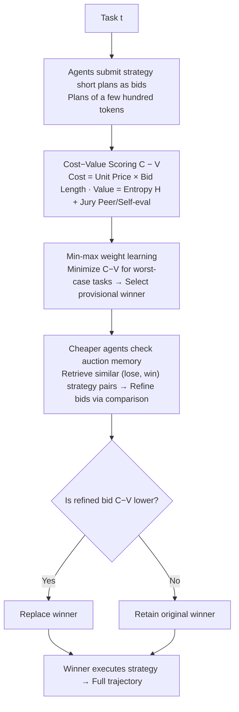

# Scaling Small Agents Through Strategy Auctions

**Conference**: ICML 2026  
**arXiv**: [2602.02751](https://arxiv.org/abs/2602.02751)  
**Code**: TBD  
**Area**: LLM Agent / Multi-agent Routing  
**Keywords**: Strategy Auctions, Heterogeneous Agent Routing, Freelance Marketplace, Test-time Self-improvement, Deep Search  

## TL;DR
The paper proposes sale (Strategy Auctions for Workload Efficiency): letting Qwen3 agents of varying sizes submit "strategy short plans" as bids for each task. Executors are selected based on a cost-minus-value metric, while historical auction memory allows lower-cost agents to continuously refine their bids. In deep search and coding tasks, this approach exceeds the pass@1 of the largest model while reducing dependence on the largest agent by 52% and total costs by 35%.

## Background & Motivation
**Background**: There is general optimism in the industry that "small models + tools" can replace large models for agentic workflows, assuming small LLM agents are sufficient once reasoning is outsourced to the environment and tools.

**Limitations of Prior Work**: The authors conducted fine-grained evaluations using Qwen3 4B/8B/14B/32B on deep search and coding tasks along the "human solving time" $\tau(t)$. They found that on simple tasks, the smallest agent achieves approximately 87–92% of the largest agent's pass@1. However, for the most complex category ($\tau \leq 60$ minutes), this drops to only 17–25%. Thus, small agent performance does not scale with task complexity. Conversely, relying solely on "large model backstops" leads to significant computational waste on simple tasks.

**Key Challenge**: Existing routing strategies face a dilemma. Non-predictive routing (running multiple models to completion then selecting) leads to cost explosions in agentic scenarios (trajectories often exceed millions of tokens). Predictive routing (training an auxiliary small router model) requires specific training, is locked to a fixed set of models, often degrades on difficult tasks, and lacks test-time self-improvement capabilities.

**Goal**: Design a routing mechanism that simultaneously satisfies: ① negligible inference overhead; ② plug-and-play capability for any off-the-shelf agent; ③ sustained precision on long-horizon tasks; ④ the ability for small agents to improve through use, gradually assuming more workload.

**Key Insight**: Drawing inspiration from the freelance market—where recruiters post tasks, freelancers bid with short proposals on "how they intend to work," and the platform awards contracts based on a price/quality score; unsuccessful bidders upgrade their proposals by observing past cases. Sun et al. (2024) have demonstrated a strong correlation between plan quality and execution quality, making a plan-based bid both informative and extremely low-cost.

**Core Idea**: Arrange heterogeneous agents into a test-time auction market where bids are strategy short plans rather than full solutions. The winner is selected based on cost-minus-value. A memory of "past winning/losing bids" drives the self-iteration of small agents, merging task routing and self-improvement into one.

## Method

### Overall Architecture
sale organizes a set of heterogeneous agents $\mathcal{A} = \{a_i\}_{i=1}^{|\mathcal{A}|}$ (consisting of 4 Qwen3 sizes in the paper) into a test-time auction market. Upon receiving task $t$, each agent first outputs a short strategy describing "how I plan to do this" as a bid. The market scores bids using a cost-minus-value metric to select a provisional winner. Agents cheaper than the winner can retrieve historical auction memories to refine their bids and attempt a "takeover." Only the final winner executes their strategy to generate a complete trajectory. Crucially, the entire auction process only requires each agent to output a few hundred tokens for the plan, accounting for less than 1% of total inference tokens and latency. This transforms the decision of "whether to use a large model" into a nearly free market-clearing event.

### Key Designs

**1. Strategy Short Plans as Bids: Using plans of a few hundred tokens for routing instead of full solutions**

Agentic trajectories often range from hundreds of thousands to millions of tokens. Non-predictive routing is cost-prohibitive here, while predictive routing (based purely on task descriptions) fails on long-horizon tasks. sale takes a middle path of "partially predictive routing": each agent produces a strategy $s_{t,i}$ as a bid, detailing "how to decompose the task, which tools to use, and potential pitfalls." This works because plan quality and execution quality are strongly correlated (Sun et al. 2024). Thus, the short strategy serves as both a low-cost quality signal and a ready-to-execute roadmap—the winning agent does not need to re-plan and simply follows its bid.

**2. Cost-Value Scoring and Min-Max Weight Learning: Compressing the utility of assigning $a_i$ to task $t$ into a scalar**

The score for each bid is $C_{t,i} - V_{t,i}$. On the cost side, $C_{t,i} = w_c \cdot \pi(a_i) \cdot |s_{t,i}|$ multiplies the unit price per million tokens $\pi(a_i)$ by the bid length. Long strategies often predict longer execution trajectories (Goebel & Zips 2025) and higher failure rates (Xiong et al. 2025a), making bid length a "free" double proxy for cost and risk. On the value side:

$$V_{t,i} = w_h \cdot H(s_{t,i}) + \sum_{a_j \in \mathcal{A}} w_j \cdot \gamma_j(s_{t,i}),$$

where $H(s_{t,i})$ is the per-token average entropy of the bid (high entropy suggests high information density and low redundancy, corresponding to better planning), and $\gamma_j \in \{0,\dots,5\}$ are 0–5 Likert scores given by a jury (including self-evaluation). Thus, value accounts for both intrinsic quality (entropy) and extrinsic recognition (jury peer+self evaluation), signals calculated without extra training. Weights $w = (w_c, w_h, \{w_j\})$ are learned via min-max rather than average loss: $\min_{w,x,Q} Q\ \text{s.t.}\ z_t \leq Q\ \forall t$. This minimizes the $C-V$ of the worst-performing task to prevent long-tail tasks from being crippled by poor allocation—ablation shows average loss is significantly more fragile on difficult tasks.

**3. Auction Memory Driven Strategy Refinement: Allowing unsuccessful cheaper agents to review historical outcomes and rewrite bids**

Selection alone is insufficient; sale aims to enable small agents to handle more tasks over time. After each auction, results are stored in a shared memory $\mathcal{M}(t') = (t', \{s_{t',i}\}, y_{t'})$, where $y_{t'}$ represents win/loss labels. For a new task $t$, only agents cheaper than the provisional winner initiate refinement. They retrieve the top-$\tilde{k}$ similar historical tasks' (lose, win) strategy pairs (including at least one of their own) based on cosine similarity of text embeddings. Using a contrastive prompt, the agent identifies "why I lost last time and why the opponent won," producing a refined bid $s^r_{t,i}$ for re-scoring. If any refined bid yields a lower $C-V$ than the provisional winner, the winner is replaced. Limiting refinement to "cheaper agents with a chance to win" preserves a shortcut for small agents who already won (preventing token doubling) while focusing extra computation where it has the most value. As memory grows, cheaper agents win more frequently, merging routing and self-improvement.

### Loss & Training
sale does not train any routing or refinement networks. It uses off-the-shelf Qwen3 models throughout the process. The only components to "learn" are the scalar weights $w = (w_c, w_h, \{w_j\})$, fitted once on a training subset using a min-max MIP with big-M constraints (Appendix D). The refinement phase is performed purely via prompting and retrieval at test time.

## Key Experimental Results

### Main Results
Evaluation used the HST-Bench dataset (753 tasks, 5 complexity bins partitioned by human solving time $\tau(t)$); the agent pool consisted of Qwen3 4B / 8B / 14B / 32B, with unit prices of $0.05 / $0.09 / $0.16 / $0.36 per million tokens, respectively. Metrics included pass@1 (LLM-as-judge) and actual cost per million tokens $/Mt. All sale figures are averages of 5 random task sequences.

| Domain | Setting | 32B agent pass@1 | sale pass@1 | sale Gain | sale $/Mt | 32B $/Mt | Cost Reduction |
|---|---|---|---|---|---|---|---|
| Deep search | All | 63.8 | 67.3 | +3.5 | 0.21 | 0.36 | -42% |
| Deep search | $\tau\leq0.1$ (Easiest) | 87.5 | 91.3 | +3.8 | 0.22 | 0.36 | -39% |
| Deep search | $\tau\leq60$ (Hardest) | 12.5 | 16.3 | +3.8 | 0.23 | 0.36 | -36% |
| Coding | $\tau\leq0.1$ | 95.0 | 98.3 | +3.3 | 0.18 | 0.36 | -50% |
| Coding | $\tau\leq0.5$ | 79.7 | 82.0 | +2.3 | — | 0.36 | — |

Overall, sale reduced reliance on the largest agent by 65% in deep search and 40% in coding (-52% overall); total costs were reduced by 42% in deep search and 25% in coding (-35% overall).

### Ablation Study

| Configuration | Phenomenon | Description |
|---|---|---|
| Any single Qwen3 agent | Dominated by sale in both pass@1 and $/Mt | Demonstrates sale pushes the Pareto frontier outwards. |
| Off-the-shelf predictive router (task-based) | Lower pass@1 than 32B or no cost savings | Viewing only "task descriptions" provides insufficient signals in agentic scenarios. |
| Removing jury self-eval / reducing size | pass@1 decreases (Appendix I) | The mixed jury of self and peer evaluation is irreplaceable. |
| Removing entropy as value | pass@1 decreases | Confirms high-entropy plans $\leftrightarrow$ better planning. |
| No memory refinement | Bid win rate for small agents stays flat | Refinement is key to "scaling up small agents." |
| Cost of auction phase | sale auction phase < 1% total cost | Overhead is negligible. |

### Key Findings
- pass@1 decreases monotonically as $\tau(t)$ increases across all 4 sizes, confirming that HST-Bench task scales align with LLM difficulty and can serve as a benchmark for future agents.
- Large agents do not offset high prices with "shorter trajectories"—traces are only slightly shorter for simple tasks and similar or longer for complex tasks. Thus, "expensive agents are more efficient" is false for long-horizon tasks.
- As auction memory grows, the win rate for small agents increases significantly, replicating the market dynamics where "freelancers handle more work as they gain experience."
- sale's improvements are robust to task order permutations (low std across 5 runs, e.g., 0.5–1.8 pass@1).

## Highlights & Insights
- Shifting the cost signal of routing from "training a router model" to "letting agents output a few hundred tokens of a plan" is a lightweight approach with low deployment friction; this is the essence of "partially predictive routing."
- Using plan length as a simultaneous proxy for cost and risk is a practical dual-purpose variable—predicting both expenditure and failure probability by combining two often separately modeled quantities into one free scalar.
- The asymmetric design where only "cheaper agents get a chance to refine" naturally couples the goals of "improving small models" and "controlling extra inference tokens." This is an excellent example of system-level design applicable to any test-time self-improvement multi-model system.
- Min-max weight learning is friendlier to long-tail tasks, suggesting that researchers in agent routing should avoid relying solely on average loss.

## Limitations & Future Work
- The heterogeneous agent pool only tested 4 sizes within the Qwen3 family. Whether the jury remains robust across families (e.g., Qwen × Llama × GPT) or if weights must be relearned for larger price gaps remains unanswered.
- The $O(|\mathcal{A}|^2)$ scoring calls for peer evaluations within the jury might become a bottleneck if the agent pool expands to dozens; sparse or hierarchical juries may be needed.
- Evaluation relies entirely on LLM-as-judge pass@1. For domains like coding, stricter execution-level evaluations (unit tests) should be added to ensure jury preference does not decouple from truth.
- Memory currently stores strategy pairs rather than execution trajectories. Cheaper agents learn "how to write better plans" rather than "how to fix execution errors." Higher task complexity might require trace-level memory.
- Weights are learned via min-max MIP on a small training set; how to perform online re-calibration when transitioning to new benchmarks with significant distribution shifts is an open question.

## Related Work & Insights
- **vs. Predictive Router (Hu et al. 2024 / Stripelis et al.)**: These require independent router networks, are locked to specific model sets, and fail on difficult tasks. sale functions without a trained router, using "bid plans" for partially predictive routing that is plug-and-play and experiential.
- **vs. Non-predictive Router (Chen et al. 2024 et al.)**: These run all candidates to completion, causing cost explosions in long-trace agentic tasks. sale truncates this overhead to < 1% using short plans.
- **vs. Agent Scaling studies (Kwa et al. 2025 / Sinha et al. 2026)**: The former focuses on "50% success time for single models," while the latter uses synthetic tasks to show cumulative failure. sale shifts from "single agent scaling" to "system-level scaling," proving that market structures can break single-model Pareto limits.
- **vs. Agent Virtual Economy (Tomasev et al. 2025 / Dütting et al. 2024)**: These discuss agent economies conceptually. sale concretizes auction mechanisms for the quantifiable goal of "workload efficiency" with an end-to-end implementation.
- **vs. Memory-driven Agents (Cao 2026 / Salama 2025 et al.)**: Traditional agent memory stores traces or user histories to enhance single-agent reasoning. sale uses memory as a "market feedback signal" (storing win/loss records) to reallocate labor rather than merely modifying internal agent states—this represents a novel use for memory.

## Rating
- Novelty: ⭐⭐⭐⭐⭐ Combining "strategy as bid + auction memory for self-improvement" into a test-time framework is a rare and compelling perspective.
- Experimental Thoroughness: ⭐⭐⭐⭐ 753 tasks × 5 complexities × 5 random sequences + multiple baseline routers + extensive ablation. However, lacks cross-family evidence.
- Writing Quality: ⭐⭐⭐⭐⭐ Motivation, formulas, and appendix cross-references are clear. The "dual motivation" for the cost-value design is persuasive.
- Value: ⭐⭐⭐⭐⭐ Provides a replicable system-level answer for "how to utilize small agents," highly practical for industrial multi-model agent deployment.

<!-- RELATED:START -->

## Related Papers

- [\[ICML 2026\] Scaling, Benchmarking, and Reasoning of Vision-Language Agents for Mobile GUI Navigation](scaling_benchmarking_and_reasoning_of_vision-language_agents_for_mobile_gui_navi.md)
- [\[ICML 2026\] EvolveR: Self-Evolving LLM Agents through an Experience-Driven Lifecycle](evolver_self-evolving_llm_agents_through_an_experience-driven_lifecycle.md)
- [\[ACL 2026\] Polaris: A Gödel Agent Framework for Small Language Models through Experience-Abstracted Policy Repair](../../ACL2026/llm_agent/polaris_a_gödel_agent_framework_for_small_language_models_through_experience-abs.md)
- [\[NeurIPS 2025\] AgentTTS: Large Language Model Agent for Test-time Compute-optimal Scaling Strategy in Complex Tasks](../../NeurIPS2025/llm_agent/agenttts_large_language_model_agent_for_testtime_computeopti.md)
- [\[ICML 2026\] AutoRPA: Efficient GUI Automation through LLM-Driven Code Synthesis from Interactions](autorpa_efficient_gui_automation_through_llm-driven_code_synthesis_from_interact.md)

<!-- RELATED:END -->
