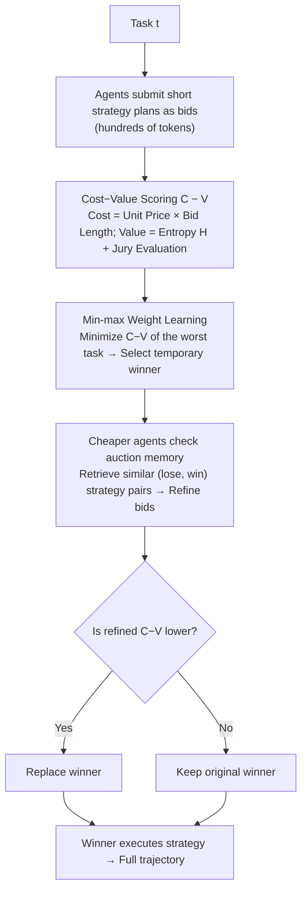

# Scaling Small Agents Through Strategy Auctions

**Conference**: ICML 2026  
**arXiv**: [2602.02751](https://arxiv.org/abs/2602.02751)  
**Code**: TBD  
**Area**: LLM Agent / Multi-Agent Routing  
**Keywords**: Strategy Auctions, Heterogeneous Agent Routing, Freelance Market, Test-time Self-improvement, Deep Search

## TL;DR
This paper proposes sale (Strategy Auctions for Workload Efficiency): diverse Qwen3 agents submit "short strategy plans" as bids for each task. The executor is selected based on cost-minus-value, and a historical auction memory allows cheaper agents to continuously refine their bids. In deep search and coding tasks, sale exceeds the pass@1 of the largest model while reducing dependence on the largest agent by 52% and total costs by 35%.

## Background & Motivation
**Background**: There is widespread optimism in the industry that "small models + tools" can replace large models for agentic workflows, assuming small LLM agents are sufficient once reasoning is outsourced to the environment and tools.

**Limitations of Prior Work**: The authors conducted fine-grained evaluations of Qwen3 4B/8B/14B/32B on deep search and coding across "human solve time" $\tau(t)$. They found that on simple tasks, the smallest agent achieves approximately 87–92% of the largest agent's pass@1, but on the most complex tier ($\tau \leq 60$ minutes), performance drops to 17–25%. Small agent performance does not scale with task complexity, while relying solely on a "large model backup" causes significant computational waste on simple tasks.

**Key Challenge**: Current routing strategies face a dilemma. Non-predictive routing (running multiple models to full completion before selecting) leads to cost explosions in agentic scenarios where trajectories often exceed millions of tokens. Predictive routing (training an additional small router model) requires specialized training, is tied to specific model sets, degrades on difficult tasks, and lacks test-time self-improvement capabilities.

**Goal**: Design a routing mechanism that satisfies: ① negligible inference overhead; ② plug-and-play compatibility with existing agents; ③ high precision on long-range tasks; ④ the ability for small agents to become stronger over time and assume more workload.

**Key Insight**: Drawing inspiration from freelance markets—clients post tasks, freelancers bid with plans ("how I intend to do it"), the platform ranks bids by price/quality, and unsuccessful bidders improve their future proposals by observing past cases. Sun et al. (2024) demonstrated that plan quality correlates strongly with execution quality, making plans effective, low-cost bids.

**Core Idea**: Organize heterogeneous agents into a test-time auction market where bids are short strategy plans rather than full solutions. Winners are chosen via cost-minus-value. Memory of "past wins/losses" drives small agents to iterate themselves, merging task routing and self-improvement into one process.

## Method

### Overall Architecture
sale organizes a set of heterogeneous agents $\mathcal{A} = \{a_i\}_{i=1}^{|\mathcal{A}|}$ (four Qwen3 sizes in the paper) into a test-time auction market. Upon receiving task $t$, each agent generates a short strategy as a bid. The market scores these bids using cost-minus-value to select a temporary winner. Agents cheaper than the winner can refine their bids by retrieving historical auction memory to "outbid" the current leader. Only the final winner executes their strategy to generate a full trajectory. Crucially, the auction involves only a few hundred tokens per agent (plan), costing less than 1% of total tokens and latency, thus making the decision of "whether to use a large model" a nearly free market clearing process.

### Key Designs

**1. Strategy Plans as Bids: Using hundreds of tokens for routing instead of full solutions**

Agentic trajectories often span hundreds of thousands to millions of tokens. Non-predictive routing is cost-prohibitive, while predictive routing (based only on task descriptions) fails on long-range tasks. sale adopts "partially predictive routing": agents produce a strategy $s_{t,i}$ explaining task decomposition, tool selection, and potential pitfalls. This works because plan quality is strongly correlated with execution quality (Sun et al. 2024). The short strategy acts as a cheap quality signal and a reusable roadmap—the winner follows their own plan without re-planning.

**2. Cost-Value Scoring & Min-max Weight Learning: Compressing the decision into a scalar**

Each bid is scored as $C_{t,i} - V_{t,i}$. Cost is defined as $C_{t,i} = w_c \cdot \pi(a_i) \cdot |s_{t,i}|$, where $\pi(a_i)$ is the unit price per million tokens and $|s_{t,i}|$ is the bid length. Longer strategies predict longer execution trajectories (Goebel & Zips 2025) and higher failure rates (Xiong et al. 2025a), making length a free proxy for cost and risk. Value is defined as:

$$V_{t,i} = w_h \cdot H(s_{t,i}) + \sum_{a_j \in \mathcal{A}} w_j \cdot \gamma_j(s_{t,i}),$$

where $H(s_{t,i})$ is the average token-level entropy (high entropy implies information density/low redundancy, correlating with better planning) and $\gamma_j$ is a Likert score (0–5) from a jury (including self-evaluation). Thus, value accounts for internal quality (entropy) and external consensus (jury). Weights $w = (w_c, w_h, \{w_j\})$ are learned via min-max: $\min_{w,x,Q} Q\ \text{s.t.}\ z_t \leq Q\ \forall t$, minimizing the $C-V$ of the worst-case task to prevent poor allocations on long-tail tasks.

**3. Auction-Memory-Driven Strategy Refinement: Allowing cheaper losers to recover and outbid**

To help small agents improve over time, results are stored in a shared memory $\mathcal{M}(t') = (t', \{s_{t',i}\}, y_{t'})$ with win/loss labels $y_{t'}$. For a new task $t$, only agents cheaper than the temporary winner perform refinement. They retrieve top-$\tilde{k}$ similar historical tasks and (lose, win) strategy pairs via embedding similarity. Using a contrastive prompt, the agent analyzes why it lost and why the opponent won to produce a refined bid $s^r_{t,i}$. If the refined $C-V$ is lower than the current winner's, the winner is replaced. This asymmetric design ensures extra computation is spent only where "flipping the result" is cost-effective.

### Training Strategy
sale does not train any routing or refinement networks; it uses off-the-shelf Qwen3 models. The only "learned" components are the scalar weights $w = (w_c, w_h, \{w_j\})$, fitted once on a training subset using a min-max MIP with big-M constraints (Appendix D). Refinement is performed entirely via prompting and retrieval at test-time.

## Key Experimental Results

### Main Results
Evaluated on HST-Bench (753 tasks, 5 complexity bins based on human solve time $\tau(t)$); agent pool: Qwen3 4B/8B/14B/32B; Metrics: pass@1 (LLM-as-judge) and cost per million tokens ($/Mt). sale results are averaged over 5 random task orders.

| Domain | Setting | 32B agent pass@1 | sale pass@1 | sale Gain | sale $/Mt | 32B $/Mt | Cost Reduction |
|---|---|---|---|---|---|---|---|
| Deep search | All | 63.8 | 67.3 | +3.5 | 0.21 | 0.36 | -42% |
| Deep search | $\tau\leq0.1$ (Easiest) | 87.5 | 91.3 | +3.8 | 0.22 | 0.36 | -39% |
| Deep search | $\tau\leq60$ (Hardest) | 12.5 | 16.3 | +3.8 | 0.23 | 0.36 | -36% |
| Coding | $\tau\leq0.1$ | 95.0 | 98.3 | +3.3 | 0.18 | 0.36 | -50% |
| Coding | $\tau\leq0.5$ | 79.7 | 82.0 | +2.3 | — | 0.36 | — |

Overall, sale reduces dependence on the largest agent by 65% in deep search and 40% in coding (-52% combined), with total cost reductions of 42% and 25% respectively (-35% combined).

### Ablation Study

| Configuration | Performance / Phenomenon | Description |
|---|---|---|
| Any single Qwen3 agent | Dominated by sale in both pass@1 and $/Mt | sale pushes the Pareto frontier outward. |
| Standard predictive router | Lower pass@1 or higher cost | "Looking at the task description" is a weak signal for agentic tasks. |
| Remove self-evaluation / Jury size reduction | pass@1 drops (Appendix I) | Mixed jury (self + peer) is indispensable. |
| Exclude entropy from Value | pass@1 drops | Confirms high-entropy plans match superior planning. |
| No memory refinement | Win rate of small agents stagnates | Refinement is key to "scaling up small agents." |
| Overhead of sale auction | < 1% of total inference cost | The auction phase is negligible. |

### Key Findings
- pass@1 decreases monotonically with $\tau(t)$ across all sizes, validating HST-Bench as a reliable benchmark for agent complexity.
- Large agents do not necessarily produce "shorter trajectories" to offset high unit prices; they only yield shorter traces on simple tasks, while complex tasks use similar or more tokens.
- As auction memory grows, the win rate of small agents significantly increases, mimicking market dynamics where freelancers improve with experience.
- sale is robust to task order permutations (std across 5 runs is low, e.g., 0.5–1.8 pass@1).

## Highlights & Insights
- Shifting routing signals from "training a router model" to "letting agents emit short plans" is a lightweight approach with low deployment friction.
- Using plan length as a simultaneous proxy for cost and risk is a practical "two-for-one" variable.
- The asymmetric refinement (only for cheaper agents) naturally couples the goals of "improving small models" and "controlling token count," serving as a model for system-level design.
- Min-max weight learning is friendlier to long-tail tasks than average loss, suggesting that agent routing should avoid simple mean-squared error objectives.

## Limitations & Future Work
- The heterogeneous pool was limited to Qwen3 sizes; it is unclear if juries remain robust across families (e.g., Qwen vs. Llama vs. GPT) or if weights require retraining for larger price gaps.
- The jury mechanism invites $O(|\mathcal{A}|^2)$ score calls, which may become a bottleneck if the agent pool scales to dozens; sparse or hierarchical juries may be needed.
- Evaluation relies on LLM-as-judge (pass@1). For coding, unit tests should be integrated to avoid decoupling between jury preference and ground truth.
- Memory stores strategy pairs, not execution traces. Small agents learn to "plan better" but not "fix execution errors."
- Weight calibration under significant distribution shifts remains an open question for online adaptation.

## Related Work & Insights
- **vs. Predictive Routers (Hu et al. 2024 / Stripelis et al.)**: These require independent networks and fixed candidate sets. sale is "partially predictive," uses no external router, and supports plug-and-play improvement.
- **vs. Non-predictive Routers (Chen et al. 2024)**: Running every candidate to completion is cost-prohibitive for agents; sale uses short plans to bypass this.
- **vs. Agent Scaling Studies (Kwa et al. 2025 / Sinha et al. 2026)**: While others focus on single-model scaling or failure accumulation, sale shifts the perspective to system-level scaling via market structures.
- **vs. Agent Virtual Economies (Tomasev et al. 2025)**: While previous work was conceptual, sale delivers a concrete, quantifiable implementation for workload efficiency.
- **vs. Memory-driven Agents**: Conventional memory stores traces to improve reasoning; sale uses memory as a "market signal" to redistribute labor.

## Rating
- Novelty: ⭐⭐⭐⭐⭐ Integrating strategy-as-bid and auction-memory refinement is a unique perspective.
- Experimental Thoroughness: ⭐⭐⭐⭐ Strong evaluation across 753 tasks and multiple baselines, though cross-family evidence is lacking.
- Writing Quality: ⭐⭐⭐⭐⭐ Clear motivation and formulas; the "dual motivation" for cost-value design is convincing.
- Value: ⭐⭐⭐⭐⭐ Provides a practical system-level answer for utilizing small models in the industry.

<!-- RELATED:START -->

## Related Papers

- [\[ICML 2026\] Scaling, Benchmarking, and Reasoning of Vision-Language Agents for Mobile GUI Navigation](scaling_benchmarking_and_reasoning_of_vision-language_agents_for_mobile_gui_navi.md)
- [\[ICML 2026\] EvolveR: Self-Evolving LLM Agents through an Experience-Driven Lifecycle](evolver_self-evolving_llm_agents_through_an_experience-driven_lifecycle.md)
- [\[ACL 2026\] Polaris: A Gödel Agent Framework for Small Language Models through Experience-Abstracted Policy Repair](../../ACL2026/llm_agent/polaris_a_gödel_agent_framework_for_small_language_models_through_experience-abs.md)
- [\[NeurIPS 2025\] AgentTTS: Large Language Model Agent for Test-time Compute-optimal Scaling Strategy in Complex Tasks](../../NeurIPS2025/llm_agent/agenttts_large_language_model_agent_for_testtime_computeopti.md)
- [\[ICML 2026\] AutoRPA: Efficient GUI Automation through LLM-Driven Code Synthesis from Interactions](autorpa_efficient_gui_automation_through_llm-driven_code_synthesis_from_interact.md)

<!-- RELATED:END -->
