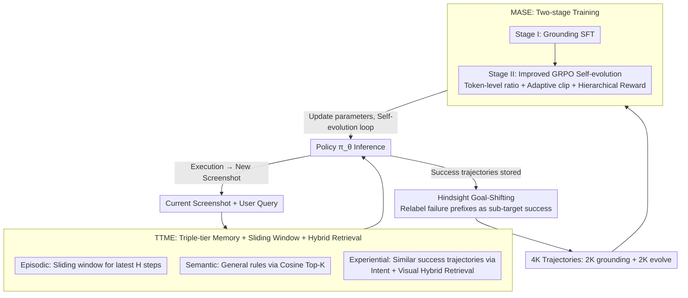

# SE-GA: Memory-Augmented Self-Evolution for GUI Agents

**Conference**: ICML 2026  
**arXiv**: [2605.16883](https://arxiv.org/abs/2605.16883)  
**Code**: https://github.com/jinshilong-dev/SE-GA (Available)  
**Area**: Agent / Multimodal VLM / Reinforcement Learning  
**Keywords**: GUI Agent, Hierarchical Memory, Self-evolution, GRPO, Hindsight Goal-Shifting

## TL;DR
SE-GA equips VLM-based GUI agents with a triple-tier memory (TTME: episodic + semantic + experiential) and a two-stage memory-augmented self-evolution training pipeline (MASE: SFT → improved GRPO). This approach pushes Qwen2.5-VL-7B to 89.0 on ScreenSpot, 75.8 on AndroidControl-High, and 39.0 on AndroidWorld, comprehensively outperforming same-scale baselines and matching the performance of 72B models.

## Background & Motivation

**Background**: Current mainstream GUI agents treat VLMs (e.g., Qwen2.5-VL, UI-TARS) directly as policy networks that output actions from screenshots. They typically use Behavior Cloning via SFT on fixed trajectory datasets, with some works further employing RL algorithms like GRPO to align with human intent.

**Limitations of Prior Work**: The authors identify two specific bottlenecks. First, **finite context windows + reliance on current screenshots**: GUI navigation is a partially observable, history-dependent POMDP. Critical information may appear only in early steps, but existing methods (ShowUI, OS-Atlas, etc.) only fit recent steps into the window, leading to irreversible failures in long-range tasks. Second, **static policies + lack of unified memory organization**: Real-world tasks are often variants or combinations of historically successful tasks. Current agents are either frozen after training or rely on temporary text RAG, failing to crystallize successful strategies into long-term reusable knowledge or explicitly feedback this experience into model parameters.

**Key Challenge**: There is a structural trade-off between the **long-range dependency** of GUI tasks and the engineering reality of **short windows + static parameters** in VLM agents. One must enable the agent to retrieve critical observations from many steps ago during inference while allowing the strategy to continuously evolve from past successful trajectories. Relying solely on window expansion or additional training rounds cannot solve this.

**Goal**: Transform GUI agents from "static command executors" into "dynamic learners." This is broken down into two sub-problems: (1) How to **precisely manage long-range context** during inference—not just episodic short-term windows, but also cross-task retrieval of abstract rules and similar historical experiences; (2) How to **stably encode retrieved successful experiences back into strategy parameters** during training, making GRPO viable in sparse-reward, high-variance GUI environments.

**Key Insight**: Borrowing from the three types of human cognitive memory (episodic/semantic/experiential), it is hypothesized that GUI agents can decouple "recent context" vs. "general rules" vs. "similar successful experiences" through hierarchical memory. Experiential memory can be dynamically accumulated during inference and fed back into training, forming a self-evolution loop.

**Core Idea**: A triple-tier memory (TTME: episodic + semantic + experiential) is used for precise context retrieval during inference. A two-stage training pipeline (MASE: grounding SFT + improved GRPO) then incorporates high-quality trajectories from the memory back into the strategy parameters, enabling continuous online evolution.

## Method

### Overall Architecture
SE-GA formalizes GUI navigation as a POMDP $\langle\mathcal{S},\mathcal{A},\mathcal{O},\mathcal{T},\mathcal{R},\gamma\rangle$. The goal is to transform a vanilla VLM policy into a self-evolving agent capable of cross-task experience retrieval and parameter feedback. At each step $t$, the agent receives the user query $Q$ and current screenshot $o_t$, retrieves structured memory $M_{retrieved}$ from the triple-tier database $\mathcal{M}=(M^{EPI},M^{SEM},M^{EXP})$, and feeds the combined input $x_t=(o_t,Q,M_{retrieved})$ into the policy $\pi_\theta(a_t|x_t)$. The system is integrated into a self-evolution loop by three components: **TTME** (Test-Time Memory Extension) manages hierarchical context retrieval and real-time storage of success; **Hindsight Goal-Shifting** recycles successful prefixes of failed trajectories to expand data to 4K high-quality samples; and **MASE** (Memory-Augmented Self-Evolution) uses two-stage training (Grounding SFT → Improved GRPO) to burn this data back into VLM parameters. The base model is Qwen2.5-VL-7B, trained on 4×A800.

### Key Designs

**1. TTME: Triple-tier Memory + Sliding Window + Multimodal Hybrid Retrieval**

GUI navigation is partially observable, and critical clues may be hidden in a screenshot from 100 steps ago. TTME splits context into three layers based on cognitive science. The **Episodic** layer $M^{EPI}_t=[\langle o_k,a_k,o_{k+1}\rangle]_{k=1}^{t-1}$ stores raw action sequences, using a fixed-length $H$ sliding window $\mathcal{C}^{epi}_t=[m_k]_{k=\max(1,t-H)}^{t-1}$ to retain recent steps and prevent obsolete steps from misleading decisions. The **Semantic** layer stores general interaction rules $m^{sem}_i=\langle k^{sem}_i,d_i\rangle$ (e.g., "Log in before accessing restricted pages"), retrieved via cosine similarity $S^{sem}(Q,m^{sem}_i)=\phi(Q)\cdot k^{sem}_i / (|\phi(Q)||k^{sem}_i|)$ to facilitate cross-task knowledge transfer. The **Experiential** layer stores historical success trajectories and reflections $m^{exp}_i=\langle\tau_i,g(\tau_i),k^{intent}_i,k^{task}_i\rangle$ to avoid "reinventing the wheel."

The retrieval for the experiential layer is the most critical design: it uses **intent-visual hybrid retrieval** $S^{exp}(Q,o_t)=\lambda\cdot\text{Sim}(\phi(Q),k^{intent}_i)+(1-\lambda)\cdot\text{Sim}(\psi(o_t),k^{task}_i)$. This fuses text query similarity with the visual similarity of the current screenshot $\psi(o_t)$. Since GUI tasks are highly dependent on layout, pure text RAG ignores "what the UI looks like," which can lead to misleading historical trajectories with similar intent but different interfaces. All layers $\mathcal{C}^{epi},\mathcal{C}^{sem},\mathcal{C}^{exp}$ are concatenated into the agent input. TTME acts as a dynamic buffer, where new successful trajectories are stored in real-time during inference.

**2. Hindsight Goal-Shifting: Recycling failure prefixes as successful sub-task samples**

High-quality GUI trajectories are extremely scarce. Hindsight Goal-Shifting adapts HER (Hindsight Experience Replay) to the symbolic GUI action space. Given a failed trajectory for target $g$, $\tau=(s_0,a_0,\ldots,s_T)$, if a prefix $\tau_{0:k}$ actually completes an **alternative sub-goal** $g'$ (e.g., "Successfully opened App but failed subsequent search," where $g'$ is "Open App"), $\tau_{0:k}$ is relabeled as a success for $g'$. This forms $\mathcal{D}_{GS}=\{(\tau_{0:k},g')\mid \text{Verify}(\tau_{0:k},g')=1\}$. This effectively doubles data utility by extracting gradients from the "successful first half" of failures.

**3. MASE Training: Grounding SFT + Improved GRPO for Evolution**

To feed data back into model parameters, MASE employs a two-stage approach. **Stage I (Grounding Training)** is memory-aware behavior cloning: $\mathcal{L}_{SFT}(\theta)=-\mathbb{E}_{(x,y)\sim\mathcal{D}_{ground}}[\frac{1}{|y|}\sum_t\log\pi_\theta(y_t|o_t,Q,M,y_{<t})]$, which stabilizes grounding and prevents catastrophic forgetting in Stage II. **Stage II (Self-Evolution Training)** modifies GRPO for GUI tasks in three ways. 

First, **token-level importance ratio**: $\rho_{i,t}=\pi_\theta(y_{i,t}|x,y_{i,<t})/\pi_{\theta_{old}}(\cdot)$, which calculates ratios at the token level to prevent gradients from exploding due to irrelevant tokens. Second, **adaptive clipping**: the clip upper bound $\epsilon_{cur}$ decays from $\epsilon_{init}$ to $\epsilon_{end}$ via a cosine schedule: 
$$\epsilon_{cur}=\epsilon_{end}+\tfrac{1}{2}(\epsilon_{init}-\epsilon_{end})(1+\cos(\pi k/K))$$
This allows exploration in early training while ensuring stability later. Third, **hierarchical reward**: $R_{total}=w_f R_{format}+w_a R_{acc}$. Formatting is penalized first; if $R_{format}=0$, the accuracy reward is chopped. Accuracy is subdivided into action type and parameter rewards (e.g., for clicks, $R_{point}=\mathbb{I}((x_p,y_p)\in B_{gt})$). This ensures strict output formats and precise coordinate accuracy. Final objective: $\mathcal{J}(\theta)=\mathbb{E}[\frac{1}{\sum|y_i|}\sum_{i,t}(\min(\rho_{i,t}A_i,\rho_{i,t}^{clip}A_i)-\beta\mathbb{D}_{KL}(\pi_\theta||\pi_{ref}))]$.

### Loss & Training
Stage I SFT: lr=2e-6, global batch=16. Stage II GRPO: lr=2e-5, global batch=256, group size $G=16$. Hardware: 4×A800 GPU. Data sources: AITW + AMEX + GUIOdyssey + Android emulator. Samples are filtered by Qwen-VL for quality and expanded via Hindsight Goal-Shifting.

## Key Experimental Results

### Main Results

| Dataset | Metric | Ours (7B) | Prev. SOTA | Gain |
|--------|------|-----------|-----------|------|
| ScreenSpot | Avg Grounding Acc | **89.0** | UI-TARS-72B 88.4 / Aguvis-7B 84.4 | +0.6 vs 72B / +4.6 vs Scale |
| AndroidControl-Low | Success Rate | **88.6** | OS-Atlas-7B 85.2 | +3.4 |
| AndroidControl-High | Success Rate | **75.8** | UI-TARS-72B 74.7 / OS-Atlas-7B 71.2 | +1.1 vs 72B / +4.6 vs Scale |
| GUIOdyssey | Step SR | **83.9** | OS-Atlas-7B 62.0 / UI-TARS-72B 88.6 | +21.9 vs Scale (72B leads by 4.7) |
| GUIOdyssey | Type Acc | **96.5** | UI-TARS-72B 95.4 | +1.1 (Ours > 72B) |
| AndroidWorld (Online) | SR | **39.0** | UI-TARS-7B 33.0 / GUI-Critic-R1 27.6 | +6.0 |

### Ablation Study

| Configuration | AC-Low SR | AC-High SR | GUIOdyssey SR | Explanation |
|------|-----------|------------|---------------|------|
| Full SE-GA | 88.6 | 73.8 | 83.9 | Full model |
| w/o TTME | 83.0 | 61.4 | 74.9 | No hierarchical memory: Long-range SR drops 12.4 |
| w/o MASE | 74.3 | 59.7 | 60.4 | No self-evolution: Massive drop (GUIOdyssey -23.5) |

### Key Findings
- **MASE is the foundation, TTME is the scaffolding**: Removing MASE causes a larger drop than removing TTME, indicating that burning grounding and decision-making into parameters is the baseline, while TTME adds long-range gains.
- **TTME value scales with task length**: In AC-Low (short-range), removal drops performance by 5.6; in AC-High (long-range), it drops by 12.4, validating that hierarchical memory primarily solves long-range forgetting.
- **7B beats 72B**: SE-GA-7B outperforms UI-TARS-72B and Qwen2.5-VL-72B on ScreenSpot and AndroidControl-High, showing that for structured GUI tasks, mechanism improvements are more valuable than parameter scaling.
- **Greater online gains**: The 6-point lead in AndroidWorld (dynamic online) over baselines highlights the advantage of the self-evolution mechanism in real-world dynamic environments.

## Highlights & Insights
- **Engineering scheme of triple memory + visual hybrid retrieval**: Mapping cognitive divisions to GUI contexts and adding a visual similarity channel $\psi(o_t)$ is necessary—pure text RAG cannot capture UI layout dependencies.
- **Self-evolution loop**: TTME collects new success trajectories → MASE fine-tunes them into parameters → a stronger agent collects higher quality trajectories. This loop between non-parametric memory and parametric strategy is a universal paradigm for agents.
- **GUI-customized GRPO**: The three-part modification (token-level ratio + adaptive clipping + hierarchical reward) addresses specific failure modes in GUI RL training, such as gradient explosion and sparse correctness.
- **Hindsight Goal-Shifting**: Relabeling successful prefixes is a "free" data augmentation technique for any agent task with distinct intermediate states.

## Limitations & Future Work
- **Retrieval Latency**: As experiential memory accumulates, embedding-based hybrid retrieval may become a bottleneck for real-time response.
- **Training Scale**: The 4K trajectory dataset is small; future work needs to validate scalability on much larger and more diverse datasets.
- **Cross-platform Generalization**: Experiments were focused on Android and ScreenSpot. Generalization to Web or Desktop GUI is unverified and might require rebuilding semantic memory sets.
- **Negative Retrieval Effects**: Instances where similar historical trajectories mislead the agent due to intent-only matches need further analysis.
- **Hyperparameter Sensitivity**: The weights for $\lambda$ and sliding window $H$ lack sensitivity curves in the current paper.

## Related Work & Insights
- **vs. UI-TARS**: UI-TARS relies on large models and datasets (72B hits 88.4 on ScreenSpot). SE-GA-7B reaches 89.0 through architecture, proving engineering beats raw scale in structured domains.
- **vs. OS-Atlas / GUI-Critic-R1**: These lack unified episodic/semantic/experiential organization. SE-GA elevates "memory" from an engineering module to a core abstraction for information and evolution.
- **vs. ShowUI / RAG Agents**: These rely on text-only vectors. SE-GA’s hybrid retrieval $\lambda\cdot\text{Sim}(\phi(Q),k^{intent})+(1-\lambda)\cdot\text{Sim}(\psi(o_t),k^{task})$ is a necessary extension for GUI space.
- **vs. DAPO / GRPO**: By integrating token-level ratios and hierarchical rewards, SE-GA provides a template for applying GRPO to structured agent tasks.

## Rating
- Novelty: ⭐⭐⭐⭐ While triple memory is not new (CoALA, Reflexion), the integration with visual hybrid retrieval and the RL self-evolution loop for GUI is highly complete.
- Experimental Thoroughness: ⭐⭐⭐⭐ Covers major benchmarks with full ablation, though sensitivity analysis for specific parameters is missing.
- Writing Quality: ⭐⭐⭐⭐ Clear logic and complete formulas.
- Value: ⭐⭐⭐⭐ 7B beating 72B is directly valuable for deployed products; the TTME+MASE loop is a generalizable paradigm for other agent tasks.

<!-- RELATED:START -->

## Related Papers

- [\[AAAI 2026\] Co-EPG: A Framework for Co-Evolution of Planning and Grounding in Autonomous GUI Agents](../../AAAI2026/llm_agent/co-epg_a_framework_for_co-evolution_of_planning_and_groundin.md)
- [\[ICML 2026\] SafeHarbor: Defining Precise Decision Boundaries via Hierarchical Memory-Augmented Guardrail for LLM Agent Safety](safeharbor_hierarchical_memory-augmented_guardrail_for_llm_agent_safety.md)
- [\[ACL 2026\] From Storage to Experience: A Survey on the Evolution of LLM Agent Memory Mechanisms](../../ACL2026/llm_agent/from_storage_to_experience_a_survey_on_the_evolution_of_llm_agent_memory_mechani.md)
- [\[ICML 2026\] EvolveR: Self-Evolving LLM Agents through an Experience-Driven Lifecycle](evolver_self-evolving_llm_agents_through_an_experience-driven_lifecycle.md)
- [\[ICLR 2026\] Exploratory Memory-Augmented LLM Agent via Hybrid On- and Off-Policy Optimization](../../ICLR2026/llm_agent/exploratory_memory-augmented_llm_agent_via_hybrid_on-_and_off-policy_optimizatio.md)

<!-- RELATED:END -->
