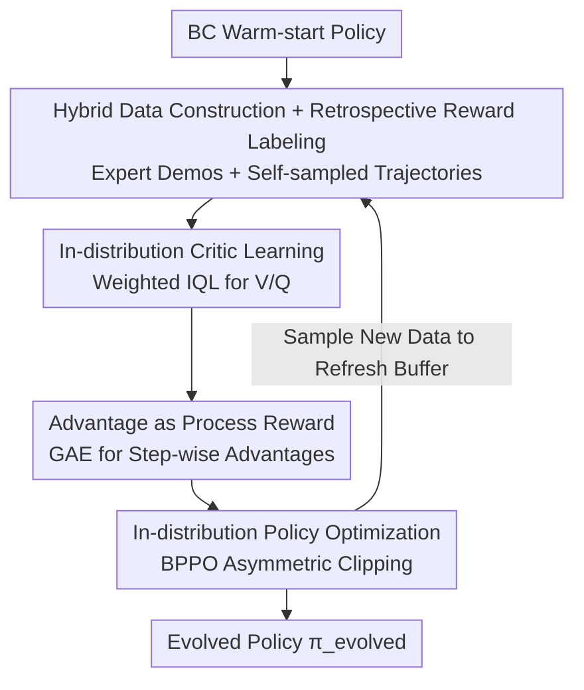

# Self-evolving LLM agents with in-distribution Optimization

**Conference**: ICML2026  
**arXiv**: [2606.07367](https://arxiv.org/abs/2606.07367)  
**Code**: [qevolve.github.io](https://qevolve.github.io/)  
**Area**: LLM Agent / Reinforcement Learning / Process Reward  
**Keywords**: Self-evolving agents, Process reward, Implicit Q-learning, Credit assignment, In-distribution optimization

## TL;DR
Q-Evolve enables LLM agents to learn an "in-distribution critic" on a fixed hybrid offline dataset. It automatically assigns process rewards to each step using advantage estimation and updates via a behavior-proximal policy optimization. The entire process remains within the data distribution, achieving stable self-evolution on AlfWorld, WebShop, and ScienceWorld with significantly fewer environment interactions.

## Background & Motivation
**Background**: LLMs are transitioning from static text generation to driving interactive agents for sequential decision-making in long-horizon tasks such as navigation, games, and robotics. However, feedback in long-horizon tasks is typically **sparse and heavily delayed**—agents often receive a binary reward only at the end of an episode, making it difficult to attribute success or failure to specific intermediate steps, which is the classic credit assignment problem.

**Limitations of Prior Work**: To provide step-by-step process rewards (PR), existing methods either rely on expensive human annotation or, like QLASS, use **extensive online rollouts and searching** to estimate Q-values as PR labels. However, they face a fundamental risk: **process rewards are distribution-sensitive**—PR labels are only reliable near the state-action distribution on which they were trained. Once the policy is optimized online and generates actions unseen by the PR, or environmental dynamics push the agent into OOD states, the PR scores become invalid, potentially causing catastrophic distribution shift. Furthermore, these methods often rely on restrictive assumptions such as environmental determinism, reversible states, or discretizable action spaces.

**Key Challenge**: If "generating process supervision" and "utilizing process supervision" occur on different distributions, the supervision becomes untrustworthy. Existing offline RL approaches (using an external critic to rerank candidate actions) treat the critic as an auxiliary filter rather than an intrinsic objective, which neither transforms the LLM into a self-contained evolving agent nor resolves the drift between offline data and the policy's own distribution.

**Goal**: To both generate and utilize step-wise supervision within the **same distribution** to ensure process reward reliability, while enabling the policy, critic, and data to co-evolve in a closed loop.

**Key Insight**: Although classic Bellman backup theoretically solves long-term credit assignment, applying it directly to LLMs faces two dilemmas: bootstrap noise accumulation is hard to converge under sparse rewards, and scalar Q-values are difficult to use for direct policy guidance in multi-token action spaces. The authors address this by using Implicit Q-learning (IQL) to learn a critic only on dataset actions, avoiding OOD actions.

**Core Idea**: Propose **Q-Evolve**, a self-evolution framework that unifies "automatic process reward labeling" and "in-distribution policy optimization" into a closed loop: learn an in-distribution critic (Weighted IQL) from hybrid offline data consisting of expert demonstrations and agent trajectories, use GAE advantages as process rewards, and update via behavior-proximal policy optimization on the same data. Every update is anchored within the distribution, preventing the amplification of distribution drift.

## Method

### Overall Architecture
Q-Evolve first warm-starts the policy using Behavior Cloning (BC) and then enters several "in-distribution evolution cycles." Each cycle (inner loop) consists of four steps, and an outer loop uses the evolved policy to sample new data and refresh the buffer, forming a closed-loop co-evolution of policy, critic, and data.

The key transformation of the pipeline is: **filling sparse rewards (available only at the end of an episode) into dense step-wise process rewards via Bellman propagation and advantage estimation, then updating the policy only on the same data that generated these rewards**. Specifically, ① a hybrid offline dataset of "expert + self-sampled" trajectories is constructed via current policy rollouts, with auxiliary rewards added via rule-based retrospective labeling; ② an in-distribution critic ($V$, $Q$) is learned on this fixed data using Weighted IQL; ③ step-wise advantages are derived from the critic via GAE to serve as process rewards; ④ the policy is updated using a Behavior-Proximal Policy Optimization (BPPO) objective.

### Key Designs

**1. Hybrid Offline Data + Retrospective Reward Labeling: Anchoring Process Supervision on Error Distributions**

Learning a critic solely from self-sampled trajectories is often overwhelmed by random noise—especially since early weak agents rarely reach successful terminal states, resulting in offline data biased toward low-signal regions. The authors construct a hybrid dataset $\mathcal{D}=\mathcal{D}_{\text{expert}}\cup\mathcal{D}_{\text{self}}$: expert demonstrations provide key steps and successful subroutines (high-quality positive signal anchors), while self-sampled trajectories expose the policy's true state-action coverage (including failure modes and "plausible but incorrect" actions), calibrating process supervision exactly where the agent makes mistakes. The initial $\mathcal{D}_{\text{self}}$ is collected by the BC policy $\pi_{\text{BC}}$.

On top of this, **Retrospective Reward Labeling** is applied: exploiting the fact that LLM agent observations and actions are natural language and environments often provide explicit text feedback, rule-based parsing of the next observation $o_{t+1}$ assigns auxiliary rewards—$r^{\text{fmt}}$ for format errors, $r^{\text{inv}}$ for invalid actions, and $r^{\text{repeat}}$ for stagnation ($o_t=o_{t+1}$), else 0. This labeling **does not require access to environment dynamics**, immediately penalizes non-executable steps, and decouples "action validity" from "task success," providing sparse but fine-grained additional signals.

**2. In-distribution Critic via Weighted IQL: Stabilizing Bellman Backup under Sparse Rewards**

To strictly constrain process rewards within the fixed data, the authors use IQL—it learns only on dataset actions, explicitly avoiding maximization over OOD actions. $V$ approximates a specific quantile of the action-value distribution via asymmetric expectile regression, while $Q$ uses standard Bellman regression $L_Q=\mathbb{E}_{\mathcal{D}}[(r_{t+1}+\gamma V(u,h_{t+1},o_{t+1})-Q(\cdots))^2]$. However, even with IQL, learning is difficult under sparse delayed rewards where most transition rewards are zero and objectives are dominated by bootstrap noise.

The solution is **Weighted IQL**: assigning a step weight $w_t=(t/T+d)\cdot 0.5+0.5$, where $d\in\{0,1\}$ indicates if the trajectory ended with a non-zero reward. This weight (i) upweights successful trajectories ($d=1$) and (ii) gives more weight to later steps more closely related to the terminal outcome. Incorporating $w_t$ into IQL's expectile and Q-regression losses allows the critic to receive stronger signals from informative steps, stabilizing estimation. Critic learning is decoupled from policy improvement (training the critic separately on fixed data first) to avoid feedback loops of noisy co-learning.

**3. GAE Advantage as Process Reward: Filling Missing Intermediate Rewards with Multi-step Advantages**

Once the critic is trained, the authors **do not directly use $Q-V$** as the process reward (single-step advantages are too heavily corrupted by bootstrap noise in long-horizon tasks). Instead, they use GAE to calculate step-wise advantages: $\delta_t=r^{\text{env}}_{t+1}+\gamma V(\cdots_{t+1})-V(\cdots_t)$, $A_t=\delta_t+\lambda\gamma A_{t+1}$. This uses Bellman propagation to "fill in" missing intermediate rewards without requiring environment reversibility or manual annotation.

A counter-intuitive but key finding: **using only environmental rewards $r^{\text{env}}$ in advantage estimation and excluding auxiliary rewards $r^{\text{aux}}$** performs better than removing $r^{\text{aux}}$ entirely or including it in the advantage. This is because it aligns process rewards with the true task objective, maintaining optimal policy invariance; $r^{\text{aux}}$ is useful as an auxiliary signal for training the critic but would introduce heuristic bias into policy learning if included in the advantage.

**4. Behavior-Proximal Policy Optimization + Asymmetric Clipping: Amplifying Good and Suppressing Bad Actions In-distribution**

Initially, the authors followed the IQL convention of using Advantage Weighted Regression (AWR) $L_\pi=\mathbb{E}[\exp(A_t)\log\pi_\theta(\cdots)]$. However, AWR only monotonically increases the probability of actions present in the dataset and **lacks a mechanism to suppress actions with negative process rewards**, leading to overfitting.

They switch to the **BPPO** clipped objective: $\mathcal{L}_\pi(\theta)=\mathbb{E}_{\mathcal{D}}[\min(\eta_t A_t,\ \text{clip}(\eta_t,1-\epsilon_{\text{low}},1+\epsilon_{\text{high}})A_t)]+\alpha\,\text{KL}(\pi_\phi\|\pi_{\text{ref}})$, where $\eta_t$ is the importance ratio of the current policy to the lagged behavior policy $\pi_{\text{old}}$ that generated the data. It adopts PPO-style clipping, but the advantages come directly from the pre-labeled process rewards, **eliminating the need for an online critic and extensive online interaction**. Crucially, **asymmetric clipping $\epsilon_{\text{low}}>\epsilon_{\text{high}}$** is used: allowing more aggressive suppression of negatively labeled actions (loosening the lower bound) while keeping the increase in probability more tightly constrained (tightening the upper bound). This decisively inhibits harmful actions without aggressively extrapolating beyond the offline data distribution, maintaining conservative updates "within the support set."

### Main Results
Q-Evolve was evaluated against baselines on three sparse delayed reward environments (WebShop, SciWorld, AlfWorld). The metric used is the average cumulative reward:

| Method | WebShop | SciWorld Seen | SciWorld Unseen | AlfWorld Seen | AlfWorld Unseen | Mean |
|------|---------|---------------|-----------------|---------------|-----------------|------|
| SFT | 63.1 | 67.4 | 53.0 | 60.0 | 67.2 | 62.1 |
| ETO | 67.4 | 73.8 | 65.0 | 68.6 | 72.4 | 69.4 |
| QLASS | 70.3 | 75.3 | 66.4 | 77.9 | 82.8 | 74.5 |
| **Ours (Q-Evolve)** | **70.5** | **76.3** | **69.7** | **90.7** | **89.6** | **79.4** |

Q-Evolve achieved the highest average score of 79.4, outperforming the runner-up QLASS by 4.9. The improvement is most significant in AlfWorld: Seen 90.7 / Unseen 89.6 (surpassing QLASS by 12.8 / 6.8). More importantly, in terms of **sample efficiency**, QLASS requires 600K online samples on AlfWorld, while Q-Evolve uses only 20K (approx. 1/30), as it relies primarily on offline re-labeling rather than online rollout and search to derive process rewards.

### Ablation Study (AlfWorld, 1 Iteration)

| Variant | Seen | Unseen | Description |
|------|------|--------|------|
| Q-Evolve (1-iter) | 87.9 | 86.6 | Full Model |
| w/o RR | 83.6 | 82.7 | Loss of intermediate learning signals |
| w/o W-IQL | 83.6 | 76.1 | Critic becomes fragile under sparse rewards |
| w/o GAE | 74.3 | 74.6 | Significant drop in advantage quality |
| w/o PI | 58.6 | 59.0 | Critic only used for test-time reranking (below SFT) |
| w/o PI + AWR | 64.3 | 67.9 | Using AWR for policy improvement; fails to suppress bad actions |

### Key Findings
- **In-distribution policy learning is the dominant mechanism**: Using process rewards for OOD test-time reranking (w/o PI) drops performance to 58.6/59.0, even lower than $\pi_{\text{BC}}$—as the policy may propose candidate actions the PR has never seen, and environment dynamics push it toward OOD states, making PR scores invalid. This validates that "process rewards must be used within a controllable distribution."
- **GAE is the critical bridge from critic to policy**: Removing GAE causes a drop to 74.x. Multi-step advantages provide much more reliable temporal credit assignment than single-step $Q-V$ or potential-based shaping.
- **Placement of $r^{\text{aux}}$ is nuanced**: Including auxiliary rewards in the advantage calculation actually hurts performance, but keeping them as auxiliary targets for critic training is beneficial. Heuristic signals are suited for "stabilizing the critic" rather than "directly shaping the policy."
- **Synergy over single tricks**: Removing RR, W-IQL, or GAE lead to performance drops; the final gains stem from their synergistic interaction.

## Highlights & Insights
- **Generating and utilizing supervision within the same distribution**: This core theme addresses the root cause of process reward unreliability. Q-Evolve locks both into a closed loop, targeting the problem directly rather than just adding modules.
- **Nearly zero-cost Retrospective Reward Labeling**: Using natural language feedback to supplement dense signals for format/invalid/repeat errors is highly efficient, does not touch environment dynamics, and is transferable to any interactive environment with text feedback.
- **Excluding $r^{\text{aux}}$ from advantages**: This design choice reflects a clear understanding of "maintaining optimal policy invariance." Heuristic rewards, no matter how helpful, should only shape the critic and not contaminate the advantage signal aligned with the task objective.
- **Asymmetric clipping** is a simple but effective modification that addresses the limitation of AWR (which can only increase probabilities).
- Achieving superior results with 1/30 of the online sampling is particularly attractive for high-risk or non-deterministic scenarios (robotics, real web) where online interaction is expensive.

## Limitations & Future Work
- **Dependency on expert demonstrations**: The hybrid data relies heavily on expert trajectories to provide success anchors; stability of Weighted IQL in pure zero-expert/cold-start scenarios remains questionable.
- **Reliance on text feedback quality**: Retrospective labeling assumes the environment explicitly reports execution errors. In environments with ambiguous or no text feedback, this signal will fail.
- **Single model scale**: Tested only on Llama2-7B-Chat. Whether distribution drift remains as prominent with larger or stronger base models is unknown.
- **Manual tuning of evolution iterations**: Cycles (2 for SciWorld/AlfWorld, 3 for WebShop) were hand-tuned; an automatic stopping criterion for evolution is currently missing.

## Related Work & Insights
- **vs QLASS (Online Search for Q)**: QLASS relies on building exploration trees and online rollouts for Q-estimation, requiring discrete states and 600K samples; Q-Evolve learns an in-distribution critic and uses offline re-labeling, proving more stable and efficient with 20K samples.
- **vs ETO / DMPO (Preference-based RL)**: These methods use trajectory-level preferences for DPO or multi-round objectives (per-trajectory supervision). Q-Evolve provides step-by-step process rewards, making credit assignment finer and more stable.
- **vs External Critic Offline RL**: Those methods use critics as filters to rerank candidates, where the LLM cannot become a self-contained evolving agent and distribution drift is not addressed. Q-Evolve treats the critic as an intrinsic objective, enabling closed-loop co-evolution.

## Rating
- Novelty: ⭐⭐⭐⭐⭐ "In-distribution closed-loop for generating and utilizing process rewards" targets the root cause of unreliable PR.
- Experimental Thoroughness: ⭐⭐⭐⭐ Seen/Unseen benchmarks + detailed ablations, though limited to a single 7B base model.
- Writing Quality: ⭐⭐⭐⭐ Clear logic from motivation to methodology; design motivations for Weighted IQL and BPPO are well-explained.
- Value: ⭐⭐⭐⭐⭐ Achieving SOTA with 1/30 online sampling is highly practical for agent training in expensive interaction scenarios.

<!-- RELATED:START -->

## Related Papers

- [\[ICML 2026\] EvolveR: Self-Evolving LLM Agents through an Experience-Driven Lifecycle](evolver_self-evolving_llm_agents_through_an_experience-driven_lifecycle.md)
- [\[ACL 2026\] SEARL: Joint Optimization of Policy and Tool Graph Memory for Self-Evolving Agents](../../ACL2026/llm_agent/searl_joint_optimization_of_policy_and_tool_graph_memory_for_self-evolving_agent.md)
- [\[ICML 2026\] Towards Feedback-to-Plan Decisions for Self-Evolving LLM Agents in CUDA Kernel Generation](towards_feedback-to-plan_decisions_for_self-evolving_llm_agents_in_cuda_kernel_g.md)
- [\[CVPR 2026\] JarvisEvo: Towards a Self-Evolving Photo Editing Agent with Synergistic Editor-Evaluator Optimization](../../CVPR2026/llm_agent/jarvisevo_towards_a_self-evolving_photo_editing_agent_with_synergistic_editor-ev.md)
- [\[ICLR 2026\] Your Agent May Misevolve: Emergent Risks in Self-evolving LLM Agents](../../ICLR2026/llm_agent/your_agent_may_misevolve_emergent_risks_in_self-evolving_llm_agents.md)

<!-- RELATED:END -->
