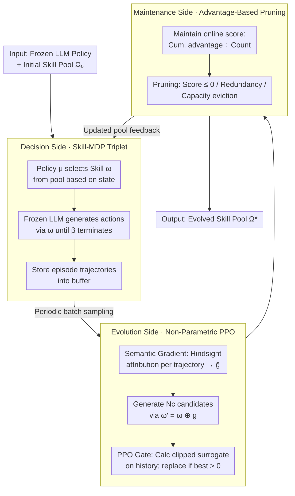

# Skill-Pro: Learning Reusable Skills from Experience via Non-Parametric PPO for LLM Agents

**Conference**: ICML 2026 Spotlight  
**arXiv**: [2602.01869](https://arxiv.org/abs/2602.01869)  
**Code**: https://github.com/Miracle1207/Skill-Pro (Available)  
**Area**: LLM Agent / Procedural Memory / Non-Parametric Optimization  
**Keywords**: Reusable Skills, Skill-MDP, Non-Parametric PPO, Semantic Gradient, Procedural Memory

## TL;DR
Skill-Pro explicitly extracts interaction experiences of LLM agents into "Activation + Execution + Termination" skill triplets. It utilizes semantic gradients to generate candidate skills and a PPO-style trust region verification (PPO Gate) to decide integration. Ultimately, it achieves a reuse rate of 0.85+ and significant performance gains on ALFWorld / Mastermind with a minimal memory library of ~800 tokens.

## Background & Motivation

**Background**: Current LLM agents primarily rely on "on-the-fly reasoning" for sequential decision-making—re-executing prompt parsing, CoT, and ReAct for every task, even in recurring similar scenarios. To incorporate past experience, mainstream approaches follow two paths: parametric (RL/RLHF/DPO fine-tuning) and non-parametric (external memory + retrieval augmentation).

**Limitations of Prior Work**: Parametric methods are expensive to train, prone to catastrophic forgetting, and risk losing general capabilities. While non-parametric methods are cheaper, they currently rely almost entirely on **episodic memory**—storing past trajectories, reflections, graphs, or workflows as "history books." During decision-making, the agent retrieves these and re-processes them, keeping the agent trapped in an inference-heavy loop with high token consumption and low reliability.

**Key Challenge**: The human brain possesses **procedural memory** in addition to episodic memory—once a skill is learned, it can be executed unconsciously as "situation → action." Existing LLM agent memory systems **only cover the episodic layer and lack the procedural layer**. Storing experience $\neq$ direct reusability; one must transform passive narratives into executable programs while ensuring updates do not damage the base LLM's general capabilities.

**Goal**: (C1) Ensure stored experiences are **executable** program units rather than narratives; (C2) Guarantee that new units are **reliably reusable** and provide stable gains in future tasks; (C3) Perform the entire optimization **without updating LLM parameters**.

**Key Insight**: Adapt the "small-step update + trust region" paradigm of Proximal Policy Optimization (PPO) from reinforcement learning to the natural language level—replacing parameter updates with skill text updates, gradients with "semantic gradients" (natural language modification suggestions), and clipping with probability ratio clipping of the frozen LLM on historical trajectories.

**Core Idea**: Formalize agent procedural memory as a **Skill-MDP** (where a skill $\omega$ is defined by the triplet: activation condition $\mathcal{I}_\omega$, execution flow $\pi_\omega$, and termination condition $\beta_\omega$). Use **Non-Parametric PPO** (semantic gradient generation + PPO Gate verification + online score pruning) to evolve the skill pool continuously without modifying LLM weights.

## Method

### Overall Architecture

Input: A fixed LLM policy $\pi_\text{LLM}$, an initial skill pool $\Omega_0$ (can be empty), and batch trajectories $\mathcal{T}^{(B)}$ from the environment. Output: An evolved skill pool $\Omega^*$. During decision-making, the agent simply "selects a skill → executes atomic actions following the skill."

The pipeline consists of three phases:

1.  **Decision Side (Skill-MDP)**: At each timestep $t$, the skill-selection policy $\mu$ selects a skill $\omega_t$ from $\Omega$ based on the current state $s_t$ (via similarity matching or top-k value ranking). The frozen LLM then generates atomic actions $a_t \sim \pi_\text{LLM}(a \mid s_t, \omega_t)$ guided by the execution flow of $\omega_t$, until $\beta_{\omega_t}(s_t)=1$ triggers a skill switch. Full episode trajectories are collected into a buffer.

2.  **Evolution Side (Non-Parametric PPO)**: A batch is periodically sampled from the buffer. For each invoked skill, a semantic gradient $g_i = \nabla_\text{sem}(\tau_i, \omega)$ is calculated and aggregated across trajectories into $\bar{g}_\omega$. $N_c$ candidate skills are generated as $\omega' = \omega \oplus \bar{g}_\omega$. The PPO Gate calculates a clipped surrogate score for each candidate on historical trajectories; only the best-of-$N_c$ candidate with a score $>0$ replaces the old skill.

3.  **Maintenance Side (Score-Based Maintenance)**: Each skill maintains an online score of "cumulative advantage / invocation count." Skills with scores $\le 0$ or semantic redundancies are pruned. When capacity is exceeded, skills are evicted in ascending order of their scores.

The system **does not modify a single LLM parameter**; all "learning" occurs through the addition, deletion, and modification of skill text. The decision side feeds trajectories to the evolution side, which identifies new skills for the maintenance side to filter, and the refined pool flows back to the decision side, forming a closed loop.

### Key Designs

**1. Skill-MDP and Skill Triplet: Rewriting Experience from Narrative to Executable Program**

Existing memory systems store trajectories or insights, requiring the LLM to "re-reason" how to use them, which fails C1. Skill-Pro extends the classical MDP into $\mathcal{M}_\Omega = (\mathcal{S}, \mathcal{A}, \Omega, P, R, \gamma)$ and formalizes each skill as a triplet $\omega = \langle \mathcal{I}_\omega, \pi_\omega, \beta_\omega \rangle$: $\mathcal{I}_\omega$ is a natural language activation condition (e.g., "start of task, no feedback yet"), $\pi_\omega$ is an ordered sequence of execution steps, and $\beta_\omega$ is a natural language termination condition. The hierarchical policy is decomposed into $\pi_\Omega(\omega_t, a_t \mid s_t) = \mu(\omega_t \mid s_t, \Omega)\,\pi_\text{LLM}(a_t \mid s_t, \omega_t)$. The explicit triplet allows skills to be directly routed by $\mu$, amortizing the "re-reasoning" cost into the training phase.

**2. Non-Parametric PPO: Semantic Gradient for Direction, PPO Gate for Validation**

To meet C2/C3, new skills must provide reliable gains without parameter updates. Relying solely on LLMs to "rewrite skills" often results in hallucinated or unstable variants. Unlike TextGrad, which optimizes static variables, Skill-Pro brings the "small-step update + trust region" of PPO to the text space in two steps.

First, the **Semantic Gradient**: For each trajectory $\tau_i$ using $\omega$, the LLM performs hindsight attribution to output structured natural language modification suggestions $g_i = (g_i^{(\mathcal{I})}, g_i^{(\pi)}, g_i^{(\beta)})$. These are aggregated across a batch into $\bar{g}_\omega$ and applied to the original skill using an LLM operator $\oplus$ to generate candidates $\omega' = \omega \oplus \bar{g}_\omega$.

Second, the **PPO Gate**: The frozen LLM is treated as a stochastic policy. The importance ratio $\rho_t(\omega') = \pi_\text{LLM}(a_t \mid s_t, \omega') / \pi_\text{LLM}(a_t \mid s_t, \omega)$ is calculated on historical trajectories. The advantage $\hat{A}_t = G_t - \bar{R}$ uses return-to-go and a running baseline. Finally, the PPOclipped surrogate is computed:

$$L^\text{CLIP}(\omega') = \hat{\mathbb{E}}_\tau \left[\frac{1}{|\tau|}\sum_t \min\big(\rho_t \hat{A}_t,\ \text{clip}(\rho_t, 1-\epsilon, 1+\epsilon)\,\hat{A}_t\big)\right]$$

The candidate with the highest $L^\text{CLIP} > 0$ replaces the old skill. This mechanism maps the "small-step, verifiable" update semantics from parameter space to skill text space.

**3. Online Advantage-Based Maintenance: Evolution under Selection Pressure**

With a fixed capacity $K$, "good" skills must be retained and "bad" ones evicted to prevent retrieval noise. Skill-Pro maintains an online score for each skill. Defining advantage-based reward as $\tilde{r}_t = r_t - \bar{r}$, the gain of a skill in a trajectory is its average advantage during activation $G(\omega; \tau) = \frac{1}{|\mathcal{T}_\omega(\tau)|}\sum_{t \in \mathcal{T}_\omega(\tau)} \tilde{r}_t$. The score is calculated as $\text{Score} = G_b / \max(1, N_b)$. Skills are pruned if their score $\le 0$, if they are redundant, or if they are the lowest-scoring skills over capacity $K$. Since the baseline $\bar{R}$ rises during training, "once useful" skills naturally fall below 0 and are evicted, creating continuous evolutionary pressure.

### Loss & Training

The overall optimization goal is $\max_\mathcal{E} \mathbb{E}_{\tau \sim \pi_{\Omega^*}}[\sum_t \gamma^t r_t]$, where $\Omega^* = \mathcal{E}^{(N)}(\Omega_0)$ is the steady-state skill pool after $N$ applications of the evolution operator $\mathcal{E}$. This work optimizes $\mathcal{E}$ while keeping $\pi_\text{LLM}$ and $\mu$ fixed. The PPO Gate surrogate follows standard PPO, with $\epsilon$ controlling the trust region.

## Key Experimental Results

### Main Results

Evaluated on ALFWorld (housekeeping tasks, including Train/OOD splits) and Mastermind (code-breaking game, with v0/Hard/Extreme difficulties). Primary backbone: a leading LLM. Cross-agent evaluation covers Gemma-3 4B / Qwen3 32B / Llama-3.3 70B. Compared against 6 memory-augmented baselines: RAG, Expel, A-MEM, AWM, G-Memory, etc.

**Reuse Rate + Storage/Execution Cost**:

| Method | Mastermind-v0 Reuse Rate ↑ | Cross-agent (Qwen3-32B) ↑ | Total Storage Tokens ↓ | Per-step Extra Tokens ↓ |
|------|--------|--------|--------|--------|
| RAG | 0.349 | 0.146 | 116,527 | 2,698 |
| Expel | 0.285 | 0.270 | 294,447 | 5,210 |
| A-MEM | 0.020 | 0.018 | 200,129 | 1,214 |
| AWM | 0.080 | 0.060 | 391,706 | 3,658 |
| G-Memory | 0.091 | 0.264 | 40,510 | 434 |
| **Skill-Pro** | **0.925** | **0.875** | **816** | **273** |

Storage is **~50× smaller** than the next best baseline (G-Memory), with a reuse rate **~10× higher**.

**Performance (Success Rate / Mean Return)**:

| Task | State | CoT | ReAct | AWM | G-Memory | **Skill-Pro** |
|------|------|------|------|------|------|------|
| ALFWorld Train | 0.312 | 0.600 | 0.580 | 0.700 | 0.681 | **0.900** |
| ALFWorld OOD | 0.262 | 0.620 | 0.640 | 0.900 | 0.812 | **0.909** |
| Mastermind-v0 | 0.388 | 0.531 | 0.557 | 0.546 | 0.577 | **0.606** |
| Mastermind-Hard | 0.336 | 0.381 | 0.405 | 0.299 | 0.406 | **0.463** |
| Cross-agent Llama-3.3-70B | 0.613 | 0.542 | 0.604 | 0.550 | 0.535 | **0.647** |

Skill-Pro outperforms the strongest baseline (AWM) on ALFWorld OOD and leads in all Mastermind categories.

### Ablation Study

| Configuration | Key Observation |
|------|------|
| Full Skill-Pro | Reuse rate 0.925 / Mastermind-v0 0.606 |
| w/o Semantic Gradient | Candidate skill quality drops; continuous improvement fails |
| w/o PPO Gate | Hallucinated skills enter the pool; performance becomes unstable |
| w/o Online Score Pruning | Pool bloats; retrieval noise increases; long-term gains disappear |

### Key Findings

- **Extreme Compression**: Achieving a 0.925 reuse rate with only 816 tokens indicates that transforming experience into **programs rather than narratives** increases information density by orders of magnitude.
- **PPO Gate is Indispensable**: Without trust region verification, "deceptive" candidates enter the pool, confirming that semantic gradients carry hallucination risks.
- **Cross-agent Transfer**: Skills learned on Gemma-3 4B can be directly transferred to Llama-3.3 70B, suggesting natural language skills act as a "protocol-level" representation across LLMs.

## Highlights & Insights

- **Mapping PPO Paradigm to Prompt/Skill Space**: Parameter update $\rightarrow$ Text update, Gradient $\rightarrow$ Semantic gradient, Importance ratio $\rightarrow$ LLM action probability ratio, Clip $\rightarrow$ Trust-region text validation. This alignment is a clean and elegant bridge between RL and in-context learning.
- **Executable vs. Narrative Distinction**: Episodic memory treats the LLM as a "secondary reasoning engine," incurring high token costs. Procedural memory "solidifies" reasoning into skill text, fundamental changing the cost model to match + execute.
- **General Framework**: By replacing triplets with tool-call schemes or task sub-flows, this can be viewed as a general evolutionary framework for prompt engineering.

## Limitations & Future Work

- Skills are currently **explicitly readable**, which consumes context window; future work could explore implicit or compressed procedural representations.
- Semantic gradients and the PPO Gate depend on the LLM's own attribution and probability estimation; thus, the **base model's capability limits the skill evolution ceiling**.
- The selection policy $\mu$ is relatively simple (similarity + top-k); a more robust RL-based retriever might be necessary as pool size increases.

## Related Work & Insights

- **vs. RAG / Expel / A-MEM**: These store episodic experiences; Skill-Pro transforms them into executable programs, reducing storage by two orders of magnitude.
- **vs. AWM (Agent Workflow Memory)**: AWM maintains workflows but lacks a mechanism for continuous workflow optimization, which Skill-Pro provides via Non-Parametric PPO.
- **vs. TextGrad**: While TextGrad optimizes static variables for single steps, Skill-Pro addresses sequential decision-making with counterfactual evaluation.
- **vs. Claude Agent Skills**: While Anthropic's skills are human-authored templates, Skill-Pro provides an algorithmic path for agents to **self-learn** these templates.

## Rating
- Novelty: ⭐⭐⭐⭐⭐ The PPO to non-parametric prompt optimization mapping is original and clean.
- Experimental Thoroughness: ⭐⭐⭐⭐ Strong across-task/agent evaluation, though the task suite is slightly narrow.
- Writing Quality: ⭐⭐⭐⭐⭐ Clear mapping between challenges C1-C3 and proposed components.
- Value: ⭐⭐⭐⭐⭐ Provides a practical paradigm for "non-parametric continuous learning."

<!-- RELATED:START -->

## Related Papers

- [\[CVPR 2026\] Learning to Select Visual Tools from Experience](../../CVPR2026/llm_agent/learning_to_select_visual_tools_from_experience.md)
- [\[ICML 2026\] Lifting Traces to Logic: Programmatic Skill Induction with Neuro-Symbolic Learning for Long-Horizon Agentic Tasks](lifting_traces_to_logic_programmatic_skill_induction_with_neuro-symbolic_learnin.md)
- [\[ICML 2026\] EvolveR: Self-Evolving LLM Agents through an Experience-Driven Lifecycle](evolver_self-evolving_llm_agents_through_an_experience-driven_lifecycle.md)
- [\[CVPR 2026\] Experience Transfer for Multimodal LLM Agents in Minecraft Game](../../CVPR2026/llm_agent/experience_transfer_for_multimodal_llm_agents_in_minecraft_game.md)
- [\[ICML 2026\] Internalizing Agency from Reflective Experience](internalizing_agency_from_reflective_experience.md)

<!-- RELATED:END -->
