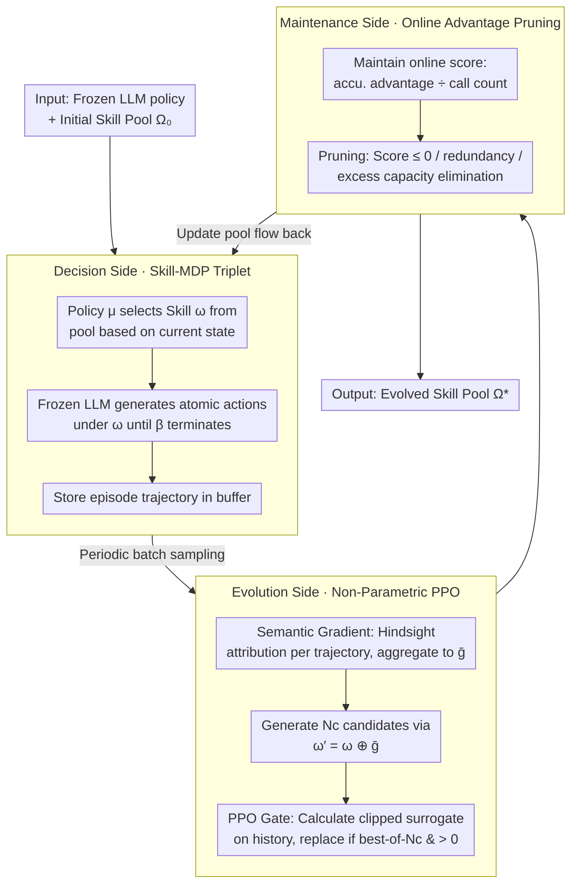

# Skill-Pro: Learning Reusable Skills from Experience via Non-Parametric PPO for LLM Agents

**Conference**: ICML 2026 Spotlight  
**arXiv**: [2602.01869](https://arxiv.org/abs/2602.01869)  
**Code**: https://github.com/Miracle1207/Skill-Pro (Yes)  
**Area**: LLM Agent / Procedural Memory / Non-parametric Optimization  
**Keywords**: Reusable Skills, Skill-MDP, Non-parametric PPO, Semantic Gradient, Procedural Memory

## TL;DR
Skill-Pro explicitly extracts interactive experiences of LLM agents into a "activation + execution + termination" skill triplet. It uses semantic gradients to generate candidate skills and verifies them with a PPO-style trust region (PPO Gate) before inclusion. Ultimately, it achieves over 0.85 reuse rate and significant performance gains in ALFWorld/Mastermind with a minimal memory library of ~800 tokens.

## Background & Motivation

**Background**: Current LLM agents rely primarily on "on-the-fly reasoning" for sequential decision-making—re-parsing prompts, CoT, and ReAct for every task, even in recurring similar scenarios. To incorporate past experiences, mainstream approaches follow two paths: parametric (RL/RLHF/DPO fine-tuning) and non-parametric (external memory + retrieval augmentation).

**Limitations of Prior Work**: Parametric methods are expensive to train and prone to catastrophic forgetting of general abilities; non-parametric methods are cheaper but currently focus almost entirely on **episodic memory**—storing past trajectories, reflections, graphs, or workflows as "historical records." During decision-making, the agent retrieves these and re-processes them, remaining trapped in an inference-heavy cycle with high token consumption and low reliability.

**Key Challenge**: The human brain possesses **procedural memory** in addition to episodic memory—once learned, it performs "situation $\rightarrow$ action" unconsciously. Existing LLM agent memory systems **only cover the episodic layer and lack the procedural layer**. Storing experience $\neq$ direct reusability; one must transform passive narratives into executable programs while ensuring updates do not damage the general capabilities of the base LLM.

**Goal**: (C1) Ensure stored experiences are **executable** program units rather than narratives; (C2) Guarantee new units can be **reliably reused** in future tasks with stable gains; (C3) Perform optimization **without updating LLM parameters**.

**Key Insight**: Adapt the PPO reinforcement learning paradigm of "small-step updates + trust region" to the natural language level—replacing parameter updates with skill text updates, gradients with "semantic gradients" (natural language modification suggestions), and clipping with probability ratio clipping of the frozen LLM over historical trajectories.

**Core Idea**: Formalize agent procedural memory as a **Skill-MDP** (where a skill $\omega$ is defined by a triplet: activation condition $\mathcal{I}_\omega$, execution process $\pi_\omega$, and termination condition $\beta_\omega$). Use **non-parametric PPO** (candidate generation via semantic gradients + PPO Gate validation + online score-based pruning) to continuously evolve the skill pool without modifying LLM weights.

## Method

### Overall Architecture

Input: A fixed LLM policy $\pi_\text{LLM}$, an initial skill pool $\Omega_0$ (can be empty), and batch trajectories $\mathcal{T}^{(B)}$ from the environment. Output: An evolved skill pool $\Omega^*$. The agent makes decisions by "selecting a skill $\rightarrow$ executing atomic actions according to the skill."

The overall pipeline consists of three segments:

1.  **Decision-making (Skill-MDP)**: At each step $t$, a skill-selection policy $\mu$ selects a skill $\omega_t$ from $\Omega$ based on state $s_t$ (via similarity matching or top-k + value ranking). The frozen LLM then generates atomic actions $a_t \sim \pi_\text{LLM}(a \mid s_t, \omega_t)$ guided by $\omega_t$ until $\beta_{\omega_t}(s_t)=1$. Trajectories are collected into a buffer.

2.  **Evolution (Non-parametric PPO)**: A batch is periodically sampled from the buffer. Semantic gradients $g_i = \nabla_\text{sem}(\tau_i, \omega)$ are calculated for each invoked skill, aggregated across trajectories into $\bar{g}_\omega$. Then, $N_c$ candidate skills are generated via $\omega' = \omega \oplus \bar{g}_\omega$. The PPO Gate calculates a clipped surrogate score for each candidate on historical trajectories; candidates are replaced only if they are "best-of-$N_c$" and have a score $>0$.

3.  **Maintenance (Score-Based Maintenance)**: Each skill maintains an online score of "accumulated advantage / call count." Skills with scores $\le 0$ or semantic redundancy are pruned. When capacity is exceeded, skills are eliminated based on ascending scores.

The system **does not modify a single LLM parameter**; all "learning" is completed via adding, deleting, or modifying skill text.

### Key Designs

**1. Skill-MDP and Skill Triplet: Rewriting experience from narrative to executable program**

Existing memory systems store trajectories or insights, forcing the LLM to re-deduce actions during invocation, which fails C1. Skill-Pro extends the classic MDP into $\mathcal{M}_\Omega = (\mathcal{S}, \mathcal{A}, \Omega, P, R, \gamma)$ and formalizes each skill as a triplet $\omega = \langle \mathcal{I}_\omega, \pi_\omega, \beta_\omega \rangle$: $\mathcal{I}_\omega$ is a natural language activation condition (e.g., "target just started, no feedback yet"), $\pi_\omega$ is an ordered execution sequence (e.g., "Step 1: Build hypothesis space..."), and $\beta_\omega$ is a natural language termination condition. The hierarchical policy is decomposed into $\pi_\Omega(\omega_t, a_t \mid s_t) = \mu(\omega_t \mid s_t, \Omega)\,\pi_\text{LLM}(a_t \mid s_t, \omega_t)$. The explicit triplet allows skills to be directly routed by $\mu$, amortizing the "re-deduction" cost into the training phase.

**2. Non-parametric PPO: Semantic gradients for direction, PPO Gate for validation**

To satisfy C2/C3, Skill-Pro brings the PPO paradigm into the text space in two steps.

First, the **semantic gradient**: For each trajectory $\tau_i$ invoking $\omega$, the LLM performs hindsight attribution to output structured natural language suggestions $g_i = (g_i^{(\mathcal{I})}, g_i^{(\pi)}, g_i^{(\beta)})$. These are aggregated across a batch into $\bar{g}_\omega$ and applied to the skill via an LLM operator $\oplus$ to generate candidate $\omega' = \omega \oplus \bar{g}_\omega$.

Second, the **PPO Gate**: Treats the frozen LLM as a stochastic policy and calculates the importance ratio $\rho_t(\omega') = \pi_\text{LLM}(a_t \mid s_t, \omega') / \pi_\text{LLM}(a_t \mid s_t, \omega)$. The advantage uses return-to-go minus a running baseline, $\hat{A}_t = G_t - \bar{R}$. Finally, it calculates a PPO-style clipped surrogate:

$$L^\text{CLIP}(\omega') = \hat{\mathbb{E}}_\tau \left[\frac{1}{|\tau|}\sum_t \min\big(\rho_t \hat{A}_t,\ \text{clip}(\rho_t, 1-\epsilon, 1+\epsilon)\,\hat{A}_t\big)\right]$$

Only the candidate with the highest $L^\text{CLIP} > 0$ replaces the old skill. This maps "small-step, verifiable" updates to the text space.

**3. Online Advantage-Based Maintenance: Evolution under pressure**

With a fixed capacity $K$, Skill-Pro maintains an online score for each skill. Defining the gain of a skill in a trajectory as the average advantage during its activation $G(\omega; \tau) = \frac{1}{|\mathcal{T}_\omega(\tau)|}\sum_{t \in \mathcal{T}_\omega(\tau)} \tilde{r}_t$ (where $\tilde{r}_t = r_t - \bar{R}$), it calculates $\text{Score} = G_b / \max(1, N_b)$. Skills are pruned if the score $\le 0$, if they are redundant, or if they have the lowest scores when exceeding capacity. The baseline $\bar{R}$ rises during training, naturally eliminating "once useful" skills and maintaining evolutionary pressure.

### Loss & Training

The overall objective is $\max_\mathcal{E} \mathbb{E}_{\tau \sim \pi_{\Omega^*}}[\sum_t \gamma^t r_t]$, where $\Omega^* = \mathcal{E}^{(N)}(\Omega_0)$ is the steady-state skill pool after $N$ iterations of the operator $\mathcal{E}$. $\pi_\text{LLM}$ and $\mu$ are fixed. The surrogate form in PPO Gate matches standard PPO, with $\epsilon$ controlling the trust region.

## Key Experimental Results

### Main Results

Evaluated on ALFWorld (household tasks, Train/OOD splits) and Mastermind (code-breaking game, v0/Hard/Extreme). Backbones include major LLMs and cross-agent evaluation for Gemma-3 4B / Qwen3 32B / Llama-3.3 70B. Compared against 6 baselines like RAG, Expel, A-MEM, and G-Memory.

**Reuse Rate and Costs**:

| Method | Mastermind-v0 Reuse Rate ↑ | Cross-agent (Qwen3-32B) ↑ | Total Token Storage ↓ | Prompt Increase per Step ↓ |
| :--- | :--- | :--- | :--- | :--- |
| RAG | 0.349 | 0.146 | 116,527 | 2,698 |
| Expel | 0.285 | 0.270 | 294,447 | 5,210 |
| A-MEM | 0.020 | 0.018 | 200,129 | 1,214 |
| AWM | 0.080 | 0.060 | 391,706 | 3,658 |
| G-Memory | 0.091 | 0.264 | 40,510 | 434 |
| **Skill-Pro** | **0.925** | **0.875** | **816** | **273** |

Storage is **~50×** smaller than the next best baseline (G-Memory), with a reuse rate **~10×** higher.

**Performance (Success Rate / Avg Return)**:

| Task | State | CoT | ReAct | AWM | G-Memory | **Skill-Pro** |
| :--- | :--- | :--- | :--- | :--- | :--- | :--- |
| ALFWorld Train | 0.312 | 0.600 | 0.580 | 0.700 | 0.681 | **0.900** |
| ALFWorld OOD | 0.262 | 0.620 | 0.640 | 0.900 | 0.812 | **0.909** |
| Mastermind-v0 | 0.388 | 0.531 | 0.557 | 0.546 | 0.577 | **0.606** |
| Mastermind-Hard | 0.336 | 0.381 | 0.405 | 0.299 | 0.406 | **0.463** |
| Cross-Llama-3.3-70B | 0.613 | 0.542 | 0.604 | 0.550 | 0.535 | **0.647** |

### Ablation Study

| Configuration | Key Observation |
| :--- | :--- |
| Full Skill-Pro | Reuse rate 0.925 / Mastermind-v0 0.606 |
| w/o Semantic Gradient | Quality of candidate skills drops; continuous improvement fails |
| w/o PPO Gate | Hallucinated skills enter pool; performance becomes unstable or degrades |
| w/o Online Score Pruning | Pool bloats; retrieval noise increases; long-term gains vanish |

### Key Findings

- **Extreme Compression**: The counter-intuitive finding of "0.925 reuse with 816 tokens" shows that converting experience into **programs rather than narratives** increases information density by orders of magnitude.
- **PPO Gate is Essential**: Removing the trust region allows candidates that "look better but underperform" into the pool, proving that semantic gradients have hallucination risks.
- **Cross-agent Transfer**: Skills learned on Gemma-3 4B can transfer directly to Llama-3.3 70B, suggesting natural language skills act as a "protocol-level" readable format across LLMs.

## Highlights & Insights

- **PPO Paradigm for Prompts/Skills**: A clean mapping where parameter updates $\rightarrow$ text updates, gradients $\rightarrow$ semantic gradients, and importance ratios $\rightarrow$ probability ratios.
- **Executable vs. Narratable**: Episodic memory treats LLMs as re-inference engines; procedural memory "solidifies" reasoning into skills, fundamentally changing the cost model to match + execute.
- **General Evolutionary Framework**: This can be applied to any prompt-as-program scenario (tool calls, long prompt templates) beyond just skills.

## Limitations & Future Work

- Skills are currently **explicitly readable**, occupying the context window; future work needs implicit/compressed procedural representations.
- Dependence on the base LLM for attribution and probability estimation means the **base LLM's capability caps the skill's ceiling**.
- $\mu$ uses simple similarity + top-k; more complex pools might require RL-based retrievers.
- Token-level probability estimation for long prompts remains an open question regarding numerical stability.

## Related Work & Insights

- **vs RAG / Expel / A-MEM**: They store raw/reflective episodic experience; Skill-Pro transforms it into executable code, reducing storage by two orders of magnitude.
- **vs AWM (Agent Workflow Memory)**: Skill-Pro provides the missing "how to continuously optimize" mechanism through Non-parametric PPO.
- **vs TextGrad**: TextGrad optimizes static variables; Skill-Pro targets sequential decision-making with return-based counterfactual evaluation.
- **vs Claude Agent Skills**: While Anthropic's skills are human-authored templates, Skill-Pro provides an algorithmic path for agents to **self-learn** these templates.

## Rating
- Novelty: ⭐⭐⭐⭐⭐ The PPO ↔ non-parametric prompt mapping is original and clean.
- Experimental Thoroughness: ⭐⭐⭐⭐ Solid across domains and agents, though task variety is slightly narrow.
- Writing Quality: ⭐⭐⭐⭐⭐ Extremely clear narrative link between challenges C1-C3 and method components.
- Value: ⭐⭐⭐⭐⭐ Provides a practical paradigm for "non-parametric continuous learning."

<!-- RELATED:START -->

## Related Papers

- [\[ICLR 2026\] PolySkill: Learning Generalizable Skills through Polymorphic Abstraction for Continual Agents](../../ICLR2026/llm_agent/polyskill_learning_generalizable_skills_through_polymorphic_abstraction_for_cont.md)
- [\[ICML 2026\] Lifting Traces to Logic: Programmatic Skill Induction with Neuro-Symbolic Learning for Long-Horizon Agentic Tasks](lifting_traces_to_logic_programmatic_skill_induction_with_neuro-symbolic_learnin.md)
- [\[ICLR 2026\] Scaling Agent Learning via Experience Synthesis](../../ICLR2026/llm_agent/scaling_agent_learning_via_experience_synthesis.md)
- [\[CVPR 2026\] Learning to Select Visual Tools from Experience](../../CVPR2026/llm_agent/learning_to_select_visual_tools_from_experience.md)
- [\[ICLR 2026\] Dyna-Mind: Learning to Simulate from Experience for Better AI Agents](../../ICLR2026/llm_agent/dyna-mind_learning_to_simulate_from_experience_for_better_ai_agents.md)

<!-- RELATED:END -->
## Related Papers

- [\[CVPR 2026\] Learning to Select Visual Tools from Experience](../../CVPR2026/llm_agent/learning_to_select_visual_tools_from_experience.md)
- [\[ICML 2026\] Lifting Traces to Logic: Programmatic Skill Induction with Neuro-Symbolic Learning for Long-Horizon Agentic Tasks](lifting_traces_to_logic_programmatic_skill_induction_with_neuro-symbolic_learnin.md)
- [\[ICML 2026\] EvolveR: Self-Evolving LLM Agents through an Experience-Driven Lifecycle](evolver_self-evolving_llm_agents_through_an_experience-driven_lifecycle.md)
- [\[CVPR 2026\] Experience Transfer for Multimodal LLM Agents in Minecraft Game](../../CVPR2026/llm_agent/experience_transfer_for_multimodal_llm_agents_in_minecraft_game.md)
- [\[ICML 2026\] Closing the Feedback Loop: From Experience Extraction to Insight Governance in Verbal Reinforcement Learning](closing_the_feedback_loop_from_experience_extraction_to_insight_governance_in_ve.md)

<!-- RELATED:END -->
