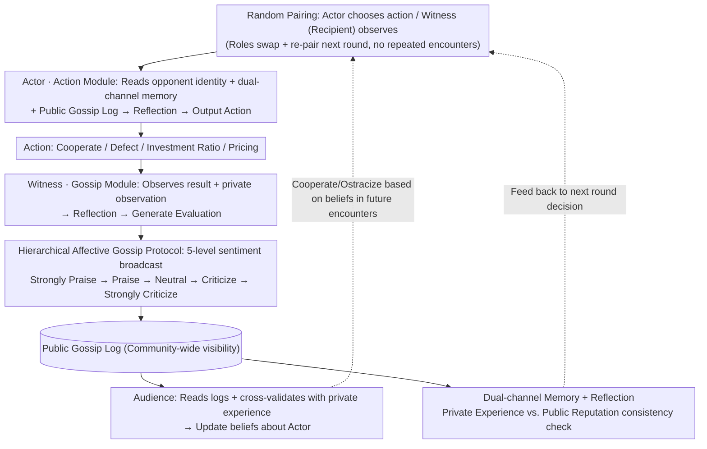

# Talk, Judge, Cooperate: Gossip-Driven Indirect Reciprocity in Self-Interested LLM Agents

**Conference**: ICML 2026  
**arXiv**: [2602.07777](https://arxiv.org/abs/2602.07777)  
**Code**: https://github.com/shuhui-zhu/ALIGN  
**Area**: Multi-agent / LLM Agent / Cooperative Games  
**Keywords**: Indirect reciprocity, Gossip protocol, Multi-agent cooperation, Reputation mechanism, Self-interested LLM

## TL;DR
This paper proposes ALIGN, which enables a group of fully self-interested, decentralized LLM agents to evaluate each other via public "gossip" messages with five levels of sentiment. This allows them to form reputations and punish defection, thereby stably establishing indirect reciprocity in donation games, investment games, and e-commerce markets without central oversight. The study finds that reasoning-based LLMs are more capable than chat-based LLMs at following game-theoretic incentives—cooperating only when it is strategically optimal to do so.

## Background & Motivation

**Background**: As LLM agents are deployed at scale, the problem of cooperation among multi-agent systems in mixed-motive scenarios has become a focus of AI safety. Classical game theory explains the emergence of cooperation through direct reciprocity (Tit-for-Tat) and indirect reciprocity (image scores, leading-eight norms), but these solutions often assume fixed norms and **centralized** reputation monitoring.

**Limitations of Prior Work**: Porting these mechanisms to LLMs typically requires either "altruistic" seed agents (Ren et al., 2025) or the assumption that all agents can directly observe everyone else's full history (Vallinder & Hughes, 2024). Once returned to a truly decentralized, self-interested setting without repeated pairings, agents can neither observe others' behavior nor expect returns from the same opponent in the future. **Direct reciprocity fails**, and self-interested reasoning directly leads to "universal defection" as the only subgame perfect equilibrium (SPE).

**Key Challenge**: To make self-interested agents cooperate, a reputation system is necessary; however, in a decentralized system, no agent can act as a "central authority." Traditional image scores can only transmit binary labels, lacking normative context and the ability to handle noise or deception.

**Goal**: Without introducing altruistic priors or assuming centralized monitoring, this paper addresses two questions: (1) Can public gossip theoretically support indirect reciprocity equilibria? (2) Can fully self-interested LLM agents practically utilize gossip to achieve cooperation instead of collapsing into universal defection?

**Key Insight**: The authors draw from sociological observations: humans maintain cooperation and enforce norms via verbal "gossip," where negative word-of-mouth serves as a "zero-cost verbal punishment." Allowing LLM agents to broadcast open-ended, affective evaluations theoretically allows for the construction of an **imperfect public monitoring** model, using "the recipient's broadcast evaluation of the donor" as a public signal.

**Core Idea**: Replace static binary reputation scores with a "hierarchical affective gossip protocol + self-interested LLM reasoning." This allows agents to infer whether others are worth cooperating with by reading public gossip logs and calculating the long-term benefits of cooperation versus defection for themselves.

## Method

### Overall Architecture
The core problem ALIGN addresses is whether a group of fully self-interested LLM agents, who do not repeatedly encounter each other, can establish cooperation in a decentralized environment solely through "talking behind each other's backs." The approach decomposes each round into roles with varying information visibility: the **actor** chooses an action visible only to the **witness** (the interaction partner), while the rest of the **audience** cannot see the actor's behavior. The witness uses an LLM to generate an affective gossip broadcast for the entire community, which is accumulated into a public gossip log. In subsequent rounds, agents combine their "private interaction memory + public gossip log" to decide whether to cooperate. This framework does not rely on a central evaluator or altruistic priors; agents are given the objective to "maximize your own long-term cumulative reward," leaving the emergence of cooperation entirely to the LLM's own reasoning.

Each agent consists of two parallel LLM modules (Figure 3): a **Gossip Module** used when acting as a witness (input: private observation + public logs + memory; output: evaluation text in one of five sentiments) and an **Action Module** used when acting as an actor (input: opponent identity, private memory, public logs, and optional equilibrium priors; output: action). Both modules incorporate a reflection step before output (see Key Design 3). Theoretically (Section 3), the authors characterize the problem using a repeated donation game (Definition 3.1): two agents are randomly paired, the donor pays cost $c$ for the recipient to gain benefit $b>c$, and roles are swapped and re-paired in the next round. **Direct reciprocity is intentionally disabled**. The authors prove that the only SPE under finite horizons or infinite horizons with private monitoring is universal defection. However, under infinite horizons with perfect public monitoring, a conditional strategy of "cooperate with non-defectors, punish defectors" constitutes an SPE if the discount factor $\gamma \geq c/b$. Proposition 3.5 extends this to imperfect monitoring where **only the recipient broadcasts a public message**: a cooperative SPE exists if $\gamma \geq c/b$, though "all-defect" also remains an SPE—theory guarantees cooperation is *possible*, but reaching it depends on the LLM's reasoning.

### Key Designs

**1. Hierarchical Affective Gossip Protocol: Encoding Punishment in Natural Language**

Theoretical models show binary signals are sufficient for cooperation, but giving LLMs raw binary labels like $\{+1, -1\}$ lacks normative context and fails to distinguish noise from lies. ALIGN requires the witness to broadcast within five discrete categories—Strongly Praise, Praise, Neutral, Criticize, Strongly Criticize (Figure 4)—while allowing free-form phrasing. This encodes "action information + normative judgment + emotional intensity." Negative sentiment naturally becomes a "low-cost verbal punishment." If an agent expects to be strongly criticized, they anticipate future community ostracism, thereby increasing the perceived cost of defection. Ablation (Section 5.3) shows that when the protocol degrades to binary signals without explicit conventions, cooperation rates plummet for most LLMs.

**2. Three-Role Decentralized Decision Process: Information Attenuation for Lie Resistance**

Unlike "perfect public monitoring" where everyone sees the full history, the three-role structure (Actor, Witness, Audience) strictly limits information. Even the Actor must infer community consensus through others' gossip. This is valuable: an Audience member meeting an Actor must cross-validate public gossip with their own limited private experiences. Consequently, malicious gossip contradicted by personal experience will be discounted by rational agents, making ALIGN naturally resistant to **single-point lies** (verified in Section 5.2 collusion experiments). Assigning the **recipient** as the witness ensures the reporting agent has the strongest incentive to report accurately, matching the theoretical setup of Proposition 3.5.

**3. Dual-Channel Memory + Reflection Adaptation: Internalizing Long-term Trade-offs**

Since agents are not fine-tuned, reflection is used to help them incorporate the $\gamma \geq c/b$ trade-off (sacrificing current gain for long-term benefit). Each agent maintains two scrolling memories: private rounds (opponent, action, payoff) and the public gossip log. The dual-channel system allows agents to check consistency—if a "well-reputed" opponent defects against them, they lower their weight on public reputation. Before each decision, a reflection step allows the LLM to write reasoning such as "I observe X, the opponent was evaluated as Y, therefore I should do Z." This functions as online strategy learning. Ablation (Appendix D.8) indicates reflection is a crucial "catch-up" mechanism for weaker models.

### Key Experimental Results

#### Main Results

Comparison of **No Gossip** vs. **ALIGN Gossip** in an infinite donation game (Metrics: Cooperation Rate / Discounted Payoff):

| Model | Type | No Gossip Coop Rate | ALIGN Coop Rate | No Gossip Payoff | ALIGN Payoff |
|------|------|--------------|--------------|------------------|------------------|
| DeepSeek-V3.1 Chat | Chat | 0.00 | 0.94 | 0.00 | 14.40 |
| GPT-4o Mini | Chat | 0.36 | 0.99 | 5.55 | 15.23 |
| Gemini 2.5 Flash-Lite | Chat | 0.08 | 0.60 | 1.32 | 9.32 |
| LLaMA 4 Maverick | Chat | 0.00 | 0.94 | 0.00 | 14.45 |
| DeepSeek-V3.1 Reasoner | Reasoning | 0.00 | **1.00** | 0.00 | **15.44** |
| o4-mini | Reasoning | 0.00 | 0.98 | 0.00 | 15.11 |
| Qwen3-235B-Instruct | Reasoning | 0.00 | 0.69 | 0.00 | 10.71 |
| Kimi-K2-Instruct | Reasoning | 0.00 | 0.73 | 0.00 | 11.21 |

Key Observation: All reasoning LLMs exhibit a cooperation rate of 0 without gossip (matching SPE predictions precisely), but jump to 0.69–1.00 with ALIGN. DeepSeek-V3.1 Reasoner achieves 100% cooperation with 0 Gini coefficient. Chat models like GPT-4o Mini exhibit "irrational cooperation" (0.36) even without gossip.

#### Ablation Study

| Configuration | Key Metric Change | Explanation |
|------|--------------|------|
| Full ALIGN | Coop Rate 0.69–1.00 | 5 sentiments + reflection + dual memory |
| Gossip as Binary (No Convention) | Significant drop | Most LLMs cannot stabilize cooperation (Fig 14) |
| Binary + Explicit Convention | Partial recovery | Binary labels lack normative context |
| Remove Reflection Memory | Drop in weak models | Reflection is a performance booster |
| Remove Equilibrium Prior | Limited impact | Strong models derive $\gamma \geq c/b$ themselves |
| Intro Always-Defect Agent | Coop rate drops to 0 | Negative gossip leads to collective ostracism |

### Key Findings
- **Reasoning ≠ Non-cooperation**: Contrary to some prior work suggesting stronger reasoning leads to less cooperation, this paper finds reasoning LLMs are closer to game-theoretic optimality—they defect when appropriate (finite sessions) and cooperate firmly when beneficial (infinite sessions with gossip). Chat models often exhibit "irrational over-cooperation."
- **Sensitivity to $\gamma$**: Figure 7 shows reasoning models' cooperation rates scale smoothly with $\gamma$, with "discount factor" explicitly mentioned in thoughts; chat models are largely indifferent to $\gamma$.
- **Sentiment Distributions**: All LLMs praise cooperation; however, when facing defection, reasoning models use "Criticize / Strongly Criticize," while chat models tend toward "Neutral," explaining the latter's weaker deterrence against fraud.

## Highlights & Insights
- **Sentiment as a First-class Citizen**: Instead of numerical rewards or binary labels, this work treats "affective intensity" as the primary signal, leveraging the LLM's inherent linguistic capabilities as a game-theoretic punishment mechanism.
- **Bidirectional Validation**: The authors prove the existence of cooperative equilibria under imperfect public monitoring (Prop 3.5) and then empirically demonstrate that the selection of this equilibrium is determined by the LLM's reasoning capability.
- **Transferable Design**: The ALIGN template (affective gossip + dual memory + reflection) can be applied to any decentralized coordination scenario, such as distributed RAG or e-commerce evaluation networks.

## Limitations & Future Work
- **Limitations acknowledged by authors**: The gap between simulation and real-world deployment; potential privacy and echo chamber issues with public gossip; performance degradation in weak models.
- **Observed limitations**: (1) Low statistical power (shared seeds); (2) No evaluation of prompt injection attacks in gossip logs; (3) Log length explosion is not addressed.
- **Future Work**: Extending gossip to continuous scalars; introducing "meta-gossip" to evaluate broadcaster credibility; RL fine-tuning of gossip modules for weaker models.

## Related Work & Insights
- **vs. Ren et al. (2025)**: They inject altruistic seeds; ALIGN achieves cooperation with fully self-interested agents.
- **vs. Vallinder & Hughes (2024)**: They assume centralized history visibility; ALIGN adheres to decentralized, imperfect monitoring.
- **vs. Leading-eight norms**: While classical norms are static, LLMs in ALIGN generate norms adaptively via natural language.

## Rating
- Novelty: ⭐⭐⭐⭐⭐ 
- Experimental Thoroughness: ⭐⭐⭐⭐ 
- Writing Quality: ⭐⭐⭐⭐ 
- Value: ⭐⭐⭐⭐⭐ 

<!-- RELATED:START -->

## Related Papers

- [\[ICML 2026\] EvolveR: Self-Evolving LLM Agents through an Experience-Driven Lifecycle](evolver_self-evolving_llm_agents_through_an_experience-driven_lifecycle.md)
- [\[ICML 2026\] On Information Self-Locking in Reinforcement Learning for Active Reasoning of LLM Agents](on_information_self-locking_in_reinforcement_learning_for_active_reasoning_of_ll.md)
- [\[ICML 2026\] Towards Feedback-to-Plan Decisions for Self-Evolving LLM Agents in CUDA Kernel Generation](towards_feedback-to-plan_decisions_for_self-evolving_llm_agents_in_cuda_kernel_g.md)
- [\[ICLR 2026\] Judge Reliability Harness: Stress Testing the Reliability of LLM Judges](../../ICLR2026/llm_agent/judge_reliability_harness_stress_testing_the_reliability_of_llm_judges.md)
- [\[ICML 2026\] SE-GA: Memory-Augmented Self-Evolution for GUI Agents](se-ga_memory-augmented_self-evolution_for_gui_agents.md)

<!-- RELATED:END -->
