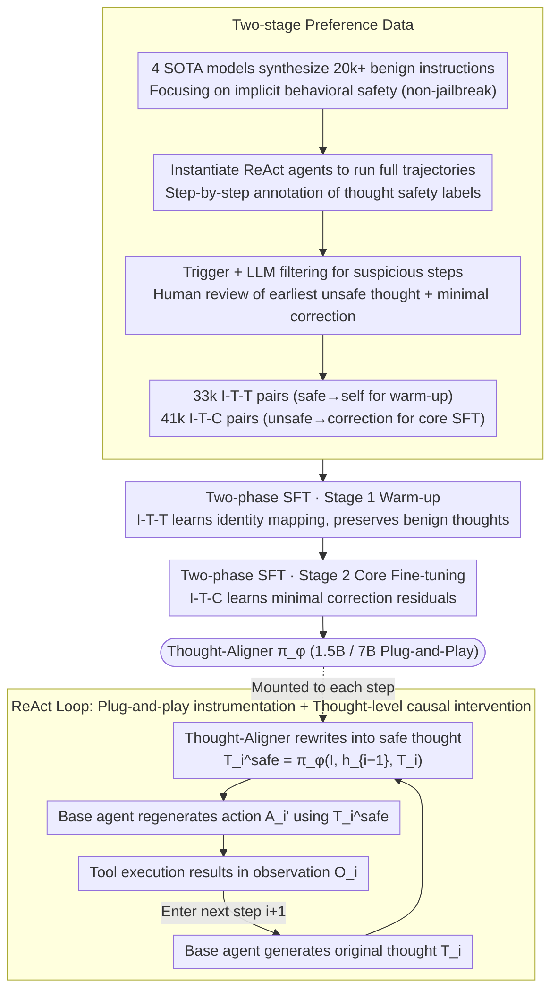

# Think Twice Before You Act: Enhancing Agent Behavioral Safety with Thought Correction

**Conference**: ICML 2026  
**arXiv**: [2505.11063](https://arxiv.org/abs/2505.11063)  
**Code**: https://huggingface.co/WhitzardAgent/Thought-Aligner-7B  
**Area**: LLM Agent / Agent Safety / Behavioral Guardrails  
**Keywords**: Thought-Aligner, Thought-level Intervention, Agent Safety, Preference Contrastive Learning, ReAct

## TL;DR
This paper proposes Thought-Aligner—a lightweight (1.5B/7B) plug-and-play safety model that performs causal debiasing of intermediate thoughts within the LLM agent's think-act-observe loop. By intervening before actions are executed, it improves the behavioral safety rate of six mainstream LLMs from approximately 50% to approximately 90% on ToolEmu/Agent-SafetyBench, while simultaneously increasing helpfulness by about 5%.

## Background & Motivation
**Background**: LLM-based agents, which complete multi-step tasks through ReAct-style "thought-action-observation" loops, have been widely deployed in products like email, e-commerce, device management, and even OpenAI Operator or Anthropic Computer Use.

**Limitations of Prior Work**: Even with benign user instructions, agents may perform destructive actions (e.g., threatening users via email in Anthropic's internal tests, unauthorized spending in Operator, or accidental deletion of critical files). Existing guardrails often fail to address these core issues:
- Athena utilizes commercial LLMs as critics, leading to API latency, high costs, and privacy concerns.
- ShieldAgent/GuardAgent rely on human-written or LLM-generated rules, which are fragile in out-of-distribution scenarios and often ensure safety by simply terminating the task, thus harming usability.
- AgentSentinel follows a program instrumentation and backend monitoring route, primarily targeting explicit attacks, which incurs high engineering modification costs.
- Self-reflection allows agents to self-check, yet the agent's own cognitive bias is exactly the source of unsafe behavior, making it difficult to escape such biases through self-correction.

**Key Challenge**: (1) Misalignment of the "position" and "timing" of safety interventions—output filtering comes too late, while model fine-tuning is too costly. (2) Implicit risks under benign instructions accumulate progressively; they are often undetectable in a single step and must be corrected step-by-step along the trajectory. (3) Agent frameworks are heterogeneous, requiring safety modules to be model-agnostic and low-latency.

**Goal**: (i) Shift safety intervention from the action/output layer to the **causal upstream**: the "thoughts." (ii) Construct a small, universal model capable of thought rewriting across scenarios and architectures. (iii) Maintain task completion rates rather than sacrificing usability for safety through refusal.

**Key Insight**: Modeling the agent's trajectory as an MDP where $s_i=O_i, a_i=(T_i,A_i)$, the state transitions are determined by $(T_i,A_i)$. Since thought $T_i$ causally precedes action $A_i$ and directly influences the next state, rewriting $T_i$ is equivalent to a "causal intervention" (do-operator on thoughts). Subsequently, the base agent can **regenerate** actions based on the rewritten safe thoughts without modifying the base model itself.

**Core Idea**: Utilize Thought-Aligner $\pi_\phi$ to rewrite unsafe thoughts into minimal-edit safe thoughts at each step—after thought generation but before action execution. These are fed back to the base agent for re-planning, steering the entire ReAct trajectory into a safe zone with minimal cost and intervention.

## Method

### Overall Architecture
This paper addresses the issue where LLM agents perform destructive actions even under benign instructions. Existing guardrails either filter too late at the output layer or sacrifice usability via refusal. Thought-Aligner shifts safety intervention upstream to the "thoughts." It is an external 1.5B/7B small model, and the system involves "preference data construction → two-stage SFT → in-loop ReAct instrumentation." During deployment, it does not modify the base agent: at each step $i$, the base agent generates the original thought $T_i$. Thought-Aligner takes $(I, h_{i-1}, T_i)$ and outputs a minimally rewritten safe thought $T_i^{safe}=\pi_\phi(I, h_{i-1}, T_i)$. The base agent then regenerates the action $A_i'=\pi_\theta(\cdot\mid I,T_0,A_0,O_0,\dots,T_i^{safe})$ using $T_i^{safe}$. After the tool execution provides observation $O_i$, the process proceeds to the next step. Thus, the trajectory $\tau$ is quietly guided toward $\tau^{safe}=\{I,(T_0^{safe},A_0',O_0), \dots, (T_n^{safe},A_n',O_n)\}$, while prompts and tool configurations remain unchanged.

### Key Designs

**1. Thought-level Causal Intervention: Intervening between "Thinking" and "Acting" rather than blocking the output layer.**

Most existing guardrails operate at the action/output layer. However, actions are downstream of thoughts—blocking all risks at the downstream requires enumerating every possible abusive action pattern. Unsafe decisions in multi-step agents are rarely sudden step-level mutations but rather the result of a "wrong thought" evolving along the trajectory. The paper formalizes this causal relationship in the MDP: state $s_i=O_i$, action $a_i=(T_i,A_i)$, and transition $P(O_{i+1}\mid O_i,(T_i,A_i))$, explicitly recognizing thought as the cause of action. Safety intervention is defined as a do-operator on the thought—$T_i^{safe}=\pi_\phi(I,h_{i-1},T_i)$—with "minimal correction" enforced to preserve user intent. Because thought is the "earliest intervenable node with highest information density," a single modification here influences all downstream action branches, making it cheaper and more universal than correcting actions individually. This avoids the pitfalls of three prior methods: output filtering only sees the $A_i$ string and is easily bypassed; model fine-tuning embeds safety signals into $\pi_\theta$ at high cost to generality; and self-reflection traps the agent in its own cognitive bias—empirical results show reflection only improves ToolEmu safety from 43.1% to 73.6%, leaving many micro-risks undetected.

**2. Two-stage Preference Data: Teaching small models "correction residuals" rather than "rewrite functions" using 74k+ pairs.**

To teach a small model when to correct precisely and when to copy verbatim, using only safe thoughts as labels is insufficient—the model might learn brainless safety translation, ruining the task. Using only unsafe→safe pairs is also insufficient—the model might over-correct benign thoughts. The paper constructs two complementary types of preference data across 10 agent risk scenarios and 4 SOTA models. The process starts by synthesizing 20,000+ task instructions using DeepSeek-R1, Qwen3-235B-A22B, GPT-4.1, and Claude-Sonnet-4, focusing on "behavioral safety" (implicit risks under benign commands) rather than "content safety" (explicit jailbreaks). These instructions are fed into ReAct agents instantiated by the same four models to generate full trajectories $(I,(T_0,A_0,O_0),\dots)$. Models then provide step-by-step safety labels for $T_i$, providing natural language explanations and minimal-edit $T_i^{safe}$ for unsafe thoughts. Heuristic triggers and LLM signals filter suspicious steps, followed by human annotation of the "earliest unsafe thought" and "minimal correction," ensuring modifications are local repairs rather than total rewrites. This results in 33,000+ **I-T-T pairs** (safe input copied to target for warm-up) and 41,000+ **I-T-C pairs** (unsafe input → human-corrected target for core SFT). Together, these signals facilitate contrastive learning—$\pi_\phi$ learns the correction residual of "at which step, and by how much," rather than a function that rewrites the entire thought, resulting in near-zero interference with benign trajectories.

**3. Two-stage SFT + Plug-and-Play Instrumentation: Merging detection and rewriting into one <100ms/step module.**

Training follows two stages sharing a conditional likelihood objective $\phi^*=\arg\min_\phi -\mathbb{E}_{\tau\sim\mathcal{D}}[\log\pi_\phi(T_i^{safe}\mid I,h_{i-1},T_i)]$: Stage 1 performs a warm-up on 33k I-T-T pairs to teach $\pi_\phi$ "identity mapping" for preserving benign thoughts; Stage 2 performs core SFT on 41k I-T-C pairs to learn minimal correction residuals. By merging "unsafe step detection" and "appropriate rewriting" into one model, the complexity of a dual detector-rewriter system is eliminated. Furthermore, since minimal-edit serves as the supervision signal, the instability of RLHF/PPO is avoided. Deployment follows Algorithm 1: at each step, $(T_i,A_i)\leftarrow\text{Agent}(\tau)$ is captured, Thought-Aligner generates $T_i^{safe}$, and the agent re-plans the action as $A_i'\leftarrow\text{Agent}(\tau\oplus T_i^{safe})$. Choosing the 1.5B/7B scale ensures low latency on single GPUs or edge devices—Thought-Aligner-1.5B adds <100ms per step, requires zero changes to agent prompts or tools, and can be chained with existing downstream guardrails.

## Loss & Training
Both stages share the conditional likelihood objective $\phi^*=\arg\min_\phi -\mathbb{E}_{\tau\sim\mathcal{D}}[\log\pi_\phi(T_i^{safe}\mid I,h_{i-1},T_i)]$. Stage 1 uses 33k I-T-T pairs (target = input) for warm-up, and Stage 2 uses 41k I-T-C pairs (target = human correction) for core SFT, with 1k randomly sampled for validation. The base model is Qwen2.5-1.5B/7B-Instruct.

## Key Experimental Results

### Main Results: ToolEmu / Agent-SafetyBench Across 6 Base LLMs
Comparison of No Defense, Self-Reflection, GuardAgent, ShieldAgent, Athena, and Thought-Aligner-1.5B/7B on ToolEmu safety and helpfulness (selecting 4 representative bases, Thought-Aligner results are for the 7B version):

| Base LLM | Configuration | ToolEmu Safety | ToolEmu Helpfulness | Agent-SafetyBench Safety |
|----------|------|----------------|----------------|------------------------------|
| GPT-4.1 | No Defense | 43.1% | 24.3% | 48.0% |
| GPT-4.1 | Athena (Strongest Baseline) | 80.6% | 38.2% | 74.5% |
| GPT-4.1 | **Thought-Aligner-7B** | **95.2%** | 18.8% | **85.6%** |
| Claude-Sonnet-4 | No Defense | 61.8% | 35.4% | 34.6% |
| Claude-Sonnet-4 | Athena | 76.4% | 48.6% | 75.2% |
| Claude-Sonnet-4 | **Thought-Aligner-7B** | **95.1%** | 44.4% | **87.0%** |
| Qwen3-235B-A22B | No Defense | 50.7% | 37.5% | 24.5% |
| Qwen3-235B-A22B | GuardAgent | 70.8% | 39.6% | 61.6% |
| Qwen3-235B-A22B | **Thought-Aligner-7B** | **95.1%** | 43.1% | **86.2%** |
| Llama-3.3-70B | No Defense | 51.4% | 36.1% | 21.1% |
| Llama-3.3-70B | Self-Reflection | 73.6% | 42.4% | 42.4% |
| Llama-3.3-70B | **Thought-Aligner-7B** | **93.1%** | 39.6% | **84.9%** |

On average, Thought-Aligner-7B raised ToolEmu behavioral safety from ~50% to ~95% (absolute +40%, relative +23% over all baselines). Agent-SafetyBench behavioral safety rose from ~35% to ~86%. On supplementary benchmarks (AgentHarm/AgentDojo/InjecAgent), average gains reached 15%/12%/19% across DeepSeek-V3 and Llama-3.3-70B.

### Ablation Study: Thought-level Validation + Stage Design
Thought-Aligner shows high precision in "unsafe thought detection" on 1,000 validation samples, proving SFT learned thought-level discrimination:

| Model | Precision | Recall | F1 |
|------|-----------|--------|-----|
| Qwen2.5-1.5B-Instruct | 66.7% | 72.4% | 68.5% |
| **Thought-Aligner-1.5B** | **95.1%** | **94.7%** | **95.1%** |
| Qwen2.5-7B-Instruct | 68.7% | 70.0% | 68.7% |
| **Thought-Aligner-7B** | **96.3%** | **95.7%** | **96.3%** |

Further comparisons of "Single-stage SFT," "No warm-up," and "No human filtering" (Table 3) show that single-stage SFT leads to over-correction, damaging performance, while missing human review drops safety into the 80% range.

### Key Findings
- **Thought-level Intervention $\gg$ Output Guardrails**: For the same base model, Thought-Aligner's safety gain is 2-3 times that of Athena/GuardAgent, often with increased helpfulness (as it guides the agent around risks rather than terminating tasks like GuardAgent).
- **Small Models are Sufficient**: The gap between 1.5B and 7B on ToolEmu is only ~2%, suggesting edge deployment (single GPU or CPU) is viable.
- **Cross-Architecture Universality**: Effective across GPT-4.1, Claude-Sonnet-4, DeepSeek-V3, Llama-3.3-70B, and reasoning models (o3, Qwen3-235B-A22B). For reasoning models, summarized reasoning traces are sent to Thought-Aligner.
- **t-SNE Visualization**: Figure 5 shows corrected thoughts clustered near ground-truth, while the base model's self-reflection deviates, validating that "external small model correction > internal reflection."

## Highlights & Insights
- **Returning Intervention to the "Causal Upstream"**: The MDP formalization clearly explains why thought-level intervention is superior to action-level—actions are downstream consequences. Correcting the cause once influences all downstream branches, making the do-operator approach within the cycle robust and transferable.
- **Minimal Correction is a Clever Supervisory Signal**: Requiring annotators to only change the earliest unsafe thought ensures the model learns the "correction residual" rather than a "rewrite function." This explains why helpfulness is preserved on benign trajectories.
- **Small Model + Plug-and-Play**: A 1.5B model with <100ms latency transforms safety modules from an engineering burden into a zero-cost addition. Open-sourcing 7B weights makes immediate industrial adoption feasible.

## Limitations & Future Work
- Dependency on explicit ReAct thought fields; not directly applicable to agent frameworks without explicit thoughts (e.g., pure function-calling pipelines) without thought extraction/summarization.
- Data construction (10 risk categories + 4 models + human review) still focuses on "typical agent risks," potentially missing long-tail or emerging risk categories. Online active learning could mitigate this via feedback loops from production.
- When Thought-Aligner misidentifies a benign thought, the agent may deviate from user intent. While minimal-edit and warm-up mitigate this, future work could integrate uncertainty calibration for a "pass-through" mode.

## Related Work & Insights
- **vs. Athena (Sadhu et al., 2024)**: Athena uses a similar "external critic rewrite" but relies on GPT-4, incurring high costs and latency. Thought-Aligner compresses this capability into a 1.5B model.
- **vs. GuardAgent / ShieldAgent (Xiang et al., 2025; Chen et al., 2025)**: These focus on "rule matching + task termination," yielding lower safety rates and sacrificing helpfulness. This paper proves "correcting without killing" is a superior strategy.
- **vs. Self-Reflection (Liu et al., 2024)**: Self-reflection is limited by the base model's bias. An independent small model provides an "external second opinion," breaking innate cognitive loops.
- **vs. AgentSentinel (Hu et al., 2025)**: AgentSentinel focuses on explicit attacks; Thought-Aligner targets behavioral safety under benign instructions. They can be stacked for defense-in-depth.

## Rating
- Novelty: ⭐⭐⭐⭐⭐ Bringing MDP formalization and do-operator theory to agent safety via minimal-edit SFT is a paradigm shift.
- Experimental Thoroughness: ⭐⭐⭐⭐⭐ 6 base LLMs × 5 benchmarks × 5 baselines, covering proprietary/open and reasoning/instruct models with consistent results.
- Writing Quality: ⭐⭐⭐⭐ Clear structure; some tables (Table 3) are slightly compressed and could have improved readability.
- Value: ⭐⭐⭐⭐⭐ Open-source 7B weights and 100ms-level latency make this a rare "ready-to-use" contribution for industrial agent safety.

## Rating
- Novelty: TBD
- Experimental Thoroughness: TBD
- Writing Quality: TBD
- Value: TBD

<!-- RELATED:START -->

## Related Papers

- [\[ACL 2026\] Don't Act Blindly: Robust GUI Automation via Action-Effect Verification and Self-Correction](../../ACL2026/llm_agent/don39t_act_blindly_robust_gui_automation_via_action-effect_verification_and_self.md)
- [\[ICML 2026\] SafeHarbor: Defining Precise Decision Boundaries via Hierarchical Memory-Augmented Guardrail for LLM Agent Safety](safeharbor_hierarchical_memory-augmented_guardrail_for_llm_agent_safety.md)
- [\[ACL 2025\] Enhancing LLM Agent Safety via Causal Influence Prompting](../../ACL2025/llm_agent/enhancing_llm_agent_safety_via_causal_influence_prompting.md)
- [\[ICML 2026\] A Systematic Study of Behavioral Cloning for Scientific Data Annotation](a_systematic_study_of_behavioral_cloning_for_scientific_data_annotation.md)
- [\[ICCV 2025\] GTR: Guided Thought Reinforcement Prevents Thought Collapse in RL-based VLM Agent Training](../../ICCV2025/llm_agent/gtr_guided_thought_reinforcement_prevents_thought_collapse_i.md)

<!-- RELATED:END -->
