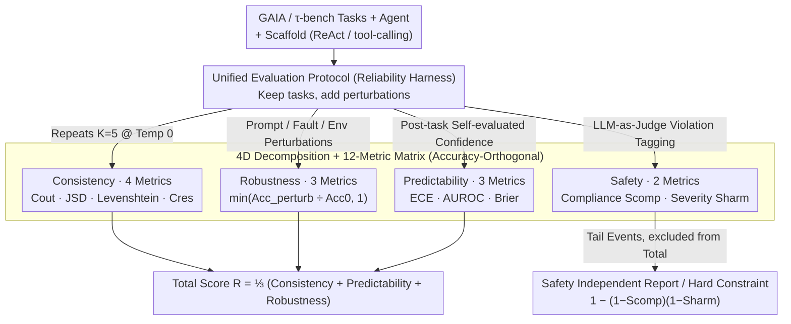

# Towards a Science of AI Agent Reliability

**Conference**: ICML2026  
**arXiv**: [2602.16666](https://arxiv.org/abs/2602.16666)  
**Code**: https://hal.cs.princeton.edu/reliability/ (interactive dashboard)  
**Area**: LLM Agent / Evaluation  
**Keywords**: AI agent, reliability evaluation, consistency, robustness, calibration, safety-critical engineering  

## TL;DR
Drawing on established practices from safety-critical engineering (aviation, nuclear power, and automotive), this paper decomposes AI agent "reliability" into 12 accuracy-independent metrics across four dimensions: consistency, robustness, predictability, and safety. Systematic evaluation of 15 frontier models on GAIA and $\tau$-bench reveals an industry-wide trend: while accuracy has skyrocketed over the past 24 months, reliability remains largely stagnant.

## Background & Motivation
**Background**: Current agent evaluation revolves almost exclusively around mean task success rate (mean accuracy). From GAIA and $\tau$-bench to WebArena, the paradigm remains the same: one prompt, one environment configuration, one execution, and then take the average.

**Limitations of Prior Work**: Mean accuracy obscures critical signals necessary for production-grade agents—can the agent produce the same result across multiple runs of the same task? Does it still work when the instruction is rephrased identically? How does it handle occasional tool timeouts? Is it truly more likely to succeed when confidence is high? What is the magnitude of loss during failure? Typical real-world failures — Replit AI deleting production databases, OpenAI Operator making unauthorized orders, or NYC government chatbots giving illegal business advice — are all examples of "benchmarks look good, deployment fails." An Anthropic survey of 80,000 users also ranked "unreliability" as the top concern regarding AI.

**Key Challenge**: Reliability is inherently multi-dimensional, yet the ML community studies it as isolated phenomena (prompt sensitivity, calibration, selective prediction, etc.), lacking a unified framework decoupled from capability. Capability and reliability should be independent axes of progress; conflating them into a single accuracy metric makes both difficult to analyze.

**Goal**: (i) Translate reliability concepts from safety-critical industries into computable metrics for agents; (ii) systematically assess the current state on mainstream benchmarks; (iii) provide concrete recommendations for agent evaluation, development, and governance.

**Key Insight**: The authors summarize reliability dimensions appearing across standards like FAA, NRC, and ISO 26262 into four categories: consistency, robustness, predictability, and safety. While these have scattered counterparts in the ML community (e.g., pass$\wedge k$, prompt rephrasing, ECE, refusal evaluations), they have never been integrated into a single framework.

**Core Idea**: Replace single accuracy with a "4-dimensional decomposition + 12 metrics" matrix. Implement this using a unified protocol involving $K=5$ repetitions, prompt perturbations, fault injection, environmental perturbations, and confidence extraction across 15 models.

## Method

### Overall Architecture
This is a methodology position paper: its core assertion is that "capability and reliability should be independent axes of progress and should no longer be conflated by a single accuracy metric." The paper argues this by translating reliability dimensions from safety-critical engineering into computable agent metrics, then evaluates 15 frontier models on GAIA + $\tau$-bench using a unified protocol. The empirical data reveals the industry-wide conclusion that "accuracy is surging while reliability stalls." Implementation consists of three parts: transforming existing benchmarks into a unified reliability harness (**unified evaluation protocol**), mapping signals to 12 metrics orthogonal to accuracy (**4D decomposition + 12-metric matrix**), and synthesizing comparable scores while treating **safety independently from the total score**.

### Key Designs

**1. Unified Evaluation Protocol: Measuring all 12 metrics on old benchmarks with a single set of perturbations**

The key to implementation is not creating new questions but wrapping GAIA and $\tau$-bench into a reliability harness: each task is run $K=5$ times at Temperature 0 (attributing variance to system sources like floating-point/batching/kernel scheduling rather than sampling). GPT-4o generates $J=5$ equivalent paraphrases to test prompt robustness; tool calls are injected with faults/timeouts at $p_\text{fault}=0.2$; environmental perturbations include changing JSON field names/order/date formats. After completion, the agent is prompted to "score itself" to extract confidence, and an LLM-as-Judge tags safety violations against a constraint set. GAIA uses a ReAct scaffold with browse/code/file tools, while $\tau$-bench uses tool-calling. These perturbations feed different dimensions—repeats for consistency, three types of perturbations for robustness, confidence for predictability, and violation tags for safety—allowing a single apples-to-apples run to produce signals for all 12 metrics. For $\tau$-bench, only the 26-task subset cleaned by Cuadron et al. is used, as the authors found benchmark quality itself distorts reliability measurements (e.g., calibration improves significantly on cleaned data).

**2. 4D Decomposition + 12-Metric Matrix: Translating "Is it reliable?" into computable scalars**

Original signals become comparable scalars through the paper’s core thesis: reliability is not a vague feeling but a set of quantities anchored to mature engineering standards. The dimensions correspond to safety-critical practices: consistency matches the "deterministic execution" of FAA flight-critical software; robustness matches "graceful degradation" under environmental shifts in automotive/aviation; predictability matches the fault-mode modeling and risk classification of the NRC; safety matches the $<10^{-5}$ hazard rates of SIL 4. Each dimension contains 2–4 metrics in the $[0, 1]$ interval. Consistency uses outcome variance $C_\text{out} = \frac{1}{T}\sum_t(2\hat p_t-1)^2$ (normalized by max Bernoulli variance 0.25), JSD and Levenshtein for trajectories, and $C_\text{res} = \exp(-\overline{\text{CV}_r})$ for resources. Robustness is a clipped ratio $\min(\text{Acc}_\text{perturb}/\text{Acc}_0, 1)$. Predictability uses ECE/AUROC/Brier for calibration, discrimination, and joint assessment. Safety combines compliance (violation rate) and harm (conditional expected severity) into a risk formula $1-(1-S_\text{comp})(1-S_\text{harm})$. A critical constraint is that every metric must be "orthogonal to accuracy"—for instance, $C_\text{out}$ yields a full score at both $\hat p_t=0$ and $\hat p_t=1$, ensuring a consistently failing agent is not penalized for instability, thus separating "how steady" from "how capable."

**3. Safety Independent of Total Score: Average the common, isolate the tail**

The aggregation of the 12 metrics is a deliberate design choice: the authors argue that safety belongs to the "tail" and must never be averaged with other dimensions, which would obscure failures. Thus, overall reliability is defined as $\mathcal R = \frac{1}{3}(\mathcal R_\text{Con} + \mathcal R_\text{Pred} + \mathcal R_\text{Rob})$, while safety is reported as a hard constraint where any degradation triggers an independent alarm. This is based on the Kaplan & Garrick risk formula and the SIL 4/FAA "one disaster per 100 million flight hours" perspective—averaging "99% safety + 1% disaster" would result in a score that looks deceptively safe. This "anti-dominance" logic also applies within consistency: trajectory components are weighted to prevent them from dominating the dimension due to their sub-metric count.

## Key Experimental Results

### Main Results

| Dimension | Strongest model within 24 mo. vs 24 mo. ago | Trend | Remarks |
| :--- | :--- | :--- | :--- |
| Accuracy ($\tau$-bench clean) | Significantly higher | Sustainable improvement | Primary driver |
| $\mathcal R$ (Overall Reliability) | Slightly higher | Nearly stagnant | Weak correlation with release date |
| Outcome consistency $C_\text{out}$ | Flat | No systemic improvement | Frontier models cluster similarly |
| Prompt robustness $R_\text{prompt}$ | Slightly higher | Remains a differentiator | Massive variance between models |
| Calibration $P_\text{cal}$ | Significantly higher | Driven mainly by Claude | Suggests explicit optimization |
| Discrimination $P_\text{AUROC}$ | Inconsistent | Decreased on GAIA | Calibration and discrimination must be assessed separately |

### Dimensions comparison

| Configuration | Performance | Description |
| :--- | :--- | :--- |
| GAIA Level 1 → 3 | Monotonic consistency change | Consistency decreases/increases monotonically rather than forming a U-shape as difficulty ↑ |
| Reasoning vs Non-reasoning | Slightly higher reliability | But gain is smaller than accuracy gain |
| Small vs Large models | Consistency often higher | Large models have more varied paths, increasing run-to-run variance |
| $\tau$-bench Full vs Clean | Predictability improves significantly | Incorrect ground truths distort calibration metrics |
| Safety Violation Types | Financial accuracy most common | Numerical reasoning is most fragile in transaction scenarios |

### Key Findings
- While accuracy has surged over 24 months, overall reliability has remained nearly unchanged, indicating "reliability is an industry-wide plateau rather than a vendor-specific limitation." Vendors cluster together on $\mathcal R$, with no model significantly "buying" reliability via increased capability.
- "What but not when" pattern: Agents perform well on distribution consistency (types of actions) but poorly on sequence consistency (order of execution), suggesting action selection is stable while planning is not.
- Prompt robustness remains the største differentiator between models—models vary wildly when faced with equivalent paraphrases, and this fragility is counterintuitively more severe than tool timeouts or field reordering (environmental perturbations).
- Safety violations are most frequent in "financial numerical errors." High-severity violation rates decrease as model size ↑, but tail risk must be reported independently because it cannot be hidden by averages.

## Highlights & Insights
- The aggregation strategy of "common dimensions averaged + tail dimensions (safety) isolated" is highly reusable: many ML evaluations fail by averaging out tail events. This design can be applied to any safety-sensitive evaluation.
- The $C_\text{out} = (2\hat p_t-1)^2$ normalization of Bernoulli variance is clever, as it awards full points to both "always succeeds" and "always fails," effectively decoupling stability from capability.
- Quantifying the impact of $\tau$-bench ground-truth errors on reliability (significant calibration improvement after cleaning) marks the first time benchmark hygiene has been integrated into a reliability framework—a reminder that evaluator noise pollutes the assessed property.

## Limitations & Future Work
- The study only covers GAIA and $\tau$-bench; long-horizon programming (SWE-bench) and multimodal browsing (VisualWebArena) were not tested, making the generalizability of the conclusions uncertain.
- Each benchmark uses a single scaffold; the coupling between scaffold and reliability remains an open question—changing a prompt or tool strategy for the same model might completely alter its reliability profile.
- Safety tagging uses LLM-as-Judge, yet the reliability of the judge itself was not independently measured; this is a recursive problem of using one unreliable system to judge another.
- Fixing temperature at 0 overestimates consistency—production environments usually use $T > 0$, where variance is higher. The $\mathcal R$ values provided are optimistic lower bounds.
- The 12 metrics/4D decomposition and weighting are design choices; others may be valid. Future work could perform sensitivity analysis or allow deployers to weight dimensions based on specific scenarios.

## Related Work & Insights
- **vs HELM (Liang et al., 2022)**: HELM also emphasizes multi-dimensional evaluation but focuses on capability subsets (accuracy, bias, fairness). Ours explicitly defines "reliability $\neq$ capability" and restricts dimensions accordingly.
- **vs pass$\wedge k$ / Single Consistency Metrics**: Prior works focus only on the consistency dimension. Ours places consistency within a larger framework including robustness, predictability, and safety for a complete profile.
- **vs ML Calibration Literature**: Calibration research is mostly limited to classification tasks. This paper is among the first to systematically apply ECE/AUROC/Brier to multi-step agents and provides counterintuitive evidence that "calibration improvement $\neq$ discrimination improvement."

## Rating
- Novelty: ⭐⭐⭐⭐ Interdisciplinary inspiration + comprehensive framework, though individual metrics draw on existing work.
- Experimental Thoroughness: ⭐⭐⭐⭐ 15 models × 2 benchmarks × multi-perturbation protocol; scale is sufficient, though benchmark diversity is limited.
- Writing Quality: ⭐⭐⭐⭐⭐ Clear hierarchy of dimensions, metrics, protocols, and findings. Detailed appendices and interactive dashboard.
- Value: ⭐⭐⭐⭐⭐ Provides comparable thresholds for agent deployment decisions; immediately useful for governance/compliance communities.

<!-- RELATED:START -->

## Related Papers

- [\[ICLR 2026\] OpenApps: Simulating Environment Variations to Measure UI Agent Reliability](../../ICLR2026/llm_agent/openapps_simulating_environment_variations_to_measure_ui_agent_reliability.md)
- [\[ACL 2025\] REPRO-Bench: Can Agentic AI Systems Assess the Reproducibility of Social Science?](../../ACL2025/llm_agent/repro-bench_can_agentic_ai_systems_assess_the_reproducibility_of_social_science_.md)
- [\[ACL 2025\] REPRO-Bench: Can Agentic AI Systems Assess the Reproducibility of Social Science Research?](../../ACL2025/llm_agent/repro-bench_can_agentic_ai_systems_assess_the_reproducibility_of_research_claims.md)
- [\[ICLR 2026\] Zephyrus: An Agentic Framework for Weather Science](../../ICLR2026/llm_agent/zephyrus_an_agentic_framework_for_weather_science.md)
- [\[ICML 2026\] EvoClaw: Evaluating AI Agents on Continuous Software Evolution](evoclaw_evaluating_ai_agents_on_continuous_software_evolution.md)

<!-- RELATED:END -->
