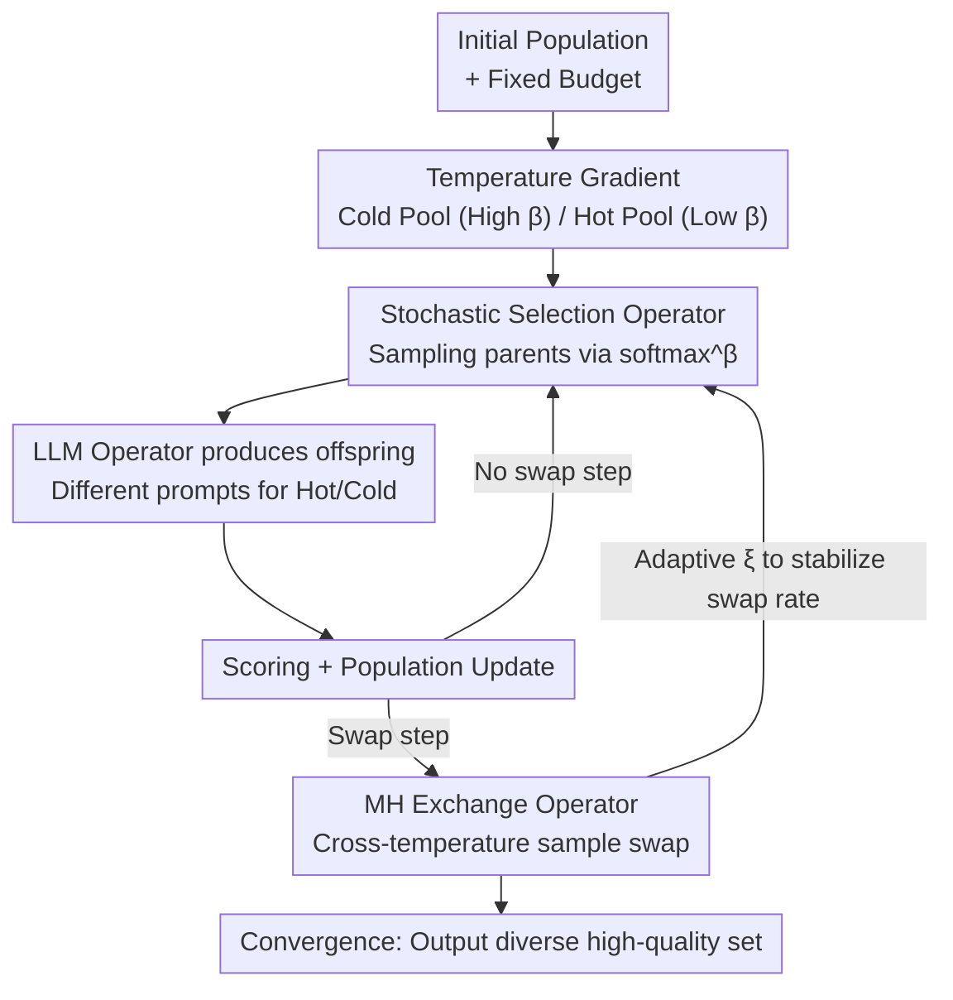

# Towards Diverse Scientific Hypothesis Search with Large Language Models

**Conference**: ICML 2026  
**arXiv**: [2606.10587](https://arxiv.org/abs/2606.10587)  
**Code**: https://github.com/zoom-wang112358/EvoDiverse  
**Area**: LLM Agent / Scientific Discovery / Evolutionary Search  
**Keywords**: Scientific Hypothesis Search, Parallel Tempering, Evolutionary Algorithms, Diversity Collapse, Sampling

## TL;DR
The study reframes "scientific hypothesis search with LLMs" as a **sampling problem aimed at efficiently producing a diverse and high-quality set of hypotheses under a fixed verification budget**. By borrowing Parallel Tempering (PT) from physics, the authors developed EvoDiverse, a dual-temperature population framework where a high-temperature pool explores and a low-temperature pool refines. Samples are exchanged via Metropolis-Hastings rules, simultaneously improving quality and diversity across molecular, equation, and algorithm discovery tasks.

## Background & Motivation
**Background**: Using LLMs to accelerate scientific discovery is currently a hot topic. The dominant approach treats the LLM as a mutation or crossover operator within an Evolutionary Algorithm (EA)—given a set of parent hypotheses, the LLM proposes better offspring, which are then scored by an objective function and selected (top-k) until convergence or budget exhaustion (e.g., FunSearch, MOLLEO, LLM-SR).

**Limitations of Prior Work**: In scientific discovery, the "optimal solution" is often not the sole objective. Simulations are approximations, and experiments are expensive and noisy; multiple competitive hypotheses might survive various validation stages. Therefore, scientists require a **set of high-quality but significantly different candidates** to hedge against downstream validation uncertainties. However, current EA workflows implicitly prioritize optimization over exploration, where strong selection pressure compresses probability mass into a narrow region of the hypothesis space, leading to **diversity collapse**, premature convergence, and sample homogeneity.

**Key Challenge**: Pure optimization collapses diversity. Conversely, treating search as **precise sampling** (sampling from a distribution where probability is proportional to quality) is unrealistic—LLM proposal distributions cannot be normalized over combinatorially explosive spaces, token likelihoods are only available for open-source models, and limited verification budgets cannot support asymptotic convergence of sampling algorithms. Furthermore, since evaluation itself is approximate and stochastic, the target distribution is not precisely defined, making exact sampling both infeasible and unnecessary.

**Goal**: To find a middle ground between pure optimization and precise sampling—**efficiently generating diverse, high-quality hypothesis sets** under a finite evaluation budget.

**Key Insight**: The authors maintain a "sampling perspective" without requiring precise sampling. Evolutionary search is viewed as sampling from a Boltzmann distribution with an **evolutionary power factor** that increases over iterations (tightening selection pressure). Since a single temperature cannot balance convergence and coverage, the authors introduce Parallel Tempering—a classical tool for sampling multimodal distributions.

**Core Idea**: Maintain populations at different temperatures. **High-temperature populations use relaxed selection for aggressive exploration, while low-temperature populations use strict selection for refinement**. A cross-temperature exchange mechanism is designed to funnel promising candidates from the high-temperature pool to the low-temperature pool for polishing without destroying individual distributions.

## Method

### Overall Architecture
EvoDiverse takes an initial hypothesis population and a fixed verification (oracle call) budget as input, outputting a set of diverse, high-quality hypotheses upon convergence. The methodology can be summarized as: **splitting a single evolutionary search into two parallel evolution chains at different temperatures and using an "accept/reject" exchange operator to swap samples between them**.

A key theoretical premise is that the population in each generation of EA approximately follows $p(x)\propto\exp(-\xi(n)\beta h(x))$, where $h$ is the target function to be minimized, $\beta$ reflects selection strength, and $\xi(n)$ is a monotonically increasing factor over iteration $n$. Temperatures act as knobs to tune the "exploration vs. convergence" trade-off. The pipeline is as follows:

### Key Designs

**1. Transforming Evolutionary Search into Temperature-Controlled Stochastic Selection: Using $\beta$ as the Knob**

Previous EAs (e.g., MOLLEO) use **deterministic** selection—selecting top-$\nu$ for the mating pool and top-$N$ for the next population. This lacks a mechanism to adjust selection pressure. EvoDiverse switches to **stochastic selection without replacement**, where each candidate is selected with probability:

$$p(x_i)=\frac{\exp(-h(x_i))^{\beta}}{\sum_{k=1}^{K}\exp(-h(x_k))^{\beta}}$$

$\beta$ directly controls selection intensity: $\beta\to\infty$ recovers deterministic top-selection (extreme convergence), while $\beta\to 0$ results in pure random exploration. High-temperature pools use small $\beta$ to encourage exploration, while low-temperature pools use large $\beta$ to tighten selection. Furthermore, the authors use **different LLM prompts** across temperatures. For example, in molecular tasks, high-temperature prompts encourage structurally diverse and novel scaffolds, while low-temperature prompts guide the model to refine known high-scoring motifs.

**2. Metropolis-Hastings (MH) Based Exchange Operator: Communication without Destroying Distributions**

Simply moving samples between pools (like Island Model migration) is problematic: low-scoring high-temperature samples are immediately eliminated in low-temperature pools, while high-scoring low-temperature samples dominate the high-temperature pool, arresting exploration. EvoDiverse treats the two pools as:

$$p_1(x)\propto\exp(-\xi(n)\beta_1 h(x)),\qquad p_2(x)\propto\exp(-\xi(n)\beta_2 h(x)),\quad \beta_2<\beta_1$$

When swapping temperature assignments for two samples $(x_1, x_2)$, the acceptance ratio $a$ is calculated as:

$$a=\exp\big(-\xi(n)(\beta_1-\beta_2)(h(x_2)-h(x_1))\big)$$

A swap is accepted with probability $A=\min\{1,a\}$. This MH step satisfies detailed balance for the joint distribution, ensuring stability. Intuitively, it **does not discard candidates** but reassigns them to the temperature that best matches their quality: strong candidates gravitate toward low-temperature refinement, while weak but diverse candidates stay in high temperatures for exploration.

**3. Aligning Convergence Speeds: Treating $\xi(n)$ as a Dynamic Hyperparameter**

Unlike classical PT, which uses fixed distributions, these distributions are "sharpened" over time at potentially different rates. Since $\xi(n)$ depends on LLM and prompt specifics, it cannot be analytically derived. The authors treat $\xi$ as a **dynamic hyperparameter**, tracking the actual swap rate of recent generations and adjusting $\xi$ to keep the swap rate within a stable range (e.g., 30%–50%). For scale-sensitive tasks like symbolic regression, a log-MSE transformation is applied to the energy to maintain stability.

### A Walkthrough Example
In JNK3 molecular discovery: 120 molecules are sampled from ZINC-250K with a 10,000 oracle call budget using DeepSeek-V3.2. The cold pool (high $\beta$ + refinement prompt) quickly pushes scores up, while the hot pool (low $\beta$ + diversity prompt) proposes new scaffolds. MH swaps periodically occur: serendipitous high-scoring scaffolds from the hot pool are funnelled into the cold pool for refinement, while high-scoring molecules that hinder diversity in the cold pool might be swapped back. Consequently, EvoDiverse maintains ~90 diverse candidates compared to MOLLEO's ~50, with higher average scores and superior drug-likeness/synthetic accessibility.

## Key Experimental Results

Tasks include **Molecular Discovery** (JNK3, GSK3β), **Equation Discovery** (LLM-SRBench), and **Algorithm Discovery** (Circle Packing n=26).

### Main Results

Molecular Discovery (Diversity-aware Top-10 metrics):

| Objective | Method | Top-10 AUC ↑ | Top-10 Avg ↑ |
|------|------|------|------|
| JNK3 | MOLLEO | 0.58 | 0.66 |
| JNK3 | Ensemble | 0.54 | 0.71 |
| JNK3 | Tempering | 0.46 | 0.59 |
| JNK3 | **EvoDiverse** | **0.63** | **0.74** |
| GSK3β | MOLLEO | 0.70 | 0.82 |
| GSK3β | Ensemble | 0.73 | 0.85 |
| GSK3β | Tempering | 0.58 | 0.70 |
| GSK3β | **EvoDiverse** | **0.76** | 0.82 |

Equation Discovery (Mean across domains, DeepSeek-V3.2 and GPT-5 backbones):

| Domain | Method | Diversity ↑ | Best $Acc_{0.1}$ ↑ | Top-10 $Acc_{0.1}$ ↑ |
|------|------|------|------|------|
| Physics | EvoDiverse | **0.305** | **0.408** | **0.275** |
| Biology | EvoDiverse | **0.290** | **0.212** | **0.146** |
| Chemistry | EvoDiverse | **0.284** | **0.618** | **0.433** |
| Materials | EvoDiverse | **0.223** | **0.803** | **0.763** |

Algorithm Discovery (Circle Packing n=26):

| Method | Best Sum ↑ | Top-100 Avg ↑ | Diversity ↑ |
|------|------|------|------|
| EA | 2.4986 | 2.4302 | 0.61 |
| Island | 2.4247 | 2.4241 | 0.48 |
| Ensemble | 2.4105 | 2.3330 | 0.76 |
| **EvoDiverse** | **2.5461** | **2.5138** | **0.78** |

### Ablation Study

| Configuration | Mechanism | Performance/Issue |
|------|------|---------|
| MOLLEO (Single-pool EA) | No Hot Pool/No Swap | Difficult to optimize early; only ~50 diverse candidates at convergence. |
| Ensemble | Dual Pools (Isolated) | High diversity but lacks refinement; often stuck in low-score regions. |
| Island | Dual Pools + Migration | Populations homogenized by migration; lowest diversity (0.48). |
| Tempering | Single-pool high-temp | Exploration increases but collapses early; quality drops. |
| **EvoDiverse** | Dual-temp + MH Swap | Win-win for quality and diversity; fastest convergence. |

### Key Findings
- **MH exchange is the key**: Ensemble shows that isolation hinders refinement, while Island shows that unprincipled migration leads to homogeneity. EvoDiverse's detailed balance exchange maintains diversity while enabling funnelled refinement.
- **The cold pool produces most elite solutions**, confirming the "Exploration -> Refinement" funnel.
- **Diversity is "productive diversity"**: EvoDiverse covers a wider, more structured area in the program embedding space rather than just increasing variance, directly leading to higher quality equations/molecules.
- **By-product**: Molecules maintain high drug-likeness (QED/SA) even without explicit optimization, suggesting LLMs correlate binding affinity with physiochemical feasibility.

## Highlights & Insights
- **Problem Redefinition**: Framing discovery as a sampling problem for diverse sets under a fixed budget addresses the real-world need to hedge against noisy/expensive verification.
- **Clean Transfer of Physical Intuition**: By identifying the bridge between "Evolutionary Search" and "Boltzmann Sampling with an evolutionary power factor," PT with temperature gradients and MH swaps fits naturally into LLM-EA.
- **Dynamic $\xi(n)$ adjustment** is a clever engineering fix. Since distributions are unknown and dynamic, monitoring the actual swap rate to inversely tune $\xi$ bypasses analytical impossibilities.
- **Plug-and-play**: The framework is decoupled from the specific EA, as shown by its successful adaptation to GraphGA.

## Limitations & Future Work
- **Budget Trade-offs**: Multiple pools improve exploration but reduce the number of evaluations per pool under a fixed budget. Hyperparameters like pool count and exchange frequency require tuning.
- **Fragility of Approximations**: This is an *approximate* PT. LLM proposals do not follow known stationary distributions, and the exchange rule is sensitive to the scale of the objective function (requiring log-transformations for equations).
- **Physical Verification**: Converting objectives into probabilities requires understanding the search space; found hypotheses still require real-world validation.
- Future work involves extending the framework to tree search and using fine-tuning to enhance LLM sampling diversity.

## Related Work & Insights
- **vs. MOLLEO / FunSearch / LLM-SR**: These focus on pure optimization, leading to diversity collapse. EvoDiverse adds a high-temperature exploration chain with principled communication.
- **vs. Island EA**: Island uses heuristic migration which leads to homogenization. MH exchange is "probabilistic migration," ensuring communication only when both temperatures "agree."
- **vs. Precise Sampling**: Precise sampling is infeasible in combinatorial spaces; EvoDiverse uses an "Evolutionary Boltzmann" approximation to balance feasibility and diversity.
- **vs. PT in Generative Models (He et al. 2025)**: While the latter controls diffusion inference, EvoDiverse applies PT to discrete LLM hypothesis search and handles unknown, dynamic distributions.

## Rating
- Novelty: ⭐⭐⭐⭐⭐ Excellent problem redefinition and clean transfer of Parallel Tempering.
- Experimental Thoroughness: ⭐⭐⭐⭐ Broad tasks and backbones, though task scales are relatively small.
- Writing Quality: ⭐⭐⭐⭐ Clear motivation and intuition, though some implementation details are in the appendix.
- Value: ⭐⭐⭐⭐⭐ Highly practical framework addressing the core "uncertainty" pain point in scientific discovery.

<!-- RELATED:START -->

## Related Papers

- [\[ICML 2026\] Hunt Instead of Wait: Evaluating Deep Data Research on Large Language Models](hunt_instead_of_wait_evaluating_deep_data_research_on_large_language_models.md)
- [\[ICLR 2026\] Do Large Language Models Know What They Are Capable Of?](../../ICLR2026/llm_agent/do_large_language_models_know_what_they_are_capable_of.md)
- [\[ACL 2026\] ImplicitMemBench: Measuring Unconscious Behavioral Adaptation in Large Language Models](../../ACL2026/llm_agent/implicitmembench_measuring_unconscious_behavioral_adaptation_in_large_language_m.md)
- [\[ICLR 2026\] GPS: Graph-guided Proactive Information Seeking in Large Language Models](../../ICLR2026/llm_agent/gps_graph-guided_proactive_information_seeking_in_large_language_models.md)
- [\[CVPR 2026\] ModularAgent: A Task-Aware Modular Framework for Joint Optimization of Multimodal Large Language Models and World Models](../../CVPR2026/llm_agent/modularagent_a_task-aware_modular_framework_for_joint_optimization_of_multimodal.md)

<!-- RELATED:END -->
