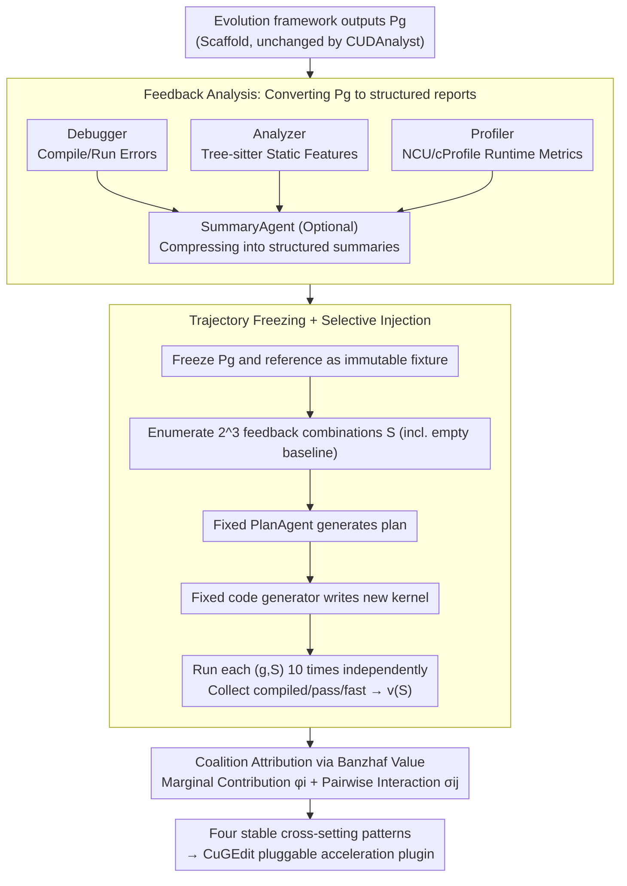

# Towards Feedback-to-Plan Decisions for Self-Evolving LLM Agents in CUDA Kernel Generation

**Conference**: ICML 2026  
**arXiv**: [2605.26720](https://arxiv.org/abs/2605.26720)  
**Code**: https://github.com/yuxuan-z19/cudanalyst (Available)  
**Area**: LLM Agent / Code Generation / CUDA Kernel Optimization  
**Keywords**: self-evolving agent, CUDA kernel, feedback attribution, trajectory freezing, Banzhaf value

## TL;DR
For self-evolving LLM agents generating CUDA kernels, this paper proposes CUDAnalyst: it performs generation-level intervention by "freezing intermediate program states + selective feedback injection/masking" and deconstructs the marginal contributions and high-order interactions of debugger/analyzer/profiler feedback using Banzhaf cooperative game values. The study yields four key findings, such as "explicit plans are only useful when feedback is aligned" and "plans from strong models can migrate to weak models of the same family." Based on these, the CuGEdit plugin was designed, outperforming torch.compile by 2.08×–10.32×.

## Background & Motivation

**Background**: Currently, automatic CUDA kernel generation has shifted from one-shot synthesis to "self-evolving agents"—where the LLM reads outputs from debuggers, static analyzers, and profilers from the previous generation to plan modifications and generate new code. Representative systems including FM Agent, STARK, ConCuR, and OpenEvolve have reported significant speedups.

**Limitations of Prior Work**: When evaluating these agents, the mainstream approach is *end-to-end ablation*—disabling a feedback source and rerunning the entire evolution trajectory from the start or a checkpoint to compare the final speedup. This paradigm has two issues: (1) Minor early perturbations are amplified by subsequent multi-generation planning, causing "feedback effects" and "trajectory drift" to become completely entangled; (2) Aggregating the entire trajectory into a single scalar erases fine-grained signals regarding "which generation, which feedback, and what role it played."

**Key Challenge**: The essence of self-evolution is *cross-generation coupling*, while attribution requires causal effects at a *fixed decision point*—the two are naturally in conflict. As long as the agent is allowed to continue its own trajectory, it remains impossible to distinguish whether "the feedback changed" or "the trajectory diverged."

**Goal**: (1) Design an analysis layer capable of feedback intervention at fixed decision points; (2) Quantify the marginal contribution and pairwise interaction of each feedback using game theory tools; (3) Verify whether the resulting findings remain stable across different backbones, workloads, and evolutionary operators; (4) Encapsulate stable patterns into plug-and-play modules to accelerate real-world systems.

**Key Insight**: The authors' key observation is that feedback attribution must occur at a *fixed generation*. By *freezing* the generated program state of a specific generation as a fixture, one can repeatedly replay plans on the same code while only varying the feedback input. Thus, any differences in plans or code can only be attributed to the feedback itself.

**Core Idea**: Decouple "self-evolution" and "feedback attribution" in the time dimension—evolution runs normally to produce trajectory snapshots, while attribution performs controlled patching on each snapshot, using Banzhaf values for game-theoretic deconstruction of feedback coalitions.

## Method

### Overall Architecture
CUDAnalyst is an analysis layer "sandwiched" between a self-evolving framework (e.g., OpenEvolve) and the LLM planner. Its core task is to quantify the causal contribution of each feedback to the plan in each generation without letting the agent continue its trajectory or suffering from trajectory drift. This is achieved by decoupling evolution and attribution in time: the evolution framework runs as usual to produce the $g$-th generation program $P_g$, while CUDAnalyst freezes $P_g$ into an immutable snapshot. On this fixed fixture, it only toggles "which feedbacks are sent to the planner" and repeatedly replays the plan→code→evaluation cycle.

The workflow follows four steps: First, the Debugger (compile/runtime errors), Analyzer (Tree-sitter-based static features), and Profiler (NCU/cProfile runtime metrics) modules convert $P_g$ into structured feedback reports, optionally compressed by a SummaryAgent. Second, $P_g$ and the reference set are frozen, and $2^N$ combinations of feedback toggles $S \subseteq \{d,a,p\}$ are enumerated. For each coalition, the PlanAgent (with fixed prompt/temperature) generates a plan, and the code generator writes a new kernel. Each $(g,S)$ combination is run 10 times to calculate the characteristic function $v(S)$ based on compiled/pass/fast metrics. Finally, the Banzhaf value and Grabisch-Roubens interaction terms are used to decompose $v(S)$ into the marginal contribution of each feedback and pairwise synergies. This process intentionally prevents the PlanAgent from seeing historical plans, excluding "evolutionary memory" from the attribution boundary.

### Key Designs

**1. Trajectory Freezing + Selective Feedback Injection: Controlled patching on the same code fixture**

Feedback attribution in self-evolution faces a fundamental difficulty—it naturally violates IID assumptions: early perturbations are amplified by subsequent planning. In traditional end-to-end ablation, differences caused by "changed feedback" and "diverged trajectories" are entangled. This design solves this by "slicing" the time dimension: $P_g$ generated in each generation is cached as an immutable snapshot, and the reference set is fixed to avoid resampling noise. Then, the planner, prompt, and decoding hyperparameters are locked, while *only* the feedback provided to the PlanAgent is toggled. For the feedback set $\{d,a,p\}$, $2^3=8$ combinations are enumerated (including the empty baseline $v(\emptyset)$). Because each experiment only changes the feedback input, any observed differences in plan or code can be strictly attributed to the feedback itself.

**2. Banzhaf-based Coalition Attribution: Cleanly separating individual contributions and interactions**

Only looking at the difference between "on/off" for a single feedback overestimates its role due to significant synergies—for instance, an analyzer might identify a potential race, which a debugger then localizes. This design models feedback attribution as a cooperative game $\mathcal{G}=(N,v)$, where players are $N=\{\text{debugger},\text{analyzer},\text{profiler}\}$ and the characteristic function $v(S)$ is the expected generation-level success under coalition $S$. The marginal contribution of each feedback is calculated using the Banzhaf value:

$$\phi_i(v) = \frac{1}{2^{|N|-1}} \sum_{S \subseteq N \setminus \{i\}} [v(S \cup \{i\}) - v(S)]$$

which averages over all subsets with equal weight. Pairwise interaction uses the Grabisch-Roubens term $\sigma_{ij} = v(\{i,j\}) - v(\{i\}) - v(\{j\}) + v(\emptyset)$, where positive values indicate complementarity and negative values indicate redundancy or competition. Banzhaf is chosen over Shapley because feedback exists *simultaneously* in planning without an arrival order; equal weighting fits the semantic reality better than Shapley's permutation-based weighting.

**3. CuGEdit: Encapsulating stable patterns into deployable plugins**

To prove the practical value of the attribution findings, four stable patterns identified in RQ1–RQ3—feedback alignment necessity, late-stage synergy, strong-to-weak model plan transfer, and the effectiveness of summaries for weak models—are encapsulated into the CuGEdit module. It consists of three components: (a) Kernel-similarity-aware activation, which only activates full feedback analysis if the current kernel resembles cached cases; (b) Feedback summarization, using a SummaryAgent to compress raw profiles; and (c) Strong-to-weak plan distillation, injecting plans from strong models (DeepSeek-R1 / Qwen3-235B) into the context of weak models (DeepSeek-V3.2 / Qwen3-Coder-30B). Applied to OpenEvolve on KernelBench Level 3, it achieved $2.08\times$–$10.32\times$ speedup over torch.compile.

### Loss & Training
No models are trained in this work; all PlanAgents, SummaryAgents, and CodeAgents utilize *fixed-prompt, fixed-decoding* off-the-shelf LLM calls. Experiments on PolyBench-ACC were conducted with 10 independent runs, using 95% CI for confidence. Evaluations were performed using a unified LLM evaluator to ensure cross-experimental comparability.

## Key Experimental Results

### Main Results

| Research Question | Setup | Key Findings |
|---|---|---|
| RQ0: Utility of Explicit Planning | 2×2: {implicit, explicit} × {no feedback, full feedback} | P+NF (plan without feedback) consistently dropped performance; P+F (plan with feedback) showed stable gains across all models, with weak models (DeepSeek-V3.2, Qwen3-Coder-30B) ganning the most. |
| RQ1: Most Critical Feedback | Banzhaf Value + $\sigma_{dap}$ third-order interaction | Early stages (gen 0-2) showed sparse/unstable contributions; late stages (gen 5-7) were dominated by interaction terms. Analyzer leads compilation, Profiler leads performance, Debugger works through interaction. |
| RQ2: Summarization vs. Planning | NP+S vs P+S vs P+F | Summaries (P+S) significantly accelerated weak models but offered minimal gains to strong models (R1, Qwen3-235B). NP+S was generally weaker than P+S, proving summaries $\neq$ planning. |
| RQ3: Strong-to-Weak Plan Distillation | Injecting strong model plans into weak model contexts | Same-family transfers (R1→V3.2, Qwen3→Qwen3-Coder) yielded the highest gains; cross-family transfers were partially effective. |
| CuGEdit Performance | KernelBench Level 3 vs torch.compile | $2.08\times$ – $10.32\times$ speedup, exceeding SOTA. |

### Ablation Study

| Configuration | Metric Changes | Description |
|---|---|---|
| Implicit (OpenEvolve default) | Baseline | Planning and code generation are coupled in a single step. |
| P+NF (Plan without feedback) | Universal decrease | Proves plan tokens themselves are useless without content. |
| P+F (Plan with feedback) | Stable improvement | Feedback is the key driver. |
| DP (Dummy Plan, template fill) | Decrease in weak models | Rules out "token budget/text structure" as confounding factors. |
| P+RF (Random feedback) | Decrease across all models | Proves "alignment" is critical, not just "information volume." |
| Cross-backbone (Kimi-K2 / MiniMax-M2.5 / Gemini-2.5-Pro) | Stable $\sigma_{ij}$ patterns | Tool synergy structure is independent of the backbone model. |
| Cross-workload (NPB / XSBench / rkbench) | Qualitative patterns consistent | Convergence speed varies but attribution structure remains stable. |
| Cross-evolutionary operator (EoH / MCTS / LHNS / hill-climbing) | Trajectories highly synced | Attribution structure decoupled from the evolutionary operator. |
| Cross-domain (CPU Numba N-body) | $12.5\times$ peak speedup | Attribution framework is not restricted to CUDA. |

### Key Findings
- **Plan tokens alone have no value**: P+NF and DummyPlan do not improve or even hinder performance; the role of a plan is to "organize and reuse aligned feedback," not to provide "extra thinking steps" for the LLM.
- **Late stage relies on interaction, early stage on individual items**: As generations increase, $\sigma_{dap}$ dominates score growth—late-stage failure modes are coupled (e.g., race conditions affecting both compilation and performance), requiring multi-tool consensus.
- **Strong models are insensitive to plan semantics**: DummyPlan barely affected R1/Qwen3-235B, but P+RF (random feedback) caused total performance drops—indicating strong models have self-correction but no immunity to misleading signals.
- **Family-specific transfer is superior**: Plan portability is limited by representational compatibility; cross-family gains (e.g., DeepSeek→Qwen3) are discounted, suggesting agent ensembles should consider model lineage.
- **CuGEdit turns analysis into productivity**: The three laws—feedback alignment, multi-tool synergy, and same-family distillation—directly translated into $10.32\times$ speedup, proving the analysis is not merely a "post-hoc explanation."

## Highlights & Insights
- **Methodological Highlight**: Introducing Banzhaf values and Grabisch-Roubens interactions from game theory into LLM agent attribution cleanly separates "individual credit" and "synergy." This recipe is highly portable to other multi-tool agents (browse + code + retrieve).
- **Universality of Trajectory Freezing**: Applicable beyond CUDA agents—any "long-horizon, multi-feedback, iterative" agent (multi-agent debate, deep research) suffers from trajectory drift during ablation. Snapshot freezing is the general remedy.
- **Anti-intuitive Insight**: Plans themselves are useless; feedback is the core. The fact that DummyPlan hardly degrades performance for strong models challenges the narrative that "longer CoT is always better."
- **Transferable Trick**: The P+RF (Random Feedback) control should be a standard baseline for any plan/tool agent paper to verify that the signal is useful, not just the token length.

## Limitations & Future Work
- **Author Acknowledgement**: The method assumes intermediate program states can be frozen, but what constitutes the "semantic evolution" of a CUDA kernel is still an open question in compiler research. Crucially, cross-generation memory was excluded from the attribution boundary to maintain causality.
- **Potential Improvements**: (1) Feedback members are currently fixed to a triplet $\{d,a,p\}$, as $2^N$ coalitions scale exponentially. Future work could use Monte-Carlo sampling for Banzhaf values to support more sources (retrieval, perf counters). (2) Evaluations were limited to PolyBench and KernelBench; generalization to "long-tail operators" (fused MoE, sparse attention) is not explicitly verified. (3) Prompts were fixed; the stability of attribution results relative to prompt engineering was not explored.
- **Open Question**: Attribution conclusions may rely on the quality of feedback implementation—if a finer-grained hardware counter profiler were used, would the relative magnitude of $\phi_p$ flip? This suggests a need for "attribution of attribution."

## Related Work & Insights
- **vs. OpenEvolve / FM Agent / STARK**: While these systems focus on "how to make agents write better," this paper focuses on "scientifically analyzing why they write better." CUDAnalyst serves as an analysis layer for these frameworks.
- **vs. Traditional E2E Ablation**: The paper uses Fig. 1 to visualize trajectory drift and systematically refutes the sufficiency of E2E ablation via P+RF and DummyPlan controls.
- **vs. Shapley-based Prompt Valuation**: This work uses Banzhaf over Shapley, arguing that feedback in planning is reached in parallel rather than sequentially—a subtle but important modeling distinction.
- **vs. CUDA-L1**: While CUDA-L1 improves the generator via RL, this work modifies nothing in the model, focusing purely on attribution and plug-in design. The two are orthogonal and stackable.

## Rating
- Novelty: ⭐⭐⭐⭐ Introducing Banzhaf attribution and trajectory freezing provides a reusable paradigm for agent behavior analysis.
- Experimental Thoroughness: ⭐⭐⭐⭐⭐ 4 RQs + broad generalization experiments + end-to-end plugin validation makes this a rare "analysis paper with a deployable module."
- Writing Quality: ⭐⭐⭐⭐ Clear argumentation; Fig. 1 is excellent for framing, though some notation (P+NF/NP+S) is dense.
- Value: ⭐⭐⭐⭐⭐ Both a methodological contribution for the self-evolving agent community and an engineering contribution ($10\times$ speedup) for LLM4Code/HPC teams.

<!-- RELATED:START -->

## Related Papers

- [\[ICML 2026\] EvolveR: Self-Evolving LLM Agents through an Experience-Driven Lifecycle](evolver_self-evolving_llm_agents_through_an_experience-driven_lifecycle.md)
- [\[ICLR 2026\] Your Agent May Misevolve: Emergent Risks in Self-evolving LLM Agents](../../ICLR2026/llm_agent/your_agent_may_misevolve_emergent_risks_in_self-evolving_llm_agents.md)
- [\[ICML 2026\] On Information Self-Locking in Reinforcement Learning for Active Reasoning of LLM Agents](on_information_self-locking_in_reinforcement_learning_for_active_reasoning_of_ll.md)
- [\[ACL 2026\] SEARL: Joint Optimization of Policy and Tool Graph Memory for Self-Evolving Agents](../../ACL2026/llm_agent/searl_joint_optimization_of_policy_and_tool_graph_memory_for_self-evolving_agent.md)
- [\[ICLR 2026\] InfiAgent: Self-Evolving Pyramid Agent Framework for Infinite Scenarios](../../ICLR2026/llm_agent/infiagent_self-evolving_pyramid_agent_framework_for_infinite_scenarios.md)

<!-- RELATED:END -->
