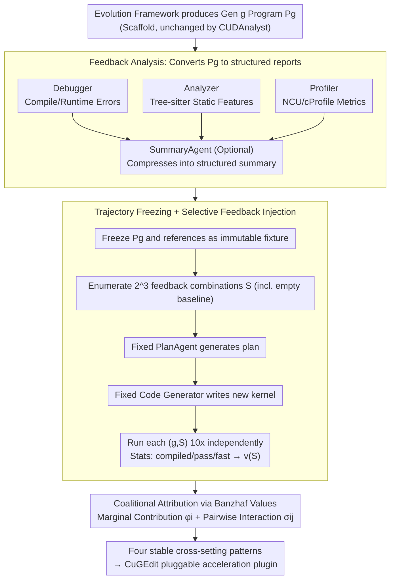

# Towards Feedback-to-Plan Decisions for Self-Evolving LLM Agents in CUDA Kernel Generation

**Conference**: ICML 2026  
**arXiv**: [2605.26720](https://arxiv.org/abs/2605.26720)  
**Code**: https://github.com/yuxuan-z19/cudanalyst (Available)  
**Area**: LLM Agent / Code Generation / CUDA Kernel Optimization  
**Keywords**: self-evolving agent, CUDA kernel, feedback attribution, trajectory freezing, Banzhaf value

## TL;DR
For self-evolving LLM agents generating CUDA kernels, this paper proposes CUDAnalyst. By "freezing intermediate program states of a specific generation + selectively injecting/masking feedback," it performs generation-level intervention. Using Banzhaf values from coalitional game theory to deconstruct the marginal contributions and high-order interactions of debugger, analyzer, and profiler feedback, it derives four conclusions—such as "explicit plans are only useful when feedback is aligned" and "plans from strong models can be transferred to weak models of the same family." Based on these, the CuGEdit plugin was designed, outperforming torch.compile by 2.08×–10.32×.

## Background & Motivation

**Background**: Currently, automatic CUDA kernel generation has shifted from one-shot synthesis to "self-evolving agents." In each generation, the LLM reads outputs from the previous generation’s debugger, static analyzer, and profiler, formulates a plan for modification, and generates new code. Representative systems like FM Agent, STARK, ConCuR, and OpenEvolve have reported significant speedups.

**Limitations of Prior Work**: When evaluating these agents, the mainstream approach is *end-to-end ablation*—disabling a specific feedback source and rerunning the entire evolution trajectory from the start or a checkpoint, then comparing the final speedup. This paradigm suffers from two issues: (1) Small perturbations in early stages are amplified by subsequent generation-level planning, causing "feedback effects" and "trajectory drift" to become completely entangled; (2) Aggregating the entire trajectory into a single scalar obscures fine-grained signals regarding "which generation, which feedback, and what effect."

**Key Challenge**: The essence of self-evolution is *cross-generation coupling*, whereas attribution requires causal effects at a *fixed decision point*—the two are inherently in conflict. As long as the agent is allowed to continue its own execution, it remains impossible to distinguish whether the change resulted from the "feedback" or the "diverged trajectory."

**Goal**: (1) Design an analysis layer capable of feedback intervention at fixed decision points; (2) Use game theory tools to quantify the marginal contribution and pairwise interaction of each feedback source; (3) Verify if these findings remain stable across different backbones, workloads, and evolutionary operators; (4) Encapsulate stable patterns into pluggable modules to accelerate real systems.

**Key Insight**: The authors observe that feedback attribution must occur at a *fixed generation*. By *freezing* the generated program state of that generation as a fixture, one can repeatedly replay the plan on the same code while only varying the feedback input. Any differences in the resulting plan/code can then be attributed solely to the feedback itself.

**Core Idea**: Decouple "self-evolution" from "feedback attribution" in the temporal dimension—evolution runs normally to produce trajectory snapshots, while attribution performs controlled patching on each snapshot, using Banzhaf values to dissect the feedback coalition at a game-theoretic level.

## Method

### Overall Architecture
CUDAnalyst is an analysis layer "sandwiched" between a self-evolving framework (e.g., OpenEvolve) and an LLM planner. Its core problem is quantifying the causal contribution of each feedback source to the plan within each generation without allowing the agent to continue execution or suffering from trajectory drift. This is achieved by temporally decoupling evolution and attribution: the evolution framework runs normally to produce the $g$-th generation program $P_g$, while CUDAnalyst freezes $P_g$ as an immutable snapshot. On this fixed fixture, it only toggles "which feedback to send to the planner," repeatedly replaying the plan→code→evaluation cycle.

The process involves four steps: first, the Debugger (compile/runtime errors), Analyzer (static features based on Tree-sitter), and Profiler (NCU/cProfile runtime metrics) modules convert $P_g$ into a structured feedback report, optionally compressed by a SummaryAgent; then, $P_g$ and the references are frozen, and $2^N$ combinations of the three feedback types $S \subseteq \{d,a,p\}$ are enumerated. For each coalition, a PlanAgent with a fixed prompt/temperature generates a plan, and a fixed code generator writes a new kernel; each $(g,S)$ combination is run 10 times independently to collect statistics on compiled/pass/fast rates, forming the characteristic function $v(S)$; finally, Banzhaf values and Grabisch-Roubens interaction terms are used to decompose $v(S)$ into marginal contributions and pairwise synergies. This process intentionally forces the PlanAgent to see only feedback and not historical plans, excluding "evolutionary memory" from the attribution boundary.

### Key Designs

**1. Trajectory Freezing + Selective Feedback Injection: Controlled Patching on the Same Code Fixture**

Feedback attribution in self-evolution faces a fundamental difficulty—it inherently violates the IID assumption: early perturbations are amplified by subsequent planning. In traditional end-to-end (E2E) ablation, where a feedback source is disabled and the trajectory is rerun, the differences between "feedback changes" and "trajectory divergence" are entangled, making causal attribution mathematically unsupported. This design "slices" the process in time: it caches $P_g$ from each generation as an immutable snapshot and fixes the reference set to avoid resampling noise. Then, by locking the planner, prompt, and decoding hyperparameters, it *only* toggles which feedback components are fed into the PlanAgent. For the three feedback types $\{d,a,p\}$, it enumerates $2^3=8$ combinations (including the empty set baseline $v(\emptyset)$). Each is evaluated by running the "feedback→plan→code→evaluation" pipeline $k=10$ times on the same $P_g$. Since only the feedback input varies, differences in plan/code can be attributed solely to the feedback; the computational budget is $O(2^{|N|}k)$ rather than the E2E $O(\text{generations}\times k)$, and results allow for strict horizontal comparison.

**2. Coalitional Attribution via Banzhaf Values: Cleanly Separating Individual Contributions and Interactions**

Looking only at the difference of "on/off" for a single feedback source overestimates its effect because of synergies—e.g., an analyzer identifies a potential race, which allows the debugger's error to be localized. This design models feedback attribution as a cooperative game $\mathcal{G}=(N,v)$, where players are $N=\{\text{debugger},\text{analyzer},\text{profiler}\}$ and the characteristic function $v(S)$ is the expected generation-level success under coalition $S$. The marginal contribution of each feedback source is calculated using the Banzhaf value:

$$\phi_i(v) = \frac{1}{2^{|N|-1}} \sum_{S \subseteq N \setminus \{i\}} [v(S \cup \{i\}) - v(S)]$$

which averages over all subsets with equal weight. Pairwise interactions use the Grabisch-Roubens term $\sigma_{ij} = v(\{i,j\}) - v(\{i\}) - v(\{j\}) + v(\emptyset)$, where positive values indicate complementarity and negative values indicate redundancy or competition. Choosing Banzhaf over Shapley is a subtle but critical modeling choice: in plan decisions, all feedback arrives *simultaneously* without a sequential order; equal weight averaging fits the actual semantics better than Shapley’s permutation-based weighting. This framework gives fair credit to each player while isolating interaction terms.

**3. CuGEdit: Encapsulating Stable Patterns into Deployable Plugins**

Attribution lacks value if it remains only an "analysis framework." This design proves that extracted patterns can be directly implemented. From RQ1–RQ3, four patterns stable across backbones, workloads, and evolutionary operators were distilled: feedback utility depends on alignment, multi-feedback relies on late-stage synergy, strong model plans transfer to weak models of the same family, and summaries are particularly effective for weak models. These are encapsulated into the CuGEdit module, which plugs into any self-evolving framework and contains three sub-components: (a) Kernel-similarity-aware activation, activating full feedback analysis only when the current kernel is similar to a cached case to save tokens; (b) Feedback summarization, using a SummaryAgent to compress raw profiles for weak models; (c) Strong-to-weak plan distillation, injecting plans from same-family strong models (DeepSeek-R1 / Qwen3-235B) into the context of weak models (DeepSeek-V3.2 / Qwen3-Coder-30B). Applied to OpenEvolve on KernelBench Level 3, it achieved $2.08\times$–$10.32\times$ speedup over torch.compile, exceeding baseline and SOTA—telling system designers exactly when to toggle feedback, use summaries, or distill plans.

### Loss & Training
This paper does not train any models. All PlanAgents, SummaryAgents, and CodeAgents are off-the-shelf LLM calls with *fixed-prompt and fixed-decoding*. Experiments are conducted on PolyBench-ACC with 10 independent runs, using 95% CI. Evaluation uses a unified LLM evaluator to ensure comparability across experiments.

## Key Experimental Results

### Main Results

| Research Problem | Setting | Key Findings |
|---|---|---|
| RQ0 Utility of Explicit Planning | 2×2: {implicit, explicit} × {no feedback, full feedback} | P+NF (Plan with no feedback) consistently drops performance; P+F (Plan with feedback) shows stable gains across all models, especially for weak models (DeepSeek-V3.2, Qwen3-Coder-30B). |
| RQ1 Which Feedback is Critical | Banzhaf values + $\sigma_{dap}$ 3rd-order interaction | Early stage (gen 0-2) marginal contributions are sparse/unstable; late stage (gen 5-7) interaction terms dominate; analyzer drives compliance, profiler drives speed, debugger works through interaction. |
| RQ2 Summary vs. Planning | NP+S vs P+S vs P+F | Summary (P+S) significantly accelerates weak models but offers minimal gain for strong models (R1, Qwen3-235B); NP+S is generally weaker than P+S, proving summary ≠ planning. |
| RQ3 Strong→Weak Plan Distillation | Inject strong model plans into weak model contexts | Same-family transfer (R1→V3.2, Qwen3-235B→Qwen3-Coder-30B) yields the highest gains; cross-family transfer is partially effective. |
| CuGEdit Performance | KernelBench Level 3 vs torch.compile | $2.08\times$ – $10.32\times$ speedup, exceeding SOTA. |

### Ablation Study

| Configuration | Key Metric Change | Description |
|---|---|---|
| Implicit (OpenEvolve Default) | baseline | Planning and code generation are coupled in a single step. |
| P+NF (Plan with no feedback) | Universal decrease | Proves that plan tokens themselves are useless without signal. |
| P+F (Plan with feedback) | Stable Gain | Feedback is the critical component. |
| DP (Dummy Plan, template filling) | Decrease for weak models | Excludes "token budget/text structure" as confounding factors. |
| P+RF (Random Feedback) | Decrease for all models | Proves "alignment" is key, not just "information volume." |
| Cross-backbone (Kimi-K2 / MiniMax-M2.5 / Gemini-2.5-Pro) | Stable $\sigma_{ij}$ patterns | Tool synergy structure is independent of the base model. |
| Cross-workload (NPB / XSBench / rkbench) | Consistent qualitative patterns | Convergence speed varies but attribution structure is stable. |
| Cross-evolutionary operator (EoH / MCTS-AHD / LHNS / hill-climbing) | High trajectory sync | Attribution structure decouples from the evolutionary operator. |
| Cross-domain (CPU Numba N-body) | $12.5\times$ peak speedup | Attribution framework is not locked to CUDA. |

### Key Findings
- **Plan tokens themselves have no value**: P+NF and DummyPlan do not improve or even degrade performance; the plan's role is to "organize and reuse aligned feedback," not to give the LLM an extra "thinking step."
- **Synergy in late stages, individual items in early stages**: As generations increase, $\sigma_{dap}$ dominates score growth—late-stage program failures become increasingly coupled (e.g., race conditions affecting both compilation and performance), requiring multi-feedback deliberation.
- **Strong models are insensitive to plan semantics**: DummyPlan barely affects R1/Qwen3-235B, but P+RF (random feedback) causes a total performance drop—indicating strong models have self-correction but no immunity to "misleading signals."
- **Same-family transfer is friendly**: Plan transferability is limited by representational compatibility; cross-family (e.g., DeepSeek→Qwen3) gains are discounted, suggesting lineage matters for "agent ensembles."
- **CuGEdit turns analysis into productivity**: The three laws—feedback alignment, multi-tool synergy, and same-family distillation—directly translated into pluggable modules, yielding $10.32\times$ speedup and proving the analysis is not just "post-hoc explanation."

## Highlights & Insights
- **Methodological Highlight**: Introducing coalitional game theory (Banzhaf / Grabisch-Roubens) into LLM agent attribution cleanly separates "individual contribution" and "interaction terms," providing much more information than simple leave-one-out analysis. This recipe is highly transferable to other multi-tool agents (browse + code + retrieve).
- **Trajectory Freezing Trick**: This is not just for CUDA agents. Any agent with "long horizons, multi-feedback, and iteration" (multi-agent debate, deep research, RAG with reflection) suffers from trajectory drift during ablation; "frozen snapshots + controlled patching" is a universal remedy.
- **Counter-intuitive "Aha" Moment**: Plans are useless; feedback is the core. The fact that DummyPlan barely degrades strong models suggests LLMs can synthesize structure on the fly from feedback. This strikes against the naive narrative that "longer chains of thought always help."
- **Transferable Trick**: The P+RF (Random Feedback) control—every plan/tool agent paper should include this baseline to verify if the "plan signal" is useful or if just having "long plan tokens" is sufficient.

## Limitations & Future Work
- **Author Admission**: The method assumes intermediate "program states" can be frozen, but what constitutes the *semantic evolutionary state* of a CUDA kernel is still an open question in compiler research; this paper intentionally moves cross-generation memory outside the attribution boundary.
- **Improvements**: (1) Feedback members are currently fixed to a triplet $\{d,a,p\}$; $2^N$ coalitions can be expanded, but costs are exponential. Approximate Banzhaf (Monte-Carlo sampling) could support more sources (retrieval, hardware counters, source diffs). (2) Evaluations were limited to PolyBench-ACC + KernelBench; generalization to "long-tail operators" (sparse attention, fused MoE) lacks direct verification. (3) PlanAgent and CodeAgent use fixed prompts; the stability of attribution results relative to prompt engineering was not explored.
- **Bigger Question**: Attribution conclusions might depend on the quality of feedback implementation—if a finer-grained profiler is used, would the relative $\phi_p$ inverse? This requires "attribution of the attribution."

## Related Work & Insights
- **vs. OpenEvolve / FM Agent / STARK**: These systems emphasize "how to make the agent write better"; this paper emphasizes "how to scientifically analyze why it writes better." CUDAnalyst serves as an *analysis layer* for these systems.
- **vs. Traditional E2E Ablation (Novikov 2025, Liu 2024b)**: This paper uses Fig. 1 to demonstrate trajectory drift in E2E and systematically refutes the common practice of E2E ablation through P+RF / DummyPlan / Cross-backbone controls.
- **vs. Shapley-based prompt valuation (Liu 2024c)**: This paper uses Banzhaf over Shapley, arguing that feedback in plan decisions arrives in parallel rather than sequentially—a subtle but important distinction.
- **vs. CUDA-L1 (Li 2025b)**: CUDA-L1 improves the generator via RL; this paper keeps models frozen and focuses on attribution and plugin design. These technical stacks are orthogonal and additive.

## Rating
- Novelty: ⭐⭐⭐⭐ Introducing Banzhaf coalitional attribution + trajectory freezing to self-evolving agents is a clean methodological innovation, providing a reusable paradigm for "agent behavior attribution."
- Experimental Thoroughness: ⭐⭐⭐⭐⭐ 4 RQs + generalization across backbones/workloads/operators/domains (CPU Numba) + real-world CuGEdit validation. It is rare for an analysis paper to include such a deployable module.
- Writing Quality: ⭐⭐⭐⭐ Clear chain of logic; Fig. 1’s explanation of "why E2E is unreliable" is high-level framing. Occasionally dense notations (e.g., P+NF / NP+S abbreviations).
- Value: ⭐⭐⭐⭐⭐ Both a methodological contribution (attribution tools for the self-evolving agent community) and an engineering contribution (CuGEdit's 10x speedup). Particularly useful for industrial teams working on LLM4Code / LLM4HPC.

<!-- RELATED:START -->

## Related Papers

- [\[ICML 2026\] Self-evolving LLM agents with in-distribution Optimization](self-evolving_llm_agents_with_in-distribution_optimization.md)
- [\[ICML 2026\] EvolveR: Self-Evolving LLM Agents through an Experience-Driven Lifecycle](evolver_self-evolving_llm_agents_through_an_experience-driven_lifecycle.md)
- [\[ICLR 2026\] Your Agent May Misevolve: Emergent Risks in Self-evolving LLM Agents](../../ICLR2026/llm_agent/your_agent_may_misevolve_emergent_risks_in_self-evolving_llm_agents.md)
- [\[ICLR 2026\] ReVeal: Self-Evolving Code Agents via Reliable Self-Verification](../../ICLR2026/llm_agent/reveal_self-evolving_code_agents_via_reliable_self-verification.md)
- [\[ACL 2026\] Mem²Evolve: Towards Self-Evolving Agents via Co-Evolutionary Capability Expansion and Experience Distillation](../../ACL2026/llm_agent/mem2evolve_towards_self-evolving_agents_via_co-evolutionary_capability_expansion.md)

<!-- RELATED:END -->
