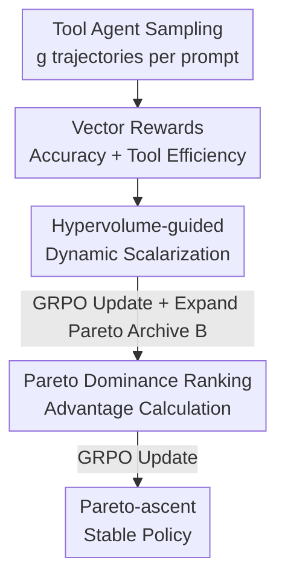

# Towards Pareto-Optimal Tool-Integrated Agents with Pareto Ranking Policy Optimization

**Conference**: ICML2026  
**arXiv**: [2606.16111](https://arxiv.org/abs/2606.16111)  
**Code**: https://github.com/Applied-Machine-Learning-Lab/ICML2026_ParetoPO  
**Area**: Agent / Multi-Objective Reinforcement Learning  
**Keywords**: Tool-integrated Agent, Multi-objective RL, Pareto dominance, Hypervolume, GRPO  

## TL;DR
ParetoPO explicitly formulates the alignment of tool-integrated agents as a multi-objective RL problem (accuracy vs. tool-use efficiency). It employs a two-stage training process—global exploration via hypervolume-guided dynamic scalarization followed by local refinement via Pareto dominance ranking for advantage calculation—achieving higher accuracy with fewer tool calls in mathematical reasoning and multi-hop QA.

## Background & Motivation
**Background**: Online RL (especially the GRPO family) has become the de facto standard for aligning LLM agents capable of tool interaction. This approach significantly enhances performance across tasks ranging from search-enhanced QA to compiler-integrated code generation.

**Limitations of Prior Work**: Existing alignment methods focus almost exclusively on optimizing final answer accuracy, neglecting process-level auxiliary objectives such as the frequency and quality of tool calls. In real-world deployments, tool call frequency directly dictates inference cost and reliability; an agent with high accuracy that repeatedly invokes a Python interpreter is less practical than one with similar accuracy that averages fewer calls.

**Key Challenge**: There is an inherent conflict between accuracy and tool efficiency—more tool calls often improve accuracy at the cost of efficiency. Current methods to combine these into a scalar reward face two major issues: (1) **Fixed-weight scalarization** uses static weights for vector rewards, but varying scales and learning dynamics across different objectives lead to mismatched optimization at different training stages. Furthermore, linear scalarization can only recover Pareto optimal solutions on **convex regions** of the trade-off curve, leaving non-convex regions inaccessible. (2) **Gradient-based multi-objective optimization** calculates independent gradients per objective, which is computationally expensive and typically applied to high-level semantic objectives rather than **action-level** behaviors like tool efficiency.

**Goal**: To enable agents to produce correct answers efficiently by finding a Pareto-optimal policy between accuracy and tool efficiency, rather than being restricted by fixed weightings.

**Key Insight**: Alignment should be modeled as a Multi-Objective Markov Decision Process (MOMDP). Two-stage training replaces fixed weighting: the first stage uses **hypervolume (HV) signals for dynamic weighting** to expand the Pareto frontier, while the second stage uses **Pareto dominance ranking** to calculate advantages, pushing the policy toward non-dominated trajectories for fine-grained action-level refinement.

## Method

### Overall Architecture
ParetoPO formalizes tool agent training as an MOMDP. In each step, the agent outputs either a standard token or a tool API call. At the end of a trajectory, a **vector reward** $\bm{r}=(r_{task}, r_{tool})$ is received, where $r_{task}$ measures task performance (e.g., accuracy) and $r_{tool}$ measures tool efficiency. The efficiency reward is defined as:

$$r_{tool}=\exp(-\alpha\,|N_{call}-N_{optimal}|),$$

where $N_{call}$ is the actual number of tool calls and $N_{optimal}=\min(\mathcal{C})$ is the minimum call count observed among **successful trajectories** ($N_{call}\ge N_{optimal}$), with $\alpha$ controlling the penalty intensity. $N_{optimal}$ is updated throughout training and is monotonically non-increasing.

Optimization proceeds in two sequential stages: **Stage 1** uses hypervolume-guided dynamic scalarization to convert vector rewards into a drifting scalar to cover different Pareto frontier regions. **Stage 2** replaces scalar rewards with Pareto dominance ranking to calculate advantages within a batch, pushing the policy towards superior trajectories. Both stages share an evolving Pareto archive $\bm{B}$.

### Key Designs

**1. Tool Efficiency Reward: Transforming efficiency into an optimizable dense signal**

The "number of calls" is a discrete count, making it non-differentiable and difficult to scale against accuracy. This work maps it to $[0,1]$ via $r_{tool}=\exp(-\alpha|N_{call}-N_{optimal}|)$. As $N_{call}$ approaches the best-known $N_{optimal}$, the reward nears 1. $N_{optimal}$ is estimated online from successful trajectories, forcing the agent to approximate the global optimum. Since the reward is bounded and $N_{optimal}$ is monotonic, training remains stable.

**2. Hypervolume-guided Dynamic Scalarization: Adaptive weighting via frontier progress**

To overcome the limitations of fixed weights $\bm{w}$, a meta-reward $r_{pareto}$ is introduced to modulate the final reward. For a new vector $\bm{r}$, the **hypervolume improvement** relative to the archive $\bm{B}$ is calculated: $\Delta\mathrm{HV}(\bm{r},\bm{B})=\mathrm{HV}(\bm{B}\cup\bm{r})-\mathrm{HV}(\bm{B})$. To manage noise in tool environments, exponential smoothing is applied:

$$\Delta\overline{\text{HV}}_t=\gamma\,\Delta\overline{\text{HV}}_{t-1}+(1-\gamma)\,\Delta\text{HV}_t,$$

resulting in $r_{pareto}=0.5+1.5\tanh(\Delta\overline{\text{HV}}_t)$ and the final scalar reward $\tilde r_w=r_{pareto}\cdot r_w$. This automatically shifts optimization focus toward under-explored regions of the frontier.

**3. Pareto Dominance Ranking for Advantage Calculation: Action-level refinement**

Stage 2 discards scalar rewards in favor of **Pareto dominance** ranking within rollouts. Trajectory $\tau_i$ dominates $\tau_j$ if it is no worse in all objectives and strictly better in at least one. Trajectories are assigned a Pareto rank $\rho$, where rank 1 represents the non-dominated set. The base advantage is $A_{base,\rho}=N_{rank}-\rho+1$, with a fine-tuning term using normalized scalar rewards $\hat r_w$:

$$A_i=A_{base,\rho}+\beta\cdot(\hat r_w-0.5),\quad \beta\le 1.$$

The constraint $\beta\le 1$ ensures that **any trajectory with a better rank always receives a higher advantage**, making the dominance structure a hard constraint.

**4. Mechanism: Global coverage + Local Pareto stability**

Stage 1 (Proposition 3.1) proves that dense exploration through dynamic scalarization allows the discovered convex hull $\mathcal{C}_T$ to converge to the reachable convex hull $\mathcal{C}$, ensuring global frontier coverage. Stage 2 uses a stochastic proxy for the discrete Pareto rank to prove that the batch gradient is a **Pareto-ascent direction** (Lemma 3.4), converging to a Pareto-ascent stationary point where no direction can improve all objectives simultaneously (Theorem 3.6).

## Key Experimental Results

### Main Results
Evaluations were conducted on mathematical reasoning (MATH500, AIME, etc., using Python) and multi-hop QA (NQ, HotpotQA, using a retriever). Metrics include EM (accuracy) and #Tool (average tool calls).

| Model (Qwen2.5-Math-1.5B) | MATH500 EM / #Tool | AIME24 EM / #Tool | Olympiad EM / #Tool | AMC23 EM / #Tool |
|---|---|---|---|---|
| TIR | 73.8 / 1.3 | 13.3 / 1.1 | 41.3 / 1.5 | 55.0 / 2.0 |
| ToRL-GRPO | 77.8 / 2.1 | 23.3 / 2.2 | 44.0 / 2.7 | 67.5 / 2.5 |
| OTC-GRPO | 74.0 / 1.3 | 20.0 / 1.1 | 42.1 / 1.2 | 62.5 / 1.1 |
| MO-GRPO | 71.2 / 2.0 | 16.7 / 1.8 | 41.2 / 2.0 | 62.5 / 2.1 |
| **ParetoPO (Ours)** | **80.0\* / 0.9** | **30.0\* / 0.8** | **48.1\* / 0.8** | **70.0\* / 0.8** |

ParetoPO improves MATH500 accuracy from 77.8 to 80.0 while reducing tool calls from 2.1 to 0.9. AIME24 accuracy rose from 23.3 to 30.0, with calls dropping from 2.2 to 0.8.

### Ablation Study

| Dimension | Fixed Weight / Heuristic Baselines | ParetoPO |
|---|---|---|
| Weighting | Static throughout training | Adaptive via HV signal |
| Advantage Calculation | Scalar return (biased to weight) | Pareto ranking (dominance as hard constraint) |
| Trade-off | Success vs. Efficiency conflict | Accuracy↑ and #Tool↓ simultaneously |
| Frontier Coverage | Convex regions only | Asymptotically all supported Pareto points |

### Key Findings
- ParetoPO simultaneously reduces tool calls and improves accuracy across datasets, suggesting it finds superior trade-off points rather than just sacrificing accuracy for efficiency.
- Tool calls are stabilized around 0.8–1.2, significantly lower than ToRL-GRPO's 2+.
- The monotonic non-increasing design of $N_{optimal}$ is vital for preventing oscillations caused by moving targets.

## Highlights & Insights
- **Elevating tool efficiency to a first-class objective**: This is the first work to explicitly model action-level tool efficiency as multi-objective RL, providing a template for optimizing latency or API costs.
- **Hypervolume as a weighting signal**: Using a global quality metric (HV increment) for weighting naturally encourages exploration of frontier "gaps" better than manual schedules.
- **Hierarchical Advantage Design**: Pareto ranking as a hard constraint combined with scalar preference for soft refinement ensures Pareto consistency while allowing for task-specific preferences.
- **Two-stage Paradigm**: The global exploration followed by local refinement is a robust template for multi-objective alignment.

## Limitations & Future Work
- Experiments were limited to two objectives (accuracy vs. efficiency); performance with three or more objectives (where non-dominated sets are larger) is unexplored.
- $N_{optimal}$ estimation relies on successful trajectories; sparse early successes might impact initial signal quality.
- Hypervolume computation scales with the number of objectives, though the overhead remains small for 2-3 objectives.
- Validation on larger models (e.g., >7B) and more complex toolchains (long-horizon, multi-tool) is needed.

## Related Work & Insights
- **Comparison to OTC-GRPO**: Uses static weights; ParetoPO uses HV-driven time-varying weights to cover non-convex regions.
- **Comparison to Gradient MO-RL**: ParetoPO avoids expensive per-objective gradient calculations by using ranking-based advantages.
- **Comparison to Search-R1/ToRL-GRPO**: While similar in use of GRPO, previous models average 2+ tool calls; ParetoPO reduces this to ~0.8 without accuracy loss.

## Rating
- Novelty: ⭐⭐⭐⭐⭐ 
- Experimental Thoroughness: ⭐⭐⭐⭐ 
- Writing Quality: ⭐⭐⭐⭐ 
- Value: ⭐⭐⭐⭐⭐ 

<!-- RELATED:START -->

## Related Papers

- [\[ACL 2026\] SEARL: Joint Optimization of Policy and Tool Graph Memory for Self-Evolving Agents](../../ACL2026/llm_agent/searl_joint_optimization_of_policy_and_tool_graph_memory_for_self-evolving_agent.md)
- [\[ACL 2026\] BAPO: Boundary-Aware Policy Optimization for Reliable Agentic Search](../../ACL2026/llm_agent/bapo_boundary-aware_policy_optimization_for_reliable_agentic_search.md)
- [\[NeurIPS 2025\] Group-in-Group Policy Optimization for LLM Agent Training](../../NeurIPS2025/llm_agent/groupingroup_policy_optimization_for_llm_agent_training.md)
- [\[ICML 2026\] Self-evolving LLM agents with in-distribution Optimization](self-evolving_llm_agents_with_in-distribution_optimization.md)
- [\[ICLR 2026\] Exploratory Memory-Augmented LLM Agent via Hybrid On- and Off-Policy Optimization](../../ICLR2026/llm_agent/exploratory_memory-augmented_llm_agent_via_hybrid_on-_and_off-policy_optimizatio.md)

<!-- RELATED:END -->
## Related Papers

- [\[ACL 2026\] SEARL: Joint Optimization of Policy and Tool Graph Memory for Self-Evolving Agents](../../ACL2026/llm_agent/searl_joint_optimization_of_policy_and_tool_graph_memory_for_self-evolving_agent.md)
- [\[ACL 2026\] BAPO: Boundary-Aware Policy Optimization for Reliable Agentic Search](../../ACL2026/llm_agent/bapo_boundary-aware_policy_optimization_for_reliable_agentic_search.md)
- [\[ICLR 2026\] Exploratory Memory-Augmented LLM Agent via Hybrid On- and Off-Policy Optimization](../../ICLR2026/llm_agent/exploratory_memory-augmented_llm_agent_via_hybrid_on-_and_off-policy_optimizatio.md)
- [\[NeurIPS 2025\] Group-in-Group Policy Optimization for LLM Agent Training](../../NeurIPS2025/llm_agent/groupingroup_policy_optimization_for_llm_agent_training.md)
- [\[ACL 2025\] Play2Prompt: Zero-shot Tool Instruction Optimization for LLM Agents via Tool Play](../../ACL2025/llm_agent/play2prompt_zero-shot_tool_instruction_optimization_for_llm_agents_via_tool_play.md)

<!-- RELATED:END -->
