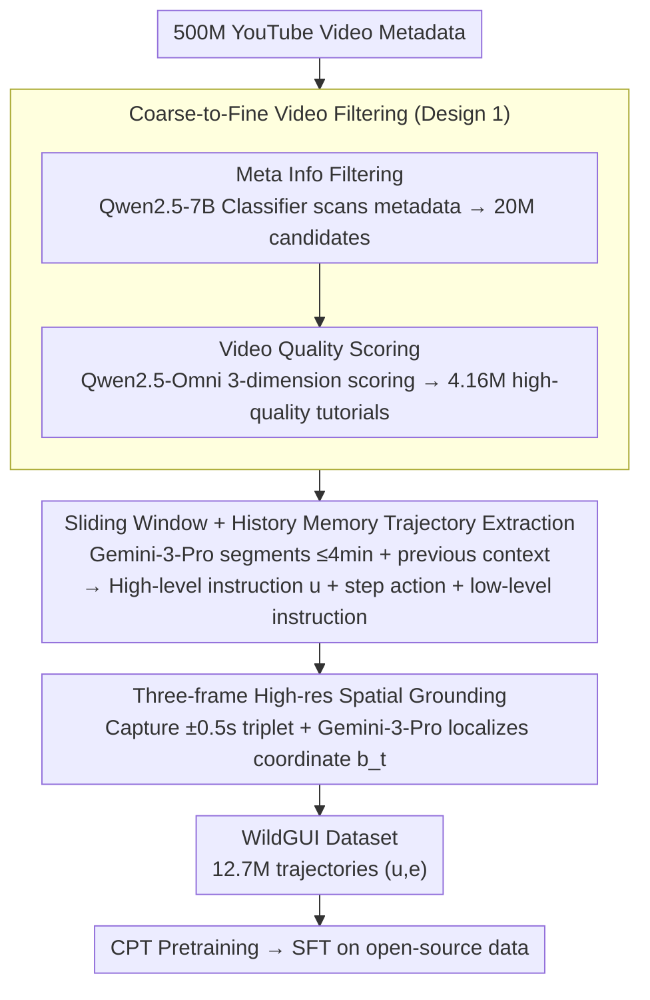

# Video2GUI: Synthesizing Large-Scale Interaction Trajectories for Generalized GUI Agent Pretraining

**Conference**: ICML 2026  
**arXiv**: [2605.14747](https://arxiv.org/abs/2605.14747)  
**Code**: Project Page <https://weiminxiong.github.io/Video2GUI/>  
**Area**: GUI Agent / Multimodal Pretraining / Data Synthesis  
**Keywords**: GUI agent, Video-to-Trajectory, Coarse-to-fine Filtering, Spatial Grounding, WildGUI Dataset

## TL;DR
Video2GUI utilizes a four-stage pipeline—"Metadata Coarse Filtering → Video Quality Fine Filtering → Gemini-3-Pro Task/Action Extraction → High-Resolution Three-Frame Precise Spatial Grounding"—to refine 500 million YouTube video metadata entries into WildGUI (12.7M trajectories, 124.5M screenshots, 1500+ applications). This dataset improves Qwen2.5-VL/Mimo-VL performance by 5–20% across multiple GUI grounding and agent benchmarks.

## Background & Motivation
**Background**: GUI agents (MLLMs capable of autonomously completing tasks via clicking, typing, and scrolling on web/desktop/mobile) represent one of the most practical directions in the trend of agentic MLLMs. A prerequisite for a generalized GUI agent is large-scale, diverse interaction trajectory data with precise coordinates, recording the complete sequence of "interface state + user action + task intent."

**Limitations of Prior Work**: (i) Manually annotated datasets (MIND2WEB, AITW, AndroidControl) are limited in scale (thousands to tens of thousands) and cover only hundreds of applications, making generalization to new interfaces difficult. (ii) Simulated environments (MiniWoB++) allow for large-scale collection but are semantically poor and differ significantly from real UIs. (iii) Existing video-based works (TongUI, VideoAgentTrek) rely on foreground/background detection or inverse dynamics, learning only short-horizon low-level visual cues without understanding the task intent behind actions, often suffering from coordinate deviations due to frame compression.

**Key Challenge**: The tension between "Data scale $\propto$ Annotation cost" and "Data quality requiring task-level understanding + pixel-level grounding." Internet videos are a natural gold mine, but the vast majority are unrelated to GUIs; even for GUI videos, converting them into "trajectories with coordinates" requires overcoming task segmentation, action recognition, and pixel localization.

**Goal**: (i) Filter high-quality GUI tutorials from a 500-million video pool at a controllable cost; (ii) automatically parse videos into task-level instructions + step-level actions + high-resolution coordinates; (iii) achieve stable performance gains on multi-platform GUI benchmarks after pretraining on synthesized data.

**Key Insight**: The authors make two key observations: first, video metadata (titles, descriptions, keywords) can filter out 95%+ noise almost for free, reducing 500M entries to 20M, followed by dimension-wise fine-filtering using omnimodal models. Second, only a few screenshots in a video actually contain changes; decoupling trajectory extraction (using strong VLMs for long-horizon reasoning on compressed frames) from spatial grounding (using three-frame high-resolution original images for pixel localization) allows for both "long-horizon understanding" and "pixel-level precision."

**Core Idea**: A three-layer architecture of "Coarse-to-fine video filtering + High/low-level instruction decoupling + Task reasoning and spatial grounding decoupling" to refine video data into GUI agent training assets.

## Method

### Overall Architecture
Video2GUI transforms 500 million noisy YouTube metadata entries into coordinate-bearing trajectories for GUI agents. The streaming pipeline includes: Coarse-to-Fine video filtering (reducing 500M to 4.16M high-quality tutorials); Trajectory Extraction (parsing long videos into high-level instructions + step actions + reasoning using strong VLMs); and Action Spatial Grounding (localizing actions to pixels using original high-resolution frames). Produced samples $(u,e)$—where $u$ is the high-level instruction and $e$ is a sequence of screenshots and coordinates—form the WildGUI dataset for CPT and SFT of models like Qwen2.5-VL/Mimo-VL.

### Key Designs

**1. Coarse-to-Fine Video Filtering: Filtering 99% noise across 500M scale with graded costs**

Directly using strong models to inspect 500M videos is computationally unfeasible. Video2GUI splits filtering into two layers. "Meta Info Filtering" uses only titles and descriptions: 10k samples labeled by DeepSeek-V3 are used to distill a Qwen2.5-7B classifier, which scans the full 500M metadata to yield 20M candidates. "Video Quality Scoring" then inspects the first minute of candidates using an omnimodal model (Qwen2.5-Omni, distilled from Gemini 3 Pro) across three dimensions: Topic Relevance, Instruction Clarity, and Screen Recording Quality, resulting in 4.16M tutorials (~300k hours). This tiered distillation scales strong model judgment at manageable costs.

**2. Sliding Window + History Memory Trajectory Extraction: Intent understanding in long videos**

Tutorials can exceed an hour, surpassing VLM context windows. Video2GUI uses Gemini-3-Pro to segment long videos into sequences $S_1, \dots, S_M$ (each $\le 4$min). When processing segment $j$, the extraction results of previous segments $D(S_{1:j-1})$ are provided as text context. Each action requires a low-level instruction (visual-anchored description) to record "what was done" and provide an anchor for grounding. A video produces $D(V)=\{(u^{(k)},e^{(k)})\}_{k=1}^N$ independent task instances, completing action recognition and intent explanation in one pass.

**3. Three-frame High-resolution Spatial Grounding: Pinning actions to pixel-level targets**

Trajectory extraction uses compressed frames insufficient for pixel-level localization. Video2GUI decouples this by returning to original video for each action at timestamp $t$. It samples a triplet $O_t=\{o_{t-0.5s},o_t,o_{t+0.5s}\}$ and uses Gemini-3-Pro with the low-level instruction $\tau_t$ to predict bounding boxes or coordinates $b_t=g_\phi(o_{t-0.5s},o_t,o_{t+0.5s},\tau_t)$. The $\pm 0.5$s offset covers the pre/at/post-action states. This ensures pixel precision while saving tokens by focusing high-res processing only on local temporal windows.

### Loss & Training
Training occurs in two stages: (i) Continued Pretraining (CPT): Large-scale training on WildGUI with Qwen2.5-VL/Mimo-VL to learn multi-platform interaction patterns; (ii) Supervised Fine-Tuning (SFT): Task-level supervision on curated open-source GUI datasets (ScreenSpot-Pro, OSWorld-G training sets) for downstream benchmark alignment. WildGUI serves as a "universal prior."

## Key Experimental Results

### Main Results
Comparison on GUI grounding benchmarks (ScreenSpot-Pro and OSWorld-G):

| Model | ScreenSpot-Pro Avg | OSWorld-G Avg |
|------|--------------------|---------------|
| Gemini-2.5-Pro (Closed) | 11.4 | 45.2 |
| Seed1.5-VL (Closed) | 60.9 | 62.9 |
| Qwen3-VL-2B (Open Baseline) | 41.9 | 45.9 |
| Qwen3-VL-8B (Open Baseline) | 49.9 | 54.8 |
| Qwen3-VL-32B | 54.9 | 60.6 |
| GTA1-7B | 50.1 | 55.1 |
| UI-Venus-7B | 50.8 | 58.8 |
| GUI-Owl-7B | 54.9 | 55.9 |
| **Qwen2.5-VL-7B + WildGUI** (Ours) | **Significant +Δ** | **Significant +Δ** |

WildGUI CPT raised the Qwen2.5-VL-7B baseline (26.8 on ScreenSpot-Pro) to levels comparable with Qwen3-VL-32B and GUI-Owl-7B, validating that real-world video data elevates general VLMs to GUI specialists.

WildGUI comparison with existing GUI datasets:

| Dataset | Platform Coverage | Environments | Trajectories/Instr | Screenshots | Avg Steps |
|--------|---------|--------|------------|--------|---------|
| AITW | mobile | 357 | 30k | 715k | 6.5 |
| AndroidControl | mobile | 833 | 14.5k | 15k | 4.8 |
| GUI-World | 3-Platform | – | 12k | 83k | 6.7 |
| GUI-Net | 3-Platform | 280 | 1M | 1M | 4.7 |
| MONDAY | mobile | – | 20k | 313k | 15.7 |
| GUI-360° | desktop | 3 | 13.75k | 105k | 7.6 |
| **WildGUI** | **3-Platform** | **1500+** | **12.7M** | **124.5M** | **9.7** |

### Ablation Study

| Configuration | Key Metric | Description |
|------|---------|------|
| Full pipeline | Optimal | C-to-F + CPT + SFT |
| w/o Coarse Meta Filter | Cost Explosion | Processing 500M videos directly is infeasible |
| w/o Fine Quality Scoring | Lower Precision | Introduces low-quality data with mismatched instructions |
| w/o Sliding Window Memory | Task Omission | Loss of cross-segment tasks in long videos |
| w/o 3-frame High-res Grounding | High Error | Direct localization on compressed frames lacks pixel accuracy |
| w/o CPT (SFT only) | Significant Lag | Validates WildGUI as a universal prior |

### Key Findings
- Scale + real-world diversity are the bottlenecks for GUI agent generalization: 12.7M semi-synthetic samples outperform 13.75k high-quality manual samples.
- Decoupling "Task Understanding" from "Spatial Grounding" is crucial: the former requires long-horizon reasoning, the latter requires pixel-level focus.
- A coarse-to-fine filtering strategy (meta → content) via distillation into 7B models is the only feasible engineering path for 500M-scale processing.
- Multi-platform and multi-lingual coverage (natural to YouTube) significantly enhances generalization to unseen interfaces.

## Highlights & Insights
- The transformation of "Internet video → Agent training data" into an end-to-end reproducible pipeline provides an excellent template for data synthesis.
- The decoupling principle (Low-res long context + High-res short context) is a universal heuristic for tasks requiring both semantic and spatial precision when constrained by context windows.
- Decoupling instructions into "High-level intent" and "Low-level visual anchors" creates a "dual-track" paradigm, significantly richer than simple coordinate labeling.

## Limitations & Future Work
- Heavy reliance on closed-source teachers (Gemini-3-Pro, DeepSeek-V3) increases cost and limits the ceiling of distilled models.
- The "3-frame $\pm 0.5$s" heuristic for spatial grounding may falter during long-duration actions like drag-and-drop or long-press.
- Lack of an "Execution Loop" verification: synthesized trajectories aren't validated in live environments to ensure successful execution.
- Limited reporting on online agent benchmarks (e.g., OSWorld full task, WebArena); end-to-end execution gains require further evaluation.
- Large-scale synthesis faces challenges regarding copyright, bias, and data contamination (PII) that require more robust processing.

## Related Work & Insights
- **vs TongUI / VideoAgentTrek**: Those rely on heuristic vision cues; Video2GUI uses LLM-driven task reasoning and explicit instructions, offering higher task coverage.
- **vs AITW / MIND2WEB**: Manual datasets are small and single-platform; WildGUI offers 12.7M trajectories across 1500+ apps.
- **vs GUI-Net / GUI-World**: Those use HTML/screenshot synthesis; Video2GUI's use of real videos captures temporal dynamics and real-world usage patterns.
- **Insight**: Distillation for filtering, "task + visual" dual-track instructions, and decoupling understanding from grounding represent a new standard for GUI agent data generation.

## Rating
- Novelty: ⭐⭐⭐⭐ Engineering-level innovation in data synthesis.
- Experimental Thoroughness: ⭐⭐⭐⭐ Strong grounding benchmark coverage; agent execution benchmarks could be expanded.
- Writing Quality: ⭐⭐⭐⭐ Clear pipeline articulation and comparisons.
- Value: ⭐⭐⭐⭐⭐ The open-sourcing of 12.7M trajectories would significantly accelerate the open-source GUI agent ecosystem.

<!-- RELATED:START -->

## Related Papers

- [\[AAAI 2026\] TongUI: Internet-Scale Trajectories from Multimodal Web Tutorials for Generalized GUI Agents](../../AAAI2026/llm_agent/tongui_internet-scale_trajectories_from_multimodal_web_tutor.md)
- [\[CVPR 2026\] WebChain: A Large-Scale Human-Annotated Dataset of Real-World Web Interaction Traces](../../CVPR2026/llm_agent/webchain_a_large-scale_human-annotated_dataset_of_real-world_web_interaction_tra.md)
- [\[ICML 2026\] SE-GA: Memory-Augmented Self-Evolution for GUI Agents](se-ga_memory-augmented_self-evolution_for_gui_agents.md)
- [\[ACL 2026\] LPO: Towards Accurate GUI Agent Interaction via Location Preference Optimization](../../ACL2026/llm_agent/lpo_towards_accurate_gui_agent_interaction_via_location_preference_optimization.md)
- [\[ACL 2026\] YIELD: A Large-Scale Dataset and Evaluation Framework for Information Elicitation Agents](../../ACL2026/llm_agent/yield_a_large-scale_dataset_and_evaluation_framework_for_information_elicitation.md)

<!-- RELATED:END -->
