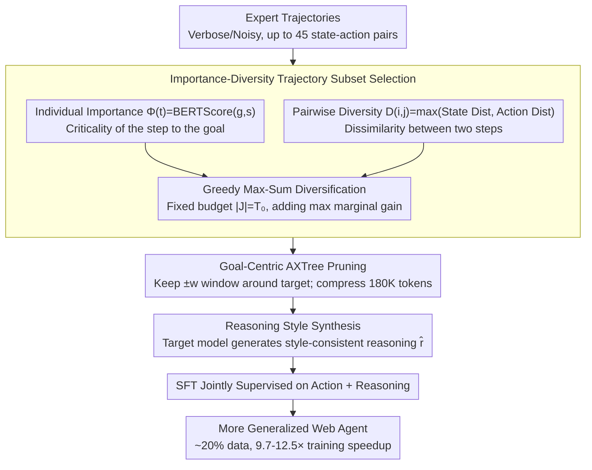

# Weasel: Achieving Out-of-Distribution Generalization for Web Agents via Importance-Diversity Data Selection

**Conference**: ICML 2026  
**arXiv**: [2605.20291](https://arxiv.org/abs/2605.20291)  
**Code**: https://github.com/fatemehpesaran310/weasel  
**Area**: LLM Agent / Web Agent  
**Keywords**: Data Selection, Web Agent, OOD Generalization, Trajectory Curation, Training Efficiency

## TL;DR
By combining goal-relevance and diversity in a trajectory step selection method, Weasel reduces training data to 20% of the original, achieving 9.7-12.5x training speedup and significantly improving Web Agent generalization on unseen domains.

## Background & Motivation

**Background**: LLM-driven Web Agents have progressed through large-scale instruction data and strong base models. However, most research evaluates agents within benchmarks, failing to test true generalization capabilities.

**Limitations of Prior Work**: (1) Agent performance drops significantly on websites or interaction patterns outside the training distribution; (2) Offline web interaction data is often verbose and noisy, with expert trajectories containing many redundant steps; (3) In AgentTrek, a single trajectory can reach 45 state-action pairs, and the Accessibility Tree (AXTree) for each web state can reach up to 180K tokens.

**Key Challenge**: Selecting a data subset that is both relevant and diverse within a limited budget is an NP-hard problem.

**Goal**: Design a trajectory selection method that simultaneously optimizes (1) Out-of-Distribution (OOD) generalization and (2) reduction of computational costs.

**Key Insight**: Model trajectory curation as a constrained optimization problem, combining goal-conditioned importance and pairwise diversity, and solving it efficiently using a greedy algorithm.

**Core Idea**: Balance individual importance scores with pairwise diversity distances to select information-dense subsets from long trajectories, achieving low data usage, high efficiency, and strong generalization.

## Method

### Overall Architecture

Weasel decomposes the problem of "training better generalizing Web Agents with less data" into a pipeline: first, picking a subset of steps from noisy expert trajectories that are both relevant and diverse; next, performing goal-centric pruning on the web states of retained steps to remove irrelevant context; finally, adding a layer of style-consistent reasoning for reasoning-native models. These three steps address "what to select," "how much to keep," and "how to train," allowing the model to match or exceed full fine-tuning performance with approximately 20% of the data.

### Key Designs

**1. Importance-Diversity Trajectory Subset Selection: Modeling Curation as Max-Sum Diversification**

Expert trajectories often contain 45 state-action pairs, most of which are redundant scrolling or repeated operations. Greedy selection based solely on relevance leads to clusters of similar states that fail to cover heterogeneous web pages and interaction patterns. Weasel defines two types of scores for each step: individual importance $\Phi(t) = \text{BERTScore}(g, s_t)$ measures how critical a step is to the goal, and pairwise diversity $D(i,j) = \max(\delta(s_i, s_j), \delta(y_i, y_j))$ measures the difference between states and actions. The objective is to maximize $\max_J \sum_{j\in J} \Phi(j) + \lambda \sum_{i<j,\, i,j\in J} D(i,j)$ given a budget $|J| = T_0 \ll T$, where $\lambda$ balances importance and diversity. This is an NP-hard max-sum diversification problem. Weasel solves it greedily by first picking the highest-scoring pair and iteratively adding the element with the maximum marginal gain $i_m = \arg\max_{k \notin J_{m-1}} \Phi(k) + \lambda \sum_{i \in J_{m-1}} D(k,i)$. Empirically, the greedy solution falls within the top 1% of optimal solutions for 99.7% of trajectories, with an approximation ratio of $0.9999 \pm 0.0005$.

**2. Goal-Centric AXTree Pruning: Retaining Local Context Around the Target Action**

A linearized Accessibility Tree (AXTree) for a single webpage in AgentTrek can reach 180K tokens. Including the full tree is slow and dilutes signals. Weasel uses the annotated target action position from the trajectory for pruning: given a linearized node sequence $V_t$ and target node position $k_t^*$, it retains a continuous node window of size $2w+1$ centered at $k_t^*$. For actions like "goto" that do not point to a specific node, it defaults to a fixed-length prefix. This significantly compresses tokens and provides a 2x speedup. Ablations show that success rate decreases almost linearly as the window shifts away from the target, confirming that information density is highest near the goal.

**3. Reasoning Style Synthesis: Aligning Training Data with Reasoning-Native Models**

Models like Qwen3 have acquired fixed reasoning styles during pre-training. Using heterogeneous reasoning traces generated by other models can cause style mismatch and hurt generalization. Weasel allows the target model to complete the reasoning itself. For each selected step $t \in J^*$, the target model generates reasoning $\hat{r}_t$ consistent with its own style, based on goal $g$, history $h_t$, pruned state $\tilde{s}_t$, and action $a_t$. The model is then trained with joint supervision: $\max_\theta \sum_{\tau \in \mathcal{D}} \sum_{t \in J^*(\tau)} \log \pi_\theta(a_t, \hat{r}_t \mid g, h_t, \tilde{s}_t)$. This synthesis step increased success rates from 17.0% to 21.2% in ablations, representing the primary source of gain.

## Key Experimental Results

### Main Results

| Dataset | Model | Training Config | WebArena-Lite | WebArena | MiniWob | Speedup |
|---------|-------|-----------------|---------------|----------|---------|---------|
| AgentTrek | Qwen2.5-7B | Full (52K) | 10.9 | 8.7 | 44.6 | 1.0× |
| AgentTrek | Qwen2.5-7B | Weasel (10K) | 14.5 | 9.5 | 48.0 | 11.3× |
| AgentTrek | Gemma3-4B | Full (52K) | 9.1 | 4.3 | 28.6 | 1.0× |
| AgentTrek | Gemma3-4B | Weasel (10K) | 11.5 | 5.5 | 30.6 | 12.5× |
| AgentTrek | Qwen3-8B | Full (52K) | 17.7 | 18.2 | 59.4 | 1.0× |
| AgentTrek | Qwen3-8B | Weasel (10K) | 21.2 | 19.2 | 61.9 | 10.7× |

### Ablation Study

| Method | Data Selection | Reasoning Synthesis | WebArena-Lite |
|--------|----------------|---------------------|---------------|
| Base Qwen3-8B | ✗ | ✗ | 16.4 |
| SFT (Random) | ✗ | ✗ | 16.5 |
| SFT + Reasoning Synthesis | ✗ | ✓ | 18.2 |
| Weasel w/o Reasoning Synthesis | ✓ | ✗ | 17.0 |
| **Weasel (Full)** | **✓** | **✓** | **21.2** |

### Key Findings
- Consistently outperforms full-data SFT across three LLMs with 9.7-12.5x training speedup, matching or exceeding full fine-tuning with 20% data.
- Necessity of Diversity: Using only state diversity (9.7%) or only action diversity (13.9%) is inferior to the combined approach (14.5%).
- Importance-Diversity Balance: Using only importance (10.9%) or only diversity (7.9%) is less effective than the balanced approach (14.5%).
- Cross-Domain Transfer: In the AITW Android GUI setting, a 3.1K subset outperformed random sampling (5.8% → 6.6%).

## Highlights & Insights
- **Elegant Problem Formulation**: Abstracting selection as max-sum diversification provides both theoretical justification (greedy approximation guarantees) and practical efficiency.
- **Multi-dimensional Diversity**: Simultaneously considers diversity in both state and action spaces.
- **Insight on Style Matching**: Discovered the sensitivity of reasoning-native models to training data style, pushing performance from 17% to 21%.
- **End-to-End Solution**: Data selection, state pruning, and reasoning adaptation form a complete workflow.

## Limitations & Future Work
- Greedy algorithm theoretical guarantees do not apply to pseudo-distances (non-metrics), serving only as a heuristic.
- Improvements in multimodal GUI experiments are modest (5.8% → 6.6%); vision-dominant scenarios require further optimization.
- BERTScore scoring may itself be biased.
- Future work: Explore learned importance/diversity weights; integrate in-context learning; study more flexible style adaptation for reasoning models.

## Related Work & Insights
- **vs WebRL / WebAgent-R1**: Online RL vs. offline data curation; Weasel avoids environment rollout costs.
- **vs General Data Selection**: General methods focus on model-independent sample representativeness; Weasel designs goal-conditioned importance for web agents.
- **vs State Pruning**: Prior work (e.g., Lee et al.) uses learned modules or retrieval; Weasel is a lightweight, parameter-free design.
- **vs Instruction Tuning**: Preference optimization targets alignment; Weasel optimizes both generalization and efficiency.

## Rating
- Novelty: ⭐⭐⭐⭐⭐  First to introduce max-sum diversification to web agent data selection.
- Experimental Thoroughness: ⭐⭐⭐⭐⭐  3 LLMs + multiple benchmarks + cross-domain validation + comprehensive ablation.
- Writing Quality: ⭐⭐⭐⭐⭐  Clear structure and rigorous formalization.
- Value: ⭐⭐⭐⭐⭐  Directly contributes to practical web agent deployment.

<!-- RELATED:START -->

## Related Papers

- [\[ICML 2026\] Self-evolving LLM agents with in-distribution Optimization](self-evolving_llm_agents_with_in-distribution_optimization.md)
- [\[ICML 2026\] It's a TRAP! Task-Redirecting Agent Persuasion Benchmark for Web Agents](its_a_trap_task-redirecting_agent_persuasion_benchmark_for_web_agents.md)
- [\[AAAI 2026\] AutoTool: Efficient Tool Selection for Large Language Model Agents](../../AAAI2026/llm_agent/autotool_efficient_tool_selection_for_large_language_model_agents.md)
- [\[ICLR 2026\] Web-CogReasoner: Towards Multimodal Knowledge-Induced Cognitive Reasoning for Web Agents](../../ICLR2026/llm_agent/web-cogreasoner_towards_multimodal_knowledge-induced_cognitive_reasoning_for_web.md)
- [\[ICLR 2026\] From Single to Multi-Granularity: Toward Long-Term Memory Association and Selection of Conversational Agents](../../ICLR2026/llm_agent/from_single_to_multi-granularity_toward_long-term_memory_association_and_selecti.md)

<!-- RELATED:END -->
