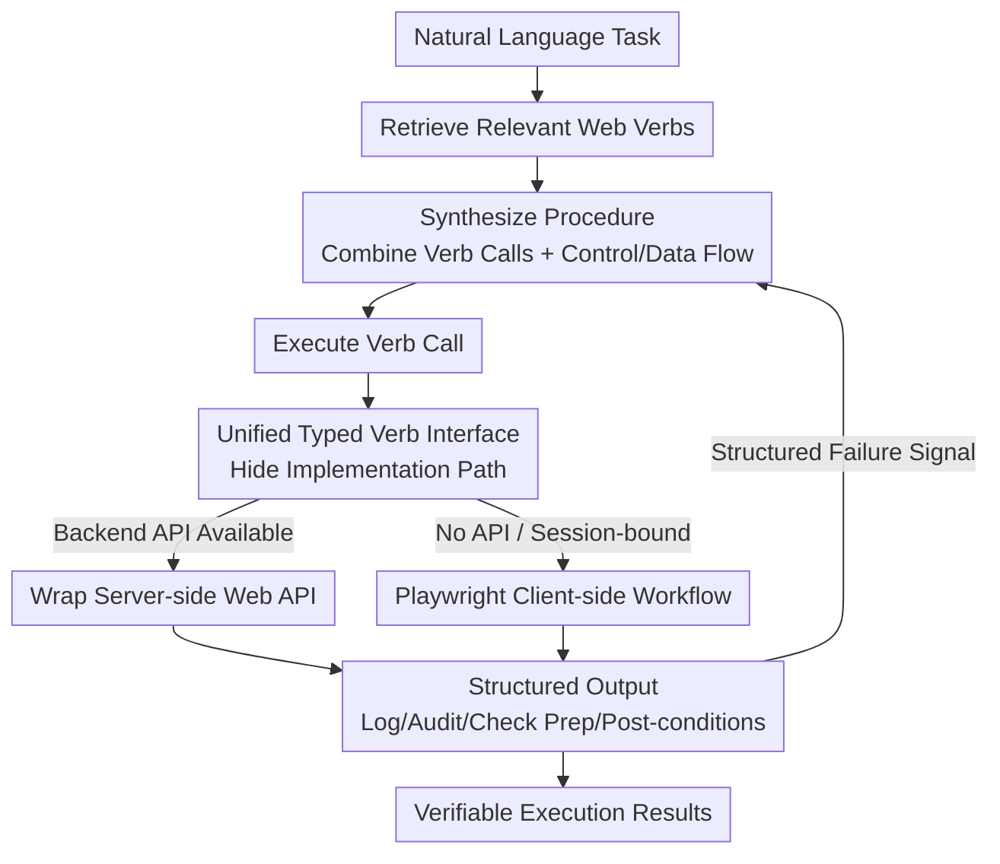

# Web Agents Should Use Typed Actions Instead of Click-Based Browsing

**Conference**: ICML2026  
**arXiv**: [2602.17245](https://arxiv.org/abs/2602.17245)  
**Code**: https://github.com/nlweb-ai/MSR-Web-Verbs  
**Area**: Web Agent / LLM Agent (Position Paper)  
**Keywords**: Web Agent, Typed Actions, Semantic Layer, Web Verbs, Verifiable Execution  

## TL;DR
This position paper argues that building a reliable "agentic web" requires more than just scaling models; websites must expose common web operations as **typed actions with signatures**—specifically designed as **web verbs**. These verbs consist of structured functions with defined inputs/outputs and documented behaviors, regardless of whether the implementation is a server-side API or a client-side browser workflow. By synthesizing tasks into short, auditable programs with explicit control/data flow on this layer, agents become significantly more reliable, efficient, and verifiable than those relying on low-level "click + keyboard + DOM" primitives.

## Background & Motivation
**Background**: The Web is transitioning from a platform for "human browsing" to one for "software execution." With the maturation of Large Language Models (LLMs), delegating open tasks (booking flights, shopping, filing applications) via natural language has become increasingly feasible, making the "agentic web" a central focus of agent research. Current mainstream agents interact with pages via two paradigms: **browser agents** (perceiving DOM/screenshots and executing low-level GUI primitives like click, type, scroll, and navigate) and **API agents** (invoking structured inputs and outputs via server-side Web APIs when available).

**Limitations of Prior Work**: In real-world environments, web automation is often brittle, slow, and difficult to audit, particularly for long-horizon, cross-site workflows. The root cause is the reliance on **low-level interaction primitives**: these action abstractions are too granular and carry minimal semantic information. Consequently, agents are forced to construct long, fragile trajectories where every small step requires re-perception and re-planning. This results in execution processes where intent and correctness are hard to verify or reproduce. Data shows that top systems on WebArena, such as IBM CUGA, reach a success rate of 0.617 on average but drop to 0.354 for cross-site tasks (despite these tasks involving fewer records).

**Key Challenge**: Many works treat web interaction as "learning better policies over the same low-level primitives," which faces a structural ceiling. Without stable, typed actions with clear semantics, agents will perpetually struggle to re-discover fragile, site-specific click sequences rather than synthesizing correct, checkable workflows. Furthermore, server-side Web APIs often cover only part of a workflow (supporting search/query while "task completion" steps like checkout, seat selection, or cancellation are often bound to interactive web flows and browser session states).

**Goal**: To argue that the "agentic web requires a semantic layer exposing typed actions," provide a concrete and actionable design (web verbs), and address various objections while outlining the roadmap for standardization and toolchains.

**Key Insight**: The authors draw an analogy to programming languages: typed actions are to low-level interaction primitives what high-level languages are to assembly. High-level languages allow developers to write structured programs without managing every register and instruction; web verbs allow agents to construct workflows without reasoning about every click and keystroke. While underlying operations remain precise, the unit of reasoning for the agent is elevated.

**Core Idea**: Encourage websites to expose high-value web operations as "typed, semantically documented, composable, and auditable" verbs. Agents synthesize tasks into short programs at the verb layer—effectively replacing "learning better low-level policies" with "raising the level of abstraction."

## Method

### Overall Architecture
The proposed workflow operates on two sides: the **website side** publishes and indexes common web operations as web verbs (each with typed inputs, structured outputs, and documented behaviors); the **agent side** retrieves relevant verbs and composes them into executable programs (procedures). A verb can be implemented in two ways: wrapping an existing backend API or using browser automation tools like Playwright to encapsulate a robust client-side workflow. However, the agent always interacts with a unified typed verb interface, making "API vs. browser script" an implementation detail. After receiving structured output, the agent can pass results between verbs and explicitly encode task logic using conditional branches and loops, producing checkable and reproducible execution trajectories.

### Key Designs

**1. Web Verb Abstraction: Encapsulating Multi-step Operations into a Typed Function Call**

This is the central unit of the paper, addressing the "thin semantics and brittle trajectories" of low-level primitives. A web verb is a high-level, typed, function-like interface that explicitly defines its **inputs, outputs, and expected behavior**. Unlike clicks or typing, its meaning is not tied to coordinates, element states, or UI styles. The authors define a minimum contract for verbs: semantic clarity (intent described in natural language), typed parameters (named and typed inputs), structured results (outputs as structured objects/records, eliminating ad-hoc parsing), composability (easy to link via data/control flow), and auditability (inputs/outputs suitable for logging and inspection). For example, a Google Maps `get_direction` verb takes a source/destination and returns a structured object with travel time, distance, and route; internally, it might use Playwright to "input location -> select driving -> read data," but for the agent, it is a single typed call.

**2. Unified Verb Layer: Hiding APIs and Client-side Workflows Behind One Interface**

The pain point is that many critical workflows lack a single public API (due to session states, login requirements, or confirmation pages), while pure browser scripts are brittle and non-reusable. The design proposes that all verbs for a site form its agent-facing **semantic layer (verb layer)**. This presents a unified typed interface externally while allowing dual implementation paths internally. This clarifies that "web verbs are not just repackaged public APIs"—APIs are developer-facing products with specific access models and support obligations, whereas web verbs are agent-facing typed actions. For browser-based verb implementations, the authors argue that while current automation stacks may not be perfect, they provide a feasible path for existing sites by moving fragile interaction logic into **testable, hardened, versioned, and reusable implementations**, shifting work from "on-the-fly reasoning by every agent" to "shared offline engineering."

**3. Programmatic Composition over Verbs: Making Task Logic Explicit as Code**

With verbs as an abstraction layer, tasks are no longer a sequence of predicted low-level primitives. Instead, agents generate **explicit programs** composed of verb calls. Since each verb has clear parameters and structured returns, the program can pass the output of one verb to a subsequent call, perform transformations, or set conditions for later steps. Composition is not limited to linear flows; it includes conditional branches (the next step depends on intermediate results) and loops (repeating a verb over a set). These branches and iterations are encoded directly in the program rather than decided step-by-step during execution. This contrasts with browser agents that "repeatedly observe status and predict the next low-level action." The agent's role shifts from "predicting primitive steps" to "synthesizing structured programs that preserve task logic." Programmatic composition does not eliminate runtime adaptation—well-designed verbs can internally handle retries or UI variances; if an unexpected event occurs, the verb returns a **structured failure/recovery signal**, allowing the agent to re-plan at the verb layer or fallback to low-level primitives if necessary.

### Comprehensive Example
The paper compares "verb composition" with "low-level trajectories" using real tasks from a prototype evaluation (where verbs were implemented for over ten sites, successfully completing 100+ complex tasks).

**Travel Planning**: A user wants museum and hotel recommendations for Anchorage, sorted by the "sum of distances from each candidate hotel to every selected museum." With verbs, the task naturally splits: first using a wrapped NLWeb `ask` verb to return structured entities (names/locations), then using `get_direction` for structured distance data. The agent synthesizes a **nested loop program**: the outer loop iterates through hotels, the inner loop through museums, accumulating distances before sorting. Using low-level primitives, the browser agent failed to calculate the requested sum; instead, it strung museums into a single multi-stop route and used the total route length as the distance. The output looked plausible but **answered the wrong question**. The failure was not a missed click, but a mismatch between the user's requested calculation and the UI's execution.

**Furniture Shopping**: A user moving to a new home needs to buy one item per category (bed, desk, chair, etc.) within a $1000 total budget while maximizing an overall objective. Using verbs, the agent retrieves structured candidates with prices and ratings, reducing the problem to a standard selection problem. It then synthesizes a program to search candidate combinations and return the highest-scoring configuration within budget. Using low-level primitives, the browser agent defaulted to a **greedy** approach: selecting items one by one until the budget was exceeded, leaving several categories empty and skipping cheaper alternatives that would have satisfied the constraints. The common lesson: low-level trajectories easily lose constraints or alter calculations over long sequences, whereas verb composition keeps task logic explicit and verifiable.

## Key Experimental Results

As a position paper, this work focuses on **representative case studies and prototyping evidence** rather than large-scale benchmark leaderboard climbing.

### Case Comparison

| Task | Requested Calculation | Web Verb Composition | Low-level Primitive Trajectory |
|------|------|------|------|
| Travel Planning | Sort hotels by sum of distances to all museums | Nested loops: Accumulate pairwise distances then sort (Correct) | Museums linked as stops on one route; total route length used (**Answered wrong question**) |
| Furniture Shopping | Maximize total score for one item per category under $1000 budget | Search combinations, calculate total price/score, return optimal set | Greedy selection until budget exceeded; left categories empty (**Failed global optimization**) |

### Evidence & Claims

| Dimension | Issues with Low-level Primitives | Improvements at Verb Layer |
|------|------|------|
| Reliability | Actions tied to coordinates/styles; thin semantics; error accumulation across sites (CUGA cross-site: 0.354) | Stable semantics; logic does not drift with UI details |
| Efficiency | Task expands to hundreds of steps; each requires perception + reasoning + tool calls | Collapsed into a few reusable typed calls; maintenance cost amortized across agents |
| Verifiability | Trajectory is opaque; difficult to check or reproduce | Explicit I/O allows logging, auditing, and adding pre/post-conditions or policy tags |

### Key Findings
- **Prototype Scale Evidence**: Implementing verbs for 10+ sites and testing 100+ complex tasks resulted in total success, demonstrating the feasibility of the verb layer on real websites.
- **Failures are "Calculation Errors," not "Interaction Errors"**: In the case studies, the low-level primitive failures were not due to clicking the wrong button, but due to **semantic drift**, where the user's requested logic was lost when translated into long UI sequences.
- **Cross-site Tasks are a Major Weakness for Primitives**: The drop in CUGA performance (0.617 to 0.354) on cross-site tasks supports the claim that low-level interactions cannot handle the pressure of multi-site composition.

## Highlights & Insights
- **The "High-level Language vs. Assembly" analogy is highly explanatory**: It clearly explains why raising the abstraction level improves reliability, efficiency, and verifiability—the underlying operations remain precise, but the agent's unit of reasoning changes.
- **Demoting "API vs. Browser Script" to an implementation detail is crucial**: Since many critical workflows are session-bound and lack public APIs, a unified verb interface allows for immediate feasibility on existing sites while remaining compatible with long-term standardization.
- **Verifiable Execution** is often overlooked in agent research but is critical for real-world deployment. Verb calls are naturally auditable, transforming "opaque trajectories" into "interpretable sequences of action calls," which is a requirement for high-stakes or compliant environments.
- **The economic perspective of "shifting runtime discovery costs to one-time offline engineering"** is pragmatic. Rather than having every agent encounter the same pitfalls at runtime, the workflow is hardened into a well-maintained shared implementation.
- The authors honestly address objections (whether stronger models are enough, coverage issues, and adoption barriers), admitting that typed actions may not cover the entire Web initially, but arguing that reliable coverage of high-frequency, high-consequence operations is a necessary first step.

## Limitations & Future Work
- **Position Paper Nature**: The evidence relies heavily on representative cases and prototypes rather than large-scale, reproducible benchmark comparisons. The "100+ tasks all successful" claim lacks a quantitative baseline comparison under a unified protocol.
- **Coverage concerns**: The long tail of web tasks is vast, and typed actions can only cover a fraction initially. The authors argue that tail tasks decompose into recurring operations, but this remains a hypothesis rather than an empirical proof.
- **Adoption Barriers**: Web verbs face the same resistance as public APIs regarding "who implements/maintains them" and "incentives." The paper optimists that developers will have a natural incentive once agents become a primary way to access the web.
- **Dependency on Automation Stacks**: Verbs implemented via browser backends still rely on current automation tools. Brittleness is moved to the maintenance layer rather than being eliminated entirely.
- **Future Work**: Standardization of verb discovery and versioning protocols, developer toolchains, and community-driven processes for verb implementation are required for scale.

## Related Work & Insights
- **vs. Browser Agents (e.g., WebArena, CUGA)**: These focus on learning better GUI grounding and long-horizon control on DOM/screenshots. This paper argues that "changing the interface" is more fundamental than "improving the policy," as failures stem from the structure of long stateful trajectories.
- **vs. API Agents**: Public APIs often only cover search/query. Web verbs bridge the gap to "task-completion" steps (checkout, cancel) that are otherwise bound to browser sessions.
- **vs. NLWeb (Microsoft, 2025)**: NLWeb uses a semantic layer to help agents "know" web content (via RSS, Schema.org). While NLWeb defines what an agent **knows**, the web verb proposal defines what an agent **can do**.
- **vs. Screen Scraping/Macros**: Web verbs are related but focus on exposing workflows through agent-oriented typed interfaces rather than standalone scripts, making them composable and auditable.

## Rating
- Novelty: ⭐⭐⭐⭐ The stance on replacing low-level primitives with a typed semantic layer is sharp, supported by a strong programming language analogy.
- Experimental Thoroughness: ⭐⭐⭐ Strong case studies and prototype evidence, but lacks quantitative benchmark comparisons against strong baselines.
- Writing Quality: ⭐⭐⭐⭐⭐ Excellent structure; logically addresses objections and maintains a high level of clarity and honesty.
- Value: ⭐⭐⭐⭐ Provides a practical direction (semantic layers/typed actions) for the agentic web, with real significance for building reliable web automation.

<!-- RELATED:START -->

## Related Papers

- [\[ACL 2026\] Don't Click That: Teaching Web Agents to Resist Deceptive Interfaces](../../ACL2026/llm_agent/dont_click_that_teaching_web_agents_to_resist_deceptive_interfaces.md)
- [\[ICML 2026\] Position: Agentic AI Orchestration Should Be Bayes-Consistent](position_agentic_ai_orchestration_should_be_bayes-consistent.md)
- [\[ACL 2025\] Browsing Like Human: A Multimodal Web Agent with Experiential Fast-and-Slow Thinking](../../ACL2025/llm_agent/browsing_like_human_a_multimodal_web_agent_with_experiential_fast-and-slow_think.md)
- [\[ICML 2026\] Hunt Instead of Wait: Evaluating Deep Data Research on Large Language Models](hunt_instead_of_wait_evaluating_deep_data_research_on_large_language_models.md)
- [\[ICML 2026\] MacArena: Benchmarking Computer Use Agents on an Online macOS Environment](macarena_benchmarking_computer_use_agents_on_an_online_macos_environment.md)

<!-- RELATED:END -->
## Related Papers

- [\[ACL 2026\] Don't Click That: Teaching Web Agents to Resist Deceptive Interfaces](../../ACL2026/llm_agent/dont_click_that_teaching_web_agents_to_resist_deceptive_interfaces.md)
- [\[ICML 2026\] Position: Agentic AI Orchestration Should Be Bayes-Consistent](position_agentic_ai_orchestration_should_be_bayes-consistent.md)
- [\[ICML 2026\] Hunt Instead of Wait: Evaluating Deep Data Research on Large Language Models](hunt_instead_of_wait_evaluating_deep_data_research_on_large_language_models.md)
- [\[ACL 2025\] Browsing Like Human: A Multimodal Web Agent with Experiential Fast-and-Slow Thinking](../../ACL2025/llm_agent/browsing_like_human_a_multimodal_web_agent_with_experiential_fast-and-slow_think.md)
- [\[ICML 2026\] MacArena: Benchmarking Computer Use Agents on an Online macOS Environment](macarena_benchmarking_computer_use_agents_on_an_online_macos_environment.md)

<!-- RELATED:END -->
