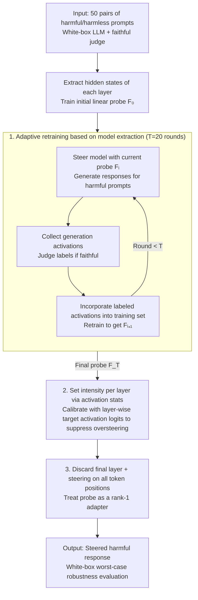

# Adaptive Probe-based Steering for Robust LLM Jailbreaking

**Conference**: ICML 2026  
**arXiv**: [2605.20286](https://arxiv.org/abs/2605.20286)  
**Code**: https://github.com/fhdnskfbeuv/adaptiveSteering  
**Area**: LLM Security / Red Teaming  
**Keywords**: LLM Jailbreaking, representation intervention, probe steering, adaptive retraining, robustness evaluation  

## TL;DR
This paper transforms probe-based contrastive steering into a more powerful white-box red-teaming tool. By using adaptive retraining to correct biased probes and automatically setting steering intensity via activation statistics, it significantly exposes the jailbreak vulnerabilities of fortified LLMs.

## Background & Motivation
**Background**: Aligned LLMs typically refuse harmful requests. Safety evaluation requires strong attacks to estimate worst-case robustness. Prompt-level jailbreaks, gradient optimization, fine-tuning attacks, and hidden state steering have been used for red-teaming. The advantage of contrastive steering is that it only requires forward passes and a set of contrastive prompts, without depending on target responses or input gradients.

**Limitations of Prior Work**: Existing steering methods have two key sources of instability. First, direction search relies on a small number of "harmful/harmless" contrastive prompts; these prompts do not only encode "compliance/refusal" but also mix in coupled directions like ethics, topics, and writing styles. The learned linear probe may deviate from the true jailbreak behavior direction. Second, steering intensity often requires manual tuning or applies a uniform logit target to all layers. However, the activation norms of different layers vary significantly, and uniform intensity can easily lead to oversteering in early layers and subsequent response collapse.

**Key Challenge**: Strong safety evaluation requires sufficiently powerful attacks, otherwise defense capabilities will be overestimated. However, the stronger the steering, the easier it is to damage linguistic capabilities or generate incoherent content. This paper addresses the contradiction where "the direction must be closer to the target behavior, yet the intensity cannot rely on brute-force manual tuning."

**Goal**: The authors aim to improve the attack effectiveness and cross-model robustness of probe-based steering against fortified LLMs without extra contrastive prompt collection, backpropagation, or manual searching for per-layer intensity.

**Key Insight**: The paper views the direction search of the probe as model extraction: the ideal probe is an invisible behavior discriminator, and existing contrastive prompts only provide biased samples. If the model can generate new activations under the current steering, which are then labeled by a judge, it can iteratively approximate a more reliable direction.

**Core Idea**: Use "adaptive activation retraining with judge labeling" to correct the steering direction, and "statistics of contrastive activations in the same layer" to automatically set the target intensity for each layer.

## Method
The goal of this paper is not to construct new prompt templates but to improve probe-based steering under a white-box threat model where hidden states are accessible. The method retains the basic form of contrastive steering: adding a vector along the probe direction to the hidden state of certain Transformer layers to move the model state closer to the target behavior region. The modifications focus on two points: how the direction is learned and how far to push each layer.

### Overall Architecture
The input includes a few pairs of harmful/harmless contrastive prompts, a white-box LLM, and an evaluator to judge if the response is "faithful to the harmful request." First, the method extracts hidden states from the contrastive prompts and trains a linear probe for each layer to obtain an initial direction. Then, it enters adaptive retraining: steering the model on harmful prompts using the current probe, collecting activations during generation and corresponding responses, labeling them via the judge, and incorporating these new activations into the training set to retrain the probe. Finally, during inference, instead of manually setting a uniform intensity, an adaptive target is set for each layer based on the probe logit statistics of target behavior activations in the training set, applying steering to all token positions.

### Key Designs

**1. Model extraction-based adaptive retraining: Turning "direction search" into active approximation of an ideal discriminator.** Initial probes can only be trained with harmful/harmless contrastive prompts, but these prompts simultaneously encode coupled directions like ethics, topics, and style. The learned direction is actually a "faithful discriminator $\times$ noise discriminator," and the direction bias is non-negligible. The authors point out that simply stacking more contrastive prompts continues to introduce these coupled dimensions. The key observation is that direction search is essentially model extraction—the ideal probe $f^*$ is invisible, but a reliable jailbreak judge can be used as a proxy labeler. The method thus converts steering into an iterative process: in the $i$-th round, it steers the model using $F_i$, generates responses for harmful prompts, collects intermediate activations, uses the judge to label these activations as faithful or not, and incorporates them into the training set to obtain $F_{i+1}$ ($T=20$ rounds for main experiments). A detail is that the target intensity is set to $s^{(l)}=0$ during retraining, making the steered activations fall exactly near the decision boundary of the current probe—this follows the logic of active learning / adaptive retraining, where sampling "samples the classifier is most uncertain about" is more efficient than random sampling, concentrating the direction refinement on the subspace that truly controls behavior.

**2. Adaptive intensity setting based on activation statistics: Replacing uniform logit targets with the scale of target activations in the same layer.** Probe steering requires an intensity for each layer to push the hidden state to a certain probe logit target. Manual per-layer tuning is a tedious task of $L$ continuous parameters, and existing methods using a uniform target across layers ignore the fact that the $L_2$ norms of activations differ by several orders of magnitude (small in early layers, large in late layers). A uniform target causes layers with small norms to suffer relatively excessive perturbation, i.e., oversteering, leading to generation collapse. The method instead uses the logit of the target activation $\mathbf{y}_i^{(l)}$ in the same layer to set $s^{(l)}=\mathbf{w}^{(l)}\cdot\mathbf{y}_i^{(l)}+b^{(l)}$: since the norm magnitudes of activations in the same layer are similar ($\|\mathbf{y}_i^{(l)}\|_2\approx\|\mathbf{x}_i^{(l)}\|_2$), the norm ratio between the steering vector and the original activation simplifies to $\cos\theta_{wy}-\cos\theta_{wx}$, a quantity that only depends on direction and is independent of activation magnitude. This automatically calibrates the intensity using the "scale of the true target activation in that layer," eliminating manual tuning and fundamentally avoiding oversteering, while also allowing the removal of the unstable accuracy-based layer selection.

**3. Discarding final layer + steering on all token positions: Engineering corrections for two overlooked pitfalls.** These two points are categorized as "other implementation details" in the paper but significantly impact attack effectiveness on fortified models. First, the activation of the final decoder layer directly connects to the unembedding, approximating a logit bias; intervening here easily induces Repetition and only affects the current step without participating in subsequent auto-regression, being a local intervention. Thus, the method discards the final layer. Second, previous works often only steered response tokens because the direction was learned from response token positions. However, if the steering vector is viewed as part of the LLM weights, it is essentially a rank-1 LoRA with a fixed bias and should act on all token positions. Modifying only response tokens allows the representations manipulated by defense methods (like Circuit Breaker or RepBend) in the prompt tokens to continue dominating generation, weakening the attack. After steering all token positions, the effectiveness on such capability-degradation defenses recovers significantly.

### Loss & Training
The probe itself is trained using linear classification, with samples from initial contrastive activations and subsequent adaptively labeled activations. The direction search uses 100 pairs of contrastive prompts, where 50 pairs are used for training/iteration and 50 harmful prompts are used for validation to select the best direction. The evaluation phase uses 200 harmful prompts from StrongReject and HarmBench; judges include SRF, StrongReject rubric judge, and HarmBench classifier, with scores normalized from 0 to 1. The paper positions this method as a red-teaming robustness evaluation tool, aiming to reveal the worst-case vulnerability of defense models under white-box hidden state intervention.

## Key Experimental Results

### Main Results
The main experiment covers 12 fortified LLMs specifically designed to prevent jailbreaking and reports harmfulness scores from three judges. The table below retains average results and several representative models.

| Method | Representative Results | Average harmfulness | Relative Conclusion |
|--------|------|------|----------|
| RepE | Most models near 0 | 0.02 | Traditional representation engineering basically cannot break strong defenses |
| SCAV | Gemma-DA reaches 0.38/0.47/0.64, but most near 0 | 0.05 | Original probe steering lacks robustness |
| RD-A | Stronger on Gemma-DA, Llama3-RB | 0.24 | Ablation steering is effective but unstable in coverage |
| RD-C | Effective on some models | 0.18 | Constant strength still requires tuning and is unstable across models |
| Angular | R2D2, Llama3-DeRTA show some effect | 0.13 | Direction improvement does not equal intensity robustness |
| **Ours** | Llama2-DA 0.57/0.86/0.85, Llama3-RB 0.71/0.86/0.98, Llama3-CB 0.70/0.83/0.91 | **0.70** | Adaptive direction and intensity significantly enhance worst-case evaluation strength |

### Ablation Study
The paper ablates intensity setting, layer selection, token position, and model extraction. The core trends are summarized below.

| Configuration | Key Metric | Description |
|------|---------|------|
| SCAV | Average 0.05 | Original probe steering mostly stays at near-zero harmfulness |
| SCAV + AS | Average 0.14 | Adaptive intensity pulls models like Llama2-DA and Vicuna-SU out of the zero zone |
| SCAV + AS + DLA | Average 0.29 | Discarding the last layer reduces logit-bias style intervention, improving coherence and effectiveness |
| Add SAT | Average increase of ~15% | Steering all token positions, especially improving CB/RB series |
| Naive Augmentation | Max average +6% | Simply adding more contrastive prompts has limited gains due to coupled concept directions |
| **Adaptive Retraining** | **Average ~+26%** | Adaptive activations labeled by the judge correct probe directions more effectively |
| R2D2 Improvements | Increase from 0.31/0.41/0.64 up to 0.74/0.87/0.81 | Filtering samples that don't follow benign prompts and using response token activations handles capability-degradation defenses |

### Key Findings
- The strongest evidence is the average harmfulness on fortified LLMs increasing from near-zero to 0.70, indicating that models previously appearing robust still share significant vulnerabilities under stronger white-box steering evaluations.
- Adaptive intensity provides the baseline gain, while model extraction-style retraining provides the main gain. The former addresses "how far to push," and the latter addresses "where to push."
- The analysis of R2D2 reminds safety evaluators to distinguish between "true safety" and "general unwillingness to answer." If a model cannot even follow benign prompts normally, low harmfulness does not directly equate to high safety.

## Highlights & Insights
- Interpreting probe direction learning as model extraction is highly insightful. It clarifies that the problem with contrastive prompts is not just their small quantity, but that they naturally entangle multiple conceptual directions.
- Activation scale variance across layers is a frequently overlooked detail in steering. This paper replaces uniform intensity with target activation statistics, making the method resemble a layer-wise calibrated adapter rather than a crude vector addition.
- The implications for defense papers are direct: if evaluation only uses weak attacks, it is easy to reach over-optimistic robustness conclusions. Red-teaming requires continuous updates to attack strength, especially checking white-box representation interventions.

## Limitations & Future Work
- The threat model is strong, requiring the attacker to access and modify hidden states at every layer, making it primarily suitable as a white-box safety evaluation tool rather than representing the real capabilities of average API users.
- Direction learning relies on an LLM judge, which may be affected by judge bias. Although the authors use multiple judges for evaluation, the training phase still mainly relies on SRF.
- The paper focuses on harmfulness enhancement and provides less discussion on how defenders can design robust training or detection mechanisms against this steering attack.
- This method reveals "whether harmful behavior patterns that can be activated still remain inside the model." Future work could combine this with mechanistic interpretability and safety fine-tuning to locate layers and representation subspaces where defenses fail.

## Related Work & Insights
- **vs Refusal Direction**: RD performs constant or ablation steering directly along the refusal direction. This work uses probe directions and adaptively sets layer intensities, making it more stable across models.
- **vs SCAV**: SCAV is also probe-based but relies on accuracy-based layer selection and uniform targets. This paper identifies these two points as sources of instability and oversteering, respectively.
- **vs prompt-level jailbreak**: Prompt attacks operate in discrete input space and may be limited by proxy objectives and search difficulties. This work operates directly on hidden states, better suited for white-box worst-case evaluation.
- **Insights for Defense Research**: Defense models should not be evaluated only at the text input level; hidden representations should also be checked for vulnerable behavior subspaces easily activated by linear directions.

## Rating
- Novelty: ⭐⭐⭐⭐☆ The combined modules are not entirely new, but the model extraction perspective and intensity calibration are valuable.
- Experimental Thoroughness: ⭐⭐⭐⭐⭐ Coverage of 12 fortified LLMs, multiple judges, and comprehensive ablations.
- Writing Quality: ⭐⭐⭐⭐☆ Motivation is clear, though tables are long and require effort to distill average trends.
- Value: ⭐⭐⭐⭐⭐ High practical significance for LLM safety red-teaming and robustness claims.

<!-- RELATED:START -->

<!-- RELATED:END -->

## Related Papers

- [\[ICML 2026\] Steering Beyond the Support: Adversarial Training on Unsupervised Jailbroken Activation Simulation](steering_beyond_the_support_adversarial_training_on_unsupervised_jailbroken_acti.md)
- [\[ACL 2025\] Don't Say No: Jailbreaking LLM by Suppressing Refusal](../../ACL2025/llm_alignment/dont_say_no_jailbreaking_llm_by_suppressing_refusal.md)
- [\[ICLR 2026\] Robust Preference Alignment via Directional Neighborhood Consensus](../../ICLR2026/llm_alignment/robust_preference_alignment_via_directional_neighborhood_consensus.md)
- [\[ICLR 2026\] AlphaSteer: Learning Refusal Steering with Principled Null-Space Constraint](../../ICLR2026/llm_alignment/alphasteer_learning_refusal_steering_with_principled_null-space_constraint.md)
- [\[ICLR 2026\] Ignore All Previous Instructions: Jailbreaking as a de-escalatory peace building practise to resist LLM social media bots](../../ICLR2026/llm_alignment/ignore_all_previous_instructions_jailbreaking_as_a_de-escalatory_peace_building_.md)

<!-- RELATED:END -->
