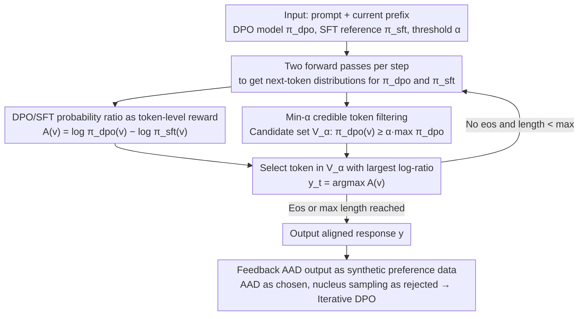

# Alignment-Aware Decoding

**Conference**: ICML 2026  
**arXiv**: [2509.26169](https://arxiv.org/abs/2509.26169)  
**Code**: https://github.com/ETH-DISCO/alignment-aware-decoding  
**Area**: LLM Alignment / Inference-time Decoding / DPO  
**Keywords**: alignment-aware decoding, DPO, inference-time alignment, token-level reward, preference optimization  

## TL;DR
Alignment-Aware Decoding (AAD) directly leverages the token probability ratio of a DPO model relative to an SFT reference model as an implicit alignment reward during inference. Without additional training or external reward models, it generates high-quality aligned responses more stably than greedy, Bo2, and EFT decoding, while also serving as a mechanism to generate synthetic preference data for iterative DPO improvement.

## Background & Motivation
**Background**: Mainstream LLM alignment is typically completed during the training phase. For instance, RLHF trains a reward model followed by PPO optimization, while DPO optimizes the model directly from chosen/rejected preference pairs. Once trained, most models are deployed using standard decoding methods such as greedy, sampling, or best-of-N.

**Limitations of Prior Work**: While DPO brings the model closer to preference data, it is inherently constrained by the prior of the SFT reference model. Theoretically, even if a response has a higher true reward, the DPO optimal policy might favor a lower-reward response if the SFT model's prior probability for the higher-reward one is sufficiently low. Consequently, standard decoding inherits the biases of the reference model and fails to fully exploit the fine-grained preference signals learned during DPO training.

**Key Challenge**: Preference optimization encodes "which token corresponds to a higher-preference response" into the probability difference between the DPO and SFT models. However, at inference time, if tokens are selected solely based on DPO probabilities, this alignment signal is often masked by linguistic fluency and the SFT prior. Conversely, directly maximizing the probability ratio can lead to the selection of rare, low-probability tokens, resulting in degenerate output.

**Goal**: The authors aim to design a simple, training-free inference-time alignment method that relies only on a standard SFT+DPO model pair. It should achieve better alignment than greedy DPO without requiring extra reward models, complex searches, or extensive hyperparameter tuning for each dataset.

**Key Insight**: The DPO objective can be interpreted as learning an implicit reward or a token-level advantage. AAD applies this interpretation directly to decoding: the DPO model determines the viability of candidate tokens, while the DPO/SFT probability ratio provides the alignment preference.

**Core Idea**: Within a set of tokens deemed "sufficiently likely" by the DPO model, select the token with the largest probability increase relative to the SFT model, thereby maximizing the implicit alignment reward while maintaining fluency.

## Method
The AAD approach is concise, but its core lies in shifting the decoding objective. While standard greedy DPO selects the token with the highest $\pi_{\mathrm{dpo}}$ probability, AAD uses $\pi_{\mathrm{dpo}}$ as a candidate filter and ranks tokens using $\log \pi_{\mathrm{dpo}}(v|s)-\log \pi_{\mathrm{sft}}(v|s)$, which represents how much preference optimization has increased the support for a token relative to the SFT prior.

### Overall Architecture
The input includes a prompt $x$, the current prefix $y_{1:t-1}$, the DPO model $\pi_{\mathrm{dpo}}$, the SFT reference model $\pi_{\mathrm{sft}}$, a maximum length, and a filtering threshold $\alpha$. At each step, forward passes are performed for both models to obtain the next-token distributions. A candidate set $\mathcal{V}_{\alpha}$ is formed from tokens in the DPO distribution with probabilities no less than $\alpha$ times the maximum probability. Within this set, AAD selects the token with the maximum log-ratio. The process repeats until the `<eos>` token is encountered or the maximum length is reached. Beyond being an inference strategy, AAD's high-quality outputs can be recycled as synthetic preference data to iteratively improve DPO.

### Key Designs
**1. DPO/SFT probability ratio as token-level reward: Bringing preference signals to every step of decoding.** Standard greedy decoding follows only the probability ranking of $\pi_{\mathrm{dpo}}$. The problem is that the DPO optimal policy remains bound by the SFT prior. The paper proves using $\log\frac{\pi^*(y_1|x)}{\pi^*(y_2|x)}=\Delta_{\mathrm{sft}}+\frac1\beta\Delta_r$ that if the SFT prior for a high-reward answer is low enough ($\Delta_{\mathrm{sft}}<-\frac1\beta\Delta_r$), the optimal policy will favor the lower-reward answer, as the alignment signal is masked. AAD uses the DPO implicit reward $r_{\mathrm{dpo}}(x,y)=\beta\log\frac{\pi_{\mathrm{dpo}}(y|x)}{\pi_{\mathrm{sft}}(y|x)}$ and localizes it to a token-level advantage $A(v|s)=\log\frac{\pi_{\mathrm{dpo}}(v|s)}{\pi_{\mathrm{sft}}(v|s)}$ ($\beta$ is omitted as it doesn't change the ranking). By picking tokens most "up-voted" by preference optimization relative to SFT, the ratio strips away the SFT prior to reveal what the preference optimization actually rewards, making it closer to the true reward than $\pi_{\mathrm{dpo}}$ alone.

**2. Min-$\alpha$ credible token filtering: Imposing fluency constraints on advantage.** Maximizing the probability ratio without constraints causes degradation. Essential linguistic tokens often receive high probabilities from both models, resulting in small ratios that might be ignored. Conversely, tokens with extremely low $\pi_{\mathrm{sft}}$ probabilities can produce massive relative ratios from minor absolute increases in $\pi_{\mathrm{dpo}}$, leading to numerical instability. Borrowing from contrastive decoding, AAD applies min-$\alpha$ filtering to keep only candidates where $\pi_{\mathrm{dpo}}(v|s)\ge \alpha\max_{v'}\pi_{\mathrm{dpo}}(v'|s)$, then takes the argmax of the advantage within this set $\mathcal{V}_{\alpha}$ (the main experiment uses $\alpha=0.1$ across datasets and scales). High-probability candidates ensure linguistic viability, while the ratio ranking reinforces alignment—this separation of fluency and alignment is the key engineering detail for stability.

**3. AAD output as synthetic preference data: Turning a decoding strategy into a self-improving generator.** Since labeled preference data is scarce and expensive, AAD can serve as a generator. By taking AAD's high-quality outputs as "chosen" completions and nucleus-sampled outputs from $\pi_{\mathrm{dpo}}$ as "rejected" completions, one can construct synthetic preference pairs to continue DPO training. This loop "distills" inference-time alignment gains back into model parameters. Experiments show that with only 10% of the original preference data, a model trained with synthetic data approach full-data DPO performance under standard decoding, though multi-round bootstrapping may eventually saturate or degenerate.

### Loss & Training
AAD does not use a training loss; instead, it performs two forward passes during inference. In experiments, the DPO model is trained for two epochs on a 10% preference training split using LoRA (rank 64) with a default $\beta=0.1$. Reward oracles and picker reward models are trained for two epochs using the Bradley-Terry loss. During generation, AAD fixes $\alpha=0.1$, resulting in a computational cost comparable to EFT and Bo2, as they also require two model forward passes or two candidate generations.

## Key Experimental Results

### Main Results
The main results across UltraFeedback, Argilla, and OpenRLHF Mixture datasets and multiple scales of Llama/Qwen show average oracle reward. The following table highlights representative results where AAD achieved the highest scores.

| Dataset / Model | Greedy SFT | Greedy DPO | Bo2 | EFT | AAD | AAD Gain over Best Baseline |
|-----------------|------------|------------|-----|-----|-----|-----------------------------|
| UltraFeedback / Llama 3B | 0.58 | 0.68 | 0.85 | 1.04 | 2.21 | +1.17 over EFT |
| UltraFeedback / Qwen 4B | 0.22 | 0.29 | 0.47 | 0.58 | 1.19 | +0.61 over EFT |
| Argilla / Llama 8B | 1.72 | 2.55 | 3.16 | 4.65 | 5.90 | +1.25 over EFT |
| Argilla / Qwen 0.6B | -0.86 | 0.12 | 0.68 | 1.99 | 2.33 | +0.34 over EFT |
| OpenRLHF Mixture / Llama 8B | 3.89 | 4.93 | 5.60 | 6.84 | 7.60 | +0.76 over EFT |
| OpenRLHF Mixture / Qwen 4B | 2.63 | 3.56 | 4.48 | 5.29 | 5.45 | +0.16 over EFT |

### Ablation Study
The paper analyzes external evaluation, human preference, reference choice, data scarcity, and hyperparameters.

| Configuration | Key Metric | Description |
|---------------|------------|-------------|
| AlpacaEval / Skywork | AAD win rate vs. Greedy SFT, DPO, Bo2, EFT mostly between 0.73 and 0.79 | Outperforms baselines under external GPT-4 evaluator |
| AlpacaEval / Nectar | AAD win rate vs. Greedy SFT 0.80/0.82, vs. EFT 0.70/0.63 on Llama 3B/8B | Prevails on separate external oracle datasets |
| Contrastive decoding reference | On Llama-8B DPO (Argilla), CD with 1B/3B yields 2.79/2.46 vs. AAD 5.90 | AAD requires the matching SFT reference, not just a smaller model |
| OLMo-2 open-source DPO | On 7B, AAD reward 3.84 (71.5% win vs. DPO); on 13B, reward 7.22 (75.2% win) | Generalizable to public DPO models |
| Human evaluation / Skywork 3B | AAD vs. Greedy DPO win rate 58.7%, vs. Bo2 73.5%, Elo 1610.1 (Rank 1) | Human evaluation aligns with reward-model findings |
| $\alpha$ Ablation | Optimal range approximately 0.1 to 0.2 | Too loose leads to over-optimization; too tight converges to greedy |
| Data scaling (Full fine-tuning) | At 5% data, AAD reward 1.25 (Bo2 -1.81); at 100%, AAD 8.36 (Bo2 -0.56) | AAD advantage is more pronounced with limited data |
| Latency | Single GPU throughput is ~0.5x of greedy; Dual GPU parallelization ~0.75x | Overhead mainly from double forward passes per token |

### Key Findings
- AAD's advantage over BoN stems from applying preference signals at the token level rather than selecting from finished responses. On Argilla and Nectar, even BoN with $N=50$ using an oracle reward struggles to match AAD.
- The AAD reference must be the exact SFT model used for DPO training. Using a generic weak instruct model (standard contrastive decoding) is significantly worse, indicating the gains come from specific DPO-SFT semantic shifts.
- AAD serves as a data generator. Iterative DPO using AAD-generated data with 10% of preference data reaches performance comparable to full-data training, although multi-round iterations may saturate.

## Highlights & Insights
- The method is minimalist but captures a frequently overlooked byproduct of DPO: the probability difference between the DPO and SFT models is inherently a preference signal. Standard decoding only uses the DPO distribution, discarding information by blending the difference signal back into the total probability.
- Min-$\alpha$ filtering is a critical engineering detail. Without it, maximizing the ratio favors anomalous tokens that the DPO model only slightly up-voted from a near-zero SFT base; with it, AAD preserves linguistic quality while enhancing alignment—achieving a functional division between fluency and preference.
- This paper makes inference-time alignment lightweight: it requires no extra reward model, no complex tree search, and no parameter updates. This is highly practical for the open-source ecosystem where SFT/DPO checkpoints are common.

## Limitations & Future Work
- AAD requires simultaneous access to both the DPO model and its corresponding SFT checkpoint. It cannot be used directly for closed-source models or those released only as merged checkpoints.
- Doubling forward passes per token roughly halves single-GPU throughput. For long contexts or high-concurrency services, deployment depends on parallelization, KV cache sharing, or fused kernels.
- The method is primarily tailored for standard SFT+DPO pipelines. Results for models trained with PPO are mixed, as PPO optimizes an external reward and may not maintain the specific SFT-DPO probability gap that AAD exploits.
- AAD optimizes the alignment signals learned from existing preference data. If the preference data is biased or the reward oracle is unreliable, AAD might amplify those biases more stably rather than improving safety.

## Related Work & Insights
- **vs. DPO greedy decoding**: Greedy DPO selects the highest-probability token; AAD selects the token with the highest relative increase from the SFT prior that remains credible, thus more directly utilizing alignment signals.
- **vs. EFT / proxy alignment**: EFT uses probability differences for inference-time guidance but often to transfer signals to a third base model; AAD focuses on improving the DPO model itself.
- **vs. BoN / reward reranking**: BoN requires generating multiple complete candidates and depends on a picker reward model; AAD makes local decisions per token without an extra reward model, achieving better results with computations similar to Bo2.
- **vs. contrastive decoding**: Traditional CD subtracts weak model logits to reduce common errors; AAD subtracts a specific SFT reference not to counter "weakness," but to explicitly extract preference increments learned during DPO.

## Rating
- Novelty: ⭐⭐⭐⭐ Simple but elegant combination of DPO/SFT ratios with theoretical justification and engineering constraints.
- Experimental Thoroughness: ⭐⭐⭐⭐⭐ Comprehensive coverage across datasets, Llama/Qwen/OLMo, oracles, AlpacaEval, human evaluation, and data scarcity.
- Writing Quality: ⭐⭐⭐⭐ Clear main narrative with derivations supporting the method; however, navigating the extensive appendix and numerous figure labels requires effort.
- Value: ⭐⭐⭐⭐⭐ Highly practical for open-source DPO deployment and demonstrates how inference can better utilize reference-model information left over from training.

<!-- RELATED:START -->

## Related Papers

- [\[ICLR 2026\] Semantic-aware Wasserstein Policy Regularization for Large Language Model Alignment](../../ICLR2026/llm_alignment/semantic-aware_wasserstein_policy_regularization_for_large_language_model_alignm.md)
- [\[ICML 2026\] Curriculum Learning for Safety Alignment](curriculum_learning_for_safety_alignment.md)
- [\[ICML 2026\] Implicit Preference Alignment for Human Image Animation](implicit_preference_alignment_for_human_image_animation.md)
- [\[CVPR 2026\] Uncertainty-Aware Exploratory Direct Preference Optimization for Multimodal Large Language Models](../../CVPR2026/llm_alignment/uncertainty-aware_exploratory_direct_preference_optimization_for_multimodal_larg.md)
- [\[AAAI 2026\] Importance-Aware Data Selection for Efficient LLM Instruction Tuning](../../AAAI2026/llm_alignment/importance-aware_data_selection_for_efficient_llm_instruction_tuning.md)

<!-- RELATED:END -->
