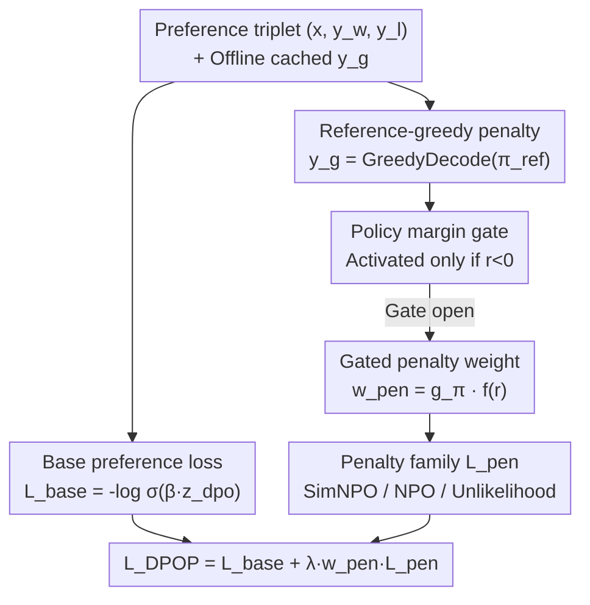

# Boosting Direct Preference Optimization with Penalization

**Conference**: ICML2026  
**arXiv**: [2606.12505](https://arxiv.org/abs/2606.12505)  
**Code**: To be confirmed  
**Area**: Alignment RLHF / Preference Optimization  
**Keywords**: DPO, Preference Optimization, Reference-Greedy Response, Gated Penalization, SimNPO

## TL;DR
This paper proposes DPOP (Direct Preference Optimization with Penalization), which adds an extra **penalty to the "reference model's own greedy-decoded response" $y_g$** for the same prompt alongside the standard DPO preference loss. A detached gate activates this penalty only when the policy "still ranks the rejected response higher than the chosen response," effectively transforming the unused reference-greedy signal into a valid offline alignment signal. On AlpacaEval 2.0, it exceeds DPO/SimPO/AlphaDPO in length-controlled win rate.

## Background & Motivation
**Background**: Aligning LLMs with human preferences traditionally relies on RLHF—separately training a reward model followed by online policy optimization, which involves a complex pipeline. DPO simplifies this into a **pure pairwise classification task**: directly performing Bradley–Terry preference classification on the "reference-calibrated policy log-likelihood ratio." By bypassing explicit reward models while retaining the regularizing role of the reference model, it has become a strong baseline.

**Limitations of Prior Work**: This simplification introduces a constraint—**the training signal is locked to the two pre-stored responses** $(y_w, y_l)$ in the preference dataset. However, modern instruction-tuning preference data is often off-policy, generated or filtered by teacher models rather than sampled from the active policy. In this regime, the reference model is not just a KL regularizer; it is a **specific generator**. Its greedy-decoded response $y_g$ for each prompt precisely exposes the "local patterns the policy might continue to mimic." Yet, DPO only updates on $(x, y_w, y_l)$, leaving $y_g$ entirely outside the objective function.

**Key Challenge**: The reference model's greedy output $y_g$ is both a useful signal (revealing local patterns the policy is prone to fall into) and completely ignored by existing objectives—**there is a signal but it is not utilized**.

**Goal**: Incorporate this wasted $y_g$ signal into the offline preference objective with minimal modifications and without compromising DPO's stability.

**Core Idea**: Retain the original pairwise preference loss as the base term and **apply an additional gated penalty to the policy likelihood of $y_g$**—exerting pressure only when the policy has not yet learned the preference (i.e., it still ranks $y_l$ above $y_w$).

## Method

### Overall Architecture
The objective function of DPOP consists of two parts: a **base pairwise preference loss** + a **gated penalty on the reference-greedy output $y_g$**. Inputs are standard preference triplets $(x, y_w, y_l)$ plus the offline cached $y_g = \mathrm{GreedyDecode}(\pi_{\mathrm{ref}}(\cdot|x))$. During training, the standard DPO base loss is calculated first; then, a gate based on the "policy likelihood margin" determines **whether to apply the penalty to this sample**; if so, pressure is applied to $y_g$ according to a specific penalty family. The design is intentionally minimalist—the original pairwise loss remains unchanged, adding pressure only on an additional generated response when the gate is open.

The final objective is:

$$\mathcal{L}_{\mathrm{DPOP}} = \mathcal{L}_{\mathrm{base}} + \lambda_{\mathrm{pen}}\, w_{\mathrm{pen}}\, \mathcal{L}_{\mathrm{pen}}$$

### Key Designs

**1. Reference-greedy response $y_g$: Reconnecting "Reference Model Local Patterns" to the Objective**

The premise of DPOP is that the reference model's greedy-decoded $y_g$ represents an "undesirable local pattern for the current prompt"—which the policy will continue to mimic if not explicitly corrected. This response is generated offline and cached, incurring no online rollout cost. Unlike "penalizing harmful data" in machine unlearning, $y_g$ here is not private or harmful but simply a model-generated response that is "not good enough" for the prompt. Treating it as a penalty target serves as a negative signal to "not lean towards the reference model's greedy pattern." The base term remains standard DPO: using the reference-calibrated logit $z_{\mathrm{dpo}} = \log\frac{\pi_\theta(y_w|x)\,\pi_{\mathrm{ref}}(y_l|x)}{\pi_{\mathrm{ref}}(y_w|x)\,\pi_\theta(y_l|x)}$, the loss is $\mathcal{L}_{\mathrm{base}} = -\log\sigma(\beta z_{\mathrm{dpo}})$.

**2. Detached policy margin gate: Applying pressure only when the "Policy hasn't learned"**

This is the key distinction between DPOP and "blindly adding penalties." Direct penalization of $y_g$ for all samples can cause collateral damage—applying pressure to samples the policy has already mastered may disrupt existing structures. DPOP first calculates the policy likelihood margin $r = \mathrm{sg}\big(\log\pi_\theta(y_w|x) - \log\pi_\theta(y_l|x)\big)$ (where $\mathrm{sg}$ is stop-gradient). The gate $g_\pi = \mathrm{sg}(\mathbf{1}[r<0])$ opens only when **$r<0$** (meaning the policy still assigns higher likelihood to the rejected response, indicating it hasn't internalized the pairwise preference). The penalty weight $w_{\mathrm{pen}} = g_\pi f(r)$ further adjusts pressure via a non-negative function $f$, such as linear $\max(-r,0)$, constant, square root $\sqrt{\max(-r,0)+\epsilon}$, or quadratic $\max(-r,0)^2$. Both the gate and weight are detached, so they determine "when and how much" to penalize without backpropagating gradients through the gating logic. This selective pressure is why it does not compromise DPO stability.

**3. Penalty family selection, SimNPO style optimal: Length normalization + Reference-free target**

The authors compared three families for the specific penalty on $y_g$. **Token-level unlikelihood** directly reduces the strategy's probability for each token in $y_g$: $\mathcal{L}_{\mathrm{unll}} = -\frac{1}{|y_g|}\sum_t \log(1 - \pi_\theta(y_{g,t}|x, y_{g,<t}))$. **NPO** uses a reference-relative negative objective $\mathcal{L}_{\mathrm{npo}} = -\frac{2}{\beta_p}\log\sigma(-\beta_p[\log\pi_\theta(y_g|x) - \log\pi_{\mathrm{ref}}(y_g|x)])$. **SimNPO** removes the reference and uses length-normalized average sequence log-probability: $\mathcal{L}_{\mathrm{simnpo}} = -\frac{2}{\beta_p}\log\sigma(-\beta_p \overline{\log\pi_\theta(y_g|x)} - \gamma_p)$, where $\overline{\log\pi_\theta}$ is the average log-probability and $\gamma_p$ is the penalty margin. These families originated in machine unlearning; DPOP adapts them as "penalty templates." Experiments show **SimNPO style is significantly strongest**—its length-normalization and reference-free nature make the penalty more stable and effective (consistent with SimPO's argument that sequence-average log-probability aligns better with inference than reference-calibrated implicit rewards).

### Loss & Training
Full algorithm (per minibatch): ① Compute $\mathcal{L}_{\mathrm{base}}$ on $(x, y_w, y_l)$; ② Compute $r = \mathrm{sg}(\log\pi_\theta(y_w|x) - \log\pi_\theta(y_l|x))$; ③ Set $w_{\mathrm{pen}} = \mathrm{sg}(\mathbf{1}[r<0])f(r)$; ④ Compute $\mathcal{L}_{\mathrm{pen}}$ on $y_g$; ⑤ Return $\mathcal{L}_{\mathrm{base}} + \lambda_{\mathrm{pen}} w_{\mathrm{pen}} \mathcal{L}_{\mathrm{pen}}$. Key hyperparameters include penalty weight $\lambda_{\mathrm{pen}}$, penalty temperature $\beta_p$, and SimNPO margin $\gamma_p$.

## Key Experimental Results

### Main Results
SFT initialization used two instruction-tuned models: Meta-Llama-3-8B-Instruct and gemma-2-9b-it. Models were trained on UltraFeedback-style preference data using 8×H100 and evaluated on AlpacaEval 2.0. The primary metric is **Length-Controlled Win Rate (LC-WR)**:

| Model | Method | WR | LC-WR | Length |
|------|------|-----|-------|------|
| Llama-3-8b-it | DPO | 39.49 | 41.84 | 1909 |
| | SimPO | 37.65 | 44.01 | 1763 |
| | AlphaDPO | 33.05 | 41.48 | 1675 |
| | **DPOP (ours)** | **47.57** | **46.35** | 2057 |
| Gemma-2-9b-it | DPO | 70.40 | 66.90 | 1900 |
| | SimPO | 66.12 | 73.08 | 1754 |
| | AlphaDPO | 65.32 | 74.90 | 1682 |
| | **DPOP (ours)** | **73.76** | **78.22** | 1970 |

DPOP achieved the highest LC-WR on both models, with relative gains of 5.3% and 4.4% over baselines. The authors note that the increase in raw WR is partly due to longer responses (especially for Llama), hence the focus on LC-WR as the main metric.

### Ablation Study: Penalty Family Comparison (Llama-3-8b-it, optimal hyperparameters)

| Penalty Family | $\lambda_{\mathrm{pen}}$ | $\beta_p$ | $\gamma_p$ | WR | LC-WR | Length |
|--------|------|------|------|-----|-------|------|
| SimNPO | 1.0 | 1.0 | 1.0 | 47.57 | **46.35** | 2057 |
| NPO | 0.01 | 0.05 | – | 42.76 | 43.94 | 1960 |
| Unlikelihood | 0.01 | – | – | 40.07 | 41.36 | 1948 |

### Key Findings
- **SimNPO style penalty is the strongest**: 46.35 LC-WR is significantly higher than NPO (43.94). NPO still outperforms the DPO baseline, but **Unlikelihood (41.36) is lower than DPO without any penalty**, indicating that token-level unlikelihood is counterproductive in this context—the choice of penalty family is critical.
- **Reference-greedy responses are valid signals**: DPOP consistently outperforms all baselines, validating the core hypothesis that $y_g$ can be converted into an effective offline penalty signal.
- **Hyperparameter Sensitivity**: SimNPO sweeps show Llama is optimal at $\lambda{=}1.0, \beta_p{=}1.0, \gamma_p{=}1.0$ (46.35), while Gemma is optimal at $\lambda{=}2.0, \beta_p{=}1.0, \gamma_p{=}0.0$ (78.22); optimal configurations vary slightly by model but remain within a small search space.

## Highlights & Insights
- **The insight that "reference greedy output is a wasted signal" is precise**: DPO treats the reference model only as a KL regularizer; DPOP points out it is also a generator whose $y_g$ exposes local bad patterns the policy might mimic—a brilliant perspective shift.
- **Gating is the soul, not the penalty itself**: The detached "apply pressure only if $r<0$" gate precisely targets samples the policy hasn't learned, avoiding damage to learned samples. This is key to adding signal without breaking stability and is transferable to any scenario where one wants to add auxiliary losses without disrupting the main objective.
- **Cross-domain transfer**: Porting NPO/SimNPO penalty families from machine unlearning to preference alignment and empirically proving that SimNPO's length-normalization and reference-free properties are superior here echoes SimPO's design philosophy.
- **Minimal changes, plug-and-play**: DPOP only adds one term to DPO, with $y_g$ cached offline and no additional online rollout, resulting in low engineering costs.

## Limitations & Future Work
- **Narrow evaluation range**: Verified only on AlpacaEval 2.0 and two models; lacks testing on larger models or more downstream tasks (e.g., math, code, safety).
- **$y_g$ quality depends on the reference model**: If the reference model's greedy output is already excellent, the benefit and direction of "penalizing it" might be questionable; the paper does not dive deep into how $y_g$ quality distribution affects results.
- **Length bias not fully eliminated**: DPOP's responses are significantly longer (Llama 2057 vs. SimPO 1763). Although LC-WR mitigates this, the magnitude of true quality improvement requires cautious interpretation.
- **Future directions**: Explore expanding $y_g$ from a single greedy response to a set of sampled "bad patterns," or making the gate threshold/penalty intensity adaptive during training.

## Related Work & Insights
- **vs DPO**: DPOP retains the full pairwise loss as a base, only adding a penalty for $y_g$; DPO excludes $y_g$ from the objective entirely.
- **vs SimPO**: SimPO removes the reference model and uses sequence-average log-probability with a fixed margin $\gamma$; DPOP adopts the "length normalization fits inference better" idea for its **penalty term** (SimNPO style) rather than the main loss, and it retains the reference-calibrated DPO base.
- **vs AlphaDPO**: AlphaDPO retains the reference perspective and adaptively adjusts the reward margin based on policy-reference interpolation; DPOP does not change the margin mechanism but adds a gated penalty to $y_g$—different parts of the objective are modified.
- **vs NPO / SimNPO (Machine Unlearning)**: These are designed as negative preference targets to forget "harmful data"; DPOP uses them as penalty templates for preference alignment, where $y_g$ is a model-generated "local bad pattern" rather than private or harmful data.

## Rating
- Novelty: ⭐⭐⭐⭐ The "reference-greedy response + gated penalty" is a simple yet fresh perspective, belonging to DPO-series incremental improvements.
- Experimental Thoroughness: ⭐⭐⭐ Two models + AlpacaEval 2.0 + solid ablations, but benchmark and model coverage is relatively narrow.
- Writing Quality: ⭐⭐⭐⭐ Extremely simple and clear method, with well-explained formulas and algorithms.
- Value: ⭐⭐⭐⭐ Small changes, plug-and-play, with consistent gains. Provides high reference value for offline preference optimization practice.

<!-- RELATED:START -->

## Related Papers

- [\[ICML 2026\] Autoregressive Direct Preference Optimization](autoregressive_direct_preference_optimization.md)
- [\[ICLR 2026\] SafeDPO: A Simple Approach to Direct Preference Optimization with Enhanced Safety](../../ICLR2026/llm_alignment/safedpo_preference_optimization_safety.md)
- [\[ICLR 2026\] Token-Importance Guided Direct Preference Optimization (TI-DPO)](../../ICLR2026/llm_alignment/token-importance_guided_direct_preference_optimization.md)
- [\[ICLR 2026\] ActiveDPO: Active Direct Preference Optimization for Sample-Efficient Alignment](../../ICLR2026/llm_alignment/activedpo_active_direct_preference_optimization_for_sample-efficient_alignment.md)
- [\[ACL 2025\] DiffPO: Diffusion Alignment with Direct Preference Optimization](../../ACL2025/llm_alignment/diffpo_diffusion_alignment.md)

<!-- RELATED:END -->
