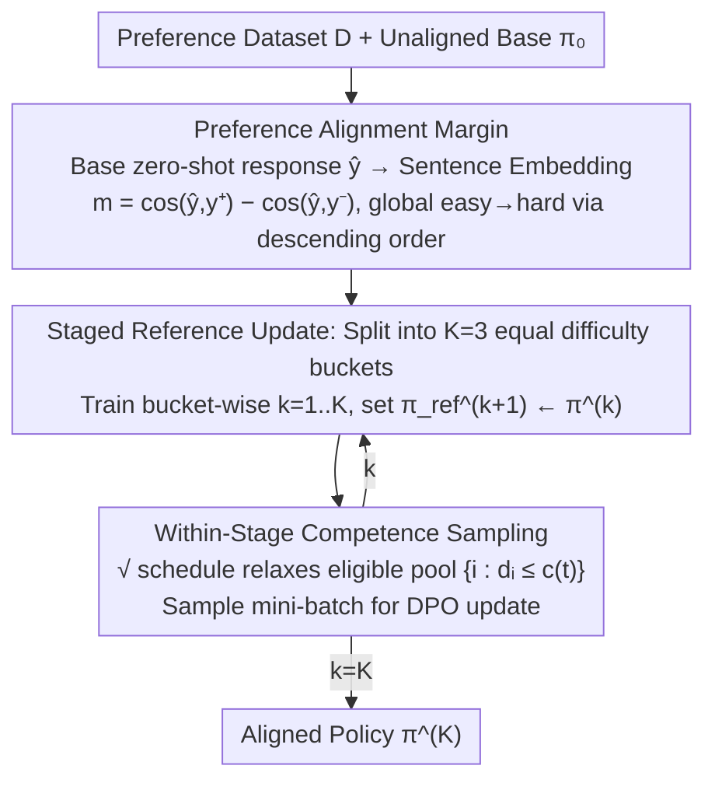

# Curriculum Learning for Safety Alignment

**Conference**: ICML 2026  
**arXiv**: [2605.26315](https://arxiv.org/abs/2605.26315)  
**Code**: https://github.com/Sandeep5500/curriculum-learning-for-safety  
**Area**: Alignment RLHF / LLM Safety  
**Keywords**: DPO, Safety Alignment, Curriculum Learning, OOD Robustness, Jailbreak Attacks

## TL;DR
This paper proposes Staged-Competence—a DPO safety alignment framework that utilizes "model-specific preference alignment margin" as a difficulty score. It employs a dual curriculum of "staged reference model updates + within-stage competence-based sampling." Across three 8B-scale LLMs, it reduces OOD harmful response rates by an average of 16% and jailbreak success rates by 20%, while maintaining general capabilities and avoiding over-refusal.

## Background & Motivation

**Background**: The current mainstream approach for LLM safety alignment involves fine-tuning with DPO on "safe/unsafe" preference pairs $(x, y^+, y^-)$, avoiding the cost of training reward models.

**Limitations of Prior Work**: DPO safety alignment has been proven by several studies to be "shallow"—safe behavior is largely concentrated in the first few tokens. Jailbreak attacks like prefill/GCG can bypass the beginning to induce harmful content. Generalization to out-of-distribution (OOD) harmful prompts is also poor.

**Key Challenge**: Standard DPO treats all preference pairs as equally difficult via random sampling. However, the "difficulty" of a preference pair is not based on linguistic complexity but on the extent to which the **unaligned base model** can already distinguish between safe and unsafe responses. Ignoring this model-related difficulty difference wastes valuable gradient signals on "easy" samples the model already distinguishes correctly.

**Goal**: (1) Design a model-related, globally comparable difficulty score; (2) Design a training algorithm within the DPO framework that effectively utilizes this difficulty; (3) Significantly improve OOD and jailbreak robustness without modifying the DPO loss or introducing new hyperparameter families.

**Key Insight**: The authors borrow the "easy-to-hard" philosophy from curriculum learning (Bengio 2009) but find existing approaches flawed: competence-based curriculum (Sqrt-Competence) has only one stage and never updates the reference model; Curri-DPO updates the reference model but degrades into random shuffling within each stage, wasting the curriculum order. These should be integrated rather than treated as alternatives.

**Core Idea**: Use the "difference in cosine similarity between the base model's zero-shot response to $y^+$ versus $y^-$" as a global difficulty score. The data is sorted and split into $K=3$ buckets. Between buckets, the reference model $\pi_\text{ref}$ is updated. Within buckets, a $\sqrt{\cdot}$ competence scheduler gradually expands the sample pool. The curriculum operates at both "macro staged" and "micro step" scales.

## Method

### Overall Architecture
Staged-Competence is a two-stage pipeline built over standard DPO. It does not modify the DPO loss itself but changes "which samples are used, in what order, and how the reference model evolves." In the first stage (Scoring), the base model $\pi_0$ generates a zero-shot response $\hat y_i$ for each prompt. A lightweight sentence encoder (all-MiniLM-L6-v2) encodes $\hat y_i, y_i^+, y_i^-$ to compute a global difficulty score, sorting the dataset from easy to hard. The second stage (Training) splits the sorted data into $K=3$ increasing difficulty buckets $\mathcal B_1, \mathcal B_2, \mathcal B_3$. Training proceeds sequentially: within buckets, samples are not shuffled but sampled via a competence function; upon completing a bucket, the current policy $\pi^{(k)}$ becomes the reference model for the next stage. The pipeline takes preference dataset $\mathcal D = \{(x_i, y_i^+, y_i^-)\}$ and base model $\pi_0$ as input and outputs the aligned policy $\pi^{(K)}$.

### Key Designs

**1. Preference Alignment Margin: Making difficulty a globally comparable scalar**

Standard DPO treats all pairs equally. However, difficulty depends on how well the base model distinguishes safety. This paper quantifies this cheaply: generate a zero-shot response $\hat y_i$ for prompt $x_i$, then calculate $m_i = \cos(e_{\hat y_i}, e_{y_i^+}) - \cos(e_{\hat y_i}, e_{y_i^-})$ using a sentence encoder. A larger $m_i$ indicates the base response is closer to the safe response (easy), while a smaller $m_i$ indicates difficulty. This creates a global curriculum where **any two preference pairs** can be compared. Unlike Curri-DPO, which only ranks 4 candidates within a single prompt, this global comparability allows competence-based sampling (from NMT) to be applied to DPO using only a small encoder and one zero-shot generation pass, without relying on GPT-4 judges.

**2. Staged Reference Update: Evolving the reference model with the curriculum**

Fixed reference models in standard DPO risk gradient dilution from "already learned" easy pairs. This method splits globally sorted data into $K=3$ equal buckets. In stage $k$, the reference model $\pi_\text{ref}^{(k)}$ is used on bucket $\mathcal B_k$ for $E$ epochs, then $\pi_\text{ref}^{(k+1)} \leftarrow \pi^{(k)}$. The reference model is no longer static but moves forward with the curriculum, redefining progress by "anchoring to the previous stage's results." The reward margin curves show distinct jumps at stage transitions (Fig. 2), indicating that each update injects new effective gradients.

**3. Within-Stage Competence Sampling: Intra-bucket easy-to-hard progression**

Bucket splitting alone is insufficient—Curri-DPO shuffles internally, wasting existing difficulty gradients. Within bucket $\mathcal B_k$, normalized ranks $d_i \in [0,1]$ are recalculated. A competence function $c(t) = \sqrt{(1-c_0^2)\,t/T + c_0^2}$ ($c_0=0.01$) determines the difficulty threshold at step $t$. Mini-batches are sampled only from the eligible pool $\{i \in \mathcal B_k : d_i \le c(t)\}$. The $\sqrt{\cdot}$ shape ensures difficult samples are added at a **decreasing** rate, allowing the model time to "digest" them. This macro-micro coordination is the key finding: Sqrt-Competence alone is worse than baseline, and Curri-DPO alone is moderate, but combined they achieve a qualitative leap.

### Loss & Training
The DPO loss remains unchanged: $\mathcal L_\text{DPO} = -\mathbb E\,[\log \sigma(\beta(\log\frac{\pi_\theta(y^+|x)}{\pi_\text{ref}(y^+|x)} - \log\frac{\pi_\theta(y^-|x)}{\pi_\text{ref}(y^-|x)}))]$, with $\beta=0.1$. Training uses LoRA ($r=16, \alpha=32$ on q/v), lr $5\times10^{-5}$, effective batch size 32, and sequence length 1024. The staged method uses $K=3$ stages with 5 epochs each (4 for Yi-1.5-9B to prevent over-optimization). Training can be completed on a single A6000 (48GB).

The authors also cleaned the data, finding 82.2% of "chosen" samples in PKU-SafeRLHF and 87.2% of "rejected" samples in HH-RLHF were mislabeled regarding safety. A Cleaned-PKU-HH-SafeRLHF dataset was released using GPT-4o-mini as a judge.

## Key Experimental Results

### Main Results: OOD Safety and Jailbreak Attacks

| Model | Metric | Standard DPO | Curri-DPO | Staged-Competence | Gain (vs DPO) |
|--------|------|------|----------|------|------|
| LLaMA-3-8B | Avg OOD Harmful Rate ↓ | 23.6% | 17.1% | 11.4% | -12.2 pp |
| Qwen3-8B | Avg OOD Harmful Rate ↓ | 32.9% | 23.0% | 4.0% | -28.9 pp |
| Yi-1.5-9B | Avg OOD Harmful Rate ↓ | 8.8% | 4.5% | 1.7% | -7.1 pp |
| LLaMA-3-8B | Avg Prefill/GCG Attack ↓ | 35.1% | 27.0% | 16.3% | -18.8 pp |
| Qwen3-8B | Avg Prefill/GCG Attack ↓ | 39.3% | 27.3% | 12.3% | -27.1 pp |
| Yi-1.5-9B | Avg Prefill/GCG Attack ↓ | 19.2% | 13.8% | 5.4% | -13.8 pp |

Average across three models: OOD harmful rate reduced by 16%, attack success rate reduced by 20%. General capabilities (MMLU/HellaSwag) remained stable, and XSTest over-refusal rates were near zero.

### Ablation Study

| Configuration | Key Effect | Description |
|------|---------|------|
| Standard DPO | Baseline | Random sampling, single stage, fixed reference |
| Sequential | OOD -5~11 pp | Difficulty-sorted feeding, single stage, fixed reference |
| Sqrt-Competence | +0.5 pp on Qwen3 (worse) | Single-stage competence sampling, no reference update |
| Curri-DPO | OOD -4~10 pp | Multi-stage + reference update, but intra-stage shuffle |
| **Staged-Competence** | OOD -7~29 pp, Attack -14~27 pp | Intra-stage competence + inter-stage reference update |
| Data Efficiency | 75% Data | Matches or exceeds 100% Standard DPO on LLaMA-3/Qwen3 |
| Scaling: Qwen3 1.7B→8B | Advantage grows 1.5pp to 29pp | Curriculum value increases as larger baseline models perform worse |

### Key Findings
- **Reward margin is more informative than reward accuracy**: While ID accuracy is similar (88–91%), the reward margin for Staged-Competence is ~3× baseline and jumps at stage transitions, validating the reference update.
- **Safety alignment "deepens"**: Token-wise analysis of $\delta(t) = \log\pi_\text{unaligned}(y_t|\cdot) - \log\pi_\text{aligned}(y_t|\cdot)$ shows Staged-Competence suppresses unsafe tokens more aggressively across nearly every bit of the first 128 tokens. This explains the drop in Prefill attack success—deep layers continue to resist even after the start is bypassed.
- **Curriculum dividends scale up**: For Qwen3 (1.7B to 8B), standard DPO OOD harmful rates worsened from 6.5% to 32.9%, while Staged-Competence remained at 2–8%. Larger models have higher marginal value for curriculum.

## Highlights & Insights
- **Model-related difficulty is crucial**: Using the zero-shot response embedding margin makes difficulty globally comparable. This is the key step to porting competence-based curriculum to preference optimization—cheap and universal.
- **Dual-scale curriculum**: Macro stages + reference updates manage "continuity," while micro steps + competence pools manage "fine-grained progression." The synergistic effect of these two scales is the paper's most valuable empirical finding.
- **Dataset cleaning as a contribution**: Identifying high noise in PKU-SafeRLHF and HH-RLHF implies previous DPO safety work was contaminated by noisy labels. Cleaned-PKU-HH-SafeRLHF provides a cleaner default for future work.
- **Loss-agnostic property**: The method is orthogonal to KTO, IPO, or Safe-DPO and can be used in conjunction with them.

## Limitations & Future Work
- **Scale limited to 8B + LoRA**: The authors leave full-parameter tuning and larger models (70B/MoE) for future work.
- **GPT-4o-mini judge dependency**: Using the same judge for cleaning and evaluation might introduce bias, particularly in niche categories like biosecurity.
- **Difficulty depends on the sentence encoder**: all-MiniLM-L6-v2 may not capture safety-specific nuances as well as a safety-specific encoder or base LM hidden states.
- **Unexplored hyperparameters**: $K=3$ and epoch counts were not systematically swept. Automated scheduling (e.g., based on margin change rate) remains to be explored.

## Related Work & Insights
- **vs Curri-DPO (Pattnaik 2024)**: Both use $K=3$ stages and reference updates. Difference: Curri-DPO uses local ranking (intra-prompt) and random shuffling within stages. Our method uses global model-related margins and competence sampling, leading by 9–11pp in OOD metrics.
- **vs Sqrt-Competence (Platanios 2019)**: Inherits the $\sqrt{\cdot}$ function but transplants it from NMT to LLM DPO. Proves it is ineffective alone (loss of 0.5pp on Qwen3) and must be paired with staged reference updates.
- **vs Qi et al. 2024 (Shallow safety alignment)**: Confirms and addresses the "shallow" alignment issue by demonstrating suppression at deeper token positions.

## Rating
- Novelty: ⭐⭐⭐⭐ First to systematically apply curriculum learning to DPO safety alignment, with innovation in the fusion and model-specific margin.
- Experimental Thoroughness: ⭐⭐⭐⭐⭐ Comprehensive evaluation across three model families, OOD benchmarks, jailbreak attacks, and token-level analysis.
- Writing Quality: ⭐⭐⭐⭐ Clear narrative; Fig. 2 (stage jumps) and Fig. 3 (token suppression) are highlights.
- Value: ⭐⭐⭐⭐⭐ Highly practical, loss-agnostic, and provided with a cleaned dataset.

<!-- RELATED:START -->

## Related Papers

- [\[ICLR 2026\] AlphaAlign: Incentivizing Safety Alignment with Extremely Simplified Reinforcement Learning](../../ICLR2026/llm_alignment/alphaalign_incentivizing_safety_alignment_with_extremely_simplified_reinforcemen.md)
- [\[ICLR 2026\] Alignment-Weighted DPO: A Principled Reasoning Approach to Improve Safety Alignment](../../ICLR2026/llm_alignment/alignment-weighted_dpo_a_principled_reasoning_approach_to_improve_safety_alignme.md)
- [\[ICML 2026\] Towards Context-Invariant Safety Alignment for Large Language Models](towards_context-invariant_safety_alignment_for_large_language_models.md)
- [\[ICML 2026\] Implicit Safety Alignment from Crowd Preferences](implicit_safety_alignment_from_crowd_preferences.md)
- [\[ICML 2026\] MESA: Improving MoE Safety Alignment via Decentralized Expertise](mesa_improving_moe_safety_alignment_via_decentralized_expertise.md)

<!-- RELATED:END -->
