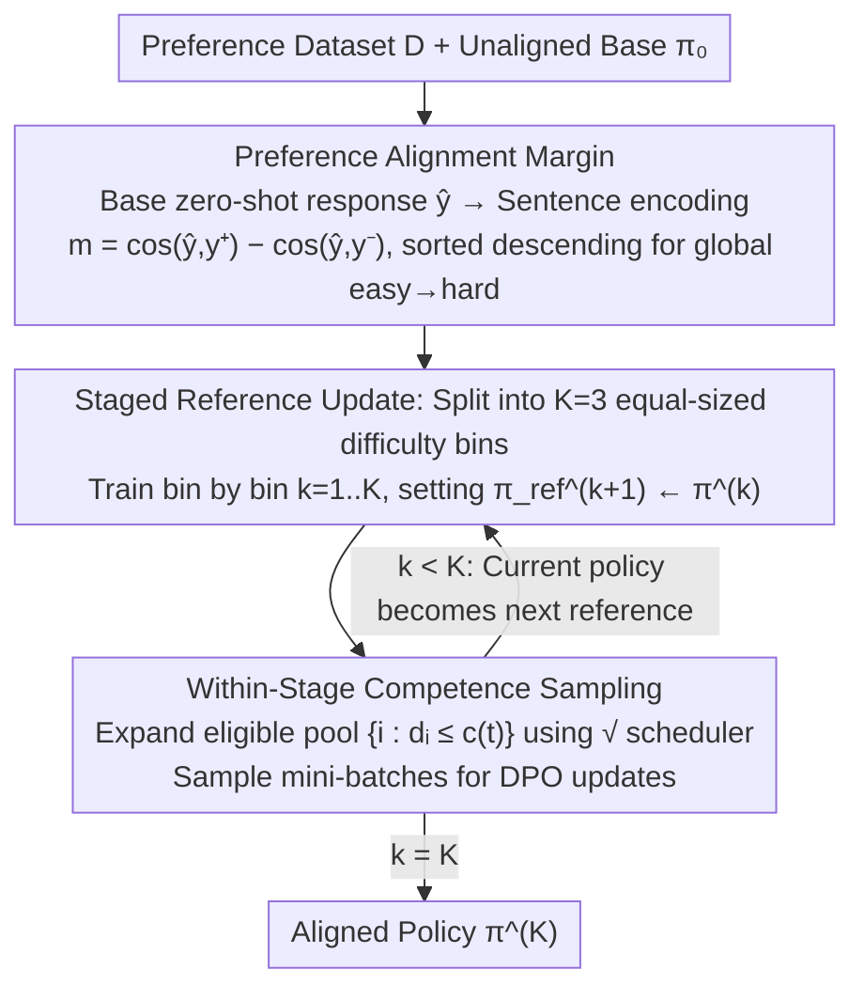

# Curriculum Learning for Safety Alignment

**Conference**: ICML 2026  
**arXiv**: [2605.26315](https://arxiv.org/abs/2605.26315)  
**Code**: https://github.com/Sandeep5500/curriculum-learning-for-safety  
**Area**: Alignment RLHF / LLM Safety  
**Keywords**: DPO, Safety Alignment, Curriculum Learning, OOD Robustness, Jailbreak Attacks

## TL;DR
This paper proposes Staged-Competence, a DPO safety alignment framework that uses the model's own "preference alignment margin" as a difficulty score. It utilizes a dual curriculum of "staged reference model updates + within-stage competence-based sampling." On three 8B-scale LLMs, it reduces the OOD harmful response rate by an average of 16% and the jailbreak attack success rate by 20%, with minimal damage to general capabilities and without introducing over-refusal.

## Background & Motivation

**Background**: The current mainstream approach for LLM safety alignment involves fine-tuning with DPO on "safe/unsafe" preference pairs $(x, y^+, y^-)$, avoiding the cost of training a reward model.

**Limitations of Prior Work**: DPO safety alignment has been proven by multiple works to be "shallow"—safe behavior is mostly concentrated in the first few tokens. Jailbreak attacks like prefill/GCG can bypass the beginning to force harmful output. Furthermore, generalization to out-of-distribution (OOD) harmful prompts is poor.

**Key Challenge**: Standard DPO treats all preference pairs as equally difficult and samples them randomly. However, the "difficulty" of a preference pair is not about linguistic complexity but depends on the **extent to which the unaligned base model** can already distinguish between safe and unsafe responses. Ignoring this model-dependent difficulty variance wastes valuable gradient signals on "easy samples" that the model can already distinguish.

**Goal**: (1) Design a model-related, globally comparable difficulty score; (2) Design a training algorithm that effectively utilizes this difficulty within the DPO framework; (3) Significantly improve OOD and jailbreak robustness without changing the DPO loss or introducing new hyperparameter families.

**Key Insight**: The authors borrow the "easy-to-hard" philosophy from curriculum learning (Bengio 2009) but find that existing approaches have flaws. Competence-based curriculum (Sqrt-Competence) has only one stage and never updates the reference model. Curri-DPO updates the reference model but degrades into random shuffling within each stage, wasting the curriculum order. The two should be integrated rather than treated as alternatives.

**Core Idea**: Use the "difference in cosine similarity between the base model's zero-shot response to $y^+$ and $y^-$" as a global difficulty score. Data is sorted and partitioned into $K=3$ bins. Between bins, the reference model $\pi_\text{ref}$ is updated; within bins, a $\sqrt{\cdot}$ competence scheduler gradually expands the sample pool. The curriculum operates at both "macro-stage" and "micro-step" scales simultaneously.

## Method

### Overall Architecture
Staged-Competence is a two-stage pipeline built on top of standard DPO. It does not modify the DPO loss itself, only changing "which samples to use, in what order, and how the reference model evolves." In the first stage (Scoring), the base model $\pi_0$ generates zero-shot responses $\hat y_i$ for each prompt. A lightweight sentence encoder (all-MiniLM-L6-v2) encodes $\hat y_i, y_i^+, y_i^-$ to calculate a global difficulty score for sorting the dataset from easy to hard. The second stage (Training) evenly partitions the sorted data into $K=3$ increasingly difficult bins $\mathcal B_1, \mathcal B_2, \mathcal B_3$. Training proceeds sequentially: within each bin, samples are not shuffled randomly but are introduced via a competence function that dynamically expands the sampling pool. After training on a bin, the current policy $\pi^{(k)}$ becomes the reference model for the next stage. The pipeline takes a preference dataset $\mathcal D = \{(x_i, y_i^+, y_i^-)\}$ and unaligned base $\pi_0$ as input and outputs the aligned policy $\pi^{(K)}$.

### Key Designs

**1. Preference Alignment Margin: Making difficulty a globally comparable scalar**

Standard DPO treats all preference pairs as equally difficult. The issue is that "difficulty" depends on the model's existing ability to distinguish safety. This paper quantifies this cheaply: the base model generates a zero-shot response $\hat y_i$ for prompt $x_i$, then a sentence encoder computes $m_i = \cos(e_{\hat y_i}, e_{y_i^+}) - \cos(e_{\hat y_i}, e_{y_i^-})$. A larger $m_i$ indicates the base response is closer to the safe response (an "easy sample"). Sorting these yields a global curriculum. Unlike Curri-DPO, which only ranks 4 candidates within a single prompt, this margin allows **any two preference pairs** to be compared. This global comparability enables competence-based sampling—originally from machine translation—to be applied to DPO without relying on expensive GPT-4 judge scores.

**2. Staged Reference Update: Evolving the reference model with the curriculum**

Standard DPO with a fixed reference model faces a risk: later in training, gradients are diluted by "easy pairs" the model has already learned. This paper splits sorted data into $K=3$ bins. In stage $k$, the reference model $\pi_\text{ref}^{(k)}$ is used to run DPO on bin $\mathcal B_k$ for $E$ epochs, after which $\pi_\text{ref}^{(k+1)} \leftarrow \pi^{(k)}$. The reference model is no longer static but moves forward with the curriculum, redefining progress by anchoring to the previous stage's results. The effectiveness of this recursive reference is visible in the reward margin curves: every time a stage switches and the reference updates, the margin jumps (Fig. 2), indicating the injection of new effective gradients.

**3. Within-Stage Competence Sampling: Easy-to-hard within each bin using $\sqrt{\cdot}$**

Partitioning into stages is not enough—Curri-DPO shuffles randomly within bins, losing the internal difficulty gradient. This paper re-normalizes the sorted rank within bin $\mathcal B_k$ to $d_i \in [0,1]$. A competence function $c(t) = \sqrt{(1-c_0^2)\,t/T + c_0^2}$ ($c_0=0.01$) calculates a difficulty threshold for step $t$, sampling only from the eligible pool $\{i \in \mathcal B_k : d_i \le c(t)\}$. Training starts with only the easiest samples and incorporates harder ones at a square-root rate. The $\sqrt{\cdot}$ shape allows hard samples to be added at a **decreasing** rate, giving the model time to "digest" them. This complements staged updates: macro-stages provide continuity, while micro-competence ensures gradual progression. This dual-scale curriculum is the core empirical finding: Sqrt-Competence alone can be worse than the baseline, but the combination yields a qualitative leap.

### Loss & Training
The DPO loss remains unchanged: $$\mathcal L_\text{DPO} = -\mathbb E\,[\log \sigma(\beta(\log\frac{\pi_\theta(y^+|x)}{\pi_\text{ref}(y^+|x)} - \log\frac{\pi_\theta(y^-|x)}{\pi_\text{ref}(y^-|x)}))]$$, where $\beta=0.1$. Training uses LoRA ($r{=}16, \alpha{=}32$, q/v projections), lr $5{\times}10^{-5}$, effective batch size 32, and sequence length 1024. The staged method uses $K{=}3$ stages, 5 epochs per stage (4 for Yi-1.5-9B to avoid over-optimization). It can be executed on a single A6000 (48GB).

The authors also cleaned the data, finding that 82.2% of "chosen" responses in PKU-SafeRLHF and 87.2% of "rejected" responses in HH-RLHF were actually unsafe or safer, respectively. They released the Cleaned-PKU-HH-SafeRLHF dataset using a GPT-4o-mini judge.

## Key Experimental Results

### Main Results: OOD Safety and Jailbreak Attacks

| Model | Metric | Standard DPO | Curri-DPO | Staged-Competence | Gain (vs DPO) |
|--------|------|------|----------|------|------|
| LLaMA-3-8B | Mean OOD Harmful Rate ↓ | 23.6% | 17.1% | 11.4% | -12.2 pp |
| Qwen3-8B | Mean OOD Harmful Rate ↓ | 32.9% | 23.0% | 4.0% | -28.9 pp |
| Yi-1.5-9B | Mean OOD Harmful Rate ↓ | 8.8% | 4.5% | 1.7% | -7.1 pp |
| LLaMA-3-8B | Mean Prefill/GCG Attack ↓ | 35.1% | 27.0% | 16.3% | -18.8 pp |
| Qwen3-8B | Mean Prefill/GCG Attack ↓ | 39.3% | 27.3% | 12.3% | -27.1 pp |
| Yi-1.5-9B | Mean Prefill/GCG Attack ↓ | 19.2% | 13.8% | 5.4% | -13.8 pp |

Average across three models: OOD harmful rate reduced by 16%, attack success rate reduced by 20%. General capabilities (MMLU/HellaSwag) remained stable, and the XSTest over-refusal rate was nearly zero.

### Ablation Study

| Configuration | Key Effect | Description |
|------|---------|------|
| Standard DPO | Baseline | Random sampling, single stage, fixed reference |
| Sequential | OOD -5~11 pp | Feeding samples in sorted order, single stage, fixed reference |
| Sqrt-Competence | +0.5 pp on Qwen3 (Worse) | Single-stage competence sampling without reference updates |
| Curri-DPO | OOD -4~10 pp | Multi-stage with reference updates, but random within stages |
| **Staged-Competence** | OOD -7~29 pp, Attack -14~27 pp | Within-stage competence + between-stage reference updates |
| Data Efficiency: 75% Data | Matches or exceeds 100% Standard DPO | Saves 25% preference data for same safety level |
| Scaling: Qwen3 1.7B→4B→8B | Advantage grows from 1.5pp to 29pp | The larger the model, the more valuable the curriculum |

### Key Findings
- **Reward margin is more informative than reward accuracy**: While ID accuracy for Staged-Competence is similar to the baseline (88–91%), the reward margin increases to ~3× the baseline, showing jumps at each stage switch.
- **Safety alignment "goes deeper"**: By calculating $\delta(t) = \log\pi_\text{unaligned}(y_t|\cdot) - \log\pi_\text{aligned}(y_t|\cdot)$ per token, Staged-Competence suppresses unsafe tokens more heavily across almost every position in the first 128 tokens. This explains the drop in Prefill attack success, as resistance persists even after the attack bypasses the initial prompt.
- **Curriculum dividends scale with model size**: In the Qwen3 series (1.7B to 8B), the OOD harmful rate for Standard DPO worsened from 6.5% to 32.9%, while Staged-Competence remained stable at 2–8%. Larger models benefit more from curriculum training.

## Highlights & Insights
- **Difficulty scores must be "model-dependent"**: Using the cosine difference of zero-shot response embeddings allows for a globally comparable scalar difficulty. This is a key step in transferring competence-based curriculum to preference optimization—cheap, general, and integrable with other DPO variants.
- **Curriculum should advance at two scales**: Macro-stages with reference updates provide continuity, while micro-competence pools ensure fine-grained difficulty progression. The failure of Sqrt-Competence alone versus the success of the combined approach is a significant empirical discovery.
- **Dataset cleaning is an independent contribution**: Identifying that over 80% of labels in common safety datasets are noisy means previous works were training on contaminated data. Cleaned-PKU-HH-SafeRLHF can serve as a new default.
- **No changes to loss function**: The method is orthogonal to work that modifies the loss (like KTO or IPO) and can be used in combination.

## Limitations & Future Work
- **Tested only at 8B scale with LoRA**: Full parameter fine-tuning and larger models (70B/MoE) are left for future research; scaling dividends for LLaMA/Mistral are still unknown.
- **Reliance on GPT-4o-mini as a judge**: Both cleaning and evaluation rely on it, potentially introducing bias. Reliable human evaluation benchmarks are needed for specific categories like biosecurity.
- **Difficulty score depends on sentence encoders**: all-MiniLM-L6-v2 is a general encoder and might not capture subtle safety-related nuances. Safety-specific encoders or base model hidden states might improve ranking.
- **Hyperparameter sensitivity**: The number of stages $K=3$ was inherited, but some models showed over-optimization, suggesting $K$ and epochs are tightly coupled and model-specific.

## Related Work & Insights
- **vs Curri-DPO (Pattnaik 2024)**: Both use $K=3$ stages and recursive reference updates. However, Curri-DPO uses local ranking (within prompt) and random within-stage shuffling. Ours uses a global margin and dual-layer curriculum, outperforming Curri-DPO by 9–11pp.
- **vs Sqrt-Competence (Platanios 2019)**: This work adapts the $\sqrt{\cdot}$ scheduler from NMT to LLM DPO. Crucially, it finds that the scheduler must be used in conjunction with staged reference updates to be effective.
- **vs Qi et al. 2024 (Shallow safety alignment)**: We respond to observations that alignment only affects initial tokens by demonstrating through per-token suppression experiments that curriculum training extends suppression throughout the response.

## Rating
- **Novelty**: ⭐⭐⭐⭐ First systematic application of curriculum learning for DPO safety alignment; innovation lies in the fusion and model-dependent margin.
- **Experimental Thoroughness**: ⭐⭐⭐⭐⭐ Comprehensive evaluation across three model families, multiple OOD benchmarks, jailbreak attacks, scaling analysis, and data cleaning.
- **Writing Quality**: ⭐⭐⭐⭐ Clear narrative; Fig. 2 (stage jumps) and Fig. 3 (token-level suppression) are highlights. 
- **Value**: ⭐⭐⭐⭐⭐ Plug-and-play method, no loss modification, single-GPU friendly, and provides a cleaned dataset.

<!-- RELATED:START -->

## Related Papers

- [\[ICML 2026\] Towards Context-Invariant Safety Alignment for Large Language Models](towards_context-invariant_safety_alignment_for_large_language_models.md)
- [\[ICML 2026\] Implicit Safety Alignment from Crowd Preferences](implicit_safety_alignment_from_crowd_preferences.md)
- [\[ICLR 2026\] Superficial Safety Alignment Hypothesis](../../ICLR2026/llm_alignment/superficial_safety_alignment_hypothesis.md)
- [\[ICML 2026\] MESA: Improving MoE Safety Alignment via Decentralized Expertise](mesa_improving_moe_safety_alignment_via_decentralized_expertise.md)
- [\[AAAI 2026\] Differentiated Directional Intervention: A Framework for Evading LLM Safety Alignment](../../AAAI2026/llm_alignment/differentiated_directional_intervention_a_framework_for_evading_llm_safety_align.md)

<!-- RELATED:END -->
