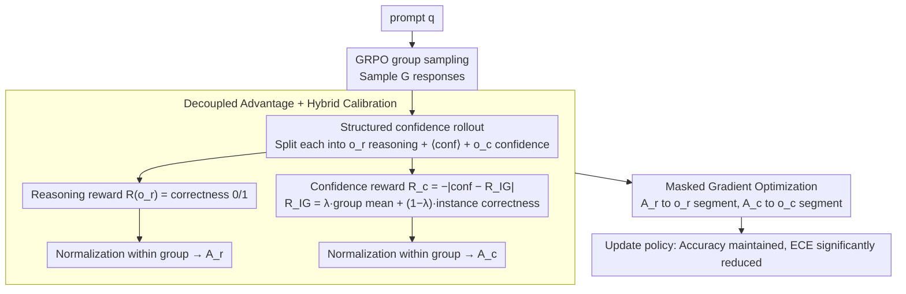

# Decoupling Reasoning and Confidence: Resurrecting Calibration in Reinforcement Learning from Verifiable Rewards

**Conference**: ICML 2026  
**arXiv**: [2603.09117](https://arxiv.org/abs/2603.09117)  
**Code**: https://github.com/icip-cas/DCPO (Available)  
**Area**: Alignment RLHF / LLM Calibration / RLVR  
**Keywords**: RLVR, Confidence Calibration, Gradient Conflict, Decoupled Optimization, GRPO

## TL;DR
This paper theoretically proves that the objectives of "improving accuracy" and "reducing calibration error" in RLVR (e.g., GRPO) training have negatively correlated and irreconcilable gradient directions under the Fisher metric. It then proposes DCPO: the model explicitly generates a verbalized confidence after the reasoning trajectory. By assigning separate rewards, advantages, and gradient masks to reasoning and confidence tokens, DCPO reduces ECE from 0.435 to 0.128 (a 71.6% relative reduction) while maintaining the same accuracy as GRPO.

## Background & Motivation

**Background**: Reinforcement Learning from Verifiable Rewards (RLVR) has become the standard training paradigm for reasoning models like GRPO and DeepSeek-R1. Using automatically verifiable 0/1 rewards for online policy optimization significantly improves accuracy in math and coding tasks.

**Limitations of Prior Work**: Models trained with RLVR are severely over-confident. Experiments show that under GRPO training, the average predicted confidence of Qwen3-8B rises from 0.88 to 0.98+, while the confidence variance drops from 0.006 to 0.001. The Positive Calibration Error (PCE) increases from 0.312 to 0.362, with incorrect answers being assigned a confidence near 1. This over-confidence can mislead users in high-risk scenarios such as medical, legal, and financial domains.

**Key Challenge**: Previous approaches (RLCR, CCGSPG) coupled calibration objectives (e.g., Brier loss or token confidence terms) into a single RL reward for joint optimization. This resulted in an "accuracy-calibration tradeoff," where accuracy inevitably drops when calibration improves. The authors diagnose that these two objectives conflict fundamentally in parameter space, which cannot be resolved by merely tuning weights.

**Goal**: (1) Identify the mathematical root cause of over-confidence in RLVR; (2) Design an RL training framework that suppresses over-confidence without sacrificing reasoning accuracy.

**Key Insight**: Starting from the inner product of gradients under the Fisher metric, the authors prove that when a model is already over-confident ($\text{Conf}_\theta > \mathbb{E}[R]$), the Fisher inner product of $\nabla J_\text{acc}$ and $\nabla J_\text{cal}$ is strictly less than zero. Therefore, the only solution is to **structurally decouple the optimization of the two objectives into different parameter subspaces or token subspaces**, rather than adjusting coefficients within a single loss function.

**Core Idea**: The model generates a reasoning trajectory $o_r$ followed by a verbalized confidence $o_c$. Different rewards and advantages are assigned to these two sets of tokens, and gradient masking is used to block interference between them, completely decoupling the tasks of "solving the problem" and "knowing one's own certainty."

## Method

### Overall Architecture
DCPO (Decoupled Calibration Policy Optimization) aims to solve the conflict between accuracy and over-confidence in standard RLVR. It is built upon the group sampling mechanism of GRPO. Given a prompt $q$, the policy samples $G$ structured responses $o = [o_r\ \texttt{<conf>}\ o_c]$, where $o_r$ contains the Chain-of-Thought reasoning and the final answer, and $o_c$ following the `<conf>` token is the explicitly generated confidence scalar. Two sets of rewards are calculated: the reasoning reward $R(o_r)=\mathbb{I}(y_\text{pred}=y_\text{label})$ checks answer correctness, while the confidence reward $R_c(o_c)=-|\text{conf}(o_c)-R_{IG}|$ measures the distance between the generated confidence and the true accuracy. Both rewards are normalized within the group to produce advantages $A_r$ and $A_c$. A token-level mask ensures that $A_r$ only propagates back to the $o_r$ section and $A_c$ only to the $o_c$ section. The reasoning and confidence tasks thus follow two non-interfering gradient paths, translating the "gradient conflict theorem" into an executable architecture.

### Key Designs

**1. Structured confidence rollout: Physically separating reasoning and confidence tokens**

The root of over-confidence lies in the reasoning token probabilities serving both to "calculate the answer" and "express certainty," which cannot be optimized separately. If logit-based confidence is still used (e.g., $\text{Conf}(y)=\prod \pi_\theta(y_i|y_{<i})$), confidence remains a byproduct of reasoning probabilities. DCPO separates these two in the generation structure: the model is prompted to provide a Chain-of-Thought reasoning followed by the answer, and then separately output a scalar confidence (e.g., 0.85) after a special token `<conf>`. Rewards and masks can then precisely target their respective token subsets.

**2. Decoupled advantage + Hybrid calibration target: Finding a low-variance, discriminative regression target**

After token separation, reasoning rewards follow the GRPO 0/1 correctness. The challenge is defining the target for the confidence value. Using the instance's own correctness $R(o_r)$ as a target is problematic; Proposition 4.3 indicates it is a single Bernoulli sample with a high variance of $4p(1-p)$, which pushes confidence toward extreme values (0 or 1), worsening over-confidence. However, GRPO samples $G$ rollouts, and their average accuracy $\tilde{R}_G=\frac{1}{G}\sum R(o_{r,i})$ is an unbiased estimate of the true expectation $\mathbb{E}[R]$ with a variance of $O(1/G)$. DCPO interpolates these into a hybrid target $R_{IG}=\lambda \tilde{R}_G + (1-\lambda) R(o_r)$, where the confidence reward is $R_c(o_c)=-|\text{conf}(o_c)-R_{IG}|$. $\lambda$ balances stability and instance-level discrimination.

**3. Masked gradient optimization: Eliminating Fisher gradient conflict**

To ensure gradients do not interfere, DCPO constructs a token mask for each response to split the sequence into $o_r$ and $o_c$. The optimization objective is:

$$\frac{1}{G}\sum_i \frac{1}{|o_i|}\Big[\sum_{y_j \in o_r}\hat{\rho}_{i,j}A_{r,i} + \sum_{y_j \in o_c}\hat{\rho}_{i,j}A_{c,i}\Big]$$

where $\hat\rho$ is the clipped importance ratio. The accuracy gradient only updates the conditional distribution of reasoning tokens, while the confidence gradient only updates tokens following `<conf>`. Theorem 5.1 guarantees that under this decoupling, the optimal confidence of a proper scoring rule equals the true expected accuracy $\mathbb{E}[c|q]=\mathbb{E}_{y\sim\pi_\theta}[R(y)]$, meaning calibration does not hinder the reasoning policy.

### Loss & Training
Base model: Qwen3-8B (non-thinking); Training set: DeepScaler; group size $G$ as per GRPO defaults. $\lambda$ is selected via ablation (Ours uses a hybrid; DCPO-I for $\lambda=0$, DCPO-G for $\lambda=1$). Format penalties are applied to ensure verbalized confidence is parsable.

## Key Experimental Results

### Main Results
Comparison of Base, GRPO, RLCR, CCGSPG, and DCPO across five math benchmarks (MATH-500, AIME24/25, AMC23/24).

| Method | Overall Acc ↑ | Overall ECE ↓ | Overall PCE ↓ | Overall AUROC ↑ |
|------|---------------|---------------|---------------|-----------------|
| Base (verbal) | 46.4 | 0.435 | 0.426 | 0.609 |
| GRPO (verbal) | 57.4 | 0.372 | 0.363 | 0.532 |
| RLCR | 56.5 | 0.139 | 0.128 | 0.753 |
| CCGSPG | 57.6 | 0.230 | 0.283 | 0.815 |
| **DCPO (Ours)** | **60.8** | **0.128** | 0.126 | **0.881** |

Key takeaway: DCPO's accuracy is on par with or better than GRPO (60.8 vs 57.4), while ECE is slashed to 0.128 (a 71.6% reduction relative to Base). 

### Ablation Study

| Configuration | Overall Acc | Overall ECE | Note |
|------|-------------|-------------|------|
| DCPO (Hybrid) | 60.8 | 0.128 | Full model |
| DCPO-G (Group-only) | 60.5 | 0.209 | High ECE due to lack of instance-level signal |
| DCPO-I (Instance-only) | 58.7 | 0.138 | 2-point drop in accuracy |

### Key Findings
- The hybrid group + instance target achieves SOTA in both Acc and ECE, validating the theoretical judgment regarding low variance and discrimination.
- AUROC shows the most significant improvement (0.532 → 0.881), indicating that verbalized confidence possesses strong discriminative power beyond just numerical alignment.
- DCPO maintains consistent results across coding benchmarks (LiveCodeBench, HumanEval+), suppressing over-confidence across domains.

## Highlights & Insights
- **Theory-to-Architecture Derivation**: Proposition 4.2 concerning Fisher negative inner products directly motivates the structural separation of objectives. The logical loop from "why coupling fails" to "how to decouple" is highly convincing.
- **Repurposing Group Sampling**: Using $\tilde R_G$ as a low-variance supervision source is efficient; it is computed from rollouts already required for GRPO's advantages, requiring no extra labeling or critic networks.
- **Transferable Pattern**: The verbalized confidence + masked gradient paradigm is applicable to any LLM task requiring "metacognition" (e.g., fact-based QA, tool use, Agent decision-making) by splitting output into "task" and "metacognition" blocks.
- **Metric Selection**: The introduction of PCE specifically captures over-confidence, avoiding the illusion of improved ECE driven solely by increased accuracy.

## Limitations & Future Work
- **Dependence on Verbalization**: The base model must be capable of outputting parsable confidence scalars, or it may require SFT for "cold-starting" smaller models.
- **Coarse-grained Confidence**: Confidence is provided once at the end of the trajectory, failing to locate exactly where a reasoning chain begins to falter (step-level calibration).
- **Assumptions**: The assumption $\text{Cov}(R, \phi) > 0$ might not hold for near-random base models, explaining potential loss fluctuations in early training steps.
- **Lack of PRM Comparison**: DCPO relies on verifiable rewards and has not been compared directly against routes using learned Process Reward Models or preference data.

## Related Work & Insights
- **vs RLCR (Damani et al., 2025)**: RLCR adds Brier Score loss to reward—a coupled approach. DCPO validates the theoretical conflict and outperforms RLCR in accuracy (60.8 vs 56.5).
- **vs CCGSPG (Liu et al., 2025)**: CCGSPG reshapes GRPO advantages via token-level confidence but remains coupled. DCPO achieves significantly lower ECE (0.128 vs 0.230).
- **vs Inference-time calibration**: Post-hoc methods require external predictors or sampling tricks. DCPO bakes calibration into weights, avoiding deployment overhead at the cost of higher training expense.
- **vs Original GRPO**: DCPO is a minimally invasive extension, adding only a confidence rollout and token masking. It is nearly drop-in compatible with existing GRPO infrastructure.

## Rating
- Novelty: ⭐⭐⭐⭐ 
- Experimental Thoroughness: ⭐⭐⭐⭐ 
- Writing Quality: ⭐⭐⭐⭐⭐ 
- Value: ⭐⭐⭐⭐⭐ 

<!-- RELATED:START -->

## Related Papers

- [\[ICML 2026\] Simultaneous Multi-objective Alignment Across Verifiable and Non-verifiable Rewards](simultaneous_multi-objective_alignment_across_verifiable_and_non-verifiable_rewa.md)
- [\[ACL 2026\] Too Correct to Learn: Reinforcement Learning on Saturated Reasoning Data](../../ACL2026/llm_alignment/too_correct_to_learn_reinforcement_learning_on_saturated_reasoning_data.md)
- [\[AAAI 2026\] DeCoRL: Decoupling Reasoning Chains via Parallel Sub-Step Generation and Cascaded Reinforcement for Interpretable and Scalable RLHF](../../AAAI2026/llm_alignment/decorl_decoupling_reasoning_chains_via_parallel_sub-step_gen.md)
- [\[ICML 2026\] Curriculum Learning for Safety Alignment](curriculum_learning_for_safety_alignment.md)
- [\[CVPR 2026\] Unlocking Token Rewards via Training-Free Reward Attribution](../../CVPR2026/llm_alignment/unlocking_token_rewards_via_training-free_reward_attribution.md)

<!-- RELATED:END -->
