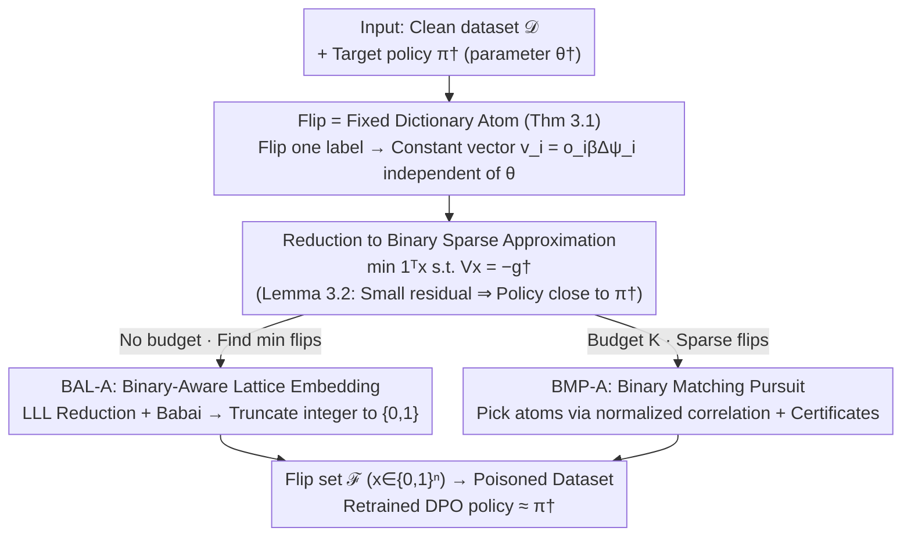

# Efficient Preference Poisoning Attack on Offline RLHF

**Conference**: ICML 2026  
**arXiv**: [2605.02495](https://arxiv.org/abs/2605.02495)  
**Code**: None  
**Area**: LLM Security / Preference Poisoning / RLHF Alignment  
**Keywords**: Preference Poisoning, DPO, Label Flipping, Sparse Recovery, Lattice Basis Reduction

## TL;DR
The paper proposes a key observation for log-linear DPO: "flipping a single preference label equals adding a fixed vector independent of the policy parameters to the loss gradient." Based on this, targeted poisoning attacks are reduced to a binary sparse approximation problem. Two algorithms are introduced: BAL-A (based on LLL lattice reduction) and BMP-A (based on matching pursuit), along with provable recovery and impossibility conditions.

## Background & Motivation

**Background**: Offline RLHF has become the mainstream path for aligning LLMs. Direct Preference Optimization (DPO) trains directly on pre-collected paired preference datasets, bypassing the need for an explicit reward model. Security research around DPO has identified two typical attack models: label flipping and data injection.

**Limitations of Prior Work**: Data injection attacks (Nika et al., 2025) have relatively complete theoretical characterizations but are expensive—the number of injected samples must grow linearly with the original dataset size for the attack to succeed. Label flipping is more "economical" and realistic (attackers usually modify existing annotations rather than creating samples from scratch), but current research is largely empirical, **lacking a theoretical characterization of "how many and which ones" to flip to drive the policy toward a specific direction**.

**Key Challenge**: An attacker performing label flipping faces two fundamental difficulties. First, the set of manipulable items is restricted to a subset $\mathcal{F}$ of the $n$ existing comparisons. Second, the impact of a single label flip on the final learned policy $\hat\theta$ is parameter-dependent in general non-linear models, making it impossible to predict accurately beforehand. Thus, finding the "most effective" labels is a combinatorial search problem.

**Goal**: For the log-linear policy class under DPO, this paper aims to provide: (i) a first-order characterization of what a single label flip actually changes; (ii) a formalization of targeted poisoning as a solvable optimization problem; (iii) two provable algorithms with recovery and impossibility guarantees.

**Key Insight**: The authors observe that in log-linear DPO, the gradient increment $\Delta g_i$ caused by flipping a label $o_i\to-o_i$ for a per-sample loss $\ell_i(\theta)$ **does not depend on the current $\theta$ at all**—it is simply a constant vector $o_i\beta(\psi(s_i,a_i)-\psi(s_i,a_i'))$. This instantly transforms an apparently policy-dependent attack into "binary sparse approximation on a fixed dictionary $V$."

**Core Idea**: The problem of finding the minimum label flips to make the post-training policy close to $\pi^\dagger$ is rewritten as $\min_{x\in\{0,1\}^n}\|x\|_0$ s.t. $Vx=-g^\dagger$, where each column of the dictionary $V$ is a gradient atom for a single sample flip, and the target $g^\dagger$ is the gradient of the clean DPO loss evaluated at $\theta^\dagger$.

## Method

### Overall Architecture
This paper answers the question: "For a preference dataset used in DPO training, how many and which labels should be flipped to precisely push the learned policy toward the attacker's target direction $\pi^\dagger$?" The entire pipeline is supported by one observation: under a log-linear policy, the effect of flipping a label on the training result is a constant vector independent of the current parameter $\theta$. Consequently, the attack is reduced to a sparse approximation problem $\min\mathbf{1}^\top x$ s.t. $\|Vx+g^\dagger\|_2\le\varepsilon$ over a fixed dictionary $V=[v_1,\dots,v_n]\in\mathbb{R}^{d\times n}$ (where $v_i=o_i\beta\Delta\psi_i$). Lemma 3.2 bridges the gap from the residual to policy distance—under $m$-strong convexity, $\|Vx+g^\dagger\|_2\le\varepsilon$ implies $\|\hat\theta-\theta^\dagger\|_2\le\varepsilon/m$, thereby bounding the $\ell_1$ policy distance. Thus, minimizing the residual ensures the trained policy is close to the target. This sparse problem is NP-hard, so the authors provide two solvers based on the attack scenario (BAL-A for minimum flips without budget, and BMP-A for sparse flips with a budget $K$), each with recovery or impossibility conditions.

### Key Designs

**1. Flip = Fixed Dictionary Atom (Theorem 3.1): Downscaling poisoning from bi-level to sparse recovery**

The most difficult aspect of label flipping attacks is that the influence of a single flip on the final policy $\hat\theta$ is usually parameter-dependent—one must "retrain on the attacked data to see the policy change," creating a bi-level combinatorial search that cannot be predicted in advance. The pivot of this paper is discovering that the structure of log-linear + DPO loss makes this dependency vanish. For $\pi_\theta(a\mid s)\propto\exp(\psi(s,a)^\top\theta)$, the derivative of the single-sample loss $\ell_i(\theta)$ yields $o_i\bigl(1-\sigma(o_i\beta\Delta\psi_i^\top\theta)\bigr)\beta\Delta\psi_i$, where the sigmoid term is symmetric with respect to the preference label $o_i$. Subtracting the original gradient from the gradient after flipping $o_i$ to $-o_i$ causes the sigmoid part containing $\theta$ to cancel out perfectly, leaving only the constant vector $\Delta g_i=o_i\beta\Delta\psi_i$. This cancellation converts "observing policy changes after retraining" into "finding a binary linear combination of fixed vectors $\{v_i\}$ to approximate $-g^\dagger$."

**2. Binary-Aware Lattice Embedding BAL-A (§4): Solving for integer solutions of minimal flips via LLL**

In scenarios without a budget, the goal is to find the minimum flips such that $Vx+g^\dagger=0$. Solving $\min_x\|Vx+g^\dagger\|^2$ with integer relaxation degrades into the Closest Vector Problem (CVP), but CVP solutions may not fall in $\{0,1\}$ and do not directly minimize the number of flips. The authors construct a $(d+n)\times(n+1)$ embedding basis:

$$B_{\mathrm{bin}}=\begin{pmatrix}V&-g^\dagger\\ MI_n&0\end{pmatrix},$$

ensuring that the squared length of a lattice point corresponding to integer coefficients $z$ decomposes into $\|y(z)\|^2=\|Vz+g^\dagger\|^2+M^2\|z\|^2$. This penalizes both the residual and the coefficient magnitude. For $\{0,1\}$ solutions, $\|x\|_2^2=\mathbf{1}^\top x$, so the $\ell_2$ penalty automatically represents the number of flipped labels. LLL ($\delta=0.75$) + Babai's nearest-plane are then used to find the integer $z$, which is truncated to $\{0,1\}$. The scalar $M$ is critical: a sufficiently large $M$ (Lemma 4.1 gives $M_0\approx (B\sqrt{K^\star}+\sqrt{B^2K^\star+6BR+3B^2})/3$) forces coefficients into $\{-1,0,1\}$, and further into $\{0,1\}$ if $z\ge0$. Theorem 4.3 provides a separation condition $\rho_k^2>M^2(K^\star-k)$ guaranteeing the global minimum is indeed the $K^\star$-flip feasible solution.

**3. Binary Matching Pursuit BMP-A (§5): Greedy solver under budget + Certificates of impossibility**

Since LLL preprocessing in BAL-A becomes computationally expensive when $n > 100$, a lighter path is chosen for budget-limited scenarios: adapting Orthogonal Matching Pursuit (OMP/BMP) to a non-normalized dictionary $V$. At each step, atoms are selected based on the normalized correlation score $|\langle v_i,r\rangle|/\|v_i\|_2$, but the residual is updated using the original columns $r\leftarrow r-v_{i_t}$. The process stops after $K$ steps or if $\|r\|_2\le\varepsilon$. Theorem 5.3 guarantees correct support selection and exact recovery in $K^\star$ steps if $\mu(V)<b/((2K^\star-1)B)$, where $\mu(V)$ is global mutual coherence. Conversely, Theorem 5.4 provides impossibility conditions independent of the algorithm: if $\|g^\dagger\|_2-\varepsilon>\sqrt{K}\|V\|_2$ or $(\|g^\dagger\|_2-\varepsilon)^2>B^2(K+\mu(V)K(K-1))$, the attack cannot succeed.

## Key Experimental Results

### Main Results

| Dataset | Method | Setting | TPR | Residual/Distance |
|---------|--------|---------|-----|-------------------|
| Synthetic Gaussian ($d=64,n=20,K^\star=5$) | BAL-A | $M < M_{\text{all sep}}\approx0.68$ | ≈1.0 | 0 |
| Synthetic Gaussian ($d=64,n=20,K^\star=5$) | BAL-A | $M > M_{\text{all sep}}$ | Fast drop | Large |
| Synthetic low-coherence ($\mu\approx0.197,n=200$) | BMP-A | $K^\star \le K_{\text{coh}}=3$ | 1.0 | 0 |
| Synthetic low-coherence ($\mu\approx0.197,n=200$) | BMP-A | $K^\star > K_{\text{coh}}$ | High, slow drop | Small |
| SHP Real Data ($n=50,K^\star=7$, common feasible) | BAL-A | TP/FP/FN = 7/0/0 | 1.0 | $\|\pi_{\theta^\dagger}-\pi_{\hat\theta}\|_1\approx 0.012$ |
| SHP Real Data ($n=50,K^\star=7$, common feasible) | BMP-A | TP/FP/FN = 7/0/0 | 1.0 | Same as above |

The Clean-vs-attacked distance $\|\pi_{\mathrm{clean}}-\pi_{\hat\theta}\|_1 \approx 0.224$ is roughly 19 times larger than the attack-vs-groundtruth distance (0.012), indicating that the recovered flipping pattern not only reproduces the constructed attack but **actually pushes the policy far away from the clean baseline**.

### Ablation Study

| Configuration | Key Metric | Description |
|---------------|------------|-------------|
| BAL-A, $M\to0$ | TPR≈1 | Smaller $M$ approaches pure residual minimization but loses binary enforcement. |
| BAL-A, $M=M_0\approx1.69$ | TPR drop | The theoretical binary sufficiency bound $M_0$ is too conservative. |
| BMP-A on low-coherence subset | TPR↑ | Better accuracy when dictionary geometry is more divergent. |
| BMP-A on random subset | TPR↓ | High coherence causes greedy selection of wrong atoms. |
| BAL-A runtime (SHP, $n=50$) | 0.6865 s | Primarily consumed by LLL preprocessing. |
| BMP-A runtime (SHP, $n=50$) | $1.37\times10^{-4}$ s | Appx. $5\times10^3$ times faster than BAL-A. |

### Key Findings
- **Abrupt change at the separation threshold**: The success of BAL-A depends heavily on $M_{\text{all sep}}$. In practice, smaller $M$ can be used to maintain binary solutions despite conservative theoretical bounds.
- **Mutual coherence $\mu(V)$** is the most critical factor for attack success. On SHP, BMP-A performs significantly better on low-coherence subsets compared to random ones.
- **Impossibility certificates** (Theorem 5.4) are algorithm-independent. If the geometry condition is not met, no algorithm can succeed with $K$ flips. This points toward defensive strategies involving the design of preference datasets where $V$ columns are small and divergent.

## Highlights & Insights
- **Parameter-independent gradient increment** is the lynchpin for reducing poisoning from a bi-level problem to sparse recovery. It stems from the symmetry of the sigmoid loss in log-linear DPO, representing an intrinsic vulnerability of this combination.
- **Lattice-based tools for ML poisoning**: The binary-aware embedding $\begin{pmatrix}V&-g^\dagger\\MI_n&0\end{pmatrix}$ elegantly encodes "small residual" and "small coefficients." Using a scalar $M$ to schedule an NP-hard binary constraint is a paradigm that can be extended to other sparse selection problems.
- **Geometric characterization of DPO robustness**: The impossibility conditions $\sqrt{K}\|V\|_2$ and $\mu(V)$ suggest that proactive defense should focus on the composition of preference datasets (e.g., diversity sampling) to make $V$ columns small and scattered.
- **Economic efficiency**: Success in pushing policies significantly with just 7 out of 50 flips on SHP highlights that the RLHF annotation pipeline is a significant attack surface, much more efficient than sample injection.

## Limitations & Future Work
- **Strict Assumptions**: The theory is limited to **log-linear policies + DPO**. In deep neural networks, the gradient increment is $\theta$-dependent, requiring approximations or online dictionary updates.
- **White-box Setting**: The attacker requires full knowledge of the feature map $\psi$, reference policy $\mu$, and target $\theta^\dagger$. Black-box versions remain unexplored.
- **Feasibility of $\pi^\dagger$**: The target policy is assumed feasible (Assumption 3.3). The problem of finding a target that is both malicious and reachable was not addressed.
- **Scalability**: LLL preprocessing in BAL-A struggles as $n$ increases ($n > 100$). Larger-scale validation on benchmarks like Anthropic-HH/UltraFeedback is needed.
- **Defense side is open**: While impossibility certificates exist, no proactive defense algorithms were proposed.

## Related Work & Insights
- **Comparison to Nika et al. 2025 (Data Injection)**: While both use log-linear DPO, data injection requires costs linear to $n$. This paper's label flipping is constrained by $V$'s geometry but is far more efficient when feasible.
- **Technical Inspirations**: The work adapts the BMP framework from Wen & Li (2021) and introduces the LLL-CVP framework from number theory/cryptography into ML poisoning for the first time.
- **Insight**: The "flip = fixed atom" reduction suggests similar vulnerabilities might exist in other symmetric losses like contrastive or InfoNCE.

## Rating
- Novelty: ⭐⭐⭐⭐⭐ 
- Experimental Thoroughness: ⭐⭐⭐ 
- Writing Quality: ⭐⭐⭐⭐ 
- Value: ⭐⭐⭐⭐ 

<!-- RELATED:START -->

- **Nika et al. (2025)**: Provable offline RLHF poisoning via data injection.
- **Rando & Tramèr (2024)**: Empirical study on stealthy poisoning of LLM preferences.
- **Babai (1986)**: Basic LLL and the Nearest Plane algorithm for CVP.

<!-- RELATED:END -->

## Related Papers

- [\[AAAI 2026\] On the Exponential Convergence for Offline RLHF with Pairwise Comparisons](../../AAAI2026/llm_alignment/on_the_exponential_convergence_for_offline_rlhf_with_pairwise_comparisons.md)
- [\[ACL 2026\] Alignment Data Map for Efficient Preference Data Selection and Diagnosis](../../ACL2026/llm_alignment/alignment_data_map_for_efficient_preference_data_selection_and_diagnosis.md)
- [\[ICML 2026\] Implicit Preference Alignment for Human Image Animation](implicit_preference_alignment_for_human_image_animation.md)
- [\[ICML 2026\] SPARD: Defending Harmful Fine-Tuning Attack via Safety Projection with Relevance-Diversity Data Selection](spard_defending_harmful_fine-tuning_attack_via_safety_projection_with_relevance-.md)
- [\[NeurIPS 2025\] Greedy Sampling Is Provably Efficient for RLHF](../../NeurIPS2025/llm_alignment/greedy_sampling_is_provably_efficient_for_rlhf.md)

<!-- RELATED:END -->
